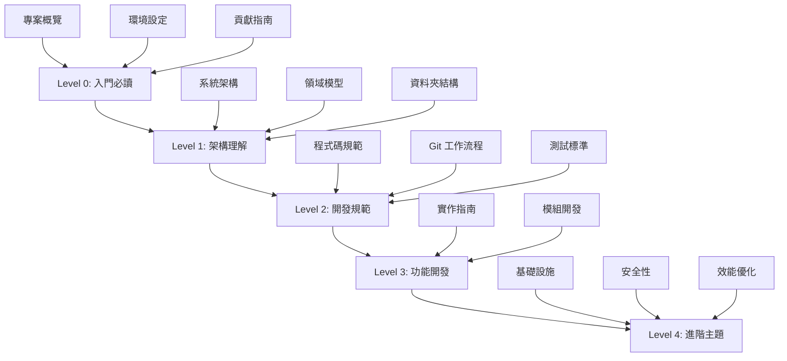
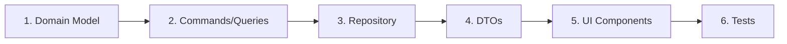

# ng-gighub 開發學習路徑

## 文件概述

本文件為 ng-gighub 專案提供結構化的學習路徑，幫助開發者從入門到精通，循序漸進地理解專案架構、開發規範和實作細節。

**適用對象**：
- 新加入專案的開發者
- 需要複習專案架構的團隊成員
- AI Agents 執行開發任務時的參考指南

**使用建議**：
- 按照 Level 順序閱讀文件
- 完成每個 Level 後實際操作驗證
- 遇到問題時回到相應的參考文件

---

## 學習路徑總覽



---

## Level 0: 入門必讀 🚀

**目標**：了解專案基本資訊，完成環境設定，準備開始開發

### 📖 必讀文件

#### 1. [README.md](../README.md)
**閱讀時間**：10-15 分鐘  
**內容重點**：
- 專案概覽與技術棧
- 快速開始指令
- 專案結構簡介
- 基本開發指令
- Code Review 檢查清單

**學習成果**：
- [ ] 理解專案的核心技術（Angular 20.1, SSR, Supabase）
- [ ] 知道如何啟動開發伺服器
- [ ] 了解基本的專案結構
- [ ] 記住常用的開發指令

#### 2. [環境設定指南](./setup/environment.md)
**閱讀時間**：20-30 分鐘  
**內容重點**：
- Node.js 與 npm 安裝
- 專案依賴安裝
- 環境變數配置
- 開發工具設定（VS Code, 擴充套件）

**學習成果**：
- [ ] 完成 Node.js v20.x 安裝
- [ ] 成功執行 `npm install`
- [ ] 配置 `.env` 檔案
- [ ] 安裝推薦的 VS Code 擴充套件
- [ ] 成功啟動開發伺服器

#### 3. [Supabase 設定指南](./setup/supabase.md)
**閱讀時間**：30-40 分鐘  
**內容重點**：
- Supabase 專案設定
- 資料庫連線配置
- Storage 設定
- Authentication 配置（如適用）

**學習成果**：
- [ ] 建立或連接 Supabase 專案
- [ ] 取得 API Keys 並配置到 `.env`
- [ ] 測試資料庫連線
- [ ] 理解 `SupabaseService` 的使用方式

#### 4. [貢獻指南](../CONTRIBUTING.md)
**閱讀時間**：15-20 分鐘  
**內容重點**：
- 開發流程
- 分支策略
- Commit 規範（Conventional Commits）
- Pull Request 流程

**學習成果**：
- [ ] 了解 Git Flow 分支策略
- [ ] 知道如何建立 feature branch
- [ ] 理解 Commit message 格式
- [ ] 知道 PR 前的檢查清單

### ✅ Level 0 驗證

完成以下任務，確認已掌握入門知識：

```bash
# 1. 啟動開發伺服器
npm start

# 2. 執行測試
npm test

# 3. 執行建置
npm run build

# 4. 檢查程式碼品質
npm run check

# 5. 執行 SSR 伺服器（需先 build）
npm run serve:ssr:ng-gighub
```

**驗證成功標準**：
- [ ] 開發伺服器成功啟動於 http://localhost:4200
- [ ] 所有測試通過
- [ ] 建置成功且無錯誤
- [ ] 程式碼檢查無問題
- [ ] SSR 伺服器成功運行

---

## Level 1: 架構理解 🏗️

**目標**：深入理解專案架構設計、領域模型和程式碼組織方式

### 📖 必讀文件

#### 1. [系統架構概覽](./architecture/system-overview.md)
**閱讀時間**：30-45 分鐘  
**內容重點**：
- 整體系統架構
- DDD + Clean Architecture 原則
- 四層架構（Domain, Application, Infrastructure, Features）
- 依賴規則與方向
- CQRS 模式說明

**學習成果**：
- [ ] 理解 DDD 的核心概念
- [ ] 知道四層架構各自的職責
- [ ] 理解依賴反轉原則
- [ ] 了解 CQRS 的 Commands 與 Queries 分離
- [ ] 知道如何在各層之間傳遞資料

**補充閱讀**：
- [架構設計文件](./ARCHITECTURE_DESIGN.md) - 更詳細的架構說明
- [src/app/ARCHITECTURE.md](../src/app/ARCHITECTURE.md) - 程式碼層級的架構說明

#### 2. [領域模型](./architecture/DOMAIN_MODEL.md)
**閱讀時間**：45-60 分鐘  
**內容重點**：
- 四個核心聚合根（Account, Organization, Team, Repository）
- 實體（Entities）設計
- 值對象（Value Objects）與驗證
- 領域事件（Domain Events）
- 領域服務（Domain Services）

**學習成果**：
- [ ] 理解聚合根的概念與職責
- [ ] 知道實體與值對象的區別
- [ ] 理解如何設計不可變的值對象
- [ ] 了解領域事件的作用
- [ ] 知道何時使用領域服務

**實作練習**：
```typescript
// 練習：建立一個簡單的值對象
class Email extends ValueObject<string> {
  private constructor(value: string) {
    super(value);
  }

  static create(email: string): Result<Email, ValidationError> {
    // 實作驗證邏輯
    // 提示：參考 docs/architecture/DOMAIN_MODEL.md 中的範例
  }
}
```

#### 3. [資料夾結構](./architecture/FOLDER_STRUCTURE.md)
**閱讀時間**：20-30 分鐘  
**內容重點**：
- 完整的專案目錄結構
- 各層級資料夾組織方式
- 檔案命名規範
- 模組化原則

**學習成果**：
- [ ] 知道如何找到特定功能的程式碼
- [ ] 理解模組化的資料夾組織
- [ ] 知道新功能應該放在哪個位置
- [ ] 理解檔案命名的一致性規則

#### 4. [架構圖表](./architecture/diagrams/)
**閱讀時間**：15-20 分鐘  
**內容重點**：
- [實體關係圖](./architecture/diagrams/erd.md) - 資料庫 Schema
- [流程圖](./architecture/diagrams/flowchart.md) - 應用程式流程

**學習成果**：
- [ ] 理解資料表之間的關聯
- [ ] 了解關鍵業務流程
- [ ] 知道如何閱讀 Mermaid 圖表

### ✅ Level 1 驗證

**知識問答**：
1. 請說明 Domain Layer 為什麼不依賴其他層？
2. 什麼是聚合根？請舉例說明。
3. Command 和 Query 有什麼區別？
4. 值對象與實體的主要差異是什麼？
5. 如果要建立一個新的功能模組，應該在哪些層級建立哪些檔案？

**實作練習**：
```bash
# 瀏覽 Domain Layer 的程式碼
cd src/app/core/domain/

# 選擇一個聚合根（例如：workspace）
cd workspace/

# 閱讀該聚合根的 README.md
# 理解其包含的實體、值對象、事件

# 查看實際的實作檔案
ls -la
```

---

## Level 2: 開發規範 📏

**目標**：掌握專案的程式碼規範、工作流程和測試標準

### 📖 必讀文件

#### 1. [程式碼規範](./standards/coding-standards.md)
**閱讀時間**：30-40 分鐘  
**內容重點**：
- 整體開發規範概覽
- 架構規範
- 模組組織原則
- 最佳實踐

**學習成果**：
- [ ] 理解 DDD 分層架構規範
- [ ] 知道如何組織功能模組
- [ ] 了解跨層通訊的原則

**補充閱讀**：
- [程式碼風格指南](./standards/code-style.md) - 詳細的語法風格

#### 2. [程式碼風格指南](./standards/code-style.md)
**閱讀時間**：40-50 分鐘  
**內容重點**：
- TypeScript 風格規範
- Angular 元件風格
- HTML 模板規範
- SCSS 樣式規範
- 註解與文件規範

**學習成果**：
- [ ] 知道何時使用 `const` vs `let`
- [ ] 理解 TypeScript 型別宣告規範
- [ ] 了解 Angular 元件的最佳實踐
- [ ] 知道如何撰寫清晰的註解
- [ ] 理解 SSR 相容性考量

**程式碼範例**：
```typescript
// ✅ 良好的程式碼風格
export class UserService {
  private readonly users$ = new BehaviorSubject<User[]>([]);
  
  constructor(
    private readonly httpClient: HttpClient,
    private readonly logger: Logger
  ) {}
  
  getUsers(): Observable<User[]> {
    return this.users$.asObservable();
  }
}

// ❌ 不良的程式碼風格
export class UserService {
  users: any; // 應該有明確型別
  
  constructor(private http: any) {} // 應該指定型別
  
  getUsers() { // 應該指定回傳型別
    return this.users;
  }
}
```

#### 3. [命名規範](./standards/naming-conventions.md)
**閱讀時間**：20-30 分鐘  
**內容重點**：
- 檔案命名規範
- 類別與介面命名
- 變數與函式命名
- 常數命名

**學習成果**：
- [ ] 知道各種檔案的命名格式
- [ ] 理解 kebab-case, camelCase, PascalCase 的使用時機
- [ ] 了解 Angular 特定的命名慣例

#### 4. [Git 工作流程](./standards/git-workflow.md)
**閱讀時間**：25-35 分鐘  
**內容重點**：
- Git Flow 分支策略
- Commit message 規範（Conventional Commits）
- 分支命名規則
- Merge vs Rebase

**學習成果**：
- [ ] 知道如何建立正確的 feature branch
- [ ] 理解 Conventional Commits 格式
- [ ] 了解何時使用 merge 或 rebase
- [ ] 知道如何處理 merge conflicts

**Commit 範例**：
```bash
# ✅ 正確的 commit message
feat(workspace): add workspace creation feature
fix(auth): correct token expiration handling
docs(readme): update installation instructions
refactor(domain): simplify value object validation

# ❌ 錯誤的 commit message
update code
fix bug
WIP
commit
```

#### 5. [測試標準](./standards/testing-standards.md)
**閱讀時間**：30-40 分鐘  
**內容重點**：
- 測試策略
- 單元測試規範
- 整合測試規範
- 測試覆蓋率要求

**學習成果**：
- [ ] 知道如何撰寫單元測試
- [ ] 理解測試的 AAA 模式（Arrange, Act, Assert）
- [ ] 了解如何 Mock 依賴
- [ ] 知道測試覆蓋率的目標

**測試範例**：
```typescript
describe('EmailValueObject', () => {
  // Arrange - Act - Assert 模式
  it('should reject invalid email format', () => {
    // Arrange
    const invalidEmail = 'not-an-email';
    
    // Act
    const result = Email.create(invalidEmail);
    
    // Assert
    expect(result.isFailure).toBe(true);
    expect(result.error).toBeDefined();
  });
});
```

#### 6. [審查準則](./standards/review-guidelines.md)
**閱讀時間**：20-25 分鐘  
**內容重點**：
- Code Review 流程
- 審查重點清單
- 常見問題檢查

**學習成果**：
- [ ] 知道如何進行有效的 Code Review
- [ ] 理解審查時應注意的重點
- [ ] 了解如何提供建設性的反饋

#### 7. [依賴規則](./standards/dependency-rules.md)
**閱讀時間**：15-20 分鐘  
**內容重點**：
- 分層之間的依賴規則
- 模組之間的依賴管理
- 避免循環依賴

**學習成果**：
- [ ] 理解依賴反轉原則
- [ ] 知道如何避免不當的依賴
- [ ] 了解如何檢查依賴違規

### ✅ Level 2 驗證

**實作練習**：

1. **建立符合規範的 feature branch**：
```bash
git checkout develop
git pull origin develop
git checkout -b feature/user-profile-page
```

2. **撰寫符合規範的程式碼**：
```typescript
// 建立一個簡單的 Service
// 確保符合：
// - TypeScript 型別規範
// - 命名規範
// - 註解規範
// - Angular 最佳實踐
```

3. **撰寫測試**：
```typescript
// 為上述 Service 撰寫單元測試
// 確保符合測試標準
```

4. **執行檢查**：
```bash
npm run check     # 執行 ESLint + Prettier
npm test         # 執行測試
npm run build    # 執行建置
```

5. **提交變更**：
```bash
git add .
git commit -m "feat(profile): add user profile service with tests"
```

---

## Level 3: 功能開發 ⚙️

**目標**：學習如何實作新功能，從領域模型到 UI 的完整流程

### 📖 必讀文件

#### 1. [實作指南](./guides/implementation-guide.md)
**閱讀時間**：60-90 分鐘  
**內容重點**：
- 完整的功能開發流程
- 從 Domain 到 Features 的實作步驟
- Repository Pattern 實作
- CQRS 實作範例
- UI 元件開發

**學習成果**：
- [ ] 理解完整的功能開發流程
- [ ] 知道如何設計聚合根
- [ ] 了解如何實作 Commands 和 Queries
- [ ] 知道如何建立 Supabase Repository
- [ ] 理解如何開發 UI 元件

**實作步驟總覽**：


#### 2. [模組 README 文件](../src/app/core/domain/README.md)
**閱讀時間**：依模組而定  
**內容重點**：
- 各層級的詳細說明
- 具體的程式碼範例
- 模組之間的互動

**學習成果**：
- [ ] 了解各模組的職責
- [ ] 知道如何使用模組提供的功能
- [ ] 理解模組的設計決策

**推薦閱讀順序**：
1. [Domain Layer README](../src/app/core/domain/README.md)
2. [Application Layer README](../src/app/core/application/README.md)
3. [Infrastructure Layer README](../src/app/core/infrastructure/README.md)
4. [Features Layer README](../src/app/features/README.md)

#### 3. [Workspace 實作指南](./workspace/IMPLEMENTATION_GUIDE.md)
**閱讀時間**：30-45 分鐘  
**內容重點**：
- Workspace 功能的完整實作
- 實際的實作範例
- 已完成與待完成的階段

**學習成果**：
- [ ] 理解實際功能的實作流程
- [ ] 看到完整的程式碼範例
- [ ] 了解如何進行階段性開發

### 📝 實作練習

#### 練習 1：建立簡單的值對象

```typescript
// 任務：建立一個 PhoneNumber 值對象
// 要求：
// 1. 繼承 ValueObject<string>
// 2. 實作驗證邏輯（台灣手機號碼格式）
// 3. 提供 create() 靜態方法
// 4. 回傳 Result<PhoneNumber, ValidationError>
```

**參考文件**：[領域模型 - 值對象](./architecture/DOMAIN_MODEL.md)

#### 練習 2：建立 Command 和 Handler

```typescript
// 任務：建立一個 UpdatePhoneNumberCommand
// 要求：
// 1. 定義 Command 類別
// 2. 實作 CommandHandler
// 3. 使用 Repository 更新資料
// 4. 發布領域事件
```

**參考文件**：[實作指南 - Commands](./guides/implementation-guide.md)

#### 練習 3：建立 UI 元件

```typescript
// 任務：建立一個 PhoneNumberInput 元件
// 要求：
// 1. Standalone Component
// 2. 使用 Reactive Forms
// 3. 整合 PhoneNumber 值對象驗證
// 4. OnPush 變更偵測
```

**參考文件**：[程式碼風格 - Angular 元件](./standards/code-style.md)

### ✅ Level 3 驗證

**專案任務**：實作一個簡單但完整的功能

**任務描述**：  
實作「使用者個人資料更新」功能

**要求**：
1. **Domain Layer**
   - [ ] 建立必要的值對象（如有需要）
   - [ ] 在相關聚合根加入更新方法

2. **Application Layer**
   - [ ] 建立 UpdateUserProfileCommand
   - [ ] 實作 UpdateUserProfileCommandHandler
   - [ ] 建立 GetUserProfileQuery
   - [ ] 實作 GetUserProfileQueryHandler

3. **Infrastructure Layer**
   - [ ] 在 Repository 實作相應方法
   - [ ] 處理 Supabase 資料存取

4. **Features Layer**
   - [ ] 建立 ProfileEditComponent
   - [ ] 實作表單與驗證
   - [ ] 整合 Commands/Queries

5. **Testing**
   - [ ] 撰寫值對象單元測試
   - [ ] 撰寫 Handler 單元測試
   - [ ] 撰寫元件測試

6. **Code Review**
   - [ ] 確認符合所有程式碼規範
   - [ ] 通過所有品質檢查

---

## Level 4: 進階主題 🚀

**目標**：深入理解基礎設施、安全性、效能優化等進階議題

### 📖 必讀文件

#### 1. [基礎設施概覽](./infrastructure/overview.md)
**閱讀時間**：20-30 分鐘  
**內容重點**：
- Infrastructure Layer 職責
- 技術實作細節
- 外部服務整合

**學習成果**：
- [ ] 理解基礎設施層的角色
- [ ] 知道如何整合外部服務
- [ ] 了解技術實作的關注點分離

#### 2. [Authentication](./infrastructure/authentication.md)
**閱讀時間**：30-40 分鐘  
**內容重點**：
- 認證機制
- Token 管理
- Session 處理
- SSR 環境下的認證

**學習成果**：
- [ ] 理解認證流程
- [ ] 知道如何實作登入/登出
- [ ] 了解 Token 的儲存與更新
- [ ] 知道 SSR 環境的特殊處理

#### 3. [Authorization](./infrastructure/authorization.md)
**閱讀時間**：30-40 分鐘  
**內容重點**：
- 授權機制
- 權限檢查
- Route Guards
- RLS (Row Level Security)

**學習成果**：
- [ ] 理解授權與認證的區別
- [ ] 知道如何實作權限檢查
- [ ] 了解 Angular Route Guards
- [ ] 理解 Supabase RLS 的運作

#### 4. [Role-Based Access Control](./infrastructure/role-based-access-control.md)
**閱讀時間**：25-35 分鐘  
**內容重點**：
- RBAC 概念
- 角色與權限設計
- 實作策略

**學習成果**：
- [ ] 理解 RBAC 模型
- [ ] 知道如何設計角色體系
- [ ] 了解權限繼承機制

#### 5. [Multi-Tenancy](./infrastructure/multi-tenancy.md)
**閱讀時間**：30-40 分鐘  
**內容重點**：
- 多租戶架構
- 資料隔離策略
- Organization 與 Workspace 設計

**學習成果**：
- [ ] 理解多租戶的概念
- [ ] 知道如何實作資料隔離
- [ ] 了解 Organization-based 架構

#### 6. [Security Best Practices](./infrastructure/security-best-practices.md)
**閱讀時間**：40-50 分鐘  
**內容重點**：
- 常見安全威脅
- XSS/CSRF 防護
- 輸入驗證
- Secrets 管理
- SSR 安全性考量

**學習成果**：
- [ ] 了解常見的安全漏洞
- [ ] 知道如何防禦 XSS 攻擊
- [ ] 理解 CSRF Token 機制
- [ ] 知道如何安全地處理 Secrets
- [ ] 了解 SSR 環境的安全風險

### 🔍 進階主題

#### 效能優化
**參考資源**：
- [Angular 效能最佳實踐](https://angular.dev/best-practices/performance)
- OnPush 變更偵測策略
- Lazy Loading 路由
- Tree Shaking 與 Bundle 優化

**學習重點**：
- [ ] 如何分析效能瓶頸
- [ ] 何時使用 OnPush 變更偵測
- [ ] 如何優化 Bundle Size
- [ ] SSR 對效能的影響

#### 錯誤處理
**學習重點**：
- [ ] 領域層的錯誤處理（Result Pattern）
- [ ] HTTP 錯誤處理
- [ ] 全域錯誤處理器
- [ ] 使用者友善的錯誤訊息

#### 日誌與監控
**學習重點**：
- [ ] 結構化日誌
- [ ] 錯誤追蹤
- [ ] 效能監控
- [ ] 分析工具整合

#### CI/CD
**學習重點**：
- [ ] 自動化測試流程
- [ ] 自動化部署
- [ ] 環境管理
- [ ] 版本發布流程

### ✅ Level 4 驗證

**進階任務**：

1. **安全性審查**
   - [ ] 審查現有程式碼的安全性
   - [ ] 找出潛在的安全漏洞
   - [ ] 提出改善建議

2. **效能優化**
   - [ ] 使用 Chrome DevTools 分析效能
   - [ ] 識別效能瓶頸
   - [ ] 實作優化方案
   - [ ] 測量優化效果

3. **RBAC 實作**
   - [ ] 設計完整的角色權限體系
   - [ ] 實作權限檢查機制
   - [ ] 整合到 UI 和 API 層

---

## 附錄

### A. 快速參考

#### 常用指令

```bash
# 開發
npm start                    # 啟動開發伺服器
npm run watch               # Watch 模式建置

# 品質檢查
npm run check               # ESLint + Prettier
npm run lint                # 只執行 ESLint
npm run format              # 自動格式化

# 測試
npm test                    # 執行測試
npm test -- --code-coverage # 測試 + 覆蓋率

# 建置
npm run build               # 生產環境建置
npm run serve:ssr:ng-gighub # 執行 SSR 伺服器

# Angular CLI
ng generate component <name>  # 建立元件
ng generate service <name>    # 建立服務
ng generate module <name>     # 建立模組
```

#### 重要路徑

```
src/app/
├── core/domain/              # 領域模型
├── core/application/         # Commands/Queries
├── core/infrastructure/      # 技術實作
├── features/                 # UI 功能
├── shared/                   # 共用元件
└── layouts/                  # 版面配置

docs/
├── setup/                    # 設定指南
├── architecture/             # 架構文件
├── standards/                # 開發規範
├── guides/                   # 實作指南
└── infrastructure/           # 基礎設施文件
```

### B. 學習資源

#### 內部文件
- [設計文件索引](./DESIGN_DOCS_INDEX.md)
- [文件管理標準](./DOCUMENTATION_STANDARDS.md)
- [實作總結](./IMPLEMENTATION_SUMMARY.md)

#### 外部資源

**Angular**
- [Angular 官方文件](https://angular.dev)
- [Angular Style Guide](https://angular.dev/style-guide)
- [Angular SSR 指南](https://angular.dev/guide/ssr)

**DDD & Clean Architecture**
- [Domain-Driven Design](https://www.domainlanguage.com/ddd/)
- [Clean Architecture](https://blog.cleancoder.com/uncle-bob/2012/08/13/the-clean-architecture.html)
- [CQRS Pattern](https://martinfowler.com/bliki/CQRS.html)

**TypeScript**
- [TypeScript Handbook](https://www.typescriptlang.org/docs/)
- [TypeScript Deep Dive](https://basarat.gitbook.io/typescript/)

**Supabase**
- [Supabase 文件](https://supabase.com/docs)
- [Supabase RLS](https://supabase.com/docs/guides/auth/row-level-security)

### C. 常見問題

#### Q1: 我應該從哪裡開始？
**A**: 按照 Level 0 → Level 1 → Level 2 → Level 3 → Level 4 的順序閱讀。每個 Level 都建立在前一個 Level 的基礎上。

#### Q2: 如果我已經有 Angular 經驗，可以跳過某些部分嗎？
**A**: 可以快速瀏覽 Level 0 和 Level 1 的基礎部分，但仍建議仔細閱讀：
- Level 1 的 DDD 架構部分（如果不熟悉 DDD）
- Level 2 的專案特定規範
- Level 3 的實作流程

#### Q3: 文件太多了，有沒有最小化的學習路徑？
**A**: 最小化路徑（適合緊急上手）：
1. README.md
2. 環境設定
3. 系統架構概覽
4. 程式碼風格指南
5. 實作指南

但仍建議完成完整學習路徑以深入理解專案。

#### Q4: 如何知道我是否真正理解了？
**A**: 每個 Level 都有驗證部分，完成驗證任務即表示掌握該 Level 的內容。特別是 Level 3 的實作任務，能真實反映理解程度。

#### Q5: 遇到問題該怎麼辦？
**A**: 
1. 回到相關的文件仔細閱讀
2. 查看程式碼範例
3. 檢查測試程式碼（測試通常是很好的使用範例）
4. 在團隊中提問
5. 查閱外部資源

### D. 學習時程建議

#### 全職學習（適合新成員入職）
- **Week 1**: Level 0 + Level 1
- **Week 2**: Level 2 + Level 3 開始
- **Week 3-4**: Level 3 實作練習
- **Week 5+**: Level 4 + 實際專案開發

#### 兼職學習（適合跨團隊支援）
- **Day 1-2**: Level 0
- **Day 3-5**: Level 1
- **Week 2**: Level 2
- **Week 3-4**: Level 3
- **Ongoing**: Level 4

---

## 結語

本學習路徑旨在提供系統化、循序漸進的學習體驗。記住：

✅ **理解比記憶更重要** - 理解架構原理比記住所有細節更有價值  
✅ **實作勝於閱讀** - 完成實作練習比只閱讀文件更有效  
✅ **持續學習** - 隨著專案演進，持續更新你的知識  
✅ **分享知識** - 幫助其他人學習，也能加深自己的理解

祝學習愉快！ 🎉

---

**文件版本**: 1.0.0  
**最後更新**: 2025-11-22  
**維護者**: Development Team  
**反饋**: 如有任何建議或問題，請開啟 Issue 或聯繫團隊
