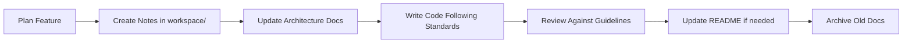
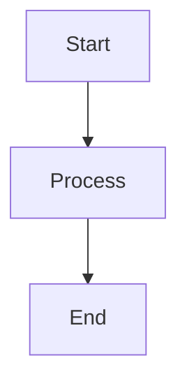

# ng-gighub Documentation

Welcome to the ng-gighub documentation! This documentation is specifically designed to work effectively with AI agents and human developers.

## 📚 Documentation Structure

### 📋 [setup/](./setup/)
Environment setup and configuration guides.

- **[environment.md](./setup/environment.md)** - Environment variables configuration
- **[supabase.md](./setup/supabase.md)** - Supabase database and storage setup

### 📋 [workspace/](./workspace/)
Working documents and active development artifacts. Use this area for day-to-day development work.

- **[todos/](./workspace/todos/)** - Development roadmap and task tracking
  - `development-roadmap.md` - Project development roadmap and milestones
- **[notes/](./workspace/notes/)** - Development notes and decisions
  - `component-x.md` - Component development notes and design decisions
- **[meeting-minutes/](./workspace/meeting-minutes/)** - Meeting records
  - `2025-11-22.md` - Sprint planning and review meetings

### 📦 [archive/](./archive/)
Historical documents and deprecated content. Reference only, not for active use.

- **[old-docs/](./archive/old-docs/)** - Outdated documentation
- **[deprecated-apis/](./archive/deprecated-apis/)** - No longer supported APIs
- **[previous-architecture/](./archive/previous-architecture/)** - Past system designs

### 🏗️ [architecture/](./architecture/)
System design documentation with diagrams and specifications.

- **[system-overview.md](./architecture/system-overview.md)** - High-level system architecture
- **[DOMAIN_MODEL.md](./architecture/DOMAIN_MODEL.md)** - Domain model design
- **[FOLDER_STRUCTURE.md](./architecture/FOLDER_STRUCTURE.md)** - Complete folder structure
- **[diagrams/](./architecture/diagrams/)** - Architecture diagrams (Mermaid format)
  - `erd.md` - Entity Relationship Diagram
  - `flowchart.md` - Application flow diagrams
- **[api-specs/](./architecture/api-specs/)** - API specifications (OpenAPI)
  - `v1.json` - Version 1 API specification
  - `v2.json` - Version 2 API specification

### 📚 [guides/](./guides/)
How-to guides and tutorials.

- **[implementation-guide.md](./guides/implementation-guide.md)** - Implementation guide and best practices

### 📏 [standards/](./standards/)
Coding standards, workflows, and team guidelines.

- **[code-style.md](./standards/code-style.md)** - Code style guide and best practices
- **[coding-standards.md](./standards/coding-standards.md)** - Overall coding standards
- **[naming-conventions.md](./standards/naming-conventions.md)** - Naming rules and conventions
- **[dependency-rules.md](./standards/dependency-rules.md)** - Dependency direction rules
- **[testing-standards.md](./standards/testing-standards.md)** - Testing standards and strategy
- **[git-workflow.md](./standards/git-workflow.md)** - Git branching strategy and commit conventions
- **[review-guidelines.md](./standards/review-guidelines.md)** - Code review process and checklist

### 🤖 [prompts/](./prompts/)
AI agent prompt templates for common development tasks.

- **[task-generation.md](./prompts/task-generation.md)** - Breaking down features into tasks
- **[code-review.md](./prompts/code-review.md)** - Automated code review prompts
- **[bug-triage.md](./prompts/bug-triage.md)** - Bug analysis and prioritization

## 🚀 Quick Start

### For Developers
1. Read the [系統概覽](./architecture/system-overview.md) to understand the architecture
2. Review [程式碼風格](./standards/code-style.md) before writing code
3. Follow [Git 工作流程](./standards/git-workflow.md) for commits and PRs
4. Check [審查準則](./standards/review-guidelines.md) before code reviews
5. Configure your [開發環境](./setup/environment.md)
6. Set up [Supabase](./setup/supabase.md) for backend services

### For AI Agents
1. Use [prompts/](./prompts/) templates for structured tasks
2. Reference [architecture/](./architecture/) for system context
3. Follow [standards/](./standards/) for consistency
4. Update [workspace/](./workspace/) with progress
5. Consult [DOCUMENTATION_STANDARDS.md](./DOCUMENTATION_STANDARDS.md) for documentation guidelines

## 📖 Document Types

### Design Documents
Architecture, system design, and technical specifications. Found in `architecture/`.

**When to use**:
- Planning new features
- Understanding system structure
- API design
- Data modeling

### Standards & Guidelines
Team conventions and best practices. Found in `standards/`.

**When to use**:
- Writing code
- Reviewing code
- Making commits
- Setting up projects

### Working Documents
Active development artifacts. Found in `workspace/`.

**When to use**:
- Tracking sprint tasks
- Recording decisions
- Meeting notes
- Quick references

### AI Prompts
Templates for AI-assisted development. Found in `prompts/`.

**When to use**:
- Breaking down features
- Automating code review
- Triaging bugs
- Generating documentation

## 🎯 Usage Guidelines

### Keeping Documentation Fresh

#### ✅ Do
- Update docs when making architectural changes
- Add new patterns to standards when adopted
- Archive outdated content to `archive/`
- Keep working documents current
- Use Mermaid for diagrams (text-based, version-controllable)
- Link between related documents

#### ❌ Don't
- Let documentation become stale
- Duplicate information across documents
- Store binary files (use text formats)
- Put sensitive information in docs
- Mix working and archived content

### Documentation Workflow



## 🔍 Finding Information

### By Topic

| Topic | Location | Files |
|-------|----------|-------|
| Environment Setup | `setup/` | `environment.md` |
| Supabase Setup | `setup/` | `supabase.md` |
| System Architecture | `architecture/` | `system-overview.md` |
| Domain Model | `architecture/` | `DOMAIN_MODEL.md` |
| Folder Structure | `architecture/` | `FOLDER_STRUCTURE.md` |
| Database Schema | `architecture/diagrams/` | `erd.md` |
| API Endpoints | `architecture/api-specs/` | `v1.json`, `v2.json` |
| Application Flows | `architecture/diagrams/` | `flowchart.md` |
| Code Style | `standards/` | `code-style.md` |
| Coding Standards | `standards/` | `coding-standards.md` |
| Naming Conventions | `standards/` | `naming-conventions.md` |
| Dependency Rules | `standards/` | `dependency-rules.md` |
| Testing Standards | `standards/` | `testing-standards.md` |
| Git Process | `standards/` | `git-workflow.md` |
| Code Reviews | `standards/` | `review-guidelines.md` |
| Development Roadmap | `workspace/todos/` | `development-roadmap.md` |
| Design Decisions | `workspace/notes/` | `*.md` |
| Meeting Records | `workspace/meeting-minutes/` | `*.md` |
| Documentation Standards | `.` | `DOCUMENTATION_STANDARDS.md` |

### By Role

#### Frontend Developer
- Start: `architecture/system-overview.md`
- Style: `standards/code-style.md`
- Components: `workspace/notes/component-x.md`

#### Backend Developer
- Start: `architecture/system-overview.md`
- API: `architecture/api-specs/v2.json`
- Database: `architecture/diagrams/erd.md`

#### DevOps Engineer
- Start: `architecture/system-overview.md`
- Workflows: `standards/git-workflow.md`

#### Project Manager
- Tasks: `workspace/todos/sprint-2025-11.yaml`
- Meetings: `workspace/meeting-minutes/`
- Architecture: `architecture/system-overview.md`

#### AI Agent
- Prompts: `prompts/`
- Standards: `standards/`
- Context: `architecture/`

## 🛠️ Tools & Formats

### Supported Formats

#### Markdown (.md)
Primary format for all documentation. Supports:
- Text formatting
- Code blocks with syntax highlighting
- Tables
- Links
- Mermaid diagrams
- Task lists

#### YAML (.yaml)
For structured data like task lists:
```yaml
tasks:
  - id: TASK-001
    title: "Task title"
    status: todo
```

#### JSON (.json)
For API specifications (OpenAPI/Swagger):
```json
{
  "openapi": "3.0.0",
  "info": {
    "title": "API Name",
    "version": "1.0.0"
  }
}
```

### Diagram Tools

#### Mermaid
All diagrams use Mermaid syntax for:
- Flowcharts
- Sequence diagrams
- Entity relationship diagrams
- Gantt charts
- State diagrams

**Why Mermaid?**
- Text-based (version control friendly)
- Rendered in GitHub/GitLab
- Easy to edit and maintain
- AI-friendly format

**Example**:


### Viewing Documentation

#### GitHub/GitLab
- All Markdown and Mermaid renders automatically
- Browse files directly in the web interface

#### VS Code
Install extensions:
- Markdown Preview Enhanced
- Mermaid Preview
- YAML

#### Command Line
```bash
# View Markdown
cat docs/architecture/system-overview.md

# Search docs
grep -r "search term" docs/

# Find files
find docs/ -name "*.md"
```

## 📝 Contributing to Documentation

### Adding New Documentation

1. **Choose the right location**
   - Active work → `workspace/`
   - Architecture → `architecture/`
   - Standards → `standards/`
   - AI prompts → `prompts/`

2. **Follow naming conventions**
   - Use kebab-case: `my-document.md`
   - Be descriptive: `user-authentication-flow.md`
   - Add dates to meeting minutes: `2025-11-22.md`

3. **Use templates**
   - Check existing docs for structure
   - Maintain consistent formatting
   - Include table of contents for long docs

4. **Link related docs**
   ```markdown
   See also: [Code Style Guide](../standards/code-style.md)
   ```

### Updating Documentation

1. **Keep it current**
   - Update docs with code changes
   - Review docs during sprint planning
   - Archive outdated content

2. **Version control**
   - Commit doc changes with code
   - Write clear commit messages
   - Reference related PRs/issues

3. **Review process**
   - Docs reviewed like code
   - Check for accuracy
   - Verify links work

## 🔗 External Resources

### Project Resources
- [Angular Documentation](https://angular.dev)
- [TypeScript Handbook](https://www.typescriptlang.org/docs/)
- [RxJS Documentation](https://rxjs.dev)

### Standards & Best Practices
- [Conventional Commits](https://www.conventionalcommits.org/)
- [Semantic Versioning](https://semver.org/)
- [OpenAPI Specification](https://swagger.io/specification/)

### Tools
- [Mermaid Live Editor](https://mermaid.live/)
- [Swagger Editor](https://editor.swagger.io/)
- [Markdown Guide](https://www.markdownguide.org/)

## 📞 Support

### Questions?
- Check existing documentation first
- Search for similar issues
- Ask in team chat
- Create documentation issue if info is missing

### Feedback
- Documentation issues: Create GitHub issue with label `documentation`
- Suggestions: Open discussion in team meetings
- Quick fixes: Submit PR directly

## 📋 Document Maintenance

### Regular Reviews
- **Weekly**: Update workspace documents
- **Sprint**: Review and archive completed work
- **Monthly**: Check architecture doc accuracy
- **Quarterly**: Major documentation audit

### Archiving Process
1. Identify outdated content
2. Move to appropriate `archive/` subdirectory
3. Add note in original location linking to archive
4. Update any linking documents

## 🏆 Best Practices

### Writing Documentation
- ✅ Write for your future self
- ✅ Use clear, simple language
- ✅ Include examples and code snippets
- ✅ Keep it concise but complete
- ✅ Update as you go, not later

### Using Documentation
- ✅ Read before asking questions
- ✅ Follow established patterns
- ✅ Update when you find errors
- ✅ Suggest improvements
- ✅ Share knowledge with team

### AI Agent Usage
- ✅ Use prompt templates from `prompts/`
- ✅ Reference architecture for context
- ✅ Follow standards for consistency
- ✅ Update workspace with findings
- ✅ Generate structured outputs

## 📊 Documentation Metrics

Track these metrics to ensure documentation health:
- Last updated date
- Number of broken links
- Coverage of features
- User feedback/issues
- Time to find information

## 🎓 Learning Path

### Week 1: Onboarding
1. Read system-overview.md
2. Review code-style.md
3. Understand git-workflow.md
4. Explore api-specs

### Week 2: Deep Dive
1. Study architecture diagrams
2. Review prompts for AI usage
3. Read review guidelines
4. Check recent meeting minutes

### Ongoing
1. Keep workspace documents updated
2. Contribute to standards
3. Archive old content
4. Improve documentation

---

**Last Updated**: 2025-11-21  
**Version**: 1.0.0  
**Maintainers**: Development Team

For questions or suggestions, please open an issue or contact the team.
