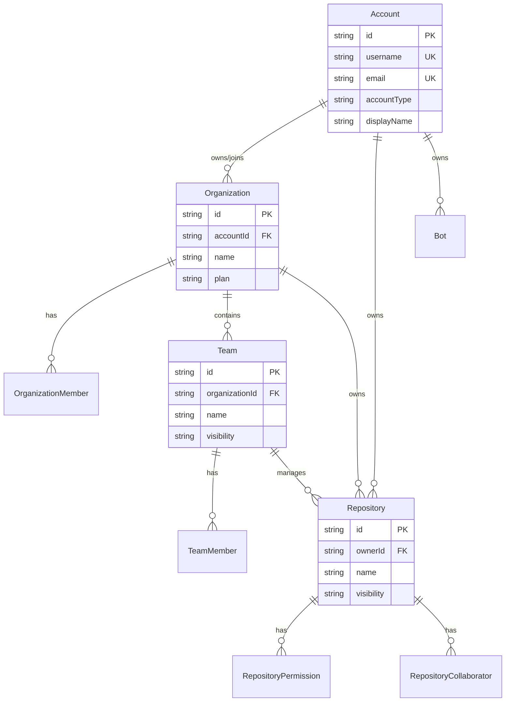

# 領域模型詳解

本文件詳細說明 ng-gighub 專案的領域模型設計，包含四個核心聚合根及其相關領域概念。

## 目錄

1. [領域概覽](#1-領域概覽)
2. [Account 聚合根](#2-account-聚合根)
3. [Organization 聚合根](#3-organization-聚合根)
4. [Team 聚合根](#4-team-聚合根)
5. [Repository 聚合根](#5-repository-聚合根)
6. [領域關係圖](#6-領域關係圖)
7. [業務規則總覽](#7-業務規則總覽)

---

## 1. 領域概覽

### 1.1 核心概念

ng-gighub 的領域模型基於以下核心概念：

- **Account（帳戶）**: 系統中的身份實體，可以是 User、Organization 或 Bot
- **Organization（組織）**: 協作實體，管理成員、團隊與專案
- **Team（團隊）**: 組織內的小組，管理成員與倉庫權限
- **Repository（倉庫）**: 程式碼倉庫，管理協作者與權限

### 1.2 聚合根之間的關係

```
User Account ──────┐
                   ├──→ Organization ──→ Team ──→ Repository
Organization Account ┘                            ↑
Bot Account ────────────────────────────────────→ │
```

**關係說明：**
1. User Account 可以建立或加入 Organization
2. Organization 可以建立多個 Team
3. Team 可以管理多個 Repository 的權限
4. Bot Account 可以直接與 Repository 關聯
5. Organization Account 可以擁有 Repository

---

## 2. Account 聚合根

### 2.1 聚合根定義

**Account** 是系統中身份實體的抽象概念，支援三種具體類型。

#### 2.1.1 聚合結構

```typescript
// 抽象聚合根
abstract class Account extends AggregateRoot {
  id: AccountId
  username: Username
  email: Email
  accountType: AccountType
  displayName: string
  avatarUrl?: string
  createdAt: Date
  updatedAt: Date
  
  // 實體
  profile: AccountProfile
  settings: AccountSettings
  
  // 方法
  abstract canBeDeleted(): boolean
  updateProfile(profile: Partial<AccountProfile>): Result<void>
  updateSettings(settings: Partial<AccountSettings>): Result<void>
}
```

#### 2.1.2 三種帳戶類型

**1. UserAccount（使用者帳戶）**

```typescript
class UserAccount extends Account {
  accountType: AccountType = AccountType.USER
  
  // 使用者特有屬性
  bio?: string
  location?: string
  company?: string
  website?: string
  
  // 業務規則
  canBeDeleted(): boolean {
    // 使用者可以刪除自己的帳戶（需確認相關資料處理）
    return true;
  }
  
  // 領域方法
  joinOrganization(orgId: OrganizationId, role: MemberRole): Result<void>
  leaveOrganization(orgId: OrganizationId): Result<void>
  switchToAccount(accountId: AccountId): Result<AccountSwitchedEvent>
}
```

**2. OrganizationAccount（組織帳戶）**

```typescript
class OrganizationAccount extends Account {
  accountType: AccountType = AccountType.ORGANIZATION
  
  // 組織特有屬性
  description?: string
  plan: OrganizationPlan
  billingEmail: Email
  
  // 業務規則
  canBeDeleted(): boolean {
    // 組織必須沒有活躍成員且沒有倉庫才能刪除
    return this.hasNoActiveMembers() && this.hasNoRepositories();
  }
  
  // 領域方法
  upgradePlan(newPlan: OrganizationPlan): Result<void>
  updateBillingInfo(email: Email): Result<void>
}
```

**3. BotAccount（機器人帳戶）**

```typescript
class BotAccount extends Account {
  accountType: AccountType = AccountType.BOT
  
  // Bot 特有屬性
  ownerId: AccountId           // 擁有者（User 或 Organization）
  permissions: string[]        // 權限範圍
  apiToken: string            // API Token (加密)
  isActive: boolean
  
  // 業務規則
  canBeDeleted(): boolean {
    // 只有擁有者可以刪除 Bot
    return true;
  }
  
  // 領域方法
  regenerateToken(): Result<string>
  activate(): Result<void>
  deactivate(): Result<void>
  updatePermissions(permissions: string[]): Result<void>
}
```

### 2.2 實體（Entities）

#### 2.2.1 AccountProfile

```typescript
class AccountProfile extends Entity {
  accountId: AccountId
  fullName?: string
  bio?: string
  location?: string
  company?: string
  website?: string
  twitterHandle?: string
  linkedinUrl?: string
  
  // 驗證
  validateWebsite(url: string): Result<void>
  validateSocialLinks(): Result<void>
}
```

#### 2.2.2 AccountSettings

```typescript
class AccountSettings extends Entity {
  accountId: AccountId
  emailNotifications: boolean
  twoFactorEnabled: boolean
  defaultVisibility: Visibility    // Public/Private
  timezone: string
  language: string
  theme: 'light' | 'dark' | 'auto'
  
  // 業務規則
  enableTwoFactor(secret: string): Result<void>
  disableTwoFactor(): Result<void>
}
```

### 2.3 值對象（Value Objects）

```typescript
// AccountId
class AccountId extends ValueObject<string> {
  static create(id: string): Result<AccountId>
  getValue(): string
}

// Username
class Username extends ValueObject<string> {
  static create(username: string): Result<Username>
  // 規則：3-39 字元，只能包含英數字、連字號、底線
  private static readonly PATTERN = /^[a-zA-Z0-9_-]{3,39}$/
  getValue(): string
}

// Email
class Email extends ValueObject<string> {
  static create(email: string): Result<Email>
  // 規則：有效的電子郵件格式
  private static readonly PATTERN = /^[^\s@]+@[^\s@]+\.[^\s@]+$/
  getValue(): string
  getDomain(): string
}

// AccountType
class AccountType extends ValueObject<'user' | 'organization' | 'bot'> {
  static readonly USER = new AccountType('user')
  static readonly ORGANIZATION = new AccountType('organization')
  static readonly BOT = new AccountType('bot')
  
  static create(type: string): Result<AccountType>
  isUser(): boolean
  isOrganization(): boolean
  isBot(): boolean
}

// AccountRole
class AccountRole extends ValueObject<'owner' | 'admin' | 'member'> {
  static readonly OWNER = new AccountRole('owner')
  static readonly ADMIN = new AccountRole('admin')
  static readonly MEMBER = new AccountRole('member')
  
  hasPermissionTo(action: string): boolean
}
```

### 2.4 領域事件（Domain Events）

```typescript
// 帳戶建立事件
class AccountCreatedEvent extends DomainEvent {
  accountId: string
  accountType: 'user' | 'organization' | 'bot'
  username: string
  email: string
}

// 帳戶切換事件
class AccountSwitchedEvent extends DomainEvent {
  userId: string
  fromAccountId: string
  toAccountId: string
}

// 帳戶更新事件
class AccountUpdatedEvent extends DomainEvent {
  accountId: string
  updatedFields: string[]
}

// 帳戶刪除事件
class AccountDeletedEvent extends DomainEvent {
  accountId: string
  accountType: string
  deletedBy: string
}
```

### 2.5 業務規則（Specifications）

```typescript
// 是否可切換帳戶
class CanSwitchAccountSpec implements ISpecification<Account> {
  constructor(private currentUserId: string) {}
  
  isSatisfiedBy(account: Account): boolean {
    // 規則：使用者必須有權限存取目標帳戶
    return this.userHasAccessTo(account);
  }
}

// 是否可刪除帳戶
class CanDeleteAccountSpec implements ISpecification<Account> {
  isSatisfiedBy(account: Account): boolean {
    return account.canBeDeleted();
  }
}
```

---

## 3. Organization 聚合根

### 3.1 聚合根定義

**Organization** 代表組織實體，管理成員、團隊與資源。

```typescript
class Organization extends AggregateRoot {
  id: OrganizationId
  accountId: AccountId           // 關聯的 Organization Account
  name: string
  slug: string                   // URL-friendly 名稱
  description?: string
  plan: OrganizationPlan
  billingEmail: Email
  website?: string
  location?: string
  
  // 實體集合
  private members: OrganizationMember[]
  private invitations: OrganizationInvitation[]
  
  // Getters
  getMembers(): ReadonlyArray<OrganizationMember>
  getMember(userId: string): OrganizationMember | null
  getOwners(): OrganizationMember[]
  
  // 成員管理
  addMember(userId: string, role: MemberRole, addedBy: string): Result<MemberAddedEvent>
  removeMember(userId: string, removedBy: string): Result<MemberRemovedEvent>
  updateMemberRole(userId: string, newRole: MemberRole, updatedBy: string): Result<void>
  
  // 邀請管理
  inviteMember(email: Email, role: MemberRole, invitedBy: string): Result<void>
  acceptInvitation(invitationId: string, userId: string): Result<void>
  cancelInvitation(invitationId: string): Result<void>
  
  // 業務規則驗證
  canAddMember(addedBy: string): boolean
  canRemoveMember(userId: string, removedBy: string): boolean
  mustHaveAtLeastOneOwner(): boolean
}
```

### 3.2 實體

#### 3.2.1 OrganizationMember

```typescript
class OrganizationMember extends Entity {
  id: string
  organizationId: OrganizationId
  userId: string                 // 使用者 ID
  role: MemberRole              // Owner, Admin, Member, Billing
  joinedAt: Date
  addedBy: string
  
  // 方法
  updateRole(newRole: MemberRole): void
  isOwner(): boolean
  isAdmin(): boolean
  canManageMembers(): boolean
  canManageTeams(): boolean
}
```

#### 3.2.2 OrganizationInvitation

```typescript
class OrganizationInvitation extends Entity {
  id: string
  organizationId: OrganizationId
  email: Email
  role: MemberRole
  invitedBy: string
  invitedAt: Date
  expiresAt: Date
  status: 'pending' | 'accepted' | 'expired' | 'cancelled'
  
  // 方法
  isExpired(): boolean
  accept(userId: string): Result<void>
  cancel(): void
}
```

### 3.3 值對象

```typescript
// OrganizationId
class OrganizationId extends ValueObject<string> {
  static create(id: string): Result<OrganizationId>
}

// MemberRole
class MemberRole extends ValueObject<'owner' | 'admin' | 'member' | 'billing'> {
  static readonly OWNER = new MemberRole('owner')
  static readonly ADMIN = new MemberRole('admin')
  static readonly MEMBER = new MemberRole('member')
  static readonly BILLING = new MemberRole('billing')
  
  canManageMembers(): boolean
  canManageTeams(): boolean
  canManageBilling(): boolean
}

// OrganizationPlan
class OrganizationPlan extends ValueObject<'free' | 'team' | 'enterprise'> {
  static readonly FREE = new OrganizationPlan('free')
  static readonly TEAM = new OrganizationPlan('team')
  static readonly ENTERPRISE = new OrganizationPlan('enterprise')
  
  getMaxMembers(): number
  getMaxTeams(): number
  getMaxPrivateRepos(): number
}
```

### 3.4 領域事件

```typescript
class OrganizationCreatedEvent extends DomainEvent {
  organizationId: string
  name: string
  ownerId: string
}

class MemberAddedEvent extends DomainEvent {
  organizationId: string
  userId: string
  role: string
  addedBy: string
}

class MemberRemovedEvent extends DomainEvent {
  organizationId: string
  userId: string
  removedBy: string
}

class TeamCreatedEvent extends DomainEvent {
  organizationId: string
  teamId: string
  name: string
  createdBy: string
}
```

---

## 4. Team 聚合根

### 4.1 聚合根定義

**Team** 代表組織內的團隊，管理成員與倉庫權限。

```typescript
class Team extends AggregateRoot {
  id: TeamId
  organizationId: OrganizationId
  name: TeamName
  slug: string
  description?: string
  visibility: 'visible' | 'secret'    // visible: 所有成員可見, secret: 僅團隊成員
  createdBy: string
  createdAt: Date
  
  // 實體集合
  private members: TeamMember[]
  
  // Getters
  getMembers(): ReadonlyArray<TeamMember>
  getMember(userId: string): TeamMember | null
  getMaintainers(): TeamMember[]
  
  // 成員管理
  addMember(userId: string, role: TeamRole, addedBy: string): Result<MemberJoinedEvent>
  removeMember(userId: string, removedBy: string): Result<MemberLeftEvent>
  updateMemberRole(userId: string, newRole: TeamRole): Result<void>
  
  // 業務規則
  canAddMember(addedBy: string, userId: string): boolean
  canRemoveMember(removedBy: string, userId: string): boolean
  userMustBeOrgMember(userId: string): boolean
}
```

### 4.2 實體

```typescript
class TeamMember extends Entity {
  id: string
  teamId: TeamId
  userId: string
  role: TeamRole                 // Maintainer, Member
  joinedAt: Date
  addedBy: string
  
  isMaintainer(): boolean
  canManageMembers(): boolean
  canManageRepositories(): boolean
}
```

### 4.3 值對象

```typescript
// TeamId
class TeamId extends ValueObject<string> {
  static create(id: string): Result<TeamId>
}

// TeamName
class TeamName extends ValueObject<string> {
  static create(name: string): Result<TeamName>
  // 規則：在組織內唯一，2-50 字元
}

// TeamRole
class TeamRole extends ValueObject<'maintainer' | 'member'> {
  static readonly MAINTAINER = new TeamRole('maintainer')
  static readonly MEMBER = new TeamRole('member')
  
  canManageMembers(): boolean
  canManageRepositories(): boolean
}
```

### 4.4 領域事件

```typescript
class TeamCreatedEvent extends DomainEvent {
  teamId: string
  organizationId: string
  name: string
  createdBy: string
}

class MemberJoinedEvent extends DomainEvent {
  teamId: string
  userId: string
  role: string
  addedBy: string
}

class MemberLeftEvent extends DomainEvent {
  teamId: string
  userId: string
  removedBy: string
}
```

---

## 5. Repository 聚合根

### 5.1 聚合根定義

**Repository** 代表程式碼倉庫，管理協作者與權限。

```typescript
class Repository extends AggregateRoot {
  id: RepositoryId
  ownerId: AccountId             // User, Organization 或 Bot
  ownerType: 'user' | 'organization'
  name: RepositoryName
  slug: string                   // owner-name/repo-name
  description?: string
  visibility: Visibility         // Public, Private, Internal
  defaultBranch: string
  
  isTemplate: boolean
  isArchived: boolean
  isFork: boolean
  forkedFrom?: RepositoryId
  
  createdAt: Date
  updatedAt: Date
  
  // 實體集合
  private permissions: RepositoryPermission[]
  private collaborators: RepositoryCollaborator[]
  
  // Getters
  getPermissions(): ReadonlyArray<RepositoryPermission>
  getCollaborators(): ReadonlyArray<RepositoryCollaborator>
  getCollaborator(userId: string): RepositoryCollaborator | null
  
  // 權限管理
  grantPermission(
    userId: string, 
    level: PermissionLevel, 
    grantedBy: string
  ): Result<PermissionGrantedEvent>
  
  revokePermission(userId: string, revokedBy: string): Result<void>
  
  updatePermission(
    userId: string, 
    newLevel: PermissionLevel, 
    updatedBy: string
  ): Result<void>
  
  // 協作者管理
  addCollaborator(
    userId: string, 
    permission: PermissionLevel, 
    addedBy: string
  ): Result<CollaboratorAddedEvent>
  
  removeCollaborator(userId: string, removedBy: string): Result<void>
  
  // 業務規則
  canAccess(userId: string): boolean
  canWrite(userId: string): boolean
  canAdmin(userId: string): boolean
  isPublic(): boolean
  isPrivate(): boolean
}
```

### 5.2 實體

#### 5.2.1 RepositoryPermission

```typescript
class RepositoryPermission extends Entity {
  id: string
  repositoryId: RepositoryId
  userId: string
  level: PermissionLevel         // Read, Write, Admin
  grantedBy: string
  grantedAt: Date
  source: 'direct' | 'team' | 'organization'
  
  isAdmin(): boolean
  canWrite(): boolean
  canRead(): boolean
}
```

#### 5.2.2 RepositoryCollaborator

```typescript
class RepositoryCollaborator extends Entity {
  id: string
  repositoryId: RepositoryId
  userId: string
  permission: PermissionLevel
  addedBy: string
  addedAt: Date
  
  hasAdminAccess(): boolean
  hasWriteAccess(): boolean
}
```

### 5.3 值對象

```typescript
// RepositoryId
class RepositoryId extends ValueObject<string> {
  static create(id: string): Result<RepositoryId>
}

// RepositoryName
class RepositoryName extends ValueObject<string> {
  static create(name: string): Result<RepositoryName>
  // 規則：在擁有者範圍內唯一，1-100 字元，只能包含英數字、連字號、底線、點
}

// Visibility
class Visibility extends ValueObject<'public' | 'private' | 'internal'> {
  static readonly PUBLIC = new Visibility('public')
  static readonly PRIVATE = new Visibility('private')
  static readonly INTERNAL = new Visibility('internal')
  
  isPublic(): boolean
  isPrivate(): boolean
  isInternal(): boolean
}

// PermissionLevel
class PermissionLevel extends ValueObject<'read' | 'write' | 'admin'> {
  static readonly READ = new PermissionLevel('read')
  static readonly WRITE = new PermissionLevel('write')
  static readonly ADMIN = new PermissionLevel('admin')
  
  canRead(): boolean
  canWrite(): boolean
  canAdmin(): boolean
  includes(level: PermissionLevel): boolean
}
```

### 5.4 領域事件

```typescript
class RepositoryCreatedEvent extends DomainEvent {
  repositoryId: string
  ownerId: string
  name: string
  visibility: string
}

class PermissionGrantedEvent extends DomainEvent {
  repositoryId: string
  userId: string
  permissionLevel: string
  grantedBy: string
}

class CollaboratorAddedEvent extends DomainEvent {
  repositoryId: string
  userId: string
  permission: string
  addedBy: string
}
```

---

## 6. 領域關係圖

### 6.1 實體關係圖 (Mermaid)



### 6.2 聚合邊界圖

```
┌─────────────────────────────────────────────────────────────┐
│ Account Aggregate                                            │
│  ┌─────────────┐                                            │
│  │   Account   │ (Aggregate Root)                           │
│  └──────┬──────┘                                            │
│         │                                                     │
│         ├─→ AccountProfile (Entity)                         │
│         └─→ AccountSettings (Entity)                        │
└─────────────────────────────────────────────────────────────┘

┌─────────────────────────────────────────────────────────────┐
│ Organization Aggregate                                       │
│  ┌──────────────┐                                           │
│  │ Organization │ (Aggregate Root)                          │
│  └──────┬───────┘                                           │
│         │                                                     │
│         ├─→ OrganizationMember[] (Entity Collection)        │
│         └─→ OrganizationInvitation[] (Entity Collection)    │
└─────────────────────────────────────────────────────────────┘

┌─────────────────────────────────────────────────────────────┐
│ Team Aggregate                                               │
│  ┌──────────┐                                               │
│  │   Team   │ (Aggregate Root)                              │
│  └────┬─────┘                                               │
│       │                                                       │
│       └─→ TeamMember[] (Entity Collection)                  │
└─────────────────────────────────────────────────────────────┘

┌─────────────────────────────────────────────────────────────┐
│ Repository Aggregate                                         │
│  ┌────────────┐                                             │
│  │ Repository │ (Aggregate Root)                            │
│  └─────┬──────┘                                             │
│        │                                                      │
│        ├─→ RepositoryPermission[] (Entity Collection)       │
│        └─→ RepositoryCollaborator[] (Entity Collection)     │
└─────────────────────────────────────────────────────────────┘
```

---

## 7. 業務規則總覽

### 7.1 Account 業務規則

1. **帳戶唯一性**
   - Username 在系統中必須唯一
   - Email 在系統中必須唯一

2. **使用者名稱規則**
   - 長度：3-39 字元
   - 格式：只能包含英數字、連字號(`-`)、底線(`_`)
   - 不能以連字號或底線開頭或結尾

3. **帳戶切換規則**
   - 使用者只能切換到有權限存取的帳戶
   - 包括：自己的帳戶、所屬組織、擁有的 Bot

4. **帳戶刪除規則**
   - User：可以刪除（需處理相關資料）
   - Organization：必須沒有活躍成員且沒有倉庫
   - Bot：只有擁有者可以刪除

### 7.2 Organization 業務規則

1. **成員管理規則**
   - 只有 Owner/Admin 可以新增/移除成員
   - 組織必須至少有一位 Owner
   - 不能移除最後一位 Owner（除非刪除組織）

2. **角色權限**
   - Owner：完全控制
   - Admin：管理成員、團隊、倉庫
   - Member：存取組織資源
   - Billing：管理帳單資訊

3. **邀請規則**
   - 邀請有效期：7 天
   - 一個 Email 同時只能有一個待處理邀請
   - 接受邀請後自動成為組織成員

4. **方案限制**
   - Free：最多 5 名成員，3 個團隊
   - Team：最多 50 名成員，無限團隊
   - Enterprise：無限制

### 7.3 Team 業務規則

1. **團隊成員規則**
   - 團隊成員必須是組織成員
   - 只有 Maintainer 可以管理團隊成員
   - 團隊名稱在組織內唯一

2. **可見性規則**
   - Visible：所有組織成員可見
   - Secret：僅團隊成員可見

3. **權限繼承**
   - 團隊成員自動獲得團隊管理的倉庫權限
   - 團隊權限可以授予倉庫 Read/Write/Admin

### 7.4 Repository 業務規則

1. **可見性規則**
   - Public：所有人可讀
   - Private：需明確授權
   - Internal：組織成員可讀

2. **權限層級**
   - Read：讀取程式碼
   - Write：Read + 推送變更
   - Admin：Write + 管理設定、協作者

3. **協作者規則**
   - 只有 Admin 可以新增/移除協作者
   - 擁有者永遠有 Admin 權限
   - 權限可以直接授予或透過團隊授予

4. **命名規則**
   - 倉庫名稱在擁有者範圍內唯一
   - 格式：`owner-name/repo-name`
   - 長度：1-100 字元

---

## 附錄

### A. 值對象驗證規則總表

| 值對象 | 規則 | 範例 |
|--------|------|------|
| Username | 3-39 字元，英數字+連字號+底線 | `john-doe`, `user_123` |
| Email | 有效的電子郵件格式 | `user@example.com` |
| AccountType | `user`, `organization`, `bot` | `user` |
| MemberRole | `owner`, `admin`, `member`, `billing` | `admin` |
| TeamRole | `maintainer`, `member` | `maintainer` |
| PermissionLevel | `read`, `write`, `admin` | `write` |
| Visibility | `public`, `private`, `internal` | `private` |
| OrganizationPlan | `free`, `team`, `enterprise` | `team` |

### B. 領域服務職責

| 領域服務 | 職責 |
|----------|------|
| AccountDomainService | 跨帳戶類型的業務邏輯 |
| AccountFactory | 建立不同類型的帳戶 |
| AccountValidator | 驗證帳戶相關業務規則 |
| OrganizationDomainService | 組織層級的業務邏輯 |
| MemberManagementService | 成員管理複雜邏輯 |
| TeamDomainService | 團隊層級的業務邏輯 |
| RepositoryDomainService | 倉庫層級的業務邏輯 |
| PermissionManagementService | 權限計算與管理 |

---

**文件維護者**: Development Team  
**最後更新**: 2025-11-21  
**版本**: 1.0.0
