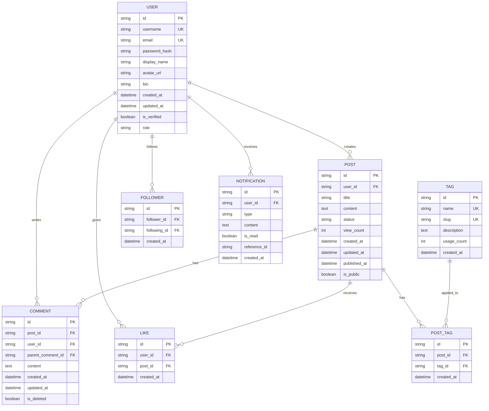

# Entity Relationship Diagram (ERD)

This document contains the Entity Relationship Diagram for the ng-gighub application using Mermaid syntax.

## Database Schema



## Entity Descriptions

### USER
Represents registered users in the system.
- **Primary Key**: id
- **Unique Keys**: username, email
- **Relationships**: 
  - Creates posts
  - Writes comments
  - Gives likes
  - Follows other users
  - Receives notifications

### POST
Represents user-generated content/articles.
- **Primary Key**: id
- **Foreign Keys**: user_id (references USER)
- **Relationships**: 
  - Belongs to a user
  - Has many comments
  - Receives likes
  - Tagged with tags

### COMMENT
Represents comments on posts.
- **Primary Key**: id
- **Foreign Keys**: 
  - post_id (references POST)
  - user_id (references USER)
  - parent_comment_id (self-reference for nested comments)
- **Relationships**: 
  - Belongs to a post
  - Written by a user
  - Can have parent comment (for threading)

### LIKE
Represents likes on posts.
- **Primary Key**: id
- **Foreign Keys**: 
  - user_id (references USER)
  - post_id (references POST)
- **Relationships**: 
  - Given by a user
  - Applied to a post

### TAG
Represents categorization tags.
- **Primary Key**: id
- **Unique Keys**: name, slug
- **Relationships**: 
  - Applied to posts via POST_TAG junction table

### POST_TAG
Junction table for many-to-many relationship between posts and tags.
- **Primary Key**: id
- **Foreign Keys**: 
  - post_id (references POST)
  - tag_id (references TAG)
- **Relationships**: 
  - Links posts to tags

### FOLLOWER
Represents follower relationships between users.
- **Primary Key**: id
- **Foreign Keys**: 
  - follower_id (references USER)
  - following_id (references USER)
- **Relationships**: 
  - Connects two users

### NOTIFICATION
Represents system notifications for users.
- **Primary Key**: id
- **Foreign Keys**: user_id (references USER)
- **Relationships**: 
  - Sent to a user

## Indexes

### Recommended Indexes
```sql
-- User indexes
CREATE INDEX idx_user_username ON USER(username);
CREATE INDEX idx_user_email ON USER(email);

-- Post indexes
CREATE INDEX idx_post_user_id ON POST(user_id);
CREATE INDEX idx_post_created_at ON POST(created_at);
CREATE INDEX idx_post_status ON POST(status);

-- Comment indexes
CREATE INDEX idx_comment_post_id ON COMMENT(post_id);
CREATE INDEX idx_comment_user_id ON COMMENT(user_id);
CREATE INDEX idx_comment_parent_id ON COMMENT(parent_comment_id);

-- Like indexes
CREATE UNIQUE INDEX idx_like_user_post ON LIKE(user_id, post_id);
CREATE INDEX idx_like_post_id ON LIKE(post_id);

-- Tag indexes
CREATE INDEX idx_tag_name ON TAG(name);
CREATE INDEX idx_tag_slug ON TAG(slug);

-- Post-Tag indexes
CREATE UNIQUE INDEX idx_post_tag_unique ON POST_TAG(post_id, tag_id);
CREATE INDEX idx_post_tag_tag_id ON POST_TAG(tag_id);

-- Follower indexes
CREATE UNIQUE INDEX idx_follower_unique ON FOLLOWER(follower_id, following_id);
CREATE INDEX idx_follower_following_id ON FOLLOWER(following_id);

-- Notification indexes
CREATE INDEX idx_notification_user_id ON NOTIFICATION(user_id);
CREATE INDEX idx_notification_is_read ON NOTIFICATION(is_read);
```

## Data Integrity Rules

### Constraints
1. **User email and username must be unique**
2. **User cannot follow themselves**: follower_id ≠ following_id
3. **User cannot like the same post twice**: Unique constraint on (user_id, post_id)
4. **Comments must belong to a post**
5. **Soft delete for comments**: Use is_deleted flag instead of physical deletion

### Cascading Rules
- On user deletion: Soft delete (mark as deleted, keep data)
- On post deletion: Cascade to comments and likes
- On comment deletion: Soft delete (set is_deleted = true)

## Notes
- All timestamps are stored in UTC
- UUIDs are used for primary keys for better distributed system support
- Soft deletes are preferred to maintain data integrity and audit trail
