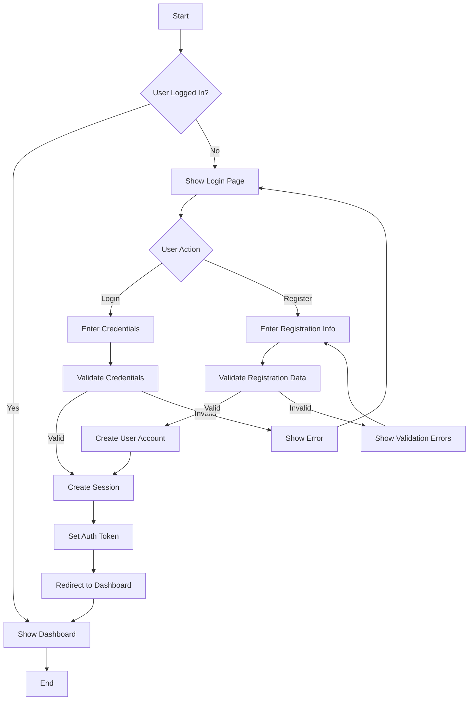
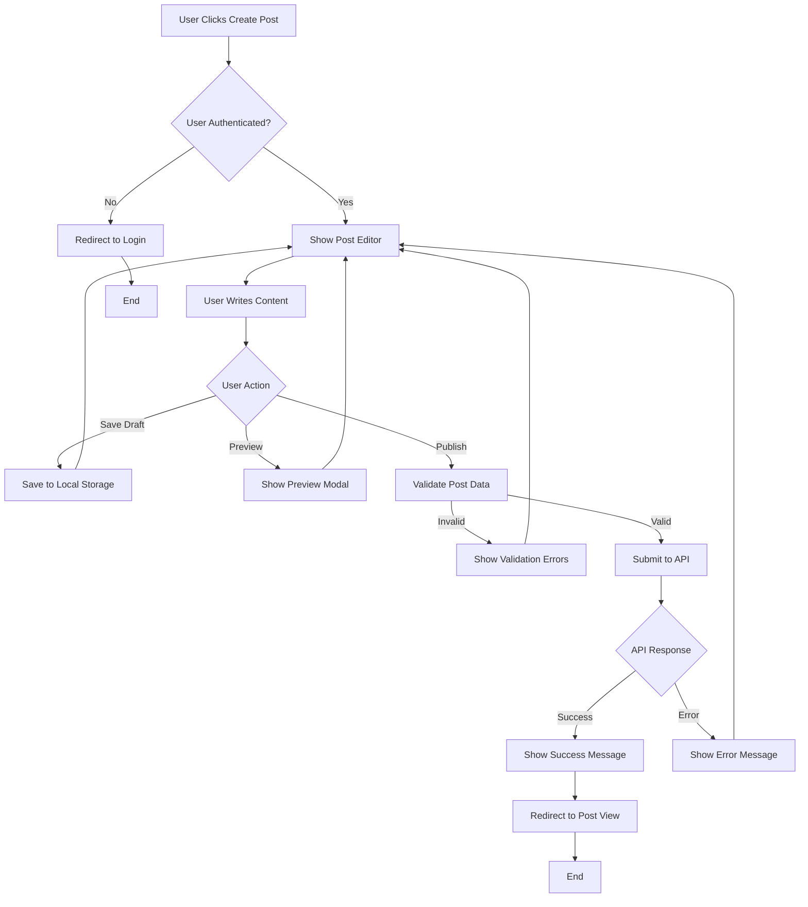
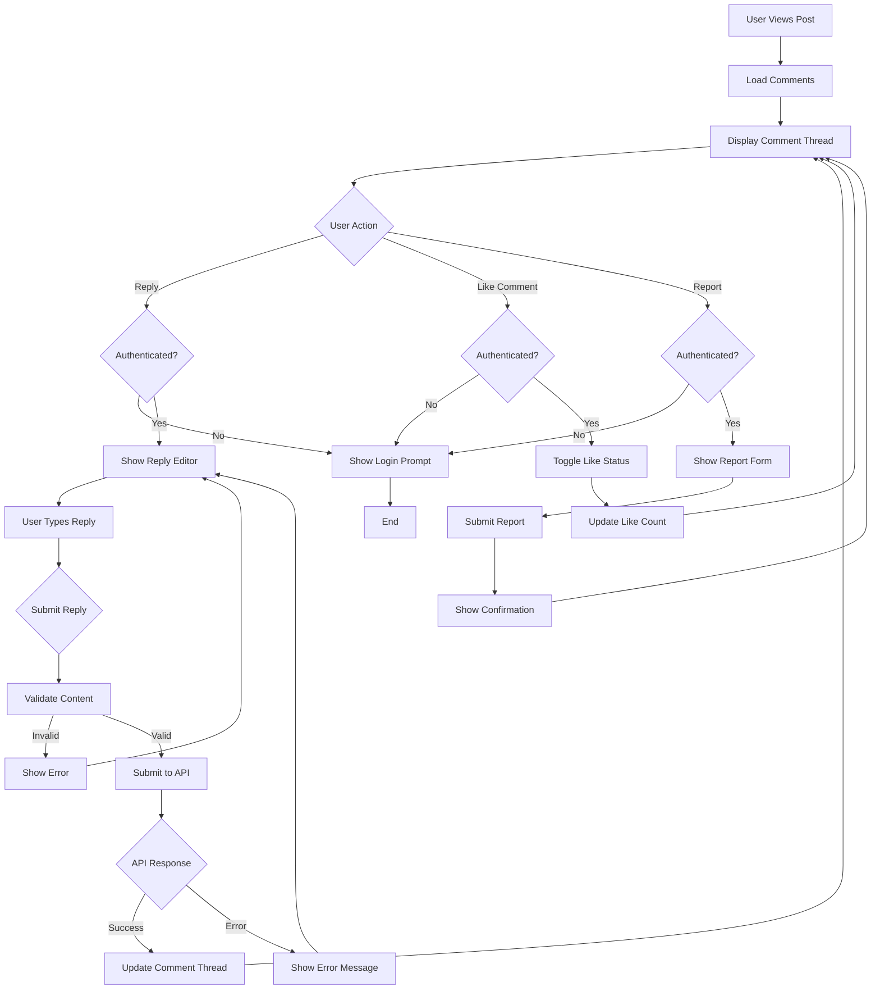
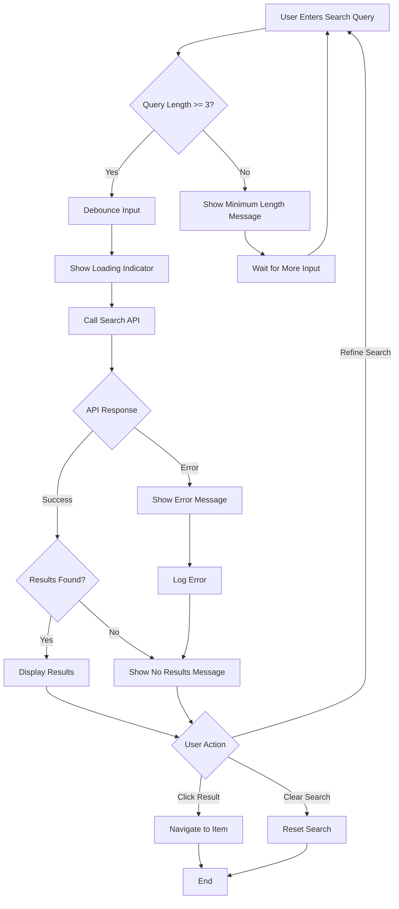
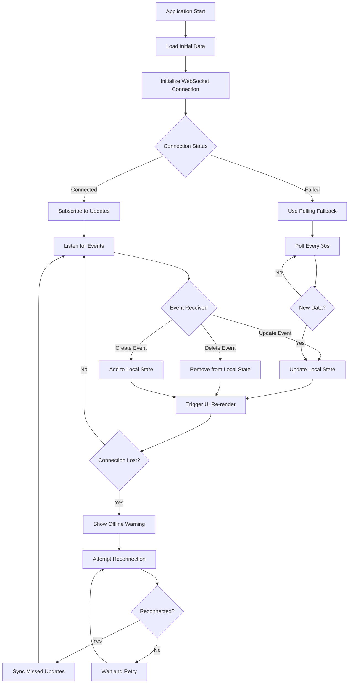
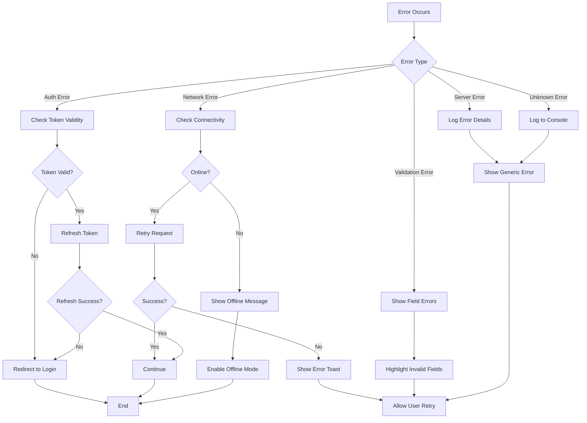

# Application Flowcharts

This document contains various flowcharts describing the ng-gighub application flows using Mermaid syntax.

## User Authentication Flow

## Post Creation Flow

## Comment System Flow

## Search Flow

## Data Synchronization Flow

## Error Handling Flow

## Notes
- All flowcharts are rendered using Mermaid syntax
- Flowcharts can be viewed in GitHub or any Mermaid-compatible markdown viewer
- Update these diagrams when application flows change
- Use consistent naming conventions for nodes and actions
