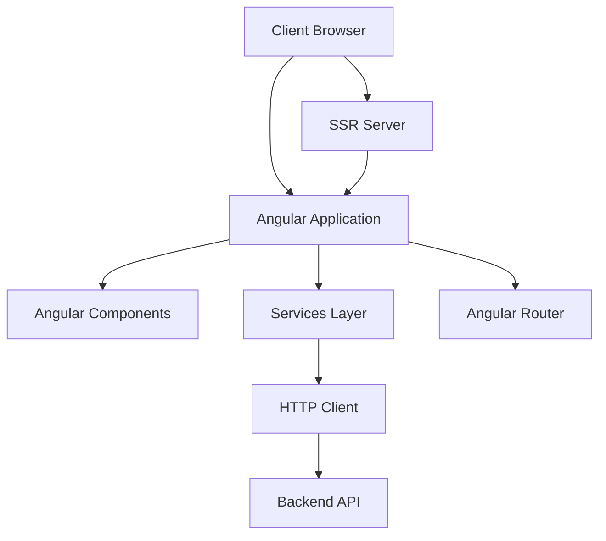

# System Overview

## Introduction
This document provides a high-level overview of the ng-gighub system architecture, including its components, data flows, and key design decisions.

## System Architecture

### High-Level Architecture
The ng-gighub application is built using Angular 20 with server-side rendering (SSR) support. It follows a modern, component-based architecture with clear separation of concerns.

### Key Components

#### 1. Frontend Application
- **Framework**: Angular 20.1.0
- **Language**: TypeScript 5.8.2
- **State Management**: RxJS 7.8.0
- **Routing**: Angular Router

#### 2. Server-Side Rendering (SSR)
- **Runtime**: Node.js with Express
- **Purpose**: Improved SEO and initial page load performance
- **Implementation**: Angular Universal (@angular/ssr)

#### 3. Build System
- **CLI**: Angular CLI 20.1.4
- **Bundler**: Angular Build (@angular/build)
- **Testing**: Karma + Jasmine

## System Components



## Technology Stack

### Frontend Stack
| Technology | Version | Purpose |
|------------|---------|---------|
| Angular | 20.1.0 | Core framework |
| TypeScript | 5.8.2 | Programming language |
| RxJS | 7.8.0 | Reactive programming |
| Angular Router | 20.1.0 | Client-side routing |

### Development Tools
| Tool | Version | Purpose |
|------|---------|---------|
| Angular CLI | 20.1.4 | Project scaffolding and build |
| Karma | 6.4.0 | Test runner |
| Jasmine | 5.8.0 | Testing framework |

## Data Flow

### Request Flow
1. User interacts with the UI
2. Component handles user event
3. Component calls service method
4. Service makes HTTP request to API
5. API returns data
6. Service transforms and returns data
7. Component updates view with new data

### State Management
- Component-level state using Angular signals (where applicable)
- Service-level state using RxJS BehaviorSubjects
- Route state using Angular Router

## Security Considerations

### Frontend Security
- XSS prevention through Angular's built-in sanitization
- CSRF protection via token-based authentication
- Input validation on all user inputs
- Content Security Policy (CSP) headers

### Build Security
- Dependency scanning via npm audit
- Regular dependency updates
- TypeScript strict mode enabled

## Performance Optimization

### Strategies
1. **Lazy Loading**: Routes loaded on-demand
2. **OnPush Change Detection**: Optimized component rendering
3. **Server-Side Rendering**: Faster initial page load
4. **Tree Shaking**: Unused code elimination
5. **AOT Compilation**: Ahead-of-time compilation for production

### Metrics
- First Contentful Paint (FCP): Target < 1.5s
- Time to Interactive (TTI): Target < 3.5s
- Bundle Size: Target < 500KB (gzipped)

## Deployment Architecture

### Build Process
```
Source Code → TypeScript Compilation → Bundling → Optimization → Distribution Files
```

### Deployment Pipeline
1. Code commit and push
2. CI/CD triggers build
3. Run tests and linting
4. Build production bundle
5. Deploy to hosting environment
6. Health check verification

## Scalability Considerations

### Frontend Scalability
- CDN distribution for static assets
- Browser caching strategies
- Service worker for offline support (future)

### SSR Scalability
- Horizontal scaling of SSR server instances
- Load balancing across multiple servers
- Caching of rendered pages

## Monitoring and Observability

### Key Metrics
- Application performance metrics
- Error tracking and reporting
- User analytics
- Bundle size tracking

### Tools (Recommended)
- Google Analytics for user behavior
- Sentry for error tracking
- Lighthouse for performance audits

## Future Enhancements

### Planned Improvements
1. Progressive Web App (PWA) capabilities
2. Advanced caching strategies
3. Micro-frontend architecture exploration
4. Enhanced SSR optimization
5. GraphQL integration (if needed)

## References
- [Angular Documentation](https://angular.dev)
- [Angular Universal SSR Guide](https://angular.dev/guide/ssr)
- [RxJS Documentation](https://rxjs.dev)
- [TypeScript Handbook](https://www.typescriptlang.org/docs/)
