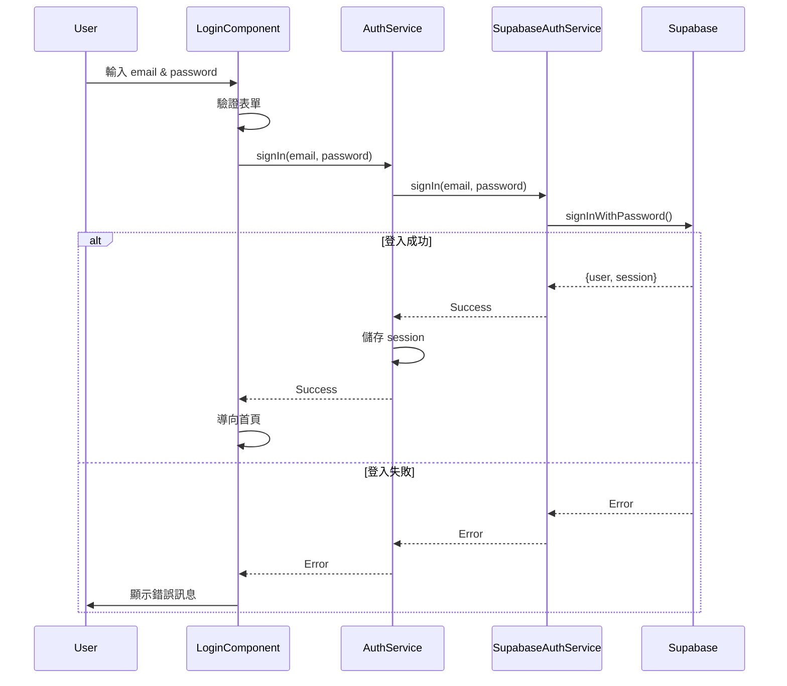
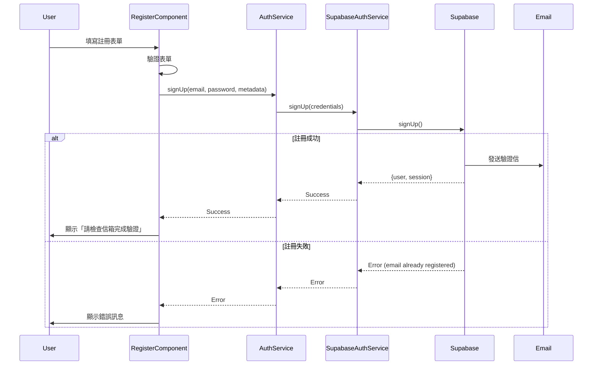
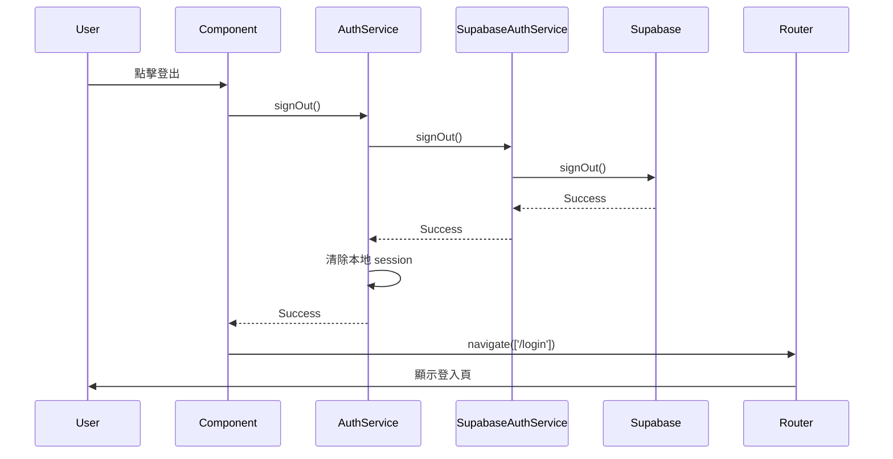
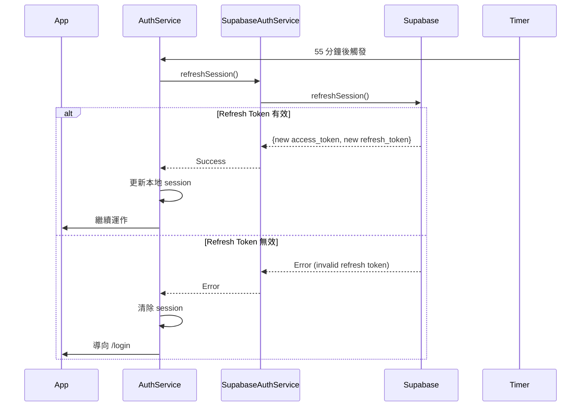
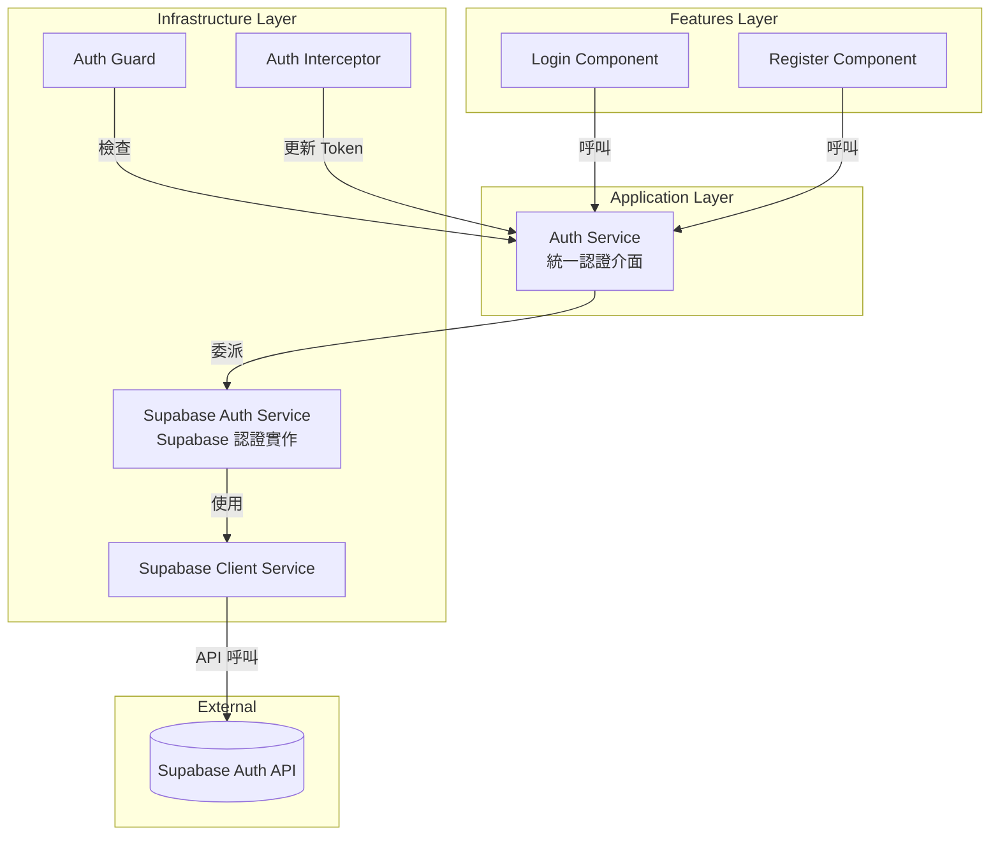

# 認證功能實施文檔

## 目錄

- [1. 概述](#1-概述)
- [2. 端點設計](#2-端點設計)
- [3. 技術架構](#3-技術架構)
- [4. Supabase 整合](#4-supabase-整合)
- [5. 實作步驟](#5-實作步驟)
- [6. 程式碼範例](#6-程式碼範例)
- [7. 驗證清單](#7-驗證清單)
- [8. 參考資料](#8-參考資料)

---

## 1. 概述

### 1.1 目標

本文件說明 ng-gighub 專案認證功能的具體實施方式，包含以下四個核心端點：

- `/login` - 使用者登入頁面
- `/register` - 使用者註冊頁面
- `/logout` - 使用者登出操作
- `/refresh` - Token 自動更新機制

### 1.2 設計原則

1. **保持架構一致性**：遵循專案的 DDD + Clean Architecture 結構
2. **參考最佳實踐**：適當參考 Supabase Angular 教學，但不改變專案方向
3. **SSR 相容**：所有認證功能須與 Angular SSR 相容
4. **安全優先**：採用業界標準的安全措施（HTTP-only Cookie, CSRF 防護等）

### 1.3 與既有架構的關係

本文件是 [認證與令牌管理](./authentication.md) 的實施補充，提供：
- 具體的實作步驟
- 程式碼範例
- 驗證方法

理論架構請參考主文件 `authentication.md`。

---

## 2. 端點設計

### 2.1 `/login` - 使用者登入

#### 功能說明

提供使用者登入介面，輸入 email 與密碼後進行身份驗證。

#### UI 需求

- **表單欄位**：
  - Email（必填，email 格式驗證）
  - Password（必填，密碼遮罩）
  - Remember Me（選填，記住登入狀態）
  
- **操作按鈕**：
  - 登入按鈕（提交表單）
  - 忘記密碼連結
  - 註冊連結
  
- **錯誤處理**：
  - 帳號或密碼錯誤
  - 帳號未驗證
  - 帳號被停用
  - 網路錯誤

#### 流程圖



---

### 2.2 `/register` - 使用者註冊

#### 功能說明

提供新使用者註冊介面，建立新帳號並發送驗證信。

#### UI 需求

- **表單欄位**：
  - Email（必填，email 格式驗證）
  - Password（必填，密碼強度驗證）
  - Confirm Password（必填，需與 Password 相符）
  - Username（選填，使用者名稱）
  - Accept Terms（必填，同意條款）
  
- **操作按鈕**：
  - 註冊按鈕（提交表單）
  - 已有帳號？登入連結
  
- **錯誤處理**：
  - Email 已被註冊
  - 密碼不符合要求
  - 密碼確認不一致
  - 網路錯誤

#### 密碼要求

- 最少 8 字元
- 至少包含一個大寫字母
- 至少包含一個小寫字母
- 至少包含一個數字
- 至少包含一個特殊符號

#### 流程圖



---

### 2.3 `/logout` - 使用者登出

#### 功能說明

登出當前使用者，清除 session 並導向登入頁。

#### 實作方式

可採用兩種方式：

**方式 1：路由觸發（建議）**
- 使用者點擊登出按鈕
- 導向 `/logout` 路由
- LogoutComponent 自動執行登出邏輯
- 完成後導向 `/login`

**方式 2：Component 方法**
- 在任意 Component 中呼叫 `authService.signOut()`
- 不需要獨立路由

#### 流程圖



---

### 2.4 `/refresh` - Token 更新

#### 功能說明

自動更新 access token，確保使用者 session 持續有效。

#### 實作方式

**不需要獨立路由**，透過以下機制自動處理：

1. **HTTP Interceptor**：當 API 返回 401 時自動更新 token
2. **定期更新**：在 access token 過期前 5 分鐘主動更新
3. **手動更新**：提供 `authService.refreshSession()` 方法

#### 流程圖



---

## 3. 技術架構

### 3.1 整體架構圖



### 3.2 檔案組織

依照 DDD + Clean Architecture 原則：

```
src/app/
├── core/
│   ├── domain/
│   │   └── account/              # 帳戶領域模型（未來擴充）
│   │
│   ├── application/
│   │   └── account/              # 帳戶應用層（未來擴充）
│   │
│   └── infrastructure/
│       ├── auth/
│       │   ├── auth.service.ts           # 統一認證服務介面
│       │   └── guards/
│       │       └── auth.guard.ts         # 路由守衛
│       │
│       └── persistence/
│           └── supabase/
│               ├── supabase.client.ts           # Supabase Client
│               ├── supabase.config.ts           # Supabase 設定
│               └── services/
│                   └── auth.service.ts          # Supabase 認證實作
│
├── features/
│   └── auth/
│       └── pages/
│           ├── login/
│           │   ├── login.component.ts
│           │   ├── login.component.html
│           │   └── login.component.scss
│           │
│           ├── register/
│           │   ├── register.component.ts
│           │   ├── register.component.html
│           │   └── register.component.scss
│           │
│           └── logout/                  # (選用)
│               └── logout.component.ts
│
└── layouts/
    └── auth/
        ├── auth.component.ts                    # Auth Layout
        └── auth.component.html
```

### 3.3 資料流

#### 登入資料流

```
User Input (email, password)
    ↓
LoginComponent.onSubmit()
    ↓
AuthService.signIn(email, password)
    ↓
SupabaseAuthService.signIn(email, password)
    ↓
supabase.auth.signInWithPassword({email, password})
    ↓
Supabase Auth API
    ↓ (成功)
{user, session: {access_token, refresh_token}}
    ↓
AuthService 儲存 session
    ↓
Router.navigate(['/'])
```


---

## 4. Supabase 整合

### 4.1 認證 API 使用

#### 註冊
```typescript
const { data, error } = await supabase.auth.signUp({
  email: 'user@example.com',
  password: 'securePassword123!',
  options: {
    data: { username: 'johndoe', display_name: 'John Doe' },
    emailRedirectTo: 'https://yourdomain.com/auth/callback'
  }
});
```

#### 登入
```typescript
const { data, error } = await supabase.auth.signInWithPassword({
  email: 'user@example.com',
  password: 'securePassword123!'
});
```

#### 登出
```typescript
const { error } = await supabase.auth.signOut();
```

#### 更新 Token
```typescript
const { data, error} = await supabase.auth.refreshSession();
```

#### 取得當前使用者
```typescript
const { data: { user } } = await supabase.auth.getUser();
```

#### 監聽認證狀態變化
```typescript
supabase.auth.onAuthStateChange((event, session) => {
  console.log('Auth event:', event);
  // 事件類型：SIGNED_IN, SIGNED_OUT, TOKEN_REFRESHED, USER_UPDATED
});
```

### 4.2 Session 管理策略

| 環境 | 儲存方式 | 說明 |
|------|----------|------|
| Browser | LocalStorage (預設) | Supabase SDK 自動管理 |
| Browser (建議) | HTTP-only Cookie | 需要自行實作，安全性較高 |
| SSR | Cookie | 必須使用，透過 Request/Response 物件 |

### 4.3 SSR 考量

#### Platform 檢查
```typescript
import { isPlatformBrowser } from '@angular/common';
import { PLATFORM_ID } from '@angular/core';

@Injectable()
export class AuthService {
  constructor(@Inject(PLATFORM_ID) private platformId: Object) {}

  async getSession() {
    if (isPlatformBrowser(this.platformId)) {
      return await this.supabase.auth.getSession();
    } else {
      return this.getSessionFromCookie();
    }
  }
}
```

#### 避免使用 Browser API
不要在 SSR 執行的程式碼中使用：`window`, `document`, `localStorage`, `sessionStorage`

---

## 5. 實作步驟

### Step 1: 基礎設施準備

1. 檢查 `.env` 檔案設定：
```env
SUPABASE_URL=https://xxxxxxxxxxxx.supabase.co
SUPABASE_ANON_KEY=eyJhbGc...
```

2. 驗證 `supabase.config.ts` 和 `SupabaseClientService` 正常運作

### Step 2: Service 層實作

完善以下 Services：
- `SupabaseAuthService`: Supabase 認證實作
- `AuthService`: 統一認證介面

（完整程式碼請見第 6 節）

### Step 3: 路由與 Layout

1. 更新 `app.routes.ts` 新增認證路由
2. 建立 `AuthGuard` 保護需要認證的路由
3. 套用 `AuthGuard` 到主應用路由

### Step 4: UI Components

1. 建立 `LoginComponent`
```bash
ng generate component features/auth/pages/login --standalone --skip-tests
```

2. 建立 `RegisterComponent`
```bash
ng generate component features/auth/pages/register --standalone --skip-tests
```

3. （選用）建立 `LogoutComponent`

### Step 5: 測試與驗證

執行以下測試：
- 註冊流程
- 登入流程
- 登出流程
- Token 更新
- SSR 相容性
- 安全性檢查


---

## 6. 程式碼範例

### 6.1 SupabaseAuthService

完整的 Supabase 認證服務實作：

```typescript
// src/app/core/infrastructure/persistence/supabase/services/auth.service.ts

import { Injectable, inject } from '@angular/core';
import { SupabaseClientService } from '../supabase.client';
import { AuthResponse, AuthTokenResponse, User, Session } from '@supabase/supabase-js';

export interface SignUpCredentials {
  email: string;
  password: string;
  options?: {
    data?: Record<string, any>;
    emailRedirectTo?: string;
  };
}

export interface SignInCredentials {
  email: string;
  password: string;
}

@Injectable({ providedIn: 'root' })
export class SupabaseAuthService {
  private supabaseClient = inject(SupabaseClientService);

  async signUp(credentials: SignUpCredentials): Promise<AuthResponse> {
    const client = this.supabaseClient.getClient();
    if (!client) throw new Error('Supabase client not available');
    return await client.auth.signUp({
      email: credentials.email,
      password: credentials.password,
      options: credentials.options
    });
  }

  async signIn(credentials: SignInCredentials): Promise<AuthTokenResponse> {
    const client = this.supabaseClient.getClient();
    if (!client) throw new Error('Supabase client not available');
    return await client.auth.signInWithPassword(credentials);
  }

  async signOut() {
    const client = this.supabaseClient.getClient();
    if (!client) throw new Error('Supabase client not available');
    return await client.auth.signOut();
  }

  async refreshSession(): Promise<AuthTokenResponse> {
    const client = this.supabaseClient.getClient();
    if (!client) throw new Error('Supabase client not available');
    return await client.auth.refreshSession();
  }

  async getSession() {
    const client = this.supabaseClient.getClient();
    if (!client) return { data: { session: null }, error: null };
    return await client.auth.getSession();
  }

  async getUser() {
    const client = this.supabaseClient.getClient();
    if (!client) return { data: { user: null }, error: null };
    return await client.auth.getUser();
  }

  onAuthStateChange(callback: (event: string, session: Session | null) => void) {
    const client = this.supabaseClient.getClient();
    if (!client) {
      console.warn('Supabase client not available');
      return { data: { subscription: { unsubscribe: () => {} } } };
    }
    return client.auth.onAuthStateChange((event, session) => callback(event, session));
  }
}
```

### 6.2 AuthService

統一的認證服務介面：

```typescript
// src/app/core/infrastructure/auth/auth.service.ts

import { Injectable, signal, inject } from '@angular/core';
import { Router } from '@angular/router';
import { SupabaseAuthService } from '../persistence/supabase/services/auth.service';
import { User, Session } from '@supabase/supabase-js';

@Injectable({ providedIn: 'root' })
export class AuthService {
  private supabaseAuth = inject(SupabaseAuthService);
  private router = inject(Router);

  private currentUserSignal = signal<User | null>(null);
  private isAuthenticatedSignal = signal<boolean>(false);

  public readonly currentUser = this.currentUserSignal.asReadonly();
  public readonly isAuthenticated = this.isAuthenticatedSignal.asReadonly();

  private refreshTokenInterval?: ReturnType<typeof setInterval>;

  constructor() {
    this.initializeAuth();
  }

  private async initializeAuth() {
    this.supabaseAuth.onAuthStateChange((event, session) => {
      this.updateAuthState(session);
      if (event === 'SIGNED_IN') {
        this.startTokenRefresh();
      } else if (event === 'SIGNED_OUT') {
        this.stopTokenRefresh();
      }
    });

    const { data: { session } } = await this.supabaseAuth.getSession();
    this.updateAuthState(session);
    if (session) this.startTokenRefresh();
  }

  private updateAuthState(session: Session | null) {
    this.currentUserSignal.set(session?.user ?? null);
    this.isAuthenticatedSignal.set(!!session);
  }

  async signUp(credentials: any): Promise<{ success: boolean; error?: string }> {
    try {
      const { data, error } = await this.supabaseAuth.signUp(credentials);
      if (error) return { success: false, error: error.message };
      return { success: true };
    } catch (error) {
      return { success: false, error: 'An unexpected error occurred' };
    }
  }

  async signIn(credentials: any): Promise<{ success: boolean; error?: string }> {
    try {
      const { data, error } = await this.supabaseAuth.signIn(credentials);
      if (error) return { success: false, error: error.message };
      if (data.session) {
        this.updateAuthState(data.session);
        this.startTokenRefresh();
        return { success: true };
      }
      return { success: false, error: 'No session returned' };
    } catch (error) {
      return { success: false, error: 'An unexpected error occurred' };
    }
  }

  async signOut(): Promise<void> {
    try {
      await this.supabaseAuth.signOut();
      this.updateAuthState(null);
      this.stopTokenRefresh();
      await this.router.navigate(['/login']);
    } catch (error) {
      console.error('Sign out error:', error);
    }
  }

  async refreshSession(): Promise<{ success: boolean; error?: string }> {
    try {
      const { data, error } = await this.supabaseAuth.refreshSession();
      if (error) {
        await this.signOut();
        return { success: false, error: error.message };
      }
      if (data.session) {
        this.updateAuthState(data.session);
        return { success: true };
      }
      return { success: false, error: 'No session returned' };
    } catch (error) {
      return { success: false, error: 'An unexpected error occurred' };
    }
  }

  private startTokenRefresh() {
    this.stopTokenRefresh();
    const REFRESH_INTERVAL = 55 * 60 * 1000; // 55 minutes
    this.refreshTokenInterval = setInterval(() => {
      this.refreshSession();
    }, REFRESH_INTERVAL);
  }

  private stopTokenRefresh() {
    if (this.refreshTokenInterval) {
      clearInterval(this.refreshTokenInterval);
      this.refreshTokenInterval = undefined;
    }
  }
}
```

### 6.3 LoginComponent

```typescript
// src/app/features/auth/pages/login/login.component.ts

import { Component, signal, inject } from '@angular/core';
import { CommonModule } from '@angular/common';
import { FormBuilder, FormGroup, Validators, ReactiveFormsModule } from '@angular/forms';
import { Router, RouterLink } from '@angular/router';
import { AuthService } from '../../../../core/infrastructure/auth/auth.service';

@Component({
  selector: 'app-login',
  standalone: true,
  imports: [CommonModule, ReactiveFormsModule, RouterLink],
  templateUrl: './login.component.html',
  styleUrl: './login.component.scss'
})
export class LoginComponent {
  private fb = inject(FormBuilder);
  private authService = inject(AuthService);
  private router = inject(Router);

  loginForm: FormGroup;
  isLoading = signal(false);
  errorMessage = signal<string | null>(null);

  constructor() {
    this.loginForm = this.fb.group({
      email: ['', [Validators.required, Validators.email]],
      password: ['', [Validators.required, Validators.minLength(8)]],
      rememberMe: [false]
    });
  }

  async onSubmit() {
    if (this.loginForm.invalid) {
      this.loginForm.markAllAsTouched();
      return;
    }

    this.isLoading.set(true);
    this.errorMessage.set(null);

    const { email, password } = this.loginForm.value;
    const result = await this.authService.signIn({ email, password });

    this.isLoading.set(false);

    if (result.success) {
      await this.router.navigate(['/']);
    } else {
      this.errorMessage.set(result.error || 'Login failed');
    }
  }

  get emailControl() { return this.loginForm.get('email'); }
  get passwordControl() { return this.loginForm.get('password'); }
}
```

```html
<!-- login.component.html -->
<div class="login-container">
  <h1>登入</h1>
  <form [formGroup]="loginForm" (ngSubmit)="onSubmit()">
    <div class="form-field">
      <label for="email">Email</label>
      <input id="email" type="email" formControlName="email" />
      @if (emailControl?.invalid && emailControl?.touched) {
        <div class="error-message">
          @if (emailControl?.errors?.['required']) { <span>Email 為必填欄位</span> }
          @if (emailControl?.errors?.['email']) { <span>請輸入有效的 Email 格式</span> }
        </div>
      }
    </div>

    <div class="form-field">
      <label for="password">Password</label>
      <input id="password" type="password" formControlName="password" />
      @if (passwordControl?.invalid && passwordControl?.touched) {
        <div class="error-message">
          @if (passwordControl?.errors?.['required']) { <span>Password 為必填欄位</span> }
          @if (passwordControl?.errors?.['minlength']) { <span>Password 至少需要 8 個字元</span> }
        </div>
      }
    </div>

    @if (errorMessage()) {
      <div class="error-banner">{{ errorMessage() }}</div>
    }

    <button type="submit" [disabled]="isLoading()">
      {{ isLoading() ? '登入中...' : '登入' }}
    </button>

    <div class="links">
      <a routerLink="/register">還沒有帳號？註冊</a>
      <a routerLink="/forgot-password">忘記密碼？</a>
    </div>
  </form>
</div>
```

### 6.4 路由配置

```typescript
// app.routes.ts

import { Routes } from '@angular/router';
import { AuthGuard } from './core/infrastructure/auth/guards/auth.guard';

export const routes: Routes = [
  // Auth routes
  {
    path: '',
    loadComponent: () => import('./layouts/auth/auth.component').then(m => m.AuthLayoutComponent),
    children: [
      { path: 'login', loadComponent: () => import('./features/auth/pages/login/login.component').then(m => m.LoginComponent) },
      { path: 'register', loadComponent: () => import('./features/auth/pages/register/register.component').then(m => m.RegisterComponent) },
    ]
  },

  // Protected routes
  {
    path: '',
    loadComponent: () => import('./layouts/default/default.component').then(m => m.DefaultLayoutComponent),
    canActivate: [AuthGuard],
    children: [
      { path: '', redirectTo: 'organizations', pathMatch: 'full' },
      { path: 'organizations', loadChildren: () => import('./features/organization/organization.routes').then(m => m.routes) },
      // ... other routes
    ]
  },

  { path: '**', redirectTo: 'login' }
];
```

### 6.5 AuthGuard

```typescript
// src/app/core/infrastructure/auth/guards/auth.guard.ts

import { inject } from '@angular/core';
import { Router, CanActivateFn } from '@angular/router';
import { AuthService } from '../auth.service';

export const AuthGuard: CanActivateFn = async (route, state) => {
  const authService = inject(AuthService);
  const router = inject(Router);

  const isAuthenticated = authService.isAuthenticated();

  if (isAuthenticated) {
    return true;
  } else {
    return router.createUrlTree(['/login'], {
      queryParams: { returnUrl: state.url }
    });
  }
};
```


---

## 7. 驗證清單

### 7.1 功能驗證

#### 註冊功能
- [ ] 可以成功註冊新帳號
- [ ] Email 格式驗證正確
- [ ] Password 強度驗證正確
- [ ] 註冊後收到驗證信
- [ ] 重複 Email 顯示錯誤訊息

#### 登入功能
- [ ] 可以使用正確帳密登入
- [ ] 錯誤帳密顯示錯誤訊息
- [ ] 登入成功後導向首頁
- [ ] 登入後可存取受保護的頁面

#### 登出功能
- [ ] 可以成功登出
- [ ] 登出後 token 清除
- [ ] 登出後導向登入頁
- [ ] 登出後無法存取受保護的頁面

#### Token 更新
- [ ] Token 在過期前自動更新
- [ ] 更新失敗時自動登出
- [ ] API 請求 401 時自動嘗試更新 token

### 7.2 SSR 驗證

- [ ] SSR build 成功（`npm run build`）
- [ ] SSR server 啟動成功（`npm run serve:ssr:ng-gighub`）
- [ ] 登入頁面 SSR 正常渲染
- [ ] 受保護頁面在未登入時正確重導向（SSR）
- [ ] SSR 環境沒有 Browser API 錯誤
- [ ] Console 沒有 Hydration 錯誤

### 7.3 安全性檢查

- [ ] Password 以遮罩形式輸入
- [ ] Token 儲存使用 HTTP-only Cookie（生產環境建議）
- [ ] Cookie 使用 Secure flag（HTTPS）
- [ ] Cookie 使用 SameSite 屬性
- [ ] 沒有在 Console 或 Network 中暴露敏感資訊
- [ ] XSS 防護：使用者輸入正確跳脫
- [ ] Password 符合強度要求

### 7.4 使用者體驗

- [ ] Loading 狀態顯示正確
- [ ] 錯誤訊息清晰易懂
- [ ] 表單驗證即時回饋
- [ ] 操作流程順暢
- [ ] RWD 響應式設計正常

---

## 8. 參考資料

### 8.1 內部文件

- [認證與令牌管理（理論架構）](./authentication.md)
- [授權與權限管理](./authorization.md)
- [架構設計文件](../ARCHITECTURE_DESIGN.md)
- [Supabase 設定](../setup/supabase.md)

### 8.2 Supabase 文件

- [Supabase Auth Documentation](https://supabase.com/docs/guides/auth)
- [Supabase Auth with Angular Tutorial](https://supabase.com/docs/guides/getting-started/tutorials/with-angular)
- [Supabase JavaScript Client](https://supabase.com/docs/reference/javascript/auth-signup)
- [Row Level Security (RLS)](https://supabase.com/docs/guides/auth/row-level-security)

### 8.3 Angular 文件

- [Angular Forms](https://angular.dev/guide/forms)
- [Angular Routing](https://angular.dev/guide/routing)
- [Angular Signals](https://angular.dev/guide/signals)
- [Angular SSR](https://angular.dev/guide/ssr)

### 8.4 安全性最佳實踐

- [OWASP Authentication Cheat Sheet](https://cheatsheetseries.owasp.org/cheatsheets/Authentication_Cheat_Sheet.html)
- [OWASP Session Management](https://cheatsheetseries.owasp.org/cheatsheets/Session_Management_Cheat_Sheet.html)
- [JWT Best Practices](https://datatracker.ietf.org/doc/html/rfc8725)

---

## 附錄

### 常見問題

**Q1: 為什麼選擇 Supabase Auth？**

A: Supabase Auth 提供開箱即用的認證功能、JWT token 管理、Email 驗證機制、OAuth 整合，以及與 Supabase Database 的 RLS 整合。

**Q2: LocalStorage vs Cookie 如何選擇？**

A:
- **開發階段**：使用 LocalStorage（Supabase 預設），快速開發
- **生產環境**：建議使用 HTTP-only Cookie，安全性較高
- **SSR 環境**：必須使用 Cookie

**Q3: 如何整合 OAuth 登入（Google, GitHub 等）？**

A: 使用 `supabase.auth.signInWithOAuth()` 並在 Supabase Dashboard 設定 OAuth provider。

**Q4: 如何實作「記住我」功能？**

A: Supabase 預設會持久化 session（30 天），不需要額外實作。

---

**文件版本**: 1.0.0  
**最後更新**: 2025-11-22  
**維護者**: Development Team  
**狀態**: Ready for Implementation
