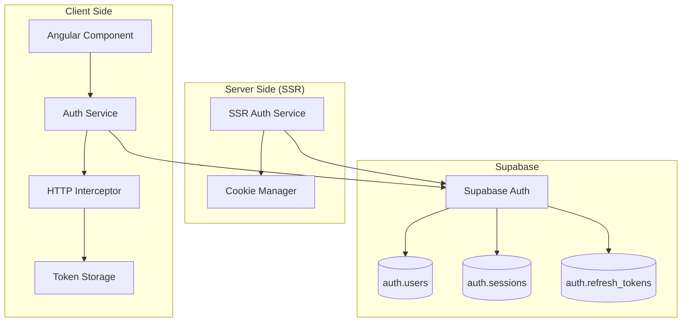
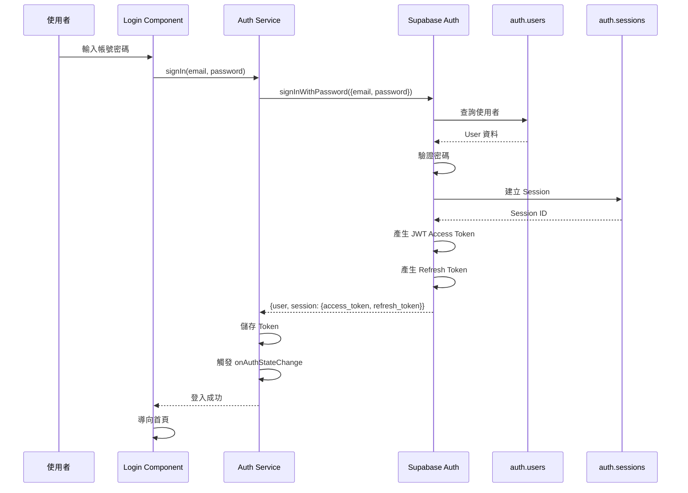
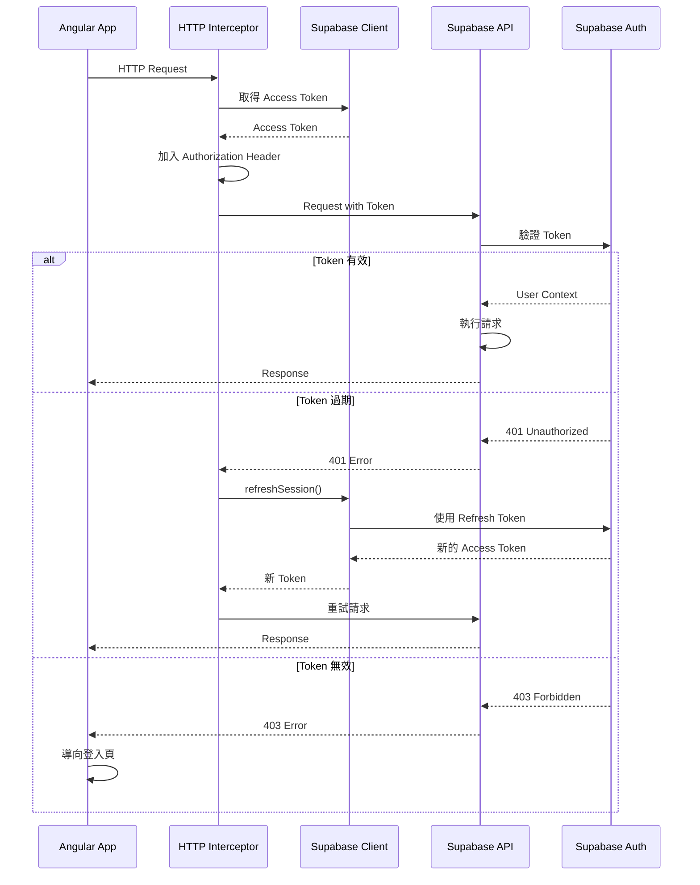
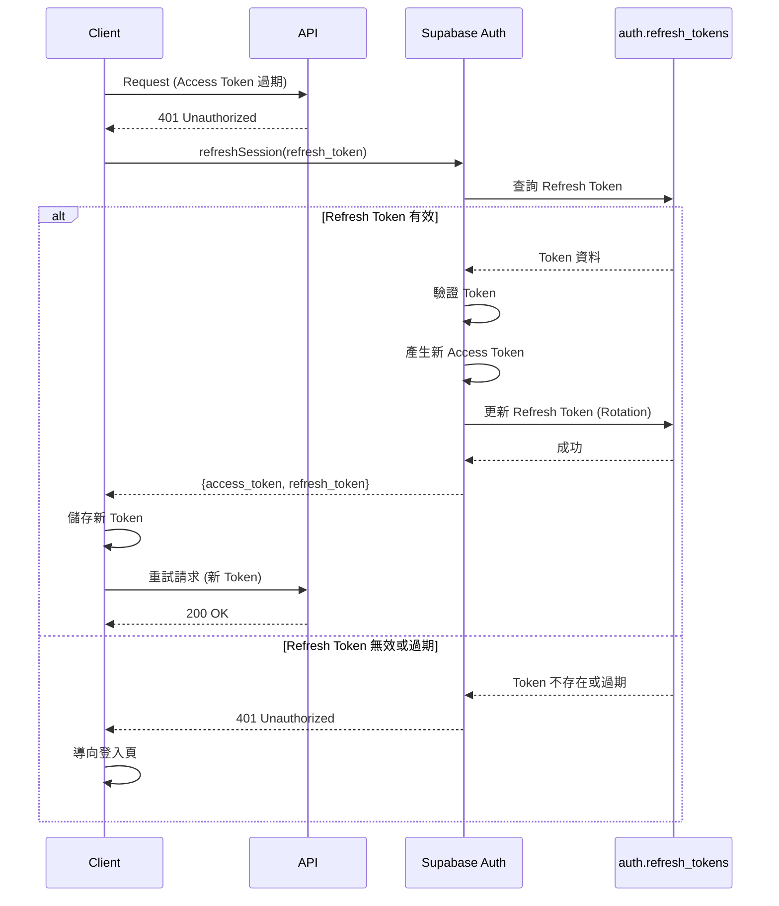
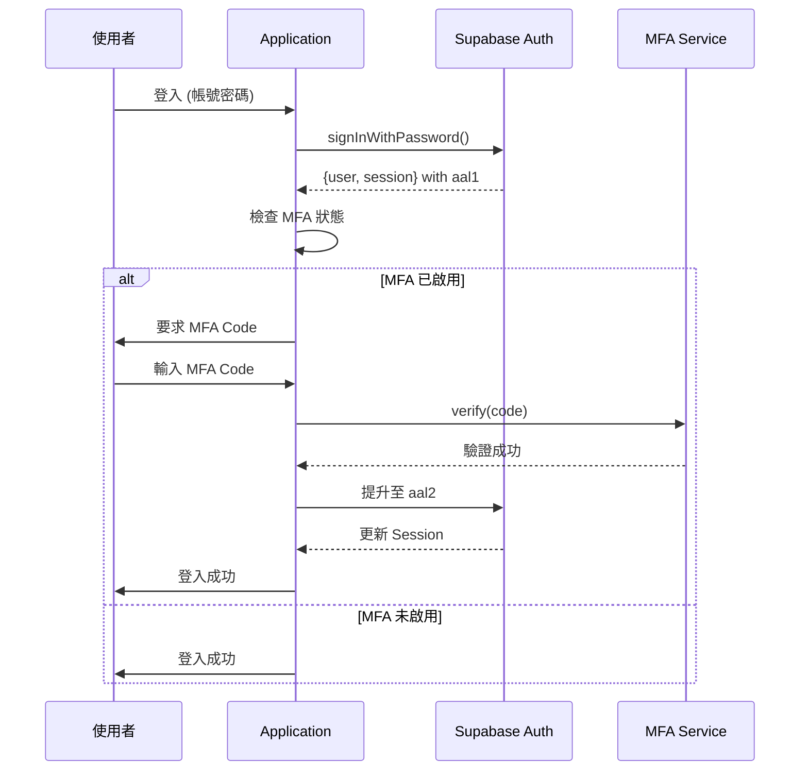

# 認證與令牌管理

## 概述

本文件詳細說明 ng-gighub 專案的認證系統架構、JWT 令牌管理策略、Session 管理，以及在 Angular SSR 環境下的特殊考量。

## 目錄

- [認證架構](#認證架構)
- [JWT Token 管理](#jwt-token-管理)
- [Session 管理](#session-管理)
- [SSR 環境下的認證處理](#ssr-環境下的認證處理)
- [Refresh Token 策略](#refresh-token-策略)
- [Multi-Factor Authentication](#multi-factor-authentication)
- [社交登入 (OAuth)](#社交登入-oauth)
- [安全考量](#安全考量)
- [實作範例](#實作範例)

## 認證架構

### 整體架構



### 認證流程

#### 登入流程



#### Token 驗證流程



## JWT Token 管理

### Token 結構

Supabase 使用 JWT (JSON Web Token) 作為認證令牌。Token 結構如下：

```
eyJhbGciOiJIUzI1NiIsInR5cCI6IkpXVCJ9.
eyJhdWQiOiJhdXRoZW50aWNhdGVkIiwiZXhwIjoxNzAwMDAwMDAwLCJzdWIiOiJ1c2VyLWlkIiwicm9sZSI6ImF1dGhlbnRpY2F0ZWQifQ.
signature
```

#### Header (標頭)
```json
{
  "alg": "HS256",
  "typ": "JWT"
}
```

#### Payload (負載)
```json
{
  "aud": "authenticated",
  "exp": 1700000000,
  "sub": "user-uuid",
  "email": "user@example.com",
  "phone": "",
  "app_metadata": {
    "provider": "email",
    "providers": ["email"]
  },
  "user_metadata": {
    "display_name": "John Doe"
  },
  "role": "authenticated",
  "aal": "aal1",
  "amr": [
    {
      "method": "password",
      "timestamp": 1700000000
    }
  ],
  "session_id": "session-uuid"
}
```

#### Signature (簽名)
使用 HS256 演算法與 JWT Secret 簽署。

### Token 生命週期

#### Access Token
- **有效期限**: 1 小時 (3600 秒)
- **用途**: API 請求認證
- **儲存位置**: 
  - Browser: LocalStorage / SessionStorage
  - SSR: HTTP-only Cookie

#### Refresh Token
- **有效期限**: 30 天 (可配置)
- **用途**: 更新 Access Token
- **儲存位置**: HTTP-only Cookie (建議)

### Token 儲存策略

#### Browser 環境

**方案 1: LocalStorage (預設)**

優點:
- 實作簡單
- 自動持久化
- 跨 Tab 共享

缺點:
- 容易受 XSS 攻擊
- 無法設定 HTTP-only

**方案 2: SessionStorage**

優點:
- Tab 隔離
- Session 結束自動清除

缺點:
- 同樣容易受 XSS 攻擊
- 不支援跨 Tab

**方案 3: HTTP-only Cookie (建議)**

優點:
- 防止 XSS 攻擊
- 瀏覽器自動管理
- SSR 友善

缺點:
- 需要伺服器端配合
- 需處理 CSRF

#### SSR 環境

**必須使用 Cookie**

```typescript
// 設定 Cookie
response.cookie('access_token', token, {
  httpOnly: true,
  secure: true,
  sameSite: 'strict',
  maxAge: 3600000 // 1 hour
});
```

### Token 更新機制

#### 自動更新

```typescript
export class AuthService {
  private refreshTokenInterval?: NodeJS.Timeout;

  startTokenRefresh() {
    // 在 Token 過期前 5 分鐘自動更新
    const refreshTime = 55 * 60 * 1000; // 55 minutes
    
    this.refreshTokenInterval = setInterval(async () => {
      await this.refreshSession();
    }, refreshTime);
  }

  async refreshSession() {
    const { data, error } = await this.supabase.auth.refreshSession();
    
    if (error) {
      console.error('Failed to refresh session:', error);
      this.signOut();
      return;
    }

    if (data.session) {
      // Token 已更新，Supabase 會自動儲存
      console.log('Session refreshed successfully');
    }
  }

  stopTokenRefresh() {
    if (this.refreshTokenInterval) {
      clearInterval(this.refreshTokenInterval);
    }
  }
}
```

#### 被動更新（Interceptor）

```typescript
@Injectable()
export class AuthInterceptor implements HttpInterceptor {
  constructor(private authService: AuthService) {}

  intercept(req: HttpRequest<any>, next: HttpHandler): Observable<HttpResponse<any>> {
    return next.handle(req).pipe(
      catchError((error: HttpErrorResponse) => {
        if (error.status === 401) {
          // Token 過期，嘗試更新
          return from(this.authService.refreshSession()).pipe(
            switchMap(() => {
              // 更新成功，重試請求
              return next.handle(req);
            }),
            catchError(() => {
              // 更新失敗，登出
              this.authService.signOut();
              return throwError(() => error);
            })
          );
        }
        return throwError(() => error);
      })
    );
  }
}
```

## Session 管理

### Session 結構

Supabase 在 `auth.sessions` 表中儲存 Session 資訊：

```sql
CREATE TABLE auth.sessions (
  id uuid PRIMARY KEY,
  user_id uuid REFERENCES auth.users(id),
  created_at timestamptz,
  updated_at timestamptz,
  factor_id uuid,
  aal auth.aal_level, -- Authentication Assurance Level
  not_after timestamptz, -- Session 過期時間
  refreshed_at timestamp,
  user_agent text,
  ip inet,
  tag text
);
```

### Session 生命週期

#### 建立 Session

```typescript
async signIn(email: string, password: string) {
  const { data, error } = await this.supabase.auth.signInWithPassword({
    email,
    password
  });

  if (error) throw error;

  // Session 已建立
  const session = data.session;
  const user = data.user;

  return { user, session };
}
```

#### 檢查 Session

```typescript
async getSession() {
  const { data, error } = await this.supabase.auth.getSession();
  
  if (error) throw error;
  
  return data.session;
}
```

#### 監聽 Session 變化

```typescript
ngOnInit() {
  this.supabase.auth.onAuthStateChange((event, session) => {
    console.log('Auth event:', event);
    
    switch (event) {
      case 'SIGNED_IN':
        this.handleSignIn(session);
        break;
      case 'SIGNED_OUT':
        this.handleSignOut();
        break;
      case 'TOKEN_REFRESHED':
        this.handleTokenRefresh(session);
        break;
      case 'USER_UPDATED':
        this.handleUserUpdate(session);
        break;
    }
  });
}
```

#### 終止 Session

```typescript
async signOut() {
  const { error } = await this.supabase.auth.signOut();
  
  if (error) throw error;
  
  // 清除本地儲存
  this.clearLocalStorage();
  
  // 導向登入頁
  this.router.navigate(['/login']);
}
```

### Session 安全

#### Session Timeout

```typescript
// 設定 Session 最大閒置時間
const MAX_IDLE_TIME = 30 * 60 * 1000; // 30 minutes
let lastActivity = Date.now();

// 監聽使用者活動
['mousedown', 'keydown', 'scroll', 'touchstart'].forEach(event => {
  document.addEventListener(event, () => {
    lastActivity = Date.now();
  });
});

// 定期檢查閒置時間
setInterval(() => {
  if (Date.now() - lastActivity > MAX_IDLE_TIME) {
    this.authService.signOut();
  }
}, 60000); // 每分鐘檢查一次
```

#### Concurrent Session Control

```typescript
// 限制同一使用者的並發 Session 數量
async checkConcurrentSessions(userId: string) {
  const { data: sessions } = await this.supabase
    .from('auth.sessions')
    .select('*')
    .eq('user_id', userId)
    .order('created_at', { ascending: false });

  const MAX_SESSIONS = 3;
  
  if (sessions && sessions.length > MAX_SESSIONS) {
    // 刪除最舊的 Session
    const sessionsToDelete = sessions.slice(MAX_SESSIONS);
    
    for (const session of sessionsToDelete) {
      await this.supabase.auth.admin.deleteUser(session.id);
    }
  }
}
```

## SSR 環境下的認證處理

### 挑戰

1. **無法使用 LocalStorage**: SSR 環境沒有瀏覽器 API
2. **Cookie 管理**: 需要手動處理 Cookie
3. **Request Context**: 每個請求需要獨立的認證上下文
4. **效能考量**: 避免不必要的資料庫查詢

### 解決方案

#### 1. 使用 Cookie 儲存 Token

```typescript
// server.ts
app.use((req, res, next) => {
  // 從 Cookie 取得 Token
  const accessToken = req.cookies['sb-access-token'];
  const refreshToken = req.cookies['sb-refresh-token'];

  // 注入到 Request Context
  req.supabaseTokens = {
    accessToken,
    refreshToken
  };

  next();
});
```

#### 2. SSR Auth Service

```typescript
// ssr-auth.service.ts
@Injectable()
export class SSRAuthService {
  constructor(
    @Inject(REQUEST) private request: Request,
    @Inject(RESPONSE) private response: Response
  ) {}

  async getUser() {
    // 從 Request Context 取得 Token
    const { accessToken } = this.request.supabaseTokens;

    if (!accessToken) {
      return null;
    }

    // 使用 Token 建立 Supabase Client
    const supabase = createClient(
      environment.supabaseUrl,
      environment.supabaseAnonKey,
      {
        global: {
          headers: {
            Authorization: `Bearer ${accessToken}`
          }
        }
      }
    );

    const { data: { user } } = await supabase.auth.getUser();
    
    return user;
  }

  setAuthCookies(session: Session) {
    this.response.cookie('sb-access-token', session.access_token, {
      httpOnly: true,
      secure: true,
      sameSite: 'lax',
      maxAge: 3600000 // 1 hour
    });

    this.response.cookie('sb-refresh-token', session.refresh_token, {
      httpOnly: true,
      secure: true,
      sameSite: 'lax',
      maxAge: 30 * 24 * 3600000 // 30 days
    });
  }

  clearAuthCookies() {
    this.response.clearCookie('sb-access-token');
    this.response.clearCookie('sb-refresh-token');
  }
}
```

#### 3. Platform 檢查

```typescript
import { isPlatformBrowser, isPlatformServer } from '@angular/common';

@Injectable({ providedIn: 'root' })
export class AuthService {
  constructor(
    @Inject(PLATFORM_ID) private platformId: Object,
    @Optional() @Inject(REQUEST) private request?: Request,
    @Optional() @Inject(RESPONSE) private response?: Response
  ) {}

  async getSession() {
    if (isPlatformBrowser(this.platformId)) {
      // Browser 環境：使用 LocalStorage
      return await this.supabase.auth.getSession();
    } else {
      // Server 環境：從 Cookie 讀取
      return this.getSessionFromCookie();
    }
  }

  private async getSessionFromCookie() {
    const accessToken = this.request?.cookies['sb-access-token'];
    
    if (!accessToken) {
      return { data: { session: null }, error: null };
    }

    // 使用 Token 取得 Session
    // ...
  }
}
```

## Refresh Token 策略

### Refresh Token 流程



### Refresh Token Rotation

為提高安全性，每次使用 Refresh Token 時應輪換（Rotation）：

```typescript
async refreshSession() {
  const { data, error } = await this.supabase.auth.refreshSession();

  if (error) {
    throw error;
  }

  // Supabase 自動處理 Token Rotation
  // 舊的 Refresh Token 會被撤銷
  // 新的 Access Token 與 Refresh Token 會被回傳

  return data.session;
}
```

### Refresh Token 安全措施

1. **僅使用一次**: 使用後立即輪換
2. **HTTP-only Cookie**: 防止 XSS 攻擊
3. **Secure Flag**: 僅透過 HTTPS 傳輸
4. **有效期限**: 30 天（可配置）
5. **撤銷機制**: 支援手動撤銷

## Multi-Factor Authentication

### MFA 流程



### 啟用 MFA

```typescript
async enrollMFA() {
  // 1. 產生 MFA Secret
  const { data, error } = await this.supabase.auth.mfa.enroll({
    factorType: 'totp',
    friendlyName: 'Authenticator App'
  });

  if (error) throw error;

  // 2. 顯示 QR Code 給使用者掃描
  const qrCode = data.totp.qr_code;
  const secret = data.totp.secret;

  // 3. 使用者輸入驗證碼
  const verifyCode = await this.getUserInput();

  // 4. 驗證並啟用
  const { data: verified, error: verifyError } = 
    await this.supabase.auth.mfa.verify({
      factorId: data.id,
      challengeId: data.challenge_id,
      code: verifyCode
    });

  if (verifyError) throw verifyError;

  return verified;
}
```

### 驗證 MFA

```typescript
async verifyMFA(code: string) {
  // 1. 建立 Challenge
  const { data: challenge, error: challengeError } = 
    await this.supabase.auth.mfa.challenge({
      factorId: this.currentFactorId
    });

  if (challengeError) throw challengeError;

  // 2. 驗證 Code
  const { data, error } = await this.supabase.auth.mfa.verify({
    factorId: this.currentFactorId,
    challengeId: challenge.id,
    code
  });

  if (error) throw error;

  // 3. Session AAL 提升至 aal2
  return data;
}
```

## 社交登入 (OAuth)

### 支援的 Provider

- Google
- GitHub
- GitLab
- Bitbucket
- Azure
- Apple
- Discord
- Facebook
- LinkedIn
- Notion
- Slack
- Spotify
- Twitch
- Twitter

### OAuth 流程

```typescript
async signInWithOAuth(provider: 'google' | 'github' | 'gitlab') {
  const { data, error } = await this.supabase.auth.signInWithOAuth({
    provider,
    options: {
      redirectTo: `${window.location.origin}/auth/callback`,
      scopes: 'email profile'
    }
  });

  if (error) throw error;

  // 使用者會被導向 OAuth Provider
  // 完成認證後會導回 redirectTo URL
}
```

### OAuth Callback 處理

```typescript
// auth-callback.component.ts
@Component({
  selector: 'app-auth-callback',
  template: '<p>正在處理登入...</p>'
})
export class AuthCallbackComponent implements OnInit {
  constructor(
    private authService: AuthService,
    private router: Router,
    private route: ActivatedRoute
  ) {}

  async ngOnInit() {
    // 從 URL 取得 code
    const code = this.route.snapshot.queryParams['code'];

    if (code) {
      try {
        // Supabase 自動處理 code exchange
        const { data, error } = await this.supabase.auth.getSession();

        if (error) throw error;

        // 登入成功，導向首頁
        this.router.navigate(['/']);
      } catch (error) {
        console.error('OAuth callback error:', error);
        this.router.navigate(['/login'], {
          queryParams: { error: 'oauth_failed' }
        });
      }
    }
  }
}
```

## 安全考量

### 1. Token 安全

#### XSS 防護
- 使用 HTTP-only Cookie 儲存 Refresh Token
- 避免在 JavaScript 中直接存取 Token
- 使用 CSP (Content Security Policy)

#### CSRF 防護
- 使用 CSRF Token
- 驗證 Referer Header
- SameSite Cookie 屬性

### 2. 密碼安全

#### 密碼要求
- 最小長度: 8 字元
- 包含大小寫字母、數字、特殊符號
- 不可與常見密碼相同
- 不可與使用者名稱相同

#### 密碼雜湊
Supabase 使用 bcrypt 雜湊密碼，安全係數為 10。

### 3. Rate Limiting

```typescript
// 實作登入嘗試限制
const MAX_LOGIN_ATTEMPTS = 5;
const LOCKOUT_DURATION = 15 * 60 * 1000; // 15 minutes

async signIn(email: string, password: string) {
  // 檢查登入嘗試次數
  const attempts = await this.getLoginAttempts(email);
  
  if (attempts >= MAX_LOGIN_ATTEMPTS) {
    const lockoutTime = await this.getLockoutTime(email);
    
    if (Date.now() - lockoutTime < LOCKOUT_DURATION) {
      throw new Error('Too many login attempts. Please try again later.');
    } else {
      // 重設嘗試次數
      await this.resetLoginAttempts(email);
    }
  }

  try {
    const result = await this.supabase.auth.signInWithPassword({
      email,
      password
    });

    // 登入成功，重設嘗試次數
    await this.resetLoginAttempts(email);

    return result;
  } catch (error) {
    // 登入失敗，增加嘗試次數
    await this.incrementLoginAttempts(email);
    throw error;
  }
}
```

### 4. 審計日誌

```sql
-- 記錄認證事件
CREATE TABLE auth_audit_logs (
  id uuid PRIMARY KEY DEFAULT gen_random_uuid(),
  user_id uuid REFERENCES auth.users(id),
  event_type text NOT NULL, -- 'login', 'logout', 'password_change', etc.
  ip_address inet,
  user_agent text,
  success boolean,
  error_message text,
  created_at timestamptz DEFAULT now()
);

-- RLS Policy
ALTER TABLE auth_audit_logs ENABLE ROW LEVEL SECURITY;

CREATE POLICY "Users can view their own audit logs"
  ON auth_audit_logs
  FOR SELECT
  USING (auth.uid() = user_id);
```

## 實作範例

完整的實作範例請參考：

- [AuthService 實作範例](./implementation-examples/auth-service.example.ts)
- [Auth Guard 實作範例](./implementation-examples/auth-guard.example.ts)
- [HTTP Interceptor 範例](./implementation-examples/http-interceptor.example.ts)

## 相關文件

- [授權與權限管理](./authorization.md)
- [安全最佳實踐](./security-best-practices.md)
- [系統基礎設施概覽](./overview.md)

## 總結

ng-gighub 的認證系統採用業界標準的 JWT Token 機制，透過 Supabase Auth 提供：

- **安全**: HTTP-only Cookie, Token Rotation, MFA
- **靈活**: 支援多種認證方式（Email, OAuth, MFA）
- **SSR 友善**: 完整的伺服器端渲染支援
- **可擴展**: 易於整合第三方認證服務

透過完善的 Token 管理與 Session 管理，確保系統的安全性與使用者體驗。

---
**最後更新**: 2025-11-22  
**維護者**: Development Team  
**版本**: 1.0.0
