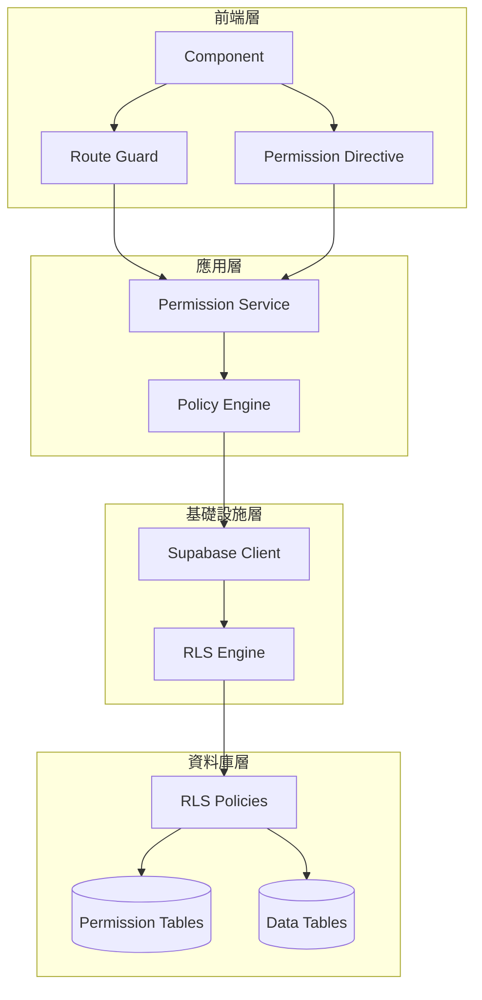
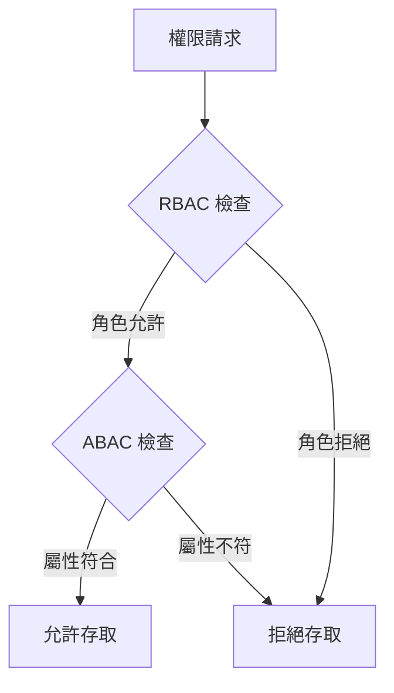
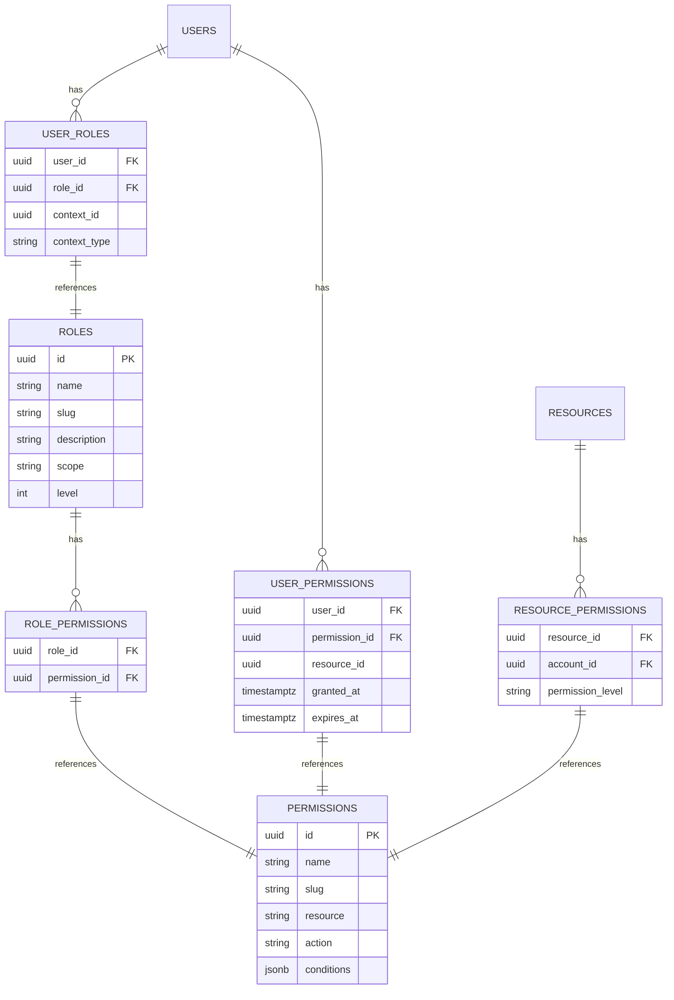
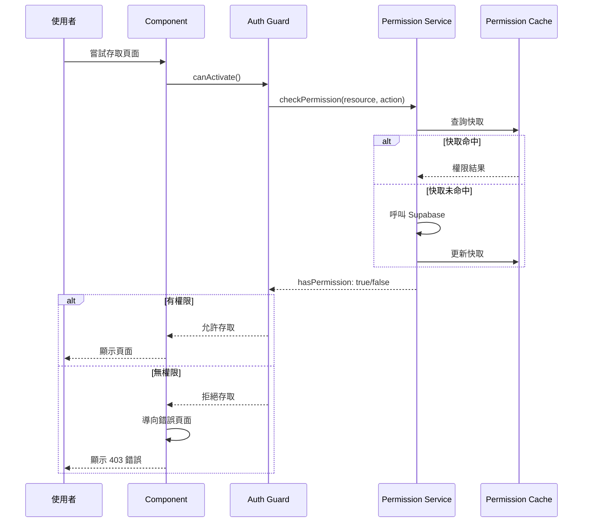
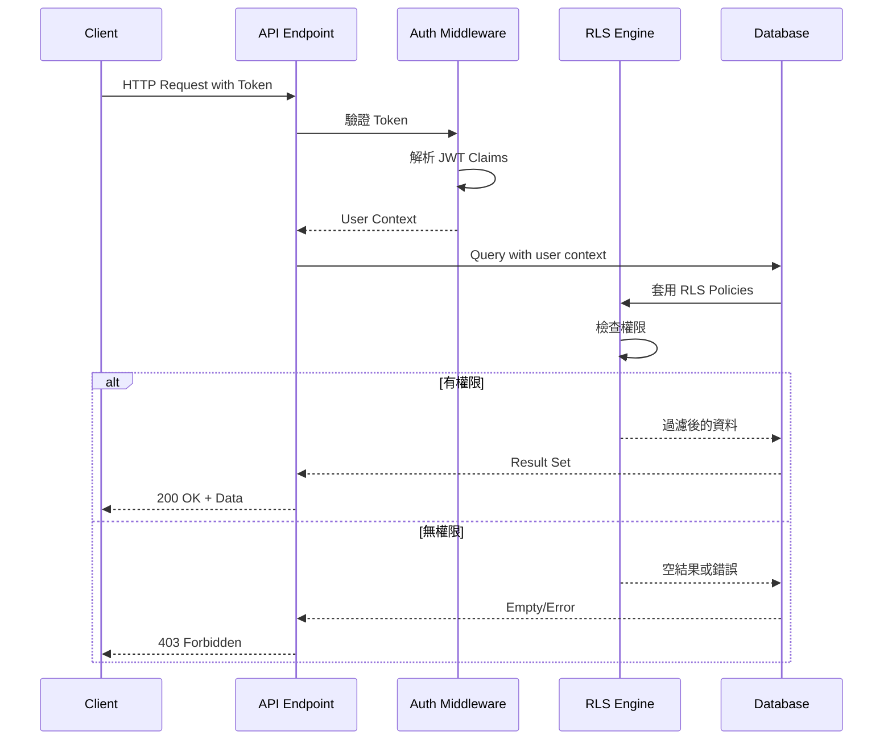

# 授權與權限管理

## 概述

本文件詳細說明 ng-gighub 專案的授權（Authorization）與權限管理系統，包含權限模型設計、Row Level Security (RLS) 策略、權限檢查流程，以及前後端的授權控制實作。

## 目錄

- [授權架構](#授權架構)
- [權限模型](#權限模型)
- [Row Level Security (RLS)](#row-level-security-rls)
- [權限檢查流程](#權限檢查流程)
- [前端授權控制](#前端授權控制)
- [API 層級授權](#api-層級授權)
- [細粒度權限控制](#細粒度權限控制)
- [權限繼承與組合](#權限繼承與組合)
- [實作範例](#實作範例)

## 授權架構

### 整體架構



### 授權層級

ng-gighub 實作多層級的授權控制：

1. **資料庫層級**: Row Level Security (RLS) - 最後防線
2. **API 層級**: Supabase Client + RLS
3. **應用層級**: Permission Service + Policy Engine
4. **前端層級**: Guards + Directives - 使用者體驗優化

## 權限模型

### RBAC + ABAC 混合模型

ng-gighub 採用 **RBAC (Role-Based Access Control)** 與 **ABAC (Attribute-Based Access Control)** 的混合模型：

- **RBAC**: 基於角色的粗粒度權限控制
- **ABAC**: 基於屬性的細粒度權限控制

#### RBAC (Role-Based Access Control)

**概念：** 根據使用者的角色授予權限

**範例：**
```
User → Role (admin) → Permissions (user:manage, repository:admin)
```

**優點：**
- 簡單易懂
- 易於管理大量使用者
- 適合組織層級的權限控制

**缺點：**
- 缺乏靈活性
- 難以處理複雜的業務規則
- 角色爆炸問題（Role Explosion）

#### ABAC (Attribute-Based Access Control)

**概念：** 根據主體（Subject）、資源（Resource）、動作（Action）、環境（Environment）的屬性組合來決定授權

**決策模型：**
```
Can Subject perform Action on Resource in Environment?

Where:
- Subject attributes: user_id, role, department, clearance_level
- Resource attributes: owner_id, sensitivity, classification
- Action attributes: read, write, delete
- Environment attributes: time, location, IP address, device
```

**範例規則：**
```json
{
  "rule_id": "allow_manager_edit_own_dept_docs",
  "effect": "allow",
  "conditions": {
    "subject": {
      "role": "manager",
      "department": "$resource.department"
    },
    "resource": {
      "type": "document",
      "classification": ["internal", "public"]
    },
    "action": ["read", "write"],
    "environment": {
      "time": {
        "between": ["09:00", "18:00"]
      }
    }
  }
}
```

**優點：**
- 高度靈活
- 支援複雜的業務規則
- 動態權限評估
- 細粒度控制

**缺點：**
- 實作複雜
- 效能開銷較大
- 規則管理較困難

#### ng-gighub 的混合實作策略



**策略：**
1. **第一層：RBAC** - 快速過濾明顯無權限的請求
2. **第二層：ABAC** - 對通過 RBAC 的請求進行細粒度檢查
3. **快取結果** - 對相同條件的請求快取決策結果

詳細的 ABAC 實作請參考本文件後續的 [ABAC 實作](#abac-實作) 章節。

### 權限結構



### 權限命名規範

權限使用 `resource:action` 格式：

```
resource:action
```

**範例：**
- `repository:read` - 讀取倉庫
- `repository:write` - 寫入倉庫
- `repository:admin` - 管理倉庫
- `organization:member:add` - 新增組織成員
- `team:settings:update` - 更新團隊設定
- `workspace:delete` - 刪除工作區

### 資源層級權限

```typescript
enum PermissionLevel {
  NONE = 0,    // 無權限
  READ = 1,    // 讀取
  WRITE = 2,   // 寫入
  ADMIN = 3    // 管理
}

// 權限繼承: ADMIN > WRITE > READ > NONE
// ADMIN 包含 WRITE 和 READ
// WRITE 包含 READ
```

## Row Level Security (RLS)

### RLS 概念

Row Level Security (RLS) 是 PostgreSQL 提供的資料庫層級安全機制，可以在資料列層級控制存取權限。

### RLS 優勢

1. **安全性**: 最後一道防線，即使應用層被繞過也能保護資料
2. **簡化程式碼**: 不需在應用層實作複雜的過濾邏輯
3. **效能**: 資料庫層級過濾，減少資料傳輸
4. **一致性**: 所有存取路徑（API, SQL, 管理工具）都受保護

### RLS Policy 類型

#### 1. SELECT Policy (查詢權限)

```sql
-- 使用者只能查看自己有權限的倉庫
CREATE POLICY "Users can view repositories they have access to"
  ON repositories
  FOR SELECT
  USING (
    -- 1. 公開倉庫
    is_private = false
    OR
    -- 2. 擁有者
    owner_id = auth.uid()
    OR
    -- 3. 有明確授權
    EXISTS (
      SELECT 1
      FROM repository_permissions
      WHERE repository_id = repositories.id
        AND account_id = auth.uid()
    )
  );
```

#### 2. INSERT Policy (新增權限)

```sql
-- 使用者只能在自己的組織中建立倉庫
CREATE POLICY "Users can create repositories in their organizations"
  ON repositories
  FOR INSERT
  WITH CHECK (
    -- 檢查使用者是否為組織成員
    EXISTS (
      SELECT 1
      FROM organization_members
      WHERE organization_id = repositories.owner_id
        AND account_id = auth.uid()
        AND role IN ('owner', 'admin')
    )
  );
```

#### 3. UPDATE Policy (更新權限)

```sql
-- 使用者只能更新有 admin 權限的倉庫
CREATE POLICY "Users can update repositories with admin permission"
  ON repositories
  FOR UPDATE
  USING (
    -- 擁有者或有 admin 權限
    owner_id = auth.uid()
    OR
    EXISTS (
      SELECT 1
      FROM repository_permissions
      WHERE repository_id = repositories.id
        AND account_id = auth.uid()
        AND permission = 'admin'
    )
  )
  WITH CHECK (
    -- 更新後仍須符合條件
    owner_id = auth.uid()
    OR
    EXISTS (
      SELECT 1
      FROM repository_permissions
      WHERE repository_id = repositories.id
        AND account_id = auth.uid()
        AND permission = 'admin'
    )
  );
```

#### 4. DELETE Policy (刪除權限)

```sql
-- 只有擁有者可以刪除倉庫
CREATE POLICY "Only owners can delete repositories"
  ON repositories
  FOR DELETE
  USING (
    owner_id = auth.uid()
  );
```

### 複雜 RLS Policy 範例

#### 多租戶資料隔離

```sql
-- 工作區成員只能存取所屬工作區的資料
CREATE POLICY "Workspace data isolation"
  ON work_items
  FOR ALL
  USING (
    -- 取得使用者的工作區 Context
    workspace_id IN (
      SELECT workspace_id
      FROM workspace_members
      WHERE account_id = auth.uid()
    )
  );
```

#### 角色基礎權限

```sql
-- 根據角色限制存取
CREATE POLICY "Role-based repository access"
  ON repositories
  FOR SELECT
  USING (
    CASE
      -- Admin 可以看所有倉庫
      WHEN EXISTS (
        SELECT 1 FROM user_roles ur
        JOIN roles r ON ur.role_id = r.id
        WHERE ur.user_id = auth.uid()
          AND r.slug = 'admin'
      ) THEN true
      
      -- 一般使用者只能看有權限的倉庫
      ELSE (
        is_private = false
        OR owner_id = auth.uid()
        OR EXISTS (
          SELECT 1 FROM repository_permissions
          WHERE repository_id = repositories.id
            AND account_id = auth.uid()
        )
      )
    END
  );
```

#### 時間基礎權限

```sql
-- 權限有時效性
CREATE POLICY "Time-based permissions"
  ON repositories
  FOR SELECT
  USING (
    EXISTS (
      SELECT 1
      FROM user_permissions
      WHERE user_id = auth.uid()
        AND resource_type = 'repository'
        AND resource_id = repositories.id
        AND (expires_at IS NULL OR expires_at > now())
    )
  );
```

### RLS 效能優化

#### 1. 使用 Index

```sql
-- 為 RLS Policy 中的查詢建立索引
CREATE INDEX idx_repository_permissions_account
  ON repository_permissions(account_id, repository_id);

CREATE INDEX idx_workspace_members_account
  ON workspace_members(account_id, workspace_id);
```

#### 2. 使用 Security Definer Functions

```sql
-- 建立 Security Definer Function 來優化複雜查詢
CREATE OR REPLACE FUNCTION has_repository_access(
  repo_id uuid,
  user_id uuid
) RETURNS boolean
LANGUAGE sql
SECURITY DEFINER
STABLE
AS $$
  SELECT EXISTS (
    SELECT 1
    FROM repository_permissions
    WHERE repository_id = repo_id
      AND account_id = user_id
  );
$$;

-- 在 Policy 中使用
CREATE POLICY "Repository access with function"
  ON repositories
  FOR SELECT
  USING (has_repository_access(id, auth.uid()));
```

#### 3. 使用 Materialized Views

```sql
-- 建立 Materialized View 快取權限資料
CREATE MATERIALIZED VIEW user_repository_access AS
SELECT
  rp.account_id,
  rp.repository_id,
  MAX(rp.permission) as permission_level
FROM repository_permissions rp
GROUP BY rp.account_id, rp.repository_id;

-- 定期更新
REFRESH MATERIALIZED VIEW CONCURRENTLY user_repository_access;
```

## 權限檢查流程

### 前端權限檢查



### 後端權限檢查



## 前端授權控制

### Route Guards

#### Auth Guard (認證守衛)

```typescript
@Injectable({ providedIn: 'root' })
export class AuthGuard implements CanActivate {
  constructor(
    private authService: AuthService,
    private router: Router
  ) {}

  async canActivate(
    route: ActivatedRouteSnapshot,
    state: RouterStateSnapshot
  ): Promise<boolean> {
    const session = await this.authService.getSession();

    if (!session) {
      // 未登入，導向登入頁
      this.router.navigate(['/login'], {
        queryParams: { returnUrl: state.url }
      });
      return false;
    }

    return true;
  }
}
```

#### Permission Guard (權限守衛)

```typescript
@Injectable({ providedIn: 'root' })
export class PermissionGuard implements CanActivate {
  constructor(
    private permissionService: PermissionService,
    private router: Router
  ) {}

  async canActivate(
    route: ActivatedRouteSnapshot,
    state: RouterStateSnapshot
  ): Promise<boolean> {
    // 從 route data 取得所需權限
    const requiredPermissions = route.data['permissions'] as string[];

    if (!requiredPermissions || requiredPermissions.length === 0) {
      return true;
    }

    // 檢查所有權限
    const hasAllPermissions = await this.permissionService.hasPermissions(
      requiredPermissions
    );

    if (!hasAllPermissions) {
      // 無權限，導向 403 頁面
      this.router.navigate(['/403']);
      return false;
    }

    return true;
  }
}
```

#### Role Guard (角色守衛)

```typescript
@Injectable({ providedIn: 'root' })
export class RoleGuard implements CanActivate {
  constructor(
    private authService: AuthService,
    private router: Router
  ) {}

  async canActivate(
    route: ActivatedRouteSnapshot
  ): Promise<boolean> {
    const requiredRoles = route.data['roles'] as string[];
    const userRoles = await this.authService.getUserRoles();

    const hasRequiredRole = requiredRoles.some(role =>
      userRoles.includes(role)
    );

    if (!hasRequiredRole) {
      this.router.navigate(['/403']);
      return false;
    }

    return true;
  }
}
```

### 路由配置範例

```typescript
export const routes: Routes = [
  {
    path: 'admin',
    canActivate: [AuthGuard, RoleGuard],
    data: { roles: ['admin', 'super_admin'] },
    children: [
      {
        path: 'users',
        component: UserManagementComponent,
        canActivate: [PermissionGuard],
        data: { permissions: ['user:manage'] }
      }
    ]
  },
  {
    path: 'repository/:id',
    canActivate: [AuthGuard, PermissionGuard],
    data: { permissions: ['repository:read'] },
    children: [
      {
        path: 'settings',
        component: RepositorySettingsComponent,
        canActivate: [PermissionGuard],
        data: { permissions: ['repository:admin'] }
      }
    ]
  }
];
```

### Permission Directive

```typescript
@Directive({
  selector: '[appHasPermission]',
  standalone: true
})
export class HasPermissionDirective implements OnInit {
  @Input() appHasPermission!: string | string[];

  constructor(
    private templateRef: TemplateRef<any>,
    private viewContainer: ViewContainerRef,
    private permissionService: PermissionService
  ) {}

  async ngOnInit() {
    const permissions = Array.isArray(this.appHasPermission)
      ? this.appHasPermission
      : [this.appHasPermission];

    const hasPermission = await this.permissionService.hasPermissions(
      permissions
    );

    if (hasPermission) {
      this.viewContainer.createEmbeddedView(this.templateRef);
    } else {
      this.viewContainer.clear();
    }
  }
}
```

### 使用範例

```html
<!-- 只有有權限的使用者才能看到按鈕 -->
<button *appHasPermission="'repository:delete'"
        (click)="deleteRepository()">
  刪除倉庫
</button>

<!-- 多個權限（AND 邏輯） -->
<div *appHasPermission="['organization:admin', 'team:manage']">
  <h2>團隊管理</h2>
  <!-- 管理介面 -->
</div>
```

### Permission Service

```typescript
@Injectable({ providedIn: 'root' })
export class PermissionService {
  private permissionCache = new Map<string, boolean>();
  private cacheExpiry = 5 * 60 * 1000; // 5 minutes

  constructor(private supabase: SupabaseClient) {}

  async hasPermission(permission: string): Promise<boolean> {
    // 檢查快取
    if (this.permissionCache.has(permission)) {
      return this.permissionCache.get(permission)!;
    }

    // 查詢資料庫
    const { data, error } = await this.supabase.rpc('check_permission', {
      permission_slug: permission
    });

    if (error) {
      console.error('Permission check error:', error);
      return false;
    }

    const hasPermission = data as boolean;

    // 更新快取
    this.permissionCache.set(permission, hasPermission);
    setTimeout(() => {
      this.permissionCache.delete(permission);
    }, this.cacheExpiry);

    return hasPermission;
  }

  async hasPermissions(permissions: string[]): Promise<boolean> {
    const results = await Promise.all(
      permissions.map(p => this.hasPermission(p))
    );

    return results.every(r => r === true);
  }

  async hasAnyPermission(permissions: string[]): Promise<boolean> {
    const results = await Promise.all(
      permissions.map(p => this.hasPermission(p))
    );

    return results.some(r => r === true);
  }

  clearCache() {
    this.permissionCache.clear();
  }
}
```

## API 層級授權

### Supabase RPC Functions

```sql
-- 檢查單一權限
CREATE OR REPLACE FUNCTION check_permission(permission_slug text)
RETURNS boolean
LANGUAGE plpgsql
SECURITY DEFINER
AS $$
DECLARE
  has_perm boolean;
BEGIN
  -- 檢查使用者是否有該權限（透過角色或直接授予）
  SELECT EXISTS (
    -- 直接權限
    SELECT 1
    FROM user_permissions up
    JOIN permissions p ON up.permission_id = p.id
    WHERE up.user_id = auth.uid()
      AND p.slug = permission_slug
      AND (up.expires_at IS NULL OR up.expires_at > now())
    
    UNION
    
    -- 角色權限
    SELECT 1
    FROM user_roles ur
    JOIN role_permissions rp ON ur.role_id = rp.role_id
    JOIN permissions p ON rp.permission_id = p.id
    WHERE ur.user_id = auth.uid()
      AND p.slug = permission_slug
  ) INTO has_perm;

  RETURN has_perm;
END;
$$;
```

```sql
-- 檢查資源權限
CREATE OR REPLACE FUNCTION check_resource_permission(
  resource_type text,
  resource_id uuid,
  required_level text
)
RETURNS boolean
LANGUAGE plpgsql
SECURITY DEFINER
AS $$
DECLARE
  user_level text;
  level_map jsonb := '{"read": 1, "write": 2, "admin": 3}';
BEGIN
  -- 取得使用者對該資源的權限等級
  SELECT permission_level INTO user_level
  FROM resource_permissions
  WHERE resource_type = check_resource_permission.resource_type
    AND resource_id = check_resource_permission.resource_id
    AND account_id = auth.uid();

  -- 比較權限等級
  RETURN (level_map->user_level)::int >= (level_map->required_level)::int;
END;
$$;
```

### 在應用中使用 RPC

```typescript
async checkRepositoryPermission(
  repositoryId: string,
  requiredLevel: 'read' | 'write' | 'admin'
): Promise<boolean> {
  const { data, error } = await this.supabase.rpc(
    'check_resource_permission',
    {
      resource_type: 'repository',
      resource_id: repositoryId,
      required_level: requiredLevel
    }
  );

  if (error) {
    console.error('Permission check failed:', error);
    return false;
  }

  return data as boolean;
}
```

## 細粒度權限控制

### 條件式權限

權限可以包含條件，只有符合條件時才授予：

```typescript
interface Permission {
  id: string;
  name: string;
  slug: string;
  resource: string;
  action: string;
  conditions?: PermissionCondition[];
}

interface PermissionCondition {
  field: string;
  operator: 'eq' | 'ne' | 'gt' | 'lt' | 'in' | 'contains';
  value: any;
}
```

### 範例：時間限制

```sql
-- 只能在工作時間（9:00-18:00）存取
INSERT INTO permissions (name, slug, resource, action, conditions)
VALUES (
  'Work Hours Access',
  'resource:access:work_hours',
  'sensitive_data',
  'read',
  jsonb_build_object(
    'time_range', jsonb_build_object(
      'start', '09:00',
      'end', '18:00'
    )
  )
);
```

### 範例：IP 限制

```sql
-- 只能從特定 IP 範圍存取
INSERT INTO permissions (name, slug, resource, action, conditions)
VALUES (
  'Internal Network Access',
  'admin:access:internal',
  'admin_panel',
  'access',
  jsonb_build_object(
    'ip_range', jsonb_build_array(
      '192.168.1.0/24',
      '10.0.0.0/8'
    )
  )
);
```

### 條件評估函數

```sql
CREATE OR REPLACE FUNCTION evaluate_permission_conditions(
  conditions jsonb,
  context jsonb
)
RETURNS boolean
LANGUAGE plpgsql
AS $$
BEGIN
  -- 評估時間條件
  IF conditions ? 'time_range' THEN
    IF NOT (
      CURRENT_TIME >= (conditions->'time_range'->>'start')::time
      AND
      CURRENT_TIME <= (conditions->'time_range'->>'end')::time
    ) THEN
      RETURN false;
    END IF;
  END IF;

  -- 評估 IP 條件
  IF conditions ? 'ip_range' THEN
    IF NOT (
      SELECT (context->>'ip_address')::inet << ANY(
        SELECT jsonb_array_elements_text(conditions->'ip_range')::cidr
      )
    ) THEN
      RETURN false;
    END IF;
  END IF;

  -- 所有條件都滿足
  RETURN true;
END;
$$;
```

## 權限繼承與組合

### 角色階層

```typescript
interface RoleHierarchy {
  [role: string]: {
    level: number;
    inherits?: string[];
  };
}

const roleHierarchy: RoleHierarchy = {
  super_admin: {
    level: 100,
    inherits: ['admin']
  },
  admin: {
    level: 90,
    inherits: ['moderator']
  },
  moderator: {
    level: 50,
    inherits: ['user']
  },
  user: {
    level: 10
  }
};
```

### 權限組合

```sql
-- 建立組合權限
CREATE TABLE permission_groups (
  id uuid PRIMARY KEY DEFAULT gen_random_uuid(),
  name text NOT NULL,
  slug text UNIQUE NOT NULL,
  description text
);

CREATE TABLE permission_group_members (
  group_id uuid REFERENCES permission_groups(id),
  permission_id uuid REFERENCES permissions(id),
  PRIMARY KEY (group_id, permission_id)
);

-- 範例：倉庫管理員權限組
INSERT INTO permission_groups (name, slug)
VALUES ('Repository Admin', 'repository_admin');

INSERT INTO permission_group_members (group_id, permission_id)
SELECT
  (SELECT id FROM permission_groups WHERE slug = 'repository_admin'),
  id
FROM permissions
WHERE slug IN (
  'repository:read',
  'repository:write',
  'repository:delete',
  'repository:settings:update',
  'repository:collaborators:manage'
);
```

## 實作範例

完整的實作範例請參考：

- [Permission Service 實作](./implementation-examples/permission-service.example.ts)
- [RLS Policies SQL](./implementation-examples/rls-policies.sql)
- [Permission Guards](./implementation-examples/permission-guards.example.ts)

## 相關文件

- [認證與令牌管理](./authentication.md)
- [角色系統 (RBAC)](./role-based-access-control.md)
- [安全最佳實踐](./security-best-practices.md)
- [系統基礎設施概覽](./overview.md)

## 總結

ng-gighub 的授權系統採用多層防禦策略：

- **資料庫層**: Row Level Security (RLS) 確保資料安全
- **API 層**: Supabase RPC Functions 提供權限檢查
- **應用層**: Permission Service 提供靈活的權限管理
- **前端層**: Guards 與 Directives 優化使用者體驗

透過 RBAC + ABAC 混合模型，支援從粗粒度到細粒度的權限控制，滿足企業級 SaaS 系統的安全需求。

---
**最後更新**: 2025-11-22  
**維護者**: Development Team  
**版本**: 1.0.0
