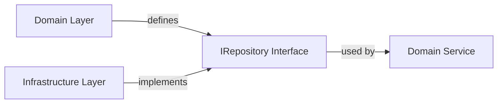

# Domain 分層架構實作指南

## 概述

本文件提供 ng-gighub 專案 Domain 分層架構的實作指南，說明如何正確使用 **Repository Pattern** + **Domain Service Pattern**，確保業務邏輯與技術實作分離，遵循 **Clean Architecture** 與 **Domain-Driven Design (DDD)** 原則。

## 目錄

- [架構層級概覽](#架構層級概覽)
- [Repository Pattern](#repository-pattern)
- [Domain Service Pattern](#domain-service-pattern)
- [Supabase Client 分離](#supabase-client-分離)
- [依賴反轉原則](#依賴反轉原則)
- [實作範例](#實作範例)
- [最佳實踐](#最佳實踐)

## 架構層級概覽

### 四層架構

```
┌─────────────────────────────────┐
│   Features Layer (展示層)        │
│   - Components                  │
│   - Pages                       │
│   - UI State Management         │
└───────────┬─────────────────────┘
            │ depends on
            ▼
┌─────────────────────────────────┐
│  Application Layer (應用層)      │
│  - Commands & Handlers          │
│  - Queries & Handlers           │
│  - DTOs                         │
└───────────┬─────────────────────┘
            │ depends on
            ▼
┌─────────────────────────────────┐
│   Domain Layer (領域層) ★核心★   │
│   - Aggregates                  │
│   - Entities                    │
│   - Value Objects               │
│   - Domain Events               │
│   - Repository Interfaces       │
│   - Domain Services             │
└───────────┬─────────────────────┘
            ▲ implemented by
            │
┌───────────┴─────────────────────┐
│  Infrastructure Layer (基礎設施層)│
│  - Repository Implementations   │
│  - Supabase Client              │
│  - External Services            │
│  - Mappers                      │
└─────────────────────────────────┘
```

### 核心原則

1. **Domain Layer 不依賴任何層**
   - 純業務邏輯
   - 不依賴 Angular
   - 不依賴 Supabase
   - 只定義介面，不實作

2. **Infrastructure Layer 實作 Domain Layer 的介面**
   - Repository 實作
   - Supabase 整合
   - 外部服務整合

3. **Application Layer 協調業務流程**
   - 使用 Domain Layer 的介面
   - 不包含業務邏輯
   - 處理資料轉換（DTO）

4. **Features Layer 僅處理 UI**
   - 呼叫 Application Layer
   - 不直接存取 Infrastructure Layer
   - 不包含業務邏輯

## Repository Pattern

### 概念

Repository 模式在 Domain Layer 與 Infrastructure Layer 之間提供抽象層，將資料存取邏輯與業務邏輯分離。



### 為什麼需要 Repository？

❌ **錯誤做法：Component 直接呼叫 Supabase**
```typescript
// ❌ 不要這樣做！
@Component({...})
export class WorkspaceListComponent {
  constructor(private supabase: SupabaseClient) {}
  
  async loadWorkspaces() {
    const { data } = await this.supabase
      .from('workspaces')
      .select('*')
      .eq('owner_id', userId);
    
    this.workspaces = data;
  }
}
```

**問題：**
- 業務邏輯散落各處
- 難以測試（與 Supabase 耦合）
- 無法抽換資料來源
- 違反單一職責原則

✅ **正確做法：使用 Repository**
```typescript
// ✅ 好的做法
@Component({...})
export class WorkspaceListComponent {
  constructor(private workspaceQuery: WorkspaceQueryService) {}
  
  async loadWorkspaces() {
    const result = await this.workspaceQuery.getUserWorkspaces(userId);
    
    if (result.isSuccess) {
      this.workspaces = result.value;
    }
  }
}
```

### Repository 介面定義（Domain Layer）

```typescript
// src/app/core/domain/workspace/repositories/workspace.repository.interface.ts
import { Result } from '@core/shared/result';
import { WorkspaceAggregate } from '../aggregates/workspace.aggregate';
import { WorkspaceId } from '../value-objects/workspace-id.vo';

export abstract class IWorkspaceRepository {
  // 基本 CRUD
  abstract findById(id: WorkspaceId): Promise<Result<WorkspaceAggregate, Error>>;
  abstract findBySlug(slug: string): Promise<Result<WorkspaceAggregate, Error>>;
  abstract save(workspace: WorkspaceAggregate): Promise<Result<void, Error>>;
  abstract delete(id: WorkspaceId): Promise<Result<void, Error>>;
  
  // 查詢方法
  abstract findByOwnerId(ownerId: string): Promise<Result<WorkspaceAggregate[], Error>>;
  abstract findByMemberId(memberId: string): Promise<Result<WorkspaceAggregate[], Error>>;
  
  // 檢查方法
  abstract exists(slug: string): Promise<boolean>;
}
```

**重點：**
- 使用 `abstract class` 而非 `interface`（Angular DI 需要）
- 回傳 `Result<T, Error>` 而非拋出例外
- 參數使用 Domain 概念（WorkspaceAggregate, WorkspaceId）
- 不包含實作細節（不提到 Supabase）

### Repository 實作（Infrastructure Layer）

```typescript
// src/app/core/infrastructure/persistence/supabase/workspace.repository.ts
import { Injectable } from '@angular/core';
import { SupabaseClient } from '@supabase/supabase-js';
import { IWorkspaceRepository } from '@core/domain/workspace/repositories/workspace.repository.interface';
import { WorkspaceAggregate } from '@core/domain/workspace/aggregates/workspace.aggregate';
import { WorkspaceMapper } from './mappers/workspace.mapper';
import { Result } from '@core/shared/result';

@Injectable({
  providedIn: 'root'
})
export class SupabaseWorkspaceRepository implements IWorkspaceRepository {
  constructor(
    private supabase: SupabaseClient,
    private mapper: WorkspaceMapper
  ) {}
  
  async findById(id: WorkspaceId): Promise<Result<WorkspaceAggregate, Error>> {
    try {
      const { data, error } = await this.supabase
        .from('workspaces')
        .select(`
          *,
          workspace_members(*),
          workspace_resources(*)
        `)
        .eq('id', id.value)
        .single();
      
      if (error) {
        return Result.fail(new Error(error.message));
      }
      
      if (!data) {
        return Result.fail(new Error('Workspace not found'));
      }
      
      // 使用 Mapper 轉換為 Domain 物件
      const workspace = this.mapper.toDomain(data);
      
      return Result.ok(workspace);
    } catch (error) {
      return Result.fail(error as Error);
    }
  }
  
  async save(workspace: WorkspaceAggregate): Promise<Result<void, Error>> {
    try {
      // 使用 Mapper 轉換為資料庫格式
      const persistence = this.mapper.toPersistence(workspace);
      
      const { error } = await this.supabase
        .from('workspaces')
        .upsert(persistence);
      
      if (error) {
        return Result.fail(new Error(error.message));
      }
      
      // 儲存成員（如果有變更）
      if (workspace.members.length > 0) {
        await this.saveMember(workspace);
      }
      
      return Result.ok();
    } catch (error) {
      return Result.fail(error as Error);
    }
  }
  
  private async saveMembers(workspace: WorkspaceAggregate): Promise<void> {
    const members = workspace.members.map(m => this.mapper.memberToPersistence(m));
    
    await this.supabase
      .from('workspace_members')
      .upsert(members);
  }
  
  async findByOwnerId(ownerId: string): Promise<Result<WorkspaceAggregate[], Error>> {
    try {
      const { data, error } = await this.supabase
        .from('workspaces')
        .select('*')
        .eq('owner_id', ownerId)
        .eq('is_active', true)
        .order('created_at', { ascending: false });
      
      if (error) {
        return Result.fail(new Error(error.message));
      }
      
      const workspaces = data.map(d => this.mapper.toDomain(d));
      
      return Result.ok(workspaces);
    } catch (error) {
      return Result.fail(error as Error);
    }
  }
  
  async exists(slug: string): Promise<boolean> {
    const { data } = await this.supabase
      .from('workspaces')
      .select('id')
      .eq('slug', slug)
      .single();
    
    return data !== null;
  }
}
```

**重點：**
- 實作 `IWorkspaceRepository` 介面
- 使用 `SupabaseClient` 進行資料存取
- 使用 `Mapper` 進行 Domain ↔ Persistence 轉換
- 錯誤處理統一回傳 `Result`
- 不洩漏 Supabase 細節到 Domain Layer

### Mapper（Infrastructure Layer）

```typescript
// src/app/core/infrastructure/persistence/mappers/workspace.mapper.ts
import { Injectable } from '@angular/core';
import { WorkspaceAggregate } from '@core/domain/workspace/aggregates/workspace.aggregate';
import { WorkspaceId } from '@core/domain/workspace/value-objects/workspace-id.vo';
import { WorkspaceType } from '@core/domain/workspace/value-objects/workspace-type.vo';

@Injectable({
  providedIn: 'root'
})
export class WorkspaceMapper {
  // 資料庫 → Domain
  toDomain(raw: any): WorkspaceAggregate {
    const id = WorkspaceId.create(raw.id).getValue();
    const type = WorkspaceType.create(raw.type).getValue();
    
    // 重建 Aggregate
    return WorkspaceAggregate.create({
      id,
      type,
      name: raw.name,
      slug: raw.slug,
      ownerId: raw.owner_id,
      settings: raw.settings || {},
      createdAt: new Date(raw.created_at),
      updatedAt: new Date(raw.updated_at)
    }).getValue();
  }
  
  // Domain → 資料庫
  toPersistence(workspace: WorkspaceAggregate): any {
    return {
      id: workspace.id.value,
      type: workspace.type.value,
      name: workspace.name,
      slug: workspace.slug,
      owner_id: workspace.ownerId,
      settings: workspace.settings,
      is_active: workspace.isActive,
      created_at: workspace.createdAt.toISOString(),
      updated_at: workspace.updatedAt.toISOString()
    };
  }
}
```

## Domain Service Pattern

### 概念

Domain Service 處理**跨多個 Aggregate** 或**不自然屬於任何單一 Aggregate** 的業務邏輯。

### 何時使用 Domain Service？

✅ **適合使用 Domain Service：**
- 業務邏輯跨越多個 Aggregate
- 複雜的業務規則計算
- 需要協調多個 Repository

❌ **不適合使用 Domain Service：**
- 單一 Aggregate 內部邏輯（應在 Aggregate 內）
- 單純的 CRUD 操作（使用 Repository）
- UI 相關邏輯（屬於 Features Layer）

### Domain Service 定義

```typescript
// src/app/core/domain/workspace/services/workspace-domain.service.ts
import { Injectable } from '@angular/core';
import { IWorkspaceRepository } from '../repositories/workspace.repository.interface';
import { WorkspaceAggregate } from '../aggregates/workspace.aggregate';
import { Result } from '@core/shared/result';

@Injectable({
  providedIn: 'root'
})
export class WorkspaceDomainService {
  constructor(
    private workspaceRepository: IWorkspaceRepository,
    private accountRepository: IAccountRepository
  ) {}
  
  /**
   * 建立新工作區（包含複雜驗證）
   */
  async createWorkspace(params: {
    name: string;
    type: 'personal' | 'organization';
    ownerId: string;
  }): Promise<Result<WorkspaceAggregate, Error>> {
    // 1. 驗證擁有者存在
    const ownerResult = await this.accountRepository.findById(params.ownerId);
    if (ownerResult.isFailure) {
      return Result.fail(new Error('Owner not found'));
    }
    
    // 2. 檢查個人工作區限制
    if (params.type === 'personal') {
      const existing = await this.workspaceRepository.findByOwnerId(params.ownerId);
      if (existing.isSuccess && existing.value.length > 0) {
        return Result.fail(new Error('User already has a personal workspace'));
      }
    }
    
    // 3. 生成唯一 slug
    const slug = await this.generateUniqueSlug(params.name);
    
    // 4. 建立 Workspace Aggregate
    const workspaceResult = WorkspaceAggregate.create({
      type: WorkspaceType.create(params.type).getValue(),
      name: params.name,
      slug,
      ownerId: params.ownerId
    });
    
    if (workspaceResult.isFailure) {
      return Result.fail(workspaceResult.error);
    }
    
    // 5. 儲存
    const saveResult = await this.workspaceRepository.save(workspaceResult.value);
    if (saveResult.isFailure) {
      return Result.fail(saveResult.error);
    }
    
    return Result.ok(workspaceResult.value);
  }
  
  /**
   * 轉移工作區擁有權（複雜業務規則）
   */
  async transferOwnership(
    workspaceId: string,
    newOwnerId: string
  ): Promise<Result<void, Error>> {
    // 1. 載入工作區
    const workspaceResult = await this.workspaceRepository.findById(
      WorkspaceId.create(workspaceId).getValue()
    );
    
    if (workspaceResult.isFailure) {
      return Result.fail(workspaceResult.error);
    }
    
    const workspace = workspaceResult.value;
    
    // 2. 驗證新擁有者是成員
    if (!workspace.hasMember(newOwnerId)) {
      return Result.fail(new Error('New owner must be a member'));
    }
    
    // 3. 執行轉移（Aggregate 內部邏輯）
    const transferResult = workspace.transferOwnership(newOwnerId);
    if (transferResult.isFailure) {
      return Result.fail(transferResult.error);
    }
    
    // 4. 儲存變更
    return await this.workspaceRepository.save(workspace);
  }
  
  private async generateUniqueSlug(name: string): Promise<string> {
    let slug = this.slugify(name);
    let counter = 1;
    
    while (await this.workspaceRepository.exists(slug)) {
      slug = `${this.slugify(name)}-${counter}`;
      counter++;
    }
    
    return slug;
  }
  
  private slugify(text: string): string {
    return text
      .toLowerCase()
      .replace(/[^a-z0-9]+/g, '-')
      .replace(/(^-|-$)/g, '');
  }
}
```

## Supabase Client 分離

### 為何要分離？

在 SSR 環境中，Supabase Client 需要：
- **Browser Client**: 使用 localStorage/cookies
- **Server Client**: 使用 cookies（從 Request 讀取）

### 實作

```typescript
// src/app/core/infrastructure/supabase/supabase-client.provider.ts
import { isPlatformBrowser } from '@angular/common';
import { inject, PLATFORM_ID } from '@angular/core';
import { createClient, SupabaseClient } from '@supabase/supabase-js';
import { environment } from '@env/environment';

export function provideSupabaseClient(): SupabaseClient {
  const platformId = inject(PLATFORM_ID);
  
  if (isPlatformBrowser(platformId)) {
    // Browser 環境
    return createClient(
      environment.supabaseUrl,
      environment.supabaseAnonKey,
      {
        auth: {
          persistSession: true,
          autoRefreshToken: true,
          storage: window.localStorage
        }
      }
    );
  } else {
    // Server 環境
    return createClient(
      environment.supabaseUrl,
      environment.supabaseAnonKey,
      {
        auth: {
          persistSession: false,
          autoRefreshToken: false
        }
      }
    );
  }
}

// app.config.ts
export const appConfig: ApplicationConfig = {
  providers: [
    {
      provide: SupabaseClient,
      useFactory: provideSupabaseClient
    }
  ]
};
```

### Repository 使用

```typescript
// Repository 不需要知道是 Browser 還是 Server
@Injectable({ providedIn: 'root' })
export class SupabaseWorkspaceRepository implements IWorkspaceRepository {
  constructor(
    private supabase: SupabaseClient // 自動注入正確的 Client
  ) {}
  
  // 實作方法...
}
```

## 依賴反轉原則

### 概念

**高層模組不應依賴低層模組，兩者都應依賴抽象**

```
Application Layer → IRepository (抽象)
                        ↑
                        │ implements
                        │
              SupabaseRepository (具體)
```

### 提供實作（Infrastructure Layer）

```typescript
// src/app/core/infrastructure/infrastructure.providers.ts
import { Provider } from '@angular/core';
import { IWorkspaceRepository } from '@core/domain/workspace/repositories/workspace.repository.interface';
import { SupabaseWorkspaceRepository } from './persistence/supabase/workspace.repository';

export const INFRASTRUCTURE_PROVIDERS: Provider[] = [
  // Repository 實作綁定
  {
    provide: IWorkspaceRepository,
    useClass: SupabaseWorkspaceRepository
  },
  {
    provide: IAccountRepository,
    useClass: SupabaseAccountRepository
  }
];

// app.config.ts
export const appConfig: ApplicationConfig = {
  providers: [
    ...INFRASTRUCTURE_PROVIDERS
  ]
};
```

### 使用抽象（Application Layer）

```typescript
// Application Layer 只依賴介面
@Injectable({ providedIn: 'root' })
export class CreateWorkspaceCommandHandler {
  constructor(
    private workspaceRepository: IWorkspaceRepository, // 介面
    private workspaceDomainService: WorkspaceDomainService
  ) {}
  
  async execute(command: CreateWorkspaceCommand): Promise<Result<void, Error>> {
    return await this.workspaceDomainService.createWorkspace({
      name: command.name,
      type: command.type,
      ownerId: command.ownerId
    });
  }
}
```

## 實作範例

### 完整流程：建立工作區

#### 1. Component (Features Layer)

```typescript
@Component({...})
export class CreateWorkspaceComponent {
  constructor(
    private commandBus: CommandBus // Application Layer
  ) {}
  
  async onSubmit(form: WorkspaceForm) {
    const command = new CreateWorkspaceCommand(
      form.name,
      form.type,
      this.currentUserId
    );
    
    const result = await this.commandBus.execute(command);
    
    if (result.isSuccess) {
      this.router.navigate(['/workspaces']);
    } else {
      this.showError(result.error);
    }
  }
}
```

#### 2. Command Handler (Application Layer)

```typescript
@Injectable({ providedIn: 'root' })
export class CreateWorkspaceCommandHandler implements ICommandHandler<CreateWorkspaceCommand> {
  constructor(
    private workspaceDomainService: WorkspaceDomainService
  ) {}
  
  async execute(command: CreateWorkspaceCommand): Promise<Result<void, Error>> {
    // 協調業務邏輯（委派給 Domain Service）
    return await this.workspaceDomainService.createWorkspace({
      name: command.name,
      type: command.type,
      ownerId: command.ownerId
    });
  }
}
```

#### 3. Domain Service (Domain Layer)

```typescript
@Injectable({ providedIn: 'root' })
export class WorkspaceDomainService {
  constructor(
    private workspaceRepository: IWorkspaceRepository // 介面
  ) {}
  
  async createWorkspace(params: CreateWorkspaceParams): Promise<Result<WorkspaceAggregate, Error>> {
    // 業務邏輯：驗證、建立 Aggregate、儲存
    const workspace = WorkspaceAggregate.create(params);
    await this.workspaceRepository.save(workspace.value);
    return workspace;
  }
}
```

#### 4. Repository Implementation (Infrastructure Layer)

```typescript
@Injectable({ providedIn: 'root' })
export class SupabaseWorkspaceRepository implements IWorkspaceRepository {
  constructor(
    private supabase: SupabaseClient,
    private mapper: WorkspaceMapper
  ) {}
  
  async save(workspace: WorkspaceAggregate): Promise<Result<void, Error>> {
    const persistence = this.mapper.toPersistence(workspace);
    await this.supabase.from('workspaces').insert(persistence);
    return Result.ok();
  }
}
```

## 最佳實踐

### ✅ DO（應該做）

1. **在 Domain Layer 定義介面**
```typescript
// ✅ 好
export abstract class IWorkspaceRepository {
  abstract findById(id: WorkspaceId): Promise<Result<WorkspaceAggregate, Error>>;
}
```

2. **使用 Result<T, Error> 而非拋出例外**
```typescript
// ✅ 好
async findById(id: string): Promise<Result<Workspace, Error>> {
  try {
    // ...
    return Result.ok(workspace);
  } catch (error) {
    return Result.fail(error);
  }
}
```

3. **使用 Mapper 轉換資料**
```typescript
// ✅ 好
const workspace = this.mapper.toDomain(rawData);
const persistence = this.mapper.toPersistence(workspace);
```

4. **Domain Service 協調多個 Aggregate**
```typescript
// ✅ 好：跨 Aggregate 的邏輯
class WorkspaceDomainService {
  async transferOwnership(workspaceId, newOwnerId) {
    const workspace = await this.workspaceRepo.findById(workspaceId);
    const newOwner = await this.accountRepo.findById(newOwnerId);
    // 協調邏輯...
  }
}
```

### ❌ DON'T（不應該做）

1. **Component 直接呼叫 Supabase**
```typescript
// ❌ 不好
@Component({...})
export class MyComponent {
  constructor(private supabase: SupabaseClient) {} // 不要這樣！
}
```

2. **Repository 包含業務邏輯**
```typescript
// ❌ 不好
class WorkspaceRepository {
  async save(workspace: Workspace) {
    // 驗證邏輯應該在 Domain Layer 或 Domain Service
    if (workspace.name.length < 3) {
      throw new Error('Name too short');
    }
    // ...
  }
}
```

3. **Domain Layer 依賴 Infrastructure**
```typescript
// ❌ 不好
// domain/workspace/aggregate.ts
import { SupabaseClient } from '@supabase/supabase-js'; // 不要！

class WorkspaceAggregate {
  constructor(private supabase: SupabaseClient) {} // 不要！
}
```

4. **在 Aggregate 外執行業務規則**
```typescript
// ❌ 不好
class CreateWorkspaceHandler {
  execute(command) {
    // 業務規則應該在 Aggregate 或 Domain Service
    if (command.name.length < 3) {
      throw new Error();
    }
  }
}
```

## 測試策略

### Domain Layer 測試

```typescript
describe('WorkspaceDomainService', () => {
  let service: WorkspaceDomainService;
  let mockRepository: jasmine.SpyObj<IWorkspaceRepository>;
  
  beforeEach(() => {
    mockRepository = jasmine.createSpyObj('IWorkspaceRepository', [
      'findById', 'save', 'exists'
    ]);
    
    service = new WorkspaceDomainService(mockRepository);
  });
  
  it('should create workspace with unique slug', async () => {
    mockRepository.exists.and.returnValue(Promise.resolve(false));
    mockRepository.save.and.returnValue(Promise.resolve(Result.ok()));
    
    const result = await service.createWorkspace({
      name: 'My Workspace',
      type: 'personal',
      ownerId: 'user-123'
    });
    
    expect(result.isSuccess).toBe(true);
    expect(mockRepository.save).toHaveBeenCalled();
  });
});
```

### Repository 測試（整合測試）

```typescript
describe('SupabaseWorkspaceRepository', () => {
  let repository: SupabaseWorkspaceRepository;
  let supabase: SupabaseClient;
  
  beforeEach(() => {
    // 使用測試資料庫
    supabase = createClient(testConfig);
    repository = new SupabaseWorkspaceRepository(supabase, new WorkspaceMapper());
  });
  
  it('should save and retrieve workspace', async () => {
    const workspace = createTestWorkspace();
    
    await repository.save(workspace);
    const result = await repository.findById(workspace.id);
    
    expect(result.isSuccess).toBe(true);
    expect(result.value.name).toBe(workspace.name);
  });
});
```

## 相關文件

- [架構設計文件](../ARCHITECTURE_DESIGN.md)
- [領域模型](../architecture/DOMAIN_MODEL.md)
- [資料庫 Schema 標準](./database-schema-standards.md)
- [Supabase 設定](../setup/supabase.md)

---

**最後更新**: 2025-11-22  
**維護者**: Development Team  
**版本**: 1.0.0
