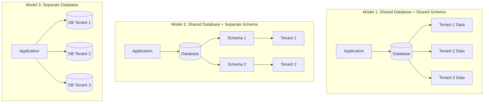
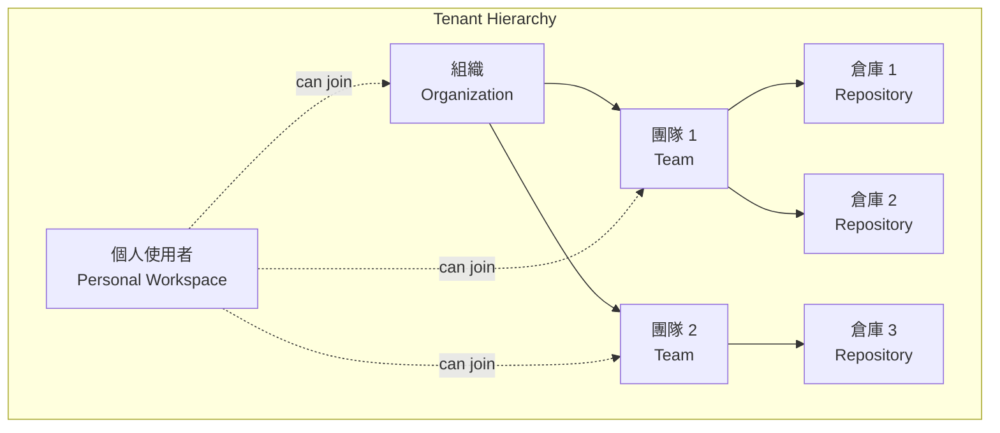

# 多租戶架構

## 概述

本文件詳細說明 ng-gighub 專案的多租戶 (Multi-Tenancy) 架構設計，包含租戶隔離策略、資料分區方案、Workspace 與 Organization 模型、效能優化及擴展性考量。

## 目錄

- [多租戶概念](#多租戶概念)
- [租戶模型](#租戶模型)
- [資料隔離策略](#資料隔離策略)
- [租戶識別與路由](#租戶識別與路由)
- [資料分區方案](#資料分區方案)
- [跨租戶資源共享](#跨租戶資源共享)
- [效能優化](#效能優化)
- [擴展性設計](#擴展性設計)

## 多租戶概念

### 什麼是多租戶？

**多租戶 (Multi-Tenancy)** 是一種軟體架構模式，允許單一應用程式實例服務多個客戶（租戶），同時確保每個租戶的資料與配置相互隔離。

### 多租戶的優勢

1. **成本效益**: 共享基礎設施，降低維護成本
2. **資源利用**: 提高伺服器資源使用效率
3. **統一管理**: 集中式維護與更新
4. **快速部署**: 新租戶即開即用
5. **數據分析**: 跨租戶數據分析與洞察

### 多租戶模型類型



**ng-gighub 採用 Model 1**: Shared Database + Shared Schema，透過 Row Level Security (RLS) 實現資料隔離。

## 租戶模型

### 租戶層級

ng-gighub 定義三種租戶層級：



### 租戶類型

#### 1. Personal Workspace (個人工作區)

```typescript
interface PersonalWorkspace {
  id: string;
  type: 'personal';
  ownerId: string; // User ID
  name: string;
  slug: string;
  settings: WorkspaceSettings;
}
```

**特性：**
- 每個使用者預設有一個個人工作區
- 只有擁有者可以存取
- 不支援成員邀請
- 適合個人專案

#### 2. Organization (組織)

```typescript
interface Organization {
  id: string;
  type: 'organization';
  name: string;
  slug: string;
  ownerId: string;
  members: OrganizationMember[];
  teams: Team[];
  plan: SubscriptionPlan; // Free, Pro, Enterprise
  settings: OrganizationSettings;
}
```

**特性：**
- 支援多成員協作
- 可建立多個團隊
- 付費方案與計費
- 組織級設定與權限

#### 3. Team (團隊)

```typescript
interface Team {
  id: string;
  organizationId: string;
  name: string;
  slug: string;
  members: TeamMember[];
  repositories: Repository[];
  settings: TeamSettings;
}
```

**特性：**
- 隸屬於組織
- 團隊級權限管理
- 可存取指定的倉庫
- 適合專案團隊協作

### 資料庫 Schema

```sql
-- 工作區表
CREATE TABLE workspaces (
  id uuid PRIMARY KEY DEFAULT gen_random_uuid(),
  type text NOT NULL CHECK (type IN ('personal', 'organization')),
  name text NOT NULL,
  slug text UNIQUE NOT NULL,
  owner_id uuid REFERENCES accounts(id),
  settings jsonb DEFAULT '{}',
  metadata jsonb DEFAULT '{}',
  is_active boolean DEFAULT true,
  created_at timestamptz DEFAULT now(),
  updated_at timestamptz DEFAULT now()
);

-- 工作區成員表
CREATE TABLE workspace_members (
  id uuid PRIMARY KEY DEFAULT gen_random_uuid(),
  workspace_id uuid REFERENCES workspaces(id) ON DELETE CASCADE,
  account_id uuid REFERENCES accounts(id) ON DELETE CASCADE,
  role text NOT NULL CHECK (role IN ('owner', 'admin', 'member', 'viewer')),
  permissions jsonb DEFAULT '{}',
  joined_at timestamptz DEFAULT now(),
  UNIQUE(workspace_id, account_id)
);

-- 工作區資源關聯表
CREATE TABLE workspace_resources (
  id uuid PRIMARY KEY DEFAULT gen_random_uuid(),
  workspace_id uuid REFERENCES workspaces(id) ON DELETE CASCADE,
  resource_type text NOT NULL, -- 'team', 'repository', 'project'
  resource_id uuid NOT NULL,
  metadata jsonb DEFAULT '{}',
  created_at timestamptz DEFAULT now(),
  UNIQUE(workspace_id, resource_type, resource_id)
);

-- 索引
CREATE INDEX idx_workspaces_owner ON workspaces(owner_id);
CREATE INDEX idx_workspaces_slug ON workspaces(slug);
CREATE INDEX idx_workspace_members_workspace ON workspace_members(workspace_id);
CREATE INDEX idx_workspace_members_account ON workspace_members(account_id);
CREATE INDEX idx_workspace_resources_workspace ON workspace_resources(workspace_id);
CREATE INDEX idx_workspace_resources_resource ON workspace_resources(resource_type, resource_id);
```

## 資料隔離策略

### 1. Row Level Security (RLS)

RLS 是 PostgreSQL 提供的資料庫層級隔離機制，確保租戶只能存取自己的資料。

#### 工作區資料隔離

```sql
-- 啟用 RLS
ALTER TABLE workspaces ENABLE ROW LEVEL SECURITY;

-- 使用者只能查看自己有權限的工作區
CREATE POLICY "Users can view their workspaces"
  ON workspaces
  FOR SELECT
  USING (
    -- 1. 擁有者
    owner_id = auth.uid()
    OR
    -- 2. 成員
    EXISTS (
      SELECT 1
      FROM workspace_members
      WHERE workspace_id = workspaces.id
        AND account_id = auth.uid()
    )
  );

-- 只有擁有者可以更新工作區
CREATE POLICY "Only owners can update workspaces"
  ON workspaces
  FOR UPDATE
  USING (owner_id = auth.uid());

-- 只有擁有者可以刪除工作區
CREATE POLICY "Only owners can delete workspaces"
  ON workspaces
  FOR DELETE
  USING (owner_id = auth.uid());
```

#### 工作區成員資料隔離

```sql
ALTER TABLE workspace_members ENABLE ROW LEVEL SECURITY;

CREATE POLICY "Users can view workspace members"
  ON workspace_members
  FOR SELECT
  USING (
    -- 只能查看自己所屬工作區的成員
    workspace_id IN (
      SELECT workspace_id
      FROM workspace_members
      WHERE account_id = auth.uid()
    )
  );
```

### 2. 應用層隔離

在應用層增加額外的租戶檢查：

```typescript
@Injectable({ providedIn: 'root' })
export class TenantGuard {
  async checkTenantAccess(
    userId: string,
    tenantId: string,
    tenantType: 'workspace' | 'organization' | 'team'
  ): Promise<boolean> {
    // 檢查使用者是否有權限存取該租戶
    const { data, error } = await this.supabase.rpc('check_tenant_access', {
      user_id: userId,
      tenant_id: tenantId,
      tenant_type: tenantType
    });

    if (error) {
      console.error('Tenant access check failed:', error);
      return false;
    }

    return data as boolean;
  }
}
```

```sql
CREATE OR REPLACE FUNCTION check_tenant_access(
  user_id uuid,
  tenant_id uuid,
  tenant_type text
)
RETURNS boolean
LANGUAGE plpgsql
SECURITY DEFINER
AS $$
BEGIN
  CASE tenant_type
    WHEN 'workspace' THEN
      RETURN EXISTS (
        SELECT 1
        FROM workspace_members
        WHERE workspace_id = tenant_id
          AND account_id = user_id
      );
    
    WHEN 'organization' THEN
      RETURN EXISTS (
        SELECT 1
        FROM organization_members
        WHERE organization_id = tenant_id
          AND account_id = user_id
      );
    
    WHEN 'team' THEN
      RETURN EXISTS (
        SELECT 1
        FROM account_teams
        WHERE team_id = tenant_id
          AND account_id = user_id
      );
    
    ELSE
      RETURN false;
  END CASE;
END;
$$;
```

### 3. API 層隔離

使用 HTTP Interceptor 自動注入租戶上下文：

```typescript
@Injectable()
export class TenantInterceptor implements HttpInterceptor {
  constructor(private tenantService: TenantService) {}

  intercept(req: HttpRequest<any>, next: HttpHandler): Observable<HttpEvent<any>> {
    const currentTenant = this.tenantService.getCurrentTenant();

    if (currentTenant) {
      // 在請求標頭中加入租戶資訊
      req = req.clone({
        setHeaders: {
          'X-Tenant-ID': currentTenant.id,
          'X-Tenant-Type': currentTenant.type
        }
      });
    }

    return next.handle(req);
  }
}
```

## 租戶識別與路由

### URL 路由策略

ng-gighub 使用 **Path-based** 路由策略識別租戶：

```
https://ng-gighub.com/{tenant-slug}/{resource}
```

**範例：**
```
# 個人工作區
https://ng-gighub.com/@username/repositories

# 組織
https://ng-gighub.com/my-org/teams

# 團隊
https://ng-gighub.com/my-org/my-team/repositories
```

### 租戶解析器

```typescript
@Injectable({ providedIn: 'root' })
export class TenantResolver implements Resolve<Tenant> {
  constructor(
    private tenantService: TenantService,
    private router: Router
  ) {}

  async resolve(route: ActivatedRouteSnapshot): Promise<Tenant> {
    const tenantSlug = route.params['tenantSlug'];

    if (!tenantSlug) {
      this.router.navigate(['/']);
      throw new Error('Tenant slug not provided');
    }

    const tenant = await this.tenantService.getTenantBySlug(tenantSlug);

    if (!tenant) {
      this.router.navigate(['/404']);
      throw new Error('Tenant not found');
    }

    // 設定當前租戶
    this.tenantService.setCurrentTenant(tenant);

    return tenant;
  }
}
```

### 路由配置

```typescript
export const routes: Routes = [
  {
    path: ':tenantSlug',
    resolve: { tenant: TenantResolver },
    children: [
      {
        path: 'repositories',
        component: RepositoriesComponent
      },
      {
        path: 'teams',
        component: TeamsComponent,
        canActivate: [OrganizationGuard] // 只有組織才有團隊
      },
      {
        path: 'settings',
        component: SettingsComponent,
        canActivate: [TenantAdminGuard]
      }
    ]
  }
];
```

### 租戶服務

```typescript
@Injectable({ providedIn: 'root' })
export class TenantService {
  private currentTenant = signal<Tenant | null>(null);

  getCurrentTenant(): Tenant | null {
    return this.currentTenant();
  }

  setCurrentTenant(tenant: Tenant) {
    this.currentTenant.set(tenant);
    
    // 儲存到 SessionStorage
    sessionStorage.setItem('current-tenant', JSON.stringify(tenant));
  }

  async getTenantBySlug(slug: string): Promise<Tenant | null> {
    const { data, error } = await this.supabase
      .from('workspaces')
      .select('*')
      .eq('slug', slug)
      .single();

    if (error || !data) {
      return null;
    }

    return data as Tenant;
  }

  async switchTenant(tenantSlug: string) {
    const tenant = await this.getTenantBySlug(tenantSlug);
    
    if (tenant) {
      this.setCurrentTenant(tenant);
      this.router.navigate([`/${tenantSlug}`]);
    }
  }
}
```

## 資料分區方案

### PostgreSQL Partitioning

對於大量資料的表，可使用 PostgreSQL 的分區功能按租戶 ID 分區：

```sql
-- 建立分區表
CREATE TABLE work_items_partitioned (
  id uuid DEFAULT gen_random_uuid(),
  workspace_id uuid NOT NULL,
  title text NOT NULL,
  status text,
  created_at timestamptz DEFAULT now()
) PARTITION BY HASH (workspace_id);

-- 建立分區
CREATE TABLE work_items_p0 PARTITION OF work_items_partitioned
  FOR VALUES WITH (MODULUS 4, REMAINDER 0);

CREATE TABLE work_items_p1 PARTITION OF work_items_partitioned
  FOR VALUES WITH (MODULUS 4, REMAINDER 1);

CREATE TABLE work_items_p2 PARTITION OF work_items_partitioned
  FOR VALUES WITH (MODULUS 4, REMAINDER 2);

CREATE TABLE work_items_p3 PARTITION OF work_items_partitioned
  FOR VALUES WITH (MODULUS 4, REMAINDER 3);

-- 在每個分區建立索引
CREATE INDEX idx_work_items_p0_workspace ON work_items_p0(workspace_id);
CREATE INDEX idx_work_items_p1_workspace ON work_items_p1(workspace_id);
CREATE INDEX idx_work_items_p2_workspace ON work_items_p2(workspace_id);
CREATE INDEX idx_work_items_p3_workspace ON work_items_p3(workspace_id);
```

### 查詢優化

```sql
-- 查詢時自動路由到對應分區
SELECT *
FROM work_items_partitioned
WHERE workspace_id = 'specific-workspace-id'
  AND status = 'in_progress';

-- PostgreSQL 會自動選擇正確的分區
```

## 跨租戶資源共享

### 共享資源模型

某些資源可能需要在租戶間共享（如公開倉庫）：

```sql
-- 資源共享表
CREATE TABLE resource_shares (
  id uuid PRIMARY KEY DEFAULT gen_random_uuid(),
  resource_type text NOT NULL, -- 'repository', 'project', etc.
  resource_id uuid NOT NULL,
  owner_tenant_id uuid NOT NULL,
  shared_with_tenant_id uuid,
  shared_with_type text, -- 'public', 'organization', 'team', 'user'
  permission_level text NOT NULL, -- 'read', 'write', 'admin'
  created_at timestamptz DEFAULT now(),
  expires_at timestamptz
);

-- 索引
CREATE INDEX idx_resource_shares_resource ON resource_shares(resource_type, resource_id);
CREATE INDEX idx_resource_shares_shared_with ON resource_shares(shared_with_tenant_id);
```

### 公開資源 RLS Policy

```sql
CREATE POLICY "Public resources are readable by all"
  ON repositories
  FOR SELECT
  USING (
    -- 私有倉庫：租戶成員
    (is_private = false)
    OR
    -- 公開倉庫：所有人
    (
      owner_id IN (
        SELECT workspace_id
        FROM workspace_members
        WHERE account_id = auth.uid()
      )
    )
  );
```

## 效能優化

### 1. 連線池配置

```typescript
// supabase.config.ts
export const supabaseConfig = {
  url: environment.supabaseUrl,
  key: environment.supabaseAnonKey,
  options: {
    db: {
      schema: 'public'
    },
    global: {
      headers: {
        'X-Client-Info': 'ng-gighub'
      }
    },
    auth: {
      persistSession: true,
      autoRefreshToken: true
    }
  }
};
```

### 2. 查詢優化

```sql
-- 為租戶相關查詢建立複合索引
CREATE INDEX idx_workspace_members_composite
  ON workspace_members(workspace_id, account_id, role);

CREATE INDEX idx_work_items_workspace_status
  ON work_items(workspace_id, status)
  WHERE deleted_at IS NULL;
```

### 3. 快取策略

```typescript
@Injectable({ providedIn: 'root' })
export class TenantCacheService {
  private cache = new Map<string, { data: any; expiry: number }>();
  private CACHE_TTL = 5 * 60 * 1000; // 5 minutes

  set(key: string, data: any) {
    this.cache.set(key, {
      data,
      expiry: Date.now() + this.CACHE_TTL
    });
  }

  get(key: string): any | null {
    const cached = this.cache.get(key);
    
    if (!cached) {
      return null;
    }

    if (Date.now() > cached.expiry) {
      this.cache.delete(key);
      return null;
    }

    return cached.data;
  }

  invalidate(key: string) {
    this.cache.delete(key);
  }

  invalidateAll() {
    this.cache.clear();
  }
}
```

### 4. Materialized Views

```sql
-- 建立租戶統計 Materialized View
CREATE MATERIALIZED VIEW tenant_statistics AS
SELECT
  w.id as workspace_id,
  w.name as workspace_name,
  COUNT(DISTINCT wm.account_id) as member_count,
  COUNT(DISTINCT wr.resource_id) FILTER (WHERE wr.resource_type = 'repository') as repository_count,
  COUNT(DISTINCT wr.resource_id) FILTER (WHERE wr.resource_type = 'project') as project_count
FROM workspaces w
LEFT JOIN workspace_members wm ON w.id = wm.workspace_id
LEFT JOIN workspace_resources wr ON w.id = wr.workspace_id
GROUP BY w.id, w.name;

-- 定期更新
REFRESH MATERIALIZED VIEW CONCURRENTLY tenant_statistics;
```

## 擴展性設計

### 水平擴展

#### 1. 應用層擴展

```
┌─────────────┐
│Load Balancer│
└──────┬──────┘
       │
   ┌───┴───┬────────┬────────┐
   │       │        │        │
┌──▼───┐┌──▼───┐┌──▼───┐┌──▼───┐
│ SSR 1││ SSR 2││ SSR 3││ SSR 4│
└──┬───┘└──┬───┘└──┬───┘└──┬───┘
   └───────┴────┬───┴────────┘
                │
         ┌──────▼──────┐
         │  Supabase   │
         │  (PostgreSQL)│
         └─────────────┘
```

#### 2. 資料庫擴展

```
┌─────────────────┐
│   Application   │
└────────┬────────┘
         │
    ┌────▼────┐
    │  Master │
    │    DB   │
    └────┬────┘
         │
    ┌────┴────┬────────────┐
    │         │            │
┌───▼───┐ ┌───▼───┐ ┌───▼───┐
│Read   │ │Read   │ │Read   │
│Replica│ │Replica│ │Replica│
│  1    │ │  2    │ │  3    │
└───────┘ └───────┘ └───────┘
```

### 垂直擴展

- CPU: 根據並發需求增加
- Memory: 根據快取需求增加
- Storage: 根據資料量增加

### 租戶隔離級別

```typescript
enum TenantIsolationLevel {
  SHARED = 'shared',      // 共享所有資源
  PARTIAL = 'partial',    // 部分資源隔離
  DEDICATED = 'dedicated' // 完全隔離
}

interface TenantConfig {
  id: string;
  isolationLevel: TenantIsolationLevel;
  resourceLimits: {
    maxMembers: number;
    maxRepositories: number;
    maxStorage: number; // GB
  };
}
```

## 相關文件

- [認證與令牌管理](./authentication.md)
- [授權與權限管理](./authorization.md)
- [角色系統 (RBAC)](./role-based-access-control.md)
- [安全最佳實踐](./security-best-practices.md)
- [系統基礎設施概覽](./overview.md)

## 總結

ng-gighub 的多租戶架構採用：

- **Shared Database + Shared Schema**: 成本效益最佳
- **Row Level Security (RLS)**: 資料庫層級隔離
- **應用層檢查**: 額外的安全防護
- **Path-based 路由**: 直觀的租戶識別
- **分區策略**: 支援大量資料擴展

透過完善的多租戶設計，確保資料安全隔離的同時，實現高效的資源利用與管理。

---
**最後更新**: 2025-11-22  
**維護者**: Development Team  
**版本**: 1.0.0
