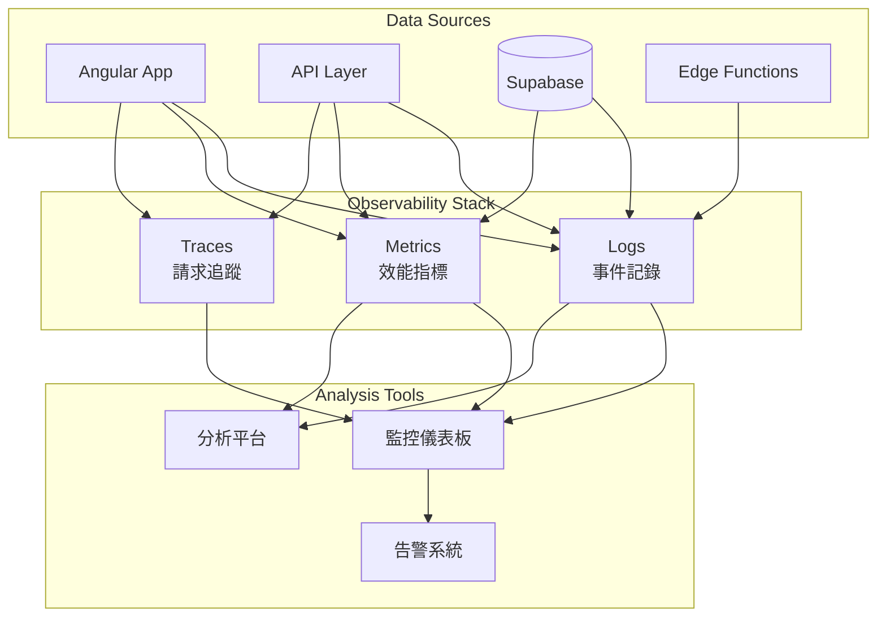

# 可觀察性 (Observability)

## 概述

本文件定義 ng-gighub 專案的可觀察性 (Observability) 架構，包含 Activity Log（活動日誌）、Audit Log（審計日誌）、錯誤追蹤（Error Tracking）、效能監控、以及日誌管理策略，確保系統透明、可追溯、可診斷。

## 目錄

- [可觀察性三大支柱](#可觀察性三大支柱)
- [Activity Log（活動日誌）](#activity-log活動日誌)
- [Audit Log（審計日誌）](#audit-log審計日誌)
- [錯誤追蹤與監控](#錯誤追蹤與監控)
- [效能監控](#效能監控)
- [日誌聚合與查詢](#日誌聚合與查詢)
- [告警機制](#告警機制)
- [合規性與資料保留](#合規性與資料保留)

## 可觀察性三大支柱

### 1. Logs（日誌）
記錄系統事件、使用者操作、錯誤訊息

### 2. Metrics（指標）
量化系統效能、資源使用、業務指標

### 3. Traces（追蹤）
分散式系統中請求的完整生命週期



## Activity Log（活動日誌）

### 概念

Activity Log 記錄使用者在系統中的**有意義操作**，用於：
- 使用者行為追蹤
- 功能使用統計
- 社交動態展示
- 協作歷史記錄

### 資料庫 Schema

```sql
CREATE TABLE activity_logs (
  -- 主鍵
  id uuid PRIMARY KEY DEFAULT gen_random_uuid(),
  
  -- 操作者（Actor）
  actor_id uuid NOT NULL REFERENCES accounts(id) ON DELETE CASCADE,
  actor_type text NOT NULL DEFAULT 'user'
    CHECK (actor_type IN ('user', 'system', 'bot', 'integration')),
  actor_name text NOT NULL,
  actor_avatar_url text,
  
  -- 動作（Action）
  action text NOT NULL, -- created, updated, deleted, invited, joined, etc.
  action_category text NOT NULL
    CHECK (action_category IN (
      'repository', 'workspace', 'team', 'member', 
      'project', 'issue', 'pull_request', 'comment'
    )),
  
  -- 目標（Target）
  target_type text NOT NULL,
  target_id uuid NOT NULL,
  target_name text,
  target_url text,
  
  -- 上下文（Context）
  workspace_id uuid REFERENCES workspaces(id) ON DELETE CASCADE,
  organization_id uuid REFERENCES accounts(id),
  team_id uuid REFERENCES teams(id),
  
  -- 詳細資訊
  description text,
  summary text, -- 簡短摘要，用於 UI 顯示
  
  -- 額外資料
  metadata jsonb DEFAULT '{}',
  
  -- 可見性
  visibility text NOT NULL DEFAULT 'private'
    CHECK (visibility IN ('public', 'workspace', 'team', 'private')),
  
  -- 時間
  occurred_at timestamptz NOT NULL DEFAULT now(),
  
  -- 標記
  is_important boolean DEFAULT false,
  is_deleted boolean DEFAULT false
);

-- 索引
CREATE INDEX idx_activity_logs_actor 
  ON activity_logs(actor_id, occurred_at DESC) 
  WHERE is_deleted = false;

CREATE INDEX idx_activity_logs_workspace 
  ON activity_logs(workspace_id, occurred_at DESC) 
  WHERE is_deleted = false;

CREATE INDEX idx_activity_logs_target 
  ON activity_logs(target_type, target_id, occurred_at DESC) 
  WHERE is_deleted = false;

CREATE INDEX idx_activity_logs_occurred 
  ON activity_logs(occurred_at DESC) 
  WHERE is_deleted = false;

CREATE INDEX idx_activity_logs_category 
  ON activity_logs(action_category, occurred_at DESC) 
  WHERE is_deleted = false;

-- 分區（按月）
CREATE TABLE activity_logs_partitioned (
  LIKE activity_logs INCLUDING ALL
) PARTITION BY RANGE (occurred_at);

-- 建立分區範例
CREATE TABLE activity_logs_2025_01 PARTITION OF activity_logs_partitioned
  FOR VALUES FROM ('2025-01-01') TO ('2025-02-01');
```

### 記錄 Activity

```typescript
@Injectable({ providedIn: 'root' })
export class ActivityLogService {
  constructor(private supabase: SupabaseClient) {}
  
  async log(activity: ActivityLogEntry): Promise<void> {
    const { error } = await this.supabase
      .from('activity_logs')
      .insert({
        actor_id: activity.actorId,
        actor_type: activity.actorType || 'user',
        actor_name: activity.actorName,
        action: activity.action,
        action_category: activity.category,
        target_type: activity.targetType,
        target_id: activity.targetId,
        target_name: activity.targetName,
        workspace_id: activity.workspaceId,
        description: activity.description,
        summary: this.generateSummary(activity),
        metadata: activity.metadata || {},
        visibility: activity.visibility || 'workspace'
      });
    
    if (error) {
      console.error('Failed to log activity:', error);
    }
  }
  
  private generateSummary(activity: ActivityLogEntry): string {
    // 根據 action 和 category 生成摘要
    const templates: Record<string, string> = {
      'repository:created': '{actor} 建立了倉庫 {target}',
      'team:joined': '{actor} 加入了團隊 {target}',
      'issue:created': '{actor} 建立了議題 {target}',
      'pull_request:merged': '{actor} 合併了拉取請求 {target}'
    };
    
    const key = `${activity.category}:${activity.action}`;
    const template = templates[key] || '{actor} {action} {target}';
    
    return template
      .replace('{actor}', activity.actorName)
      .replace('{action}', activity.action)
      .replace('{target}', activity.targetName);
  }
  
  async getWorkspaceActivities(
    workspaceId: string,
    options?: {
      limit?: number;
      offset?: number;
      category?: string;
      since?: Date;
    }
  ): Promise<Activity[]> {
    let query = this.supabase
      .from('activity_logs')
      .select('*')
      .eq('workspace_id', workspaceId)
      .eq('is_deleted', false)
      .order('occurred_at', { ascending: false });
    
    if (options?.category) {
      query = query.eq('action_category', options.category);
    }
    
    if (options?.since) {
      query = query.gte('occurred_at', options.since.toISOString());
    }
    
    if (options?.limit) {
      query = query.limit(options.limit);
    }
    
    if (options?.offset) {
      query = query.range(options.offset, options.offset + (options.limit || 20) - 1);
    }
    
    const { data, error } = await query;
    
    if (error) {
      console.error('Failed to fetch activities:', error);
      return [];
    }
    
    return data as Activity[];
  }
}

interface ActivityLogEntry {
  actorId: string;
  actorType?: 'user' | 'system' | 'bot' | 'integration';
  actorName: string;
  action: string;
  category: string;
  targetType: string;
  targetId: string;
  targetName: string;
  workspaceId?: string;
  description?: string;
  metadata?: Record<string, any>;
  visibility?: 'public' | 'workspace' | 'team' | 'private';
}
```

### 使用範例

```typescript
// 記錄倉庫建立
await this.activityLogService.log({
  actorId: currentUser.id,
  actorName: currentUser.displayName,
  action: 'created',
  category: 'repository',
  targetType: 'repository',
  targetId: newRepo.id,
  targetName: newRepo.name,
  workspaceId: currentWorkspace.id,
  description: `建立了新倉庫 ${newRepo.name}`,
  metadata: {
    visibility: newRepo.isPrivate ? 'private' : 'public',
    language: newRepo.language
  },
  visibility: 'workspace'
});

// 記錄成員邀請
await this.activityLogService.log({
  actorId: inviter.id,
  actorName: inviter.displayName,
  action: 'invited',
  category: 'member',
  targetType: 'user',
  targetId: invitee.id,
  targetName: invitee.email,
  workspaceId: workspace.id,
  metadata: {
    role: 'member',
    invitationId: invitation.id
  },
  visibility: 'workspace'
});
```

### Activity Feed UI

```typescript
@Component({
  selector: 'app-activity-feed',
  template: `
    <div class="activity-feed">
      <h2>最近活動</h2>
      
      <!-- 過濾器 -->
      <mat-button-toggle-group [(value)]="selectedCategory" 
                               (change)="onCategoryChange()">
        <mat-button-toggle value="all">全部</mat-button-toggle>
        <mat-button-toggle value="repository">倉庫</mat-button-toggle>
        <mat-button-toggle value="team">團隊</mat-button-toggle>
        <mat-button-toggle value="member">成員</mat-button-toggle>
      </mat-button-toggle-group>
      
      <!-- 活動列表 -->
      <div class="activity-list">
        @for (activity of activities(); track activity.id) {
          <div class="activity-item">
            
            <div class="content">
              <p class="summary">{{ activity.summary }}</p>
              <span class="time">{{ activity.occurred_at | relativeTime }}</span>
            </div>
            @if (activity.is_important) {
              <mat-icon class="important">star</mat-icon>
            }
          </div>
        }
      </div>
      
      <!-- 載入更多 -->
      <button mat-button 
              (click)="loadMore()" 
              [disabled]="loading()">
        載入更多
      </button>
    </div>
  `,
  standalone: true
})
export class ActivityFeedComponent implements OnInit {
  activities = signal<Activity[]>([]);
  selectedCategory = 'all';
  loading = signal(false);
  
  constructor(
    private activityService: ActivityLogService,
    private contextService: WorkspaceContextService
  ) {}
  
  async ngOnInit() {
    await this.loadActivities();
  }
  
  async onCategoryChange() {
    await this.loadActivities();
  }
  
  async loadActivities() {
    this.loading.set(true);
    
    const workspaceId = this.contextService.getWorkspaceId();
    const category = this.selectedCategory === 'all' ? undefined : this.selectedCategory;
    
    const activities = await this.activityService.getWorkspaceActivities(
      workspaceId,
      { limit: 20, category }
    );
    
    this.activities.set(activities);
    this.loading.set(false);
  }
  
  async loadMore() {
    // 實作分頁載入
  }
}
```

## Audit Log（審計日誌）

### 概念

Audit Log 記錄系統中的**所有資料變更**，用於：
- 合規性要求
- 安全審計
- 資料恢復
- 異常調查

### 特性

- **不可變**: 一旦寫入，不可修改或刪除
- **完整性**: 記錄所有變更（包含前後值）
- **可追溯**: 完整的變更鏈
- **長期保存**: 依法規要求保存數年

### 資料庫 Schema

```sql
CREATE TABLE audit_logs (
  -- 主鍵
  id uuid PRIMARY KEY DEFAULT gen_random_uuid(),
  
  -- 資料表與記錄
  schema_name text NOT NULL DEFAULT 'public',
  table_name text NOT NULL,
  record_id uuid NOT NULL,
  
  -- 操作類型
  operation text NOT NULL CHECK (operation IN ('INSERT', 'UPDATE', 'DELETE')),
  
  -- 變更內容
  old_data jsonb, -- UPDATE/DELETE 前的資料
  new_data jsonb, -- INSERT/UPDATE 後的資料
  changed_fields text[], -- UPDATE 時變更的欄位列表
  
  -- 操作者資訊
  user_id uuid REFERENCES accounts(id),
  user_email text,
  user_name text,
  user_ip inet,
  user_agent text,
  
  -- 上下文
  workspace_id uuid,
  organization_id uuid,
  session_id text,
  request_id text,
  
  -- 時間
  occurred_at timestamptz NOT NULL DEFAULT now(),
  
  -- 額外資訊
  metadata jsonb DEFAULT '{}',
  
  -- 雜湊（確保完整性）
  content_hash text,
  previous_hash text
);

-- 索引
CREATE INDEX idx_audit_logs_table_record 
  ON audit_logs(table_name, record_id, occurred_at DESC);
  
CREATE INDEX idx_audit_logs_user 
  ON audit_logs(user_id, occurred_at DESC);
  
CREATE INDEX idx_audit_logs_workspace 
  ON audit_logs(workspace_id, occurred_at DESC);
  
CREATE INDEX idx_audit_logs_occurred 
  ON audit_logs(occurred_at DESC);

-- GIN 索引用於 JSONB 查詢
CREATE INDEX idx_audit_logs_old_data 
  ON audit_logs USING GIN(old_data);
  
CREATE INDEX idx_audit_logs_new_data 
  ON audit_logs USING GIN(new_data);

-- 分區（按月，用於長期儲存）
CREATE TABLE audit_logs_partitioned (
  LIKE audit_logs INCLUDING ALL
) PARTITION BY RANGE (occurred_at);

-- RLS（僅允許插入，不允許修改/刪除）
ALTER TABLE audit_logs ENABLE ROW LEVEL SECURITY;

CREATE POLICY "Allow insert audit logs"
  ON audit_logs FOR INSERT
  WITH CHECK (true);

CREATE POLICY "Users can view their own audit logs"
  ON audit_logs FOR SELECT
  USING (
    user_id = auth.uid()
    OR
    EXISTS (
      SELECT 1 FROM workspace_members
      WHERE workspace_id = audit_logs.workspace_id
        AND account_id = auth.uid()
        AND role IN ('owner', 'admin')
    )
  );

-- 禁止 UPDATE 和 DELETE
CREATE POLICY "Prevent update audit logs"
  ON audit_logs FOR UPDATE
  USING (false);

CREATE POLICY "Prevent delete audit logs"
  ON audit_logs FOR DELETE
  USING (false);
```

### 自動審計 Trigger

```sql
CREATE OR REPLACE FUNCTION audit_trigger_function()
RETURNS TRIGGER
LANGUAGE plpgsql
SECURITY DEFINER
AS $$
DECLARE
  v_old_data jsonb;
  v_new_data jsonb;
  v_changed_fields text[];
  v_user_id uuid;
  v_user_email text;
  v_workspace_id uuid;
  v_content_hash text;
  v_previous_hash text;
BEGIN
  -- 取得使用者資訊
  v_user_id := auth.uid();
  v_user_email := auth.email();
  
  -- 取得工作區 ID（如果有）
  IF TG_TABLE_NAME IN ('workspaces', 'work_items', 'repositories') THEN
    IF TG_OP = 'DELETE' THEN
      v_workspace_id := OLD.workspace_id;
    ELSE
      v_workspace_id := NEW.workspace_id;
    END IF;
  END IF;
  
  -- 根據操作類型處理資料
  IF TG_OP = 'DELETE' THEN
    v_old_data := to_jsonb(OLD);
    v_new_data := NULL;
    v_changed_fields := NULL;
  ELSIF TG_OP = 'UPDATE' THEN
    v_old_data := to_jsonb(OLD);
    v_new_data := to_jsonb(NEW);
    -- 找出變更的欄位
    SELECT array_agg(key)
    INTO v_changed_fields
    FROM jsonb_each(v_old_data)
    WHERE v_old_data->key != v_new_data->key;
  ELSIF TG_OP = 'INSERT' THEN
    v_old_data := NULL;
    v_new_data := to_jsonb(NEW);
    v_changed_fields := NULL;
  END IF;
  
  -- 計算內容雜湊
  v_content_hash := md5(
    COALESCE(v_old_data::text, '') || 
    COALESCE(v_new_data::text, '')
  );
  
  -- 取得前一筆審計記錄的雜湊（用於建立不可篡改的鏈）
  SELECT content_hash INTO v_previous_hash
  FROM audit_logs
  WHERE table_name = TG_TABLE_NAME
    AND record_id = COALESCE(NEW.id, OLD.id)
  ORDER BY occurred_at DESC
  LIMIT 1;
  
  -- 插入審計記錄
  INSERT INTO audit_logs (
    schema_name,
    table_name,
    record_id,
    operation,
    old_data,
    new_data,
    changed_fields,
    user_id,
    user_email,
    user_ip,
    workspace_id,
    content_hash,
    previous_hash
  ) VALUES (
    TG_TABLE_SCHEMA,
    TG_TABLE_NAME,
    COALESCE(NEW.id, OLD.id),
    TG_OP,
    v_old_data,
    v_new_data,
    v_changed_fields,
    v_user_id,
    v_user_email,
    inet_client_addr(),
    v_workspace_id,
    v_content_hash,
    v_previous_hash
  );
  
  -- 返回適當的值
  IF TG_OP = 'DELETE' THEN
    RETURN OLD;
  ELSE
    RETURN NEW;
  END IF;
END;
$$;

-- 套用到重要資料表
CREATE TRIGGER workspaces_audit
  AFTER INSERT OR UPDATE OR DELETE ON workspaces
  FOR EACH ROW
  EXECUTE FUNCTION audit_trigger_function();

CREATE TRIGGER work_items_audit
  AFTER INSERT OR UPDATE OR DELETE ON work_items
  FOR EACH ROW
  EXECUTE FUNCTION audit_trigger_function();

CREATE TRIGGER repositories_audit
  AFTER INSERT OR UPDATE OR DELETE ON repositories
  FOR EACH ROW
  EXECUTE FUNCTION audit_trigger_function();
```

### 查詢審計歷史

```typescript
@Injectable({ providedIn: 'root' })
export class AuditLogService {
  constructor(private supabase: SupabaseClient) {}
  
  async getRecordHistory(
    tableName: string,
    recordId: string
  ): Promise<AuditLog[]> {
    const { data, error } = await this.supabase
      .from('audit_logs')
      .select('*')
      .eq('table_name', tableName)
      .eq('record_id', recordId)
      .order('occurred_at', { ascending: false });
    
    if (error) {
      console.error('Failed to fetch audit logs:', error);
      return [];
    }
    
    return data as AuditLog[];
  }
  
  async getUserActivity(
    userId: string,
    options?: {
      since?: Date;
      until?: Date;
      tableName?: string;
    }
  ): Promise<AuditLog[]> {
    let query = this.supabase
      .from('audit_logs')
      .select('*')
      .eq('user_id', userId)
      .order('occurred_at', { ascending: false });
    
    if (options?.since) {
      query = query.gte('occurred_at', options.since.toISOString());
    }
    
    if (options?.until) {
      query = query.lte('occurred_at', options.until.toISOString());
    }
    
    if (options?.tableName) {
      query = query.eq('table_name', options.tableName);
    }
    
    const { data, error } = await query;
    
    if (error) {
      console.error('Failed to fetch user activity:', error);
      return [];
    }
    
    return data as AuditLog[];
  }
  
  async searchChanges(
    searchCriteria: {
      workspace_id?: string;
      table_name?: string;
      operation?: 'INSERT' | 'UPDATE' | 'DELETE';
      since?: Date;
      until?: Date;
      user_id?: string;
      changed_field?: string;
    }
  ): Promise<AuditLog[]> {
    let query = this.supabase
      .from('audit_logs')
      .select('*')
      .order('occurred_at', { ascending: false });
    
    if (searchCriteria.workspace_id) {
      query = query.eq('workspace_id', searchCriteria.workspace_id);
    }
    
    if (searchCriteria.table_name) {
      query = query.eq('table_name', searchCriteria.table_name);
    }
    
    if (searchCriteria.operation) {
      query = query.eq('operation', searchCriteria.operation);
    }
    
    if (searchCriteria.user_id) {
      query = query.eq('user_id', searchCriteria.user_id);
    }
    
    if (searchCriteria.since) {
      query = query.gte('occurred_at', searchCriteria.since.toISOString());
    }
    
    if (searchCriteria.until) {
      query = query.lte('occurred_at', searchCriteria.until.toISOString());
    }
    
    if (searchCriteria.changed_field) {
      query = query.contains('changed_fields', [searchCriteria.changed_field]);
    }
    
    const { data, error } = await query;
    
    if (error) {
      console.error('Failed to search audit logs:', error);
      return [];
    }
    
    return data as AuditLog[];
  }
  
  // 資料恢復（生成 SQL）
  generateRollbackSQL(auditLog: AuditLog): string {
    if (auditLog.operation === 'INSERT') {
      return `DELETE FROM ${auditLog.table_name} WHERE id = '${auditLog.record_id}';`;
    }
    
    if (auditLog.operation === 'DELETE') {
      const columns = Object.keys(auditLog.old_data).join(', ');
      const values = Object.values(auditLog.old_data)
        .map(v => typeof v === 'string' ? `'${v}'` : v)
        .join(', ');
      return `INSERT INTO ${auditLog.table_name} (${columns}) VALUES (${values});`;
    }
    
    if (auditLog.operation === 'UPDATE') {
      const setClause = auditLog.changed_fields
        .map(field => `${field} = '${auditLog.old_data[field]}'`)
        .join(', ');
      return `UPDATE ${auditLog.table_name} SET ${setClause} WHERE id = '${auditLog.record_id}';`;
    }
    
    return '';
  }
}
```

## 錯誤追蹤與監控

### 整合 Sentry

```typescript
// main.ts
import * as Sentry from "@sentry/angular";

Sentry.init({
  dsn: environment.sentryDSN,
  environment: environment.production ? 'production' : 'development',
  integrations: [
    Sentry.browserTracingIntegration(),
    Sentry.replayIntegration({
      maskAllText: false,
      blockAllMedia: false,
    }),
  ],
  // 效能監控
  tracesSampleRate: 1.0,
  // Session Replay
  replaysSessionSampleRate: 0.1,
  replaysOnErrorSampleRate: 1.0,
  
  // 設定使用者資訊
  beforeSend(event, hint) {
    // 移除敏感資訊
    if (event.request) {
      delete event.request.cookies;
    }
    return event;
  },
});

// 設定 Sentry ErrorHandler
export const appConfig: ApplicationConfig = {
  providers: [
    {
      provide: ErrorHandler,
      useValue: Sentry.createErrorHandler({
        showDialog: false,
      }),
    },
    {
      provide: Sentry.TraceService,
      deps: [Router],
    },
    {
      provide: APP_INITIALIZER,
      useFactory: () => () => {},
      deps: [Sentry.TraceService],
      multi: true,
    },
  ],
};
```

### 自訂錯誤追蹤

```typescript
@Injectable({ providedIn: 'root' })
export class ErrorTrackingService {
  constructor(private supabase: SupabaseClient) {}
  
  trackError(error: Error, context?: ErrorContext) {
    // 1. 記錄到 Sentry
    Sentry.captureException(error, {
      tags: {
        workspace_id: context?.workspaceId,
        feature: context?.feature
      },
      user: context?.user ? {
        id: context.user.id,
        email: context.user.email
      } : undefined,
      extra: context?.extra
    });
    
    // 2. 記錄到資料庫
    this.logErrorToDatabase(error, context);
  }
  
  private async logErrorToDatabase(error: Error, context?: ErrorContext) {
    await this.supabase.from('error_logs').insert({
      error_type: error.name,
      error_message: error.message,
      stack_trace: error.stack,
      user_id: context?.user?.id,
      workspace_id: context?.workspaceId,
      url: window.location.href,
      user_agent: navigator.userAgent,
      context: context?.extra || {}
    });
  }
}

interface ErrorContext {
  workspaceId?: string;
  feature?: string;
  user?: {
    id: string;
    email: string;
  };
  extra?: Record<string, any>;
}
```

## 效能監控

### 前端效能監控

```typescript
@Injectable({ providedIn: 'root' })
export class PerformanceMonitoringService {
  // 監控 API 請求
  trackAPICall(
    endpoint: string,
    method: string,
    duration: number,
    status: number
  ) {
    // 記錄到監控系統
    Sentry.addBreadcrumb({
      category: 'api',
      message: `${method} ${endpoint}`,
      level: status >= 400 ? 'error' : 'info',
      data: {
        duration,
        status
      }
    });
    
    // 如果太慢，發送告警
    if (duration > 3000) {
      this.alertSlowAPI(endpoint, duration);
    }
  }
  
  // 監控頁面載入
  trackPageLoad() {
    if (typeof window === 'undefined') return;
    
    window.addEventListener('load', () => {
      const perfData = performance.getEntriesByType('navigation')[0] as PerformanceNavigationTiming;
      
      const metrics = {
        dns: perfData.domainLookupEnd - perfData.domainLookupStart,
        tcp: perfData.connectEnd - perfData.connectStart,
        ttfb: perfData.responseStart - perfData.requestStart,
        download: perfData.responseEnd - perfData.responseStart,
        dom: perfData.domContentLoadedEventEnd - perfData.responseEnd,
        load: perfData.loadEventEnd - perfData.loadEventStart,
        total: perfData.loadEventEnd - perfData.fetchStart
      };
      
      this.sendMetrics('page_load', metrics);
    });
  }
  
  private sendMetrics(metricName: string, data: Record<string, number>) {
    // 發送到監控平台
  }
  
  private alertSlowAPI(endpoint: string, duration: number) {
    // 發送告警
  }
}
```

## 日誌聚合與查詢

### Supabase 日誌查詢

```typescript
@Injectable({ providedIn: 'root' })
export class LogAggregationService {
  constructor(private supabase: SupabaseClient) {}
  
  // 取得 Supabase 日誌
  async getSupabaseLogs(
    service: 'api' | 'auth' | 'storage' | 'realtime',
    options?: {
      since?: Date;
      level?: 'info' | 'warn' | 'error';
      limit?: number;
    }
  ) {
    // 使用 Supabase Management API
    const response = await fetch(
      `${environment.supabaseUrl}/v1/logs/${service}`,
      {
        headers: {
          'Authorization': `Bearer ${environment.supabaseServiceKey}`,
          'Content-Type': 'application/json'
        }
      }
    );
    
    return await response.json();
  }
}
```

## 告警機制

### 告警規則

```sql
CREATE TABLE alert_rules (
  id uuid PRIMARY KEY DEFAULT gen_random_uuid(),
  name text NOT NULL,
  description text,
  
  -- 告警條件
  metric_name text NOT NULL,
  operator text NOT NULL CHECK (operator IN ('>', '<', '>=', '<=', '=')),
  threshold numeric NOT NULL,
  duration_minutes int DEFAULT 5,
  
  -- 告警動作
  severity text NOT NULL CHECK (severity IN ('info', 'warning', 'error', 'critical')),
  notification_channels text[] DEFAULT ARRAY['email'],
  
  -- 狀態
  is_enabled boolean DEFAULT true,
  
  created_at timestamptz DEFAULT now(),
  updated_at timestamptz DEFAULT now()
);
```

### 告警通知

```typescript
@Injectable({ providedIn: 'root' })
export class AlertingService {
  async checkAlertRules() {
    // 檢查各種指標
    const errorRate = await this.getErrorRate();
    const apiLatency = await this.getAPILatency();
    const activeUsers = await this.getActiveUsers();
    
    // 檢查是否觸發告警
    if (errorRate > 0.05) {
      await this.sendAlert({
        severity: 'error',
        title: '錯誤率過高',
        message: `當前錯誤率: ${(errorRate * 100).toFixed(2)}%`,
        channels: ['email', 'slack']
      });
    }
  }
  
  private async sendAlert(alert: Alert) {
    // 發送到各種通知管道
  }
}
```

## 合規性與資料保留

### 資料保留策略

```sql
-- 自動清理舊的活動日誌（保留 90 天）
CREATE OR REPLACE FUNCTION cleanup_old_activity_logs()
RETURNS void
LANGUAGE plpgsql
AS $$
BEGIN
  DELETE FROM activity_logs
  WHERE occurred_at < now() - interval '90 days';
END;
$$;

-- 定期執行
-- 使用 pg_cron 或外部排程工具

-- 審計日誌永久保留（或依法規要求）
-- 可使用分區表 + 冷儲存策略
```

## 相關文件

- [資料庫 Schema 標準](./database-schema-standards.md)
- [安全最佳實踐](./security-best-practices.md)
- [系統基礎設施概覽](./overview.md)

---

**最後更新**: 2025-11-22  
**維護者**: Development Team  
**版本**: 1.0.0
