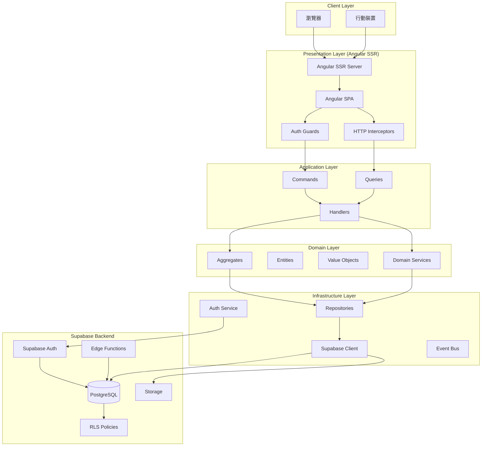
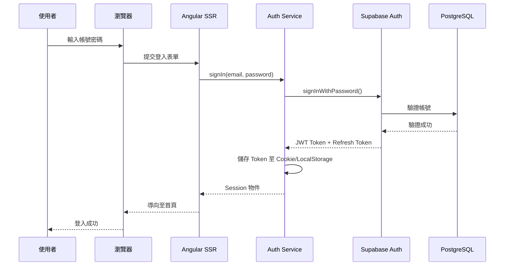
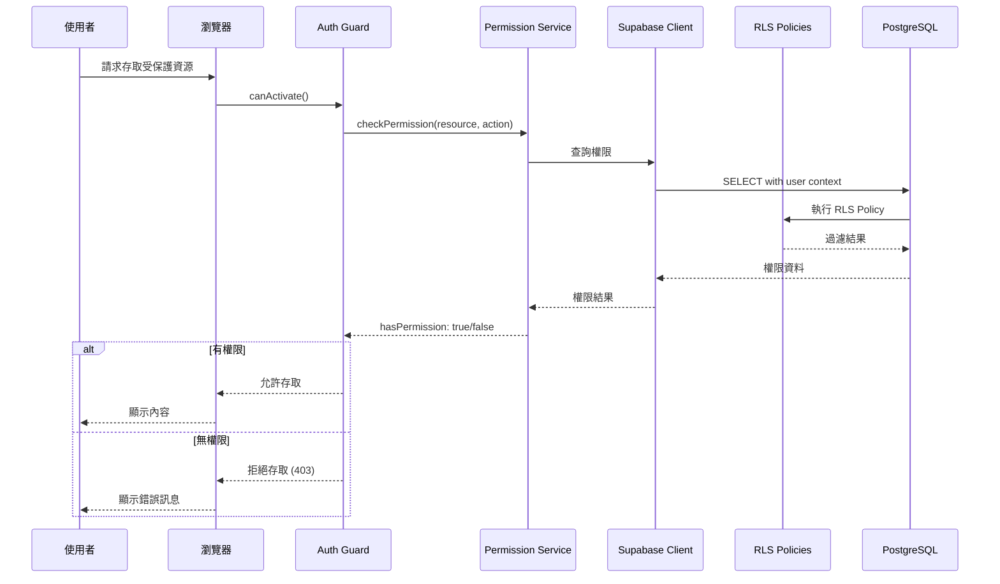
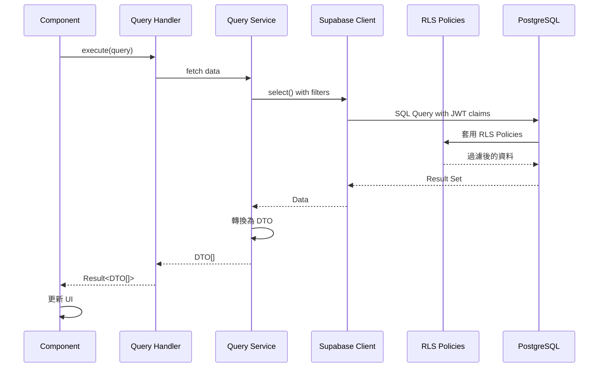
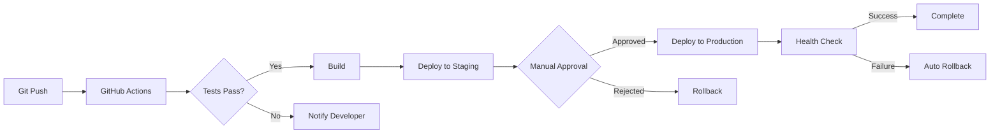

# 系統基礎設施概覽

## 概述

本文件提供 ng-gighub 專案基礎設施的全面概覽，包含認證、授權、多租戶架構及相關技術棧的整體設計。

## 目錄

- [架構概覽](#架構概覽)
- [核心元件](#核心元件)
- [技術棧](#技術棧)
- [資料流](#資料流)
- [安全架構](#安全架構)
- [擴展性設計](#擴展性設計)
- [監控與維護](#監控與維護)

## 架構概覽

### 整體架構圖

### 架構層級說明

#### 1. Client Layer（客戶端層）
- **瀏覽器**: 桌面端使用者
- **行動裝置**: 行動端使用者
- **職責**: 使用者介面渲染與互動

#### 2. Presentation Layer（展示層）
- **Angular SSR Server**: 伺服器端渲染
- **Angular SPA**: 單頁應用程式
- **Auth Guards**: 路由守衛，控制頁面存取
- **HTTP Interceptors**: 攔截器，處理請求/回應
- **職責**: UI 邏輯、路由控制、HTTP 通訊

#### 3. Application Layer（應用層）
- **Commands**: 改變系統狀態的指令
- **Queries**: 查詢系統狀態
- **Handlers**: 處理 Commands 與 Queries
- **職責**: 協調業務流程，不包含業務邏輯

#### 4. Domain Layer（領域層）
- **Aggregates**: 聚合根（Account, Organization, Team, Repository）
- **Entities**: 實體
- **Value Objects**: 值物件
- **Domain Services**: 領域服務
- **職責**: 核心業務邏輯與規則

#### 5. Infrastructure Layer（基礎設施層）
- **Auth Service**: 認證服務
- **Supabase Client**: Supabase 客戶端
- **Repositories**: 資料存取層
- **Event Bus**: 事件總線
- **職責**: 技術實作、外部服務整合

#### 6. Supabase Backend（後端服務）
- **Supabase Auth**: 認證服務（JWT）
- **PostgreSQL**: 關聯式資料庫
- **Storage**: 檔案儲存
- **RLS Policies**: 行級安全策略
- **Edge Functions**: 邊緣函數（Serverless）
- **職責**: 資料持久化、認證、授權

## 核心元件

### 1. 認證系統 (Authentication)

**元件：**
- Supabase Auth
- JWT Token Manager
- Session Manager
- Auth Guards

**功能：**
- 使用者註冊/登入
- 社交登入（OAuth）
- Email 驗證
- 密碼重設
- Multi-Factor Authentication (MFA)
- Session 管理

**詳細文件：** [認證與令牌管理](./authentication.md)

### 2. 授權系統 (Authorization)

**元件：**
- RLS Policies
- Permission Service
- Role Guard
- Policy Enforcer

**功能：**
- 角色基礎存取控制 (RBAC)
- 細粒度權限控制
- 資源級授權
- 動態權限檢查

**詳細文件：** [授權與權限管理](./authorization.md)

### 3. 角色管理系統

**元件：**
- Role Service
- Permission Manager
- Role Hierarchy

**角色類型：**
- **System Roles**: 系統級角色（SuperAdmin, Admin）
- **Organization Roles**: 組織角色（Owner, Admin, Member, Billing）
- **Team Roles**: 團隊角色（Maintainer, Member）
- **Repository Roles**: 倉庫角色（Admin, Write, Read）
- **Workspace Roles**: 工作區角色（Owner, Admin, Member, Viewer）

**詳細文件：** [角色系統 (RBAC)](./role-based-access-control.md)

### 4. 多租戶系統

**租戶類型：**
- **Personal Workspace**: 個人工作區
- **Organization**: 組織
- **Team**: 團隊

**隔離策略：**
- 資料庫層級：RLS Policies
- 應用層級：Context-based filtering
- API 層級：Tenant ID validation

**詳細文件：** [多租戶架構](./multi-tenancy.md)

## 技術棧

### 前端技術

| 技術 | 版本 | 用途 |
|------|------|------|
| Angular | 20.1.x | 前端框架 |
| TypeScript | 5.8.x | 程式語言 |
| @angular/ssr | 20.1.x | 伺服器端渲染 |
| Angular Material | 20.1.x | UI 元件庫 |
| RxJS | 7.8.x | 響應式程式設計 |
| Angular Signals | Built-in | 狀態管理 |

### 後端技術

| 技術 | 用途 |
|------|------|
| Supabase | BaaS 平台 |
| PostgreSQL | 關聯式資料庫 |
| Supabase Auth | JWT 認證服務 |
| Supabase Storage | 檔案儲存 |
| Row Level Security | 資料庫層級授權 |
| PostgREST | 自動產生 REST API |

### 基礎設施技術

| 技術 | 用途 |
|------|------|
| Express | SSR 伺服器 |
| Docker | 容器化（未來） |
| GitHub Actions | CI/CD |
| Vercel/Netlify | 部署平台（選項） |

## 資料流

### 認證流程

### 授權流程

### 資料查詢流程

## 安全架構

### 多層防禦策略

#### 1. 網路層
- HTTPS 強制執行
- CORS 配置
- Rate Limiting
- DDoS 防護

#### 2. 應用層
- Input Validation
- Output Encoding
- CSRF Protection
- XSS Protection
- SQL Injection Prevention

#### 3. 認證層
- JWT Token 驗證
- Token 過期管理
- Refresh Token Rotation
- Session 過期控制

#### 4. 授權層
- Role-Based Access Control (RBAC)
- Row Level Security (RLS)
- Attribute-Based Access Control (ABAC)
- Resource-based Authorization

#### 5. 資料層
- Data Encryption at Rest
- Data Encryption in Transit
- 敏感資料遮罩
- 審計日誌

### 安全檢查清單

開發新功能時，確保以下安全措施：

- [ ] 所有 API 端點需要認證
- [ ] 實作適當的授權檢查
- [ ] 使用參數化查詢（防 SQL Injection）
- [ ] 驗證所有使用者輸入
- [ ] 實作 Rate Limiting
- [ ] 記錄敏感操作至審計日誌
- [ ] 敏感資料加密儲存
- [ ] 實作 CSRF Token
- [ ] 設定安全的 HTTP Headers
- [ ] 定期更新依賴套件

**詳細文件：** [安全最佳實踐](./security-best-practices.md)

## 擴展性設計

### 水平擴展

#### 應用層擴展
- **無狀態設計**: Angular SSR 伺服器無狀態
- **負載平衡**: 多實例部署
- **Session 外部化**: Session 儲存於 Supabase

#### 資料庫擴展
- **讀寫分離**: PostgreSQL Read Replicas
- **Connection Pooling**: PgBouncer
- **資料分區**: 按 tenant_id 分區

### 垂直擴展

- **資源優化**: 記憶體、CPU 配置
- **查詢優化**: Index, Query Plan
- **快取策略**: Redis (未來)

### 效能優化策略

#### 前端優化
- SSR 首屏渲染
- Code Splitting
- Lazy Loading
- Service Worker (PWA)
- 圖片優化

#### 後端優化
- Query Optimization
- Connection Pooling
- Database Indexing
- Caching Layer
- CDN 整合

## 監控與維護

### 監控指標

#### 應用層監控
- 請求回應時間
- 錯誤率
- API 呼叫頻率
- 使用者活躍度

#### 資料庫監控
- 查詢效能
- Connection Pool 使用率
- Slow Query 分析
- 資料庫大小

#### 安全監控
- 登入失敗次數
- 異常存取模式
- Token 過期率
- 權限拒絕率

### 日誌管理

#### 日誌類型
- **Access Logs**: 存取記錄
- **Error Logs**: 錯誤記錄
- **Audit Logs**: 審計記錄
- **Security Logs**: 安全事件記錄

#### 日誌等級
- **ERROR**: 錯誤事件
- **WARN**: 警告事件
- **INFO**: 一般資訊
- **DEBUG**: 除錯資訊

### 備份策略

- **資料庫備份**: 每日自動備份（Supabase 提供）
- **檔案備份**: Storage 備份
- **配置備份**: 版本控制（Git）
- **恢復測試**: 定期恢復演練

## 部署架構

### 開發環境
- Local Development Server
- Supabase Local Dev
- Mock Services

### 測試環境
- Staging Server
- Supabase Staging Project
- Integration Tests

### 生產環境
- Production Server (SSR)
- CDN (Static Assets)
- Supabase Production Project
- Monitoring & Alerting

### CI/CD Pipeline

## 最佳實踐

### 開發最佳實踐

1. **分層架構**: 嚴格遵循 DDD 分層架構
2. **型別安全**: 充分利用 TypeScript 型別系統
3. **測試驅動**: 撰寫單元測試與整合測試
4. **程式碼審查**: 所有變更需經過審查
5. **文件更新**: 程式碼與文件同步更新

### 安全最佳實踐

1. **最小權限原則**: 只授予必要的權限
2. **預設拒絕**: 除非明確允許，否則拒絕存取
3. **深度防禦**: 多層安全防護
4. **定期審查**: 定期檢查權限與角色
5. **安全更新**: 及時更新依賴套件

### 效能最佳實踐

1. **Query 優化**: 減少不必要的資料庫查詢
2. **Index 使用**: 為常用查詢建立索引
3. **Connection Pool**: 合理配置連線池
4. **快取策略**: 適當使用快取
5. **監控分析**: 持續監控效能指標

## 相關文件

- [認證與令牌管理](./authentication.md)
- [授權與權限管理](./authorization.md)
- [角色系統 (RBAC)](./role-based-access-control.md)
- [多租戶架構](./multi-tenancy.md)
- [安全最佳實踐](./security-best-practices.md)
- [架構設計文件](../ARCHITECTURE_DESIGN.md)

## 總結

ng-gighub 的基礎設施設計遵循企業級 SaaS 系統的最佳實踐，採用：

- **安全優先**: 多層防禦、RBAC、RLS
- **可擴展**: 水平擴展、垂直擴展
- **可維護**: 清晰架構、完整測試、詳細文件
- **高效能**: SSR、快取、查詢優化

透過 Angular 20 + Supabase 的組合，實現了一個安全、高效、可擴展的多租戶系統。

---
**最後更新**: 2025-11-22  
**維護者**: Development Team  
**版本**: 1.0.0
