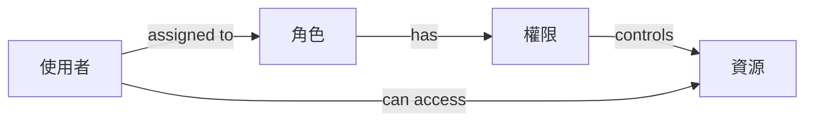
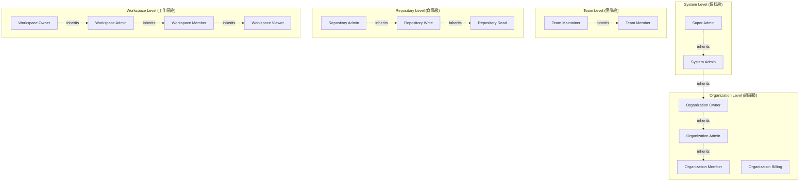

# 角色系統 (RBAC)

## 概述

本文件詳細說明 ng-gighub 專案的角色基礎存取控制 (Role-Based Access Control, RBAC) 系統，包含角色定義、角色層級、權限對應、動態角色管理，以及角色繼承機制。

## 目錄

- [RBAC 概念](#rbac-概念)
- [角色架構](#角色架構)
- [角色定義](#角色定義)
- [角色層級與繼承](#角色層級與繼承)
- [權限對應](#權限對應)
- [動態角色管理](#動態角色管理)
- [Context-Based Roles](#context-based-roles)
- [實作範例](#實作範例)

## RBAC 概念

### 什麼是 RBAC？

**Role-Based Access Control (RBAC)** 是一種存取控制方法，透過角色來管理使用者權限。使用者被賦予角色，角色則被賦予權限，從而實現使用者與權限的解耦。

### RBAC 優勢

1. **簡化管理**: 透過角色批量管理權限
2. **易於理解**: 角色概念直觀易懂
3. **職責分離**: 清楚劃分不同角色的職責
4. **擴展性好**: 易於新增角色與權限
5. **審計友善**: 清楚追蹤角色與權限變更

### RBAC 核心概念



## 角色架構

### 角色類型層級

ng-gighub 定義多個層級的角色系統：



### 資料庫 Schema

#### 角色表

```sql
CREATE TABLE roles (
  id uuid PRIMARY KEY DEFAULT gen_random_uuid(),
  name text NOT NULL,
  slug text UNIQUE NOT NULL,
  description text,
  scope text NOT NULL, -- 'system', 'organization', 'team', 'repository', 'workspace'
  level integer NOT NULL, -- 優先級，數字越大權限越高
  is_system boolean DEFAULT false, -- 系統預設角色
  metadata jsonb DEFAULT '{}',
  created_at timestamptz DEFAULT now(),
  updated_at timestamptz DEFAULT now()
);

-- 索引
CREATE INDEX idx_roles_scope ON roles(scope);
CREATE INDEX idx_roles_level ON roles(level);
CREATE INDEX idx_roles_slug ON roles(slug);
```

#### 使用者角色表

```sql
CREATE TABLE user_roles (
  id uuid PRIMARY KEY DEFAULT gen_random_uuid(),
  user_id uuid REFERENCES auth.users(id) ON DELETE CASCADE,
  role_id uuid REFERENCES roles(id) ON DELETE CASCADE,
  context_type text, -- 'organization', 'team', 'repository', 'workspace', null for system
  context_id uuid, -- 對應 context_type 的 ID
  granted_by uuid REFERENCES auth.users(id),
  granted_at timestamptz DEFAULT now(),
  expires_at timestamptz, -- 角色過期時間（可選）
  UNIQUE(user_id, role_id, context_type, context_id)
);

-- 索引
CREATE INDEX idx_user_roles_user ON user_roles(user_id);
CREATE INDEX idx_user_roles_role ON user_roles(role_id);
CREATE INDEX idx_user_roles_context ON user_roles(context_type, context_id);
```

#### 角色權限表

```sql
CREATE TABLE role_permissions (
  role_id uuid REFERENCES roles(id) ON DELETE CASCADE,
  permission_id uuid REFERENCES permissions(id) ON DELETE CASCADE,
  PRIMARY KEY (role_id, permission_id)
);

-- 索引
CREATE INDEX idx_role_permissions_role ON role_permissions(role_id);
CREATE INDEX idx_role_permissions_permission ON role_permissions(permission_id);
```

## 角色定義

### System Level Roles

#### Super Admin
```typescript
{
  name: 'Super Admin',
  slug: 'super_admin',
  scope: 'system',
  level: 100,
  description: '系統最高管理員，擁有所有權限',
  permissions: ['*'] // 所有權限
}
```

**權限範圍：**
- 管理所有組織、團隊、倉庫
- 系統配置與設定
- 使用者管理
- 系統監控與審計

#### System Admin
```typescript
{
  name: 'System Admin',
  slug: 'system_admin',
  scope: 'system',
  level: 90,
  description: '系統管理員',
  permissions: [
    'system:read',
    'system:monitor',
    'user:manage',
    'organization:manage'
  ]
}
```

### Organization Level Roles

#### Organization Owner
```typescript
{
  name: 'Organization Owner',
  slug: 'organization_owner',
  scope: 'organization',
  level: 80,
  description: '組織擁有者，擁有組織的完整控制權',
  permissions: [
    'organization:delete',
    'organization:settings:*',
    'organization:member:*',
    'organization:team:*',
    'organization:billing:*',
    'repository:*'
  ]
}
```

**職責：**
- 管理組織設定
- 管理組織成員與角色
- 建立與管理團隊
- 管理計費與訂閱
- 刪除組織

#### Organization Admin
```typescript
{
  name: 'Organization Admin',
  slug: 'organization_admin',
  scope: 'organization',
  level: 70,
  description: '組織管理員',
  permissions: [
    'organization:settings:read',
    'organization:settings:update',
    'organization:member:add',
    'organization:member:remove',
    'organization:member:update',
    'organization:team:*',
    'repository:*'
  ]
}
```

**職責：**
- 管理組織成員
- 建立與管理團隊
- 管理倉庫

#### Organization Member
```typescript
{
  name: 'Organization Member',
  slug: 'organization_member',
  scope: 'organization',
  level: 50,
  description: '組織一般成員',
  permissions: [
    'organization:read',
    'team:read',
    'repository:read'
  ]
}
```

**職責：**
- 查看組織資訊
- 查看團隊資訊
- 存取有權限的倉庫

#### Organization Billing
```typescript
{
  name: 'Organization Billing',
  slug: 'organization_billing',
  scope: 'organization',
  level: 60,
  description: '組織計費管理員',
  permissions: [
    'organization:billing:read',
    'organization:billing:update',
    'organization:settings:billing'
  ]
}
```

**職責：**
- 管理組織計費資訊
- 更新付款方式
- 查看帳單記錄

### Team Level Roles

#### Team Maintainer
```typescript
{
  name: 'Team Maintainer',
  slug: 'team_maintainer',
  scope: 'team',
  level: 60,
  description: '團隊維護者',
  permissions: [
    'team:settings:*',
    'team:member:*',
    'repository:admin'
  ]
}
```

**職責：**
- 管理團隊設定
- 管理團隊成員
- 管理團隊倉庫權限

#### Team Member
```typescript
{
  name: 'Team Member',
  slug: 'team_member',
  scope: 'team',
  level: 40,
  description: '團隊成員',
  permissions: [
    'team:read',
    'repository:read',
    'repository:write'
  ]
}
```

**職責：**
- 查看團隊資訊
- 存取團隊倉庫

### Repository Level Roles

#### Repository Admin
```typescript
{
  name: 'Repository Admin',
  slug: 'repository_admin',
  scope: 'repository',
  level: 70,
  description: '倉庫管理員',
  permissions: [
    'repository:delete',
    'repository:settings:*',
    'repository:collaborator:*',
    'repository:write',
    'repository:read'
  ]
}
```

**職責：**
- 管理倉庫設定
- 管理協作者
- 刪除倉庫
- 讀寫倉庫

#### Repository Write
```typescript
{
  name: 'Repository Write',
  slug: 'repository_write',
  scope: 'repository',
  level: 50,
  description: '倉庫寫入權限',
  permissions: [
    'repository:write',
    'repository:read',
    'repository:issue:*',
    'repository:pr:*'
  ]
}
```

**職責：**
- 推送程式碼
- 建立分支
- 管理 Issues 與 PRs

#### Repository Read
```typescript
{
  name: 'Repository Read',
  slug: 'repository_read',
  scope: 'repository',
  level: 30,
  description: '倉庫讀取權限',
  permissions: [
    'repository:read',
    'repository:clone',
    'repository:issue:read',
    'repository:pr:read'
  ]
}
```

**職責：**
- 查看倉庫內容
- Clone 倉庫
- 查看 Issues 與 PRs

### Workspace Level Roles

#### Workspace Owner
```typescript
{
  name: 'Workspace Owner',
  slug: 'workspace_owner',
  scope: 'workspace',
  level: 80,
  description: '工作區擁有者',
  permissions: [
    'workspace:delete',
    'workspace:settings:*',
    'workspace:member:*',
    'workspace:resource:*'
  ]
}
```

#### Workspace Admin
```typescript
{
  name: 'Workspace Admin',
  slug: 'workspace_admin',
  scope: 'workspace',
  level: 70,
  description: '工作區管理員',
  permissions: [
    'workspace:settings:update',
    'workspace:member:manage',
    'workspace:resource:manage'
  ]
}
```

#### Workspace Member
```typescript
{
  name: 'Workspace Member',
  slug: 'workspace_member',
  scope: 'workspace',
  level: 50,
  description: '工作區成員',
  permissions: [
    'workspace:read',
    'workspace:resource:read',
    'workspace:resource:write'
  ]
}
```

#### Workspace Viewer
```typescript
{
  name: 'Workspace Viewer',
  slug: 'workspace_viewer',
  scope: 'workspace',
  level: 30,
  description: '工作區瀏覽者',
  permissions: [
    'workspace:read',
    'workspace:resource:read'
  ]
}
```

## 角色層級與繼承

### 角色層級

角色層級決定角色的優先級，數字越大權限越高：

```typescript
enum RoleLevel {
  VIEWER = 30,
  MEMBER = 50,
  MAINTAINER = 60,
  ADMIN = 70,
  OWNER = 80,
  SYSTEM_ADMIN = 90,
  SUPER_ADMIN = 100
}
```

### 角色繼承

高層級角色自動繼承低層級角色的權限：

```typescript
interface RoleInheritance {
  role: string;
  inherits: string[];
}

const roleInheritance: RoleInheritance[] = [
  {
    role: 'super_admin',
    inherits: ['system_admin']
  },
  {
    role: 'system_admin',
    inherits: ['organization_owner']
  },
  {
    role: 'organization_owner',
    inherits: ['organization_admin']
  },
  {
    role: 'organization_admin',
    inherits: ['organization_member']
  },
  {
    role: 'team_maintainer',
    inherits: ['team_member']
  },
  {
    role: 'repository_admin',
    inherits: ['repository_write']
  },
  {
    role: 'repository_write',
    inherits: ['repository_read']
  },
  {
    role: 'workspace_owner',
    inherits: ['workspace_admin']
  },
  {
    role: 'workspace_admin',
    inherits: ['workspace_member']
  },
  {
    role: 'workspace_member',
    inherits: ['workspace_viewer']
  }
];
```

### 繼承查詢函數

```sql
CREATE OR REPLACE FUNCTION get_inherited_permissions(user_id uuid, context_type text, context_id uuid)
RETURNS TABLE(permission_slug text)
LANGUAGE plpgsql
AS $$
BEGIN
  RETURN QUERY
  WITH RECURSIVE role_hierarchy AS (
    -- 取得使用者的直接角色
    SELECT
      r.id,
      r.slug,
      r.level
    FROM user_roles ur
    JOIN roles r ON ur.role_id = r.id
    WHERE ur.user_id = get_inherited_permissions.user_id
      AND (
        ur.context_type IS NULL
        OR (
          ur.context_type = get_inherited_permissions.context_type
          AND ur.context_id = get_inherited_permissions.context_id
        )
      )
    
    UNION
    
    -- 取得繼承的角色
    SELECT
      r2.id,
      r2.slug,
      r2.level
    FROM role_hierarchy rh
    JOIN role_inheritance ri ON rh.slug = ri.child_role
    JOIN roles r2 ON ri.parent_role = r2.slug
  )
  SELECT DISTINCT p.slug
  FROM role_hierarchy rh
  JOIN role_permissions rp ON rh.id = rp.role_id
  JOIN permissions p ON rp.permission_id = p.id;
END;
$$;
```

## 權限對應

### 權限矩陣

| 角色 | 組織設定 | 成員管理 | 團隊管理 | 計費管理 | 倉庫管理 |
|------|----------|----------|----------|----------|----------|
| Super Admin | ✓ | ✓ | ✓ | ✓ | ✓ |
| Org Owner | ✓ | ✓ | ✓ | ✓ | ✓ |
| Org Admin | 部分 | ✓ | ✓ | ✗ | ✓ |
| Org Billing | ✗ | ✗ | ✗ | ✓ | ✗ |
| Org Member | ✗ | ✗ | ✗ | ✗ | 部分 |
| Team Maintainer | ✗ | 部分 | ✓ | ✗ | 部分 |
| Team Member | ✗ | ✗ | ✗ | ✗ | 部分 |

### 初始化角色與權限

```sql
-- 插入系統角色
INSERT INTO roles (name, slug, scope, level, is_system) VALUES
  ('Super Admin', 'super_admin', 'system', 100, true),
  ('System Admin', 'system_admin', 'system', 90, true),
  ('Organization Owner', 'organization_owner', 'organization', 80, true),
  ('Organization Admin', 'organization_admin', 'organization', 70, true),
  ('Organization Member', 'organization_member', 'organization', 50, true),
  ('Organization Billing', 'organization_billing', 'organization', 60, true),
  ('Team Maintainer', 'team_maintainer', 'team', 60, true),
  ('Team Member', 'team_member', 'team', 40, true),
  ('Repository Admin', 'repository_admin', 'repository', 70, true),
  ('Repository Write', 'repository_write', 'repository', 50, true),
  ('Repository Read', 'repository_read', 'repository', 30, true),
  ('Workspace Owner', 'workspace_owner', 'workspace', 80, true),
  ('Workspace Admin', 'workspace_admin', 'workspace', 70, true),
  ('Workspace Member', 'workspace_member', 'workspace', 50, true),
  ('Workspace Viewer', 'workspace_viewer', 'workspace', 30, true);

-- 插入權限
INSERT INTO permissions (name, slug, resource, action) VALUES
  ('Organization Delete', 'organization:delete', 'organization', 'delete'),
  ('Organization Settings Read', 'organization:settings:read', 'organization', 'settings_read'),
  ('Organization Settings Update', 'organization:settings:update', 'organization', 'settings_update'),
  ('Organization Member Add', 'organization:member:add', 'organization', 'member_add'),
  ('Organization Member Remove', 'organization:member:remove', 'organization', 'member_remove'),
  ('Organization Member Update', 'organization:member:update', 'organization', 'member_update'),
  ('Organization Team Create', 'organization:team:create', 'organization', 'team_create'),
  ('Organization Team Delete', 'organization:team:delete', 'organization', 'team_delete'),
  ('Organization Billing Read', 'organization:billing:read', 'organization', 'billing_read'),
  ('Organization Billing Update', 'organization:billing:update', 'organization', 'billing_update');

-- 建立角色權限對應
INSERT INTO role_permissions (role_id, permission_id)
SELECT
  (SELECT id FROM roles WHERE slug = 'organization_owner'),
  id
FROM permissions
WHERE resource = 'organization';

-- 其他角色的權限對應...
```

## 動態角色管理

### 賦予角色

```typescript
async assignRole(
  userId: string,
  roleSlug: string,
  contextType?: string,
  contextId?: string
): Promise<void> {
  const { error } = await this.supabase.rpc('assign_role', {
    p_user_id: userId,
    p_role_slug: roleSlug,
    p_context_type: contextType,
    p_context_id: contextId
  });

  if (error) throw error;
}
```

```sql
CREATE OR REPLACE FUNCTION assign_role(
  p_user_id uuid,
  p_role_slug text,
  p_context_type text DEFAULT NULL,
  p_context_id uuid DEFAULT NULL
)
RETURNS void
LANGUAGE plpgsql
SECURITY DEFINER
AS $$
DECLARE
  v_role_id uuid;
BEGIN
  -- 取得角色 ID
  SELECT id INTO v_role_id
  FROM roles
  WHERE slug = p_role_slug;

  IF v_role_id IS NULL THEN
    RAISE EXCEPTION 'Role not found: %', p_role_slug;
  END IF;

  -- 插入使用者角色
  INSERT INTO user_roles (user_id, role_id, context_type, context_id, granted_by)
  VALUES (p_user_id, v_role_id, p_context_type, p_context_id, auth.uid())
  ON CONFLICT (user_id, role_id, context_type, context_id) DO NOTHING;
END;
$$;
```

### 撤銷角色

```typescript
async revokeRole(
  userId: string,
  roleSlug: string,
  contextType?: string,
  contextId?: string
): Promise<void> {
  const { error } = await this.supabase.rpc('revoke_role', {
    p_user_id: userId,
    p_role_slug: roleSlug,
    p_context_type: contextType,
    p_context_id: contextId
  });

  if (error) throw error;
}
```

```sql
CREATE OR REPLACE FUNCTION revoke_role(
  p_user_id uuid,
  p_role_slug text,
  p_context_type text DEFAULT NULL,
  p_context_id uuid DEFAULT NULL
)
RETURNS void
LANGUAGE plpgsql
SECURITY DEFINER
AS $$
BEGIN
  DELETE FROM user_roles
  WHERE user_id = p_user_id
    AND role_id = (SELECT id FROM roles WHERE slug = p_role_slug)
    AND (p_context_type IS NULL OR context_type = p_context_type)
    AND (p_context_id IS NULL OR context_id = p_context_id);
END;
$$;
```

### 查詢使用者角色

```typescript
async getUserRoles(
  userId: string,
  contextType?: string,
  contextId?: string
): Promise<Role[]> {
  let query = this.supabase
    .from('user_roles')
    .select(`
      *,
      roles (*)
    `)
    .eq('user_id', userId);

  if (contextType) {
    query = query.eq('context_type', contextType);
  }

  if (contextId) {
    query = query.eq('context_id', contextId);
  }

  const { data, error } = await query;

  if (error) throw error;

  return data.map(ur => ur.roles);
}
```

## Context-Based Roles

### Context 概念

Context 定義角色的作用範圍。同一使用者可以在不同 Context 擁有不同角色：

```typescript
interface RoleContext {
  type: 'organization' | 'team' | 'repository' | 'workspace';
  id: string;
}

// 範例：使用者在不同組織有不同角色
const userRoles = [
  {
    userId: 'user-1',
    role: 'organization_owner',
    context: { type: 'organization', id: 'org-a' }
  },
  {
    userId: 'user-1',
    role: 'organization_member',
    context: { type: 'organization', id: 'org-b' }
  }
];
```

### Context 切換

```typescript
@Injectable({ providedIn: 'root' })
export class ContextService {
  private currentContext = signal<RoleContext | null>(null);

  setContext(context: RoleContext) {
    this.currentContext.set(context);
    
    // 重新載入使用者權限
    this.permissionService.reloadPermissions(context);
  }

  getContext(): RoleContext | null {
    return this.currentContext();
  }

  clearContext() {
    this.currentContext.set(null);
  }
}
```

### Context-Based Permission Check

```typescript
async hasPermissionInContext(
  permission: string,
  contextType: string,
  contextId: string
): Promise<boolean> {
  const { data } = await this.supabase.rpc('check_permission_in_context', {
    p_permission: permission,
    p_context_type: contextType,
    p_context_id: contextId
  });

  return data as boolean;
}
```

```sql
CREATE OR REPLACE FUNCTION check_permission_in_context(
  p_permission text,
  p_context_type text,
  p_context_id uuid
)
RETURNS boolean
LANGUAGE plpgsql
SECURITY DEFINER
AS $$
BEGIN
  RETURN EXISTS (
    SELECT 1
    FROM user_roles ur
    JOIN role_permissions rp ON ur.role_id = rp.role_id
    JOIN permissions p ON rp.permission_id = p.id
    WHERE ur.user_id = auth.uid()
      AND p.slug = p_permission
      AND ur.context_type = p_context_type
      AND ur.context_id = p_context_id
  );
END;
$$;
```

## 實作範例

### Role Service

```typescript
@Injectable({ providedIn: 'root' })
export class RoleService {
  constructor(private supabase: SupabaseClient) {}

  async assignOrganizationRole(
    userId: string,
    organizationId: string,
    roleSlug: string
  ): Promise<void> {
    await this.assignRole(userId, roleSlug, 'organization', organizationId);
  }

  async revokeOrganizationRole(
    userId: string,
    organizationId: string,
    roleSlug: string
  ): Promise<void> {
    await this.revokeRole(userId, roleSlug, 'organization', organizationId);
  }

  async getOrganizationRole(
    userId: string,
    organizationId: string
  ): Promise<Role | null> {
    const roles = await this.getUserRoles(userId, 'organization', organizationId);
    
    // 回傳最高層級的角色
    return roles.sort((a, b) => b.level - a.level)[0] || null;
  }

  async hasRole(
    userId: string,
    roleSlug: string,
    contextType?: string,
    contextId?: string
  ): Promise<boolean> {
    const roles = await this.getUserRoles(userId, contextType, contextId);
    
    return roles.some(r => r.slug === roleSlug);
  }

  async hasAnyRole(
    userId: string,
    roleSlugs: string[],
    contextType?: string,
    contextId?: string
  ): Promise<boolean> {
    const roles = await this.getUserRoles(userId, contextType, contextId);
    const userRoleSlugs = roles.map(r => r.slug);
    
    return roleSlugs.some(slug => userRoleSlugs.includes(slug));
  }
}
```

### Role Guard with Context

```typescript
@Injectable({ providedIn: 'root' })
export class ContextRoleGuard implements CanActivate {
  constructor(
    private roleService: RoleService,
    private contextService: ContextService,
    private router: Router
  ) {}

  async canActivate(route: ActivatedRouteSnapshot): Promise<boolean> {
    const requiredRoles = route.data['roles'] as string[];
    const contextType = route.data['contextType'] as string;
    
    // 從路由參數取得 context ID
    const contextId = route.params[`${contextType}Id`];
    
    if (!contextId) {
      console.error('Context ID not found in route params');
      return false;
    }

    // 檢查角色
    const hasRole = await this.roleService.hasAnyRole(
      this.authService.getUserId(),
      requiredRoles,
      contextType,
      contextId
    );

    if (!hasRole) {
      this.router.navigate(['/403']);
      return false;
    }

    // 設定當前 context
    this.contextService.setContext({
      type: contextType as any,
      id: contextId
    });

    return true;
  }
}
```

完整的實作範例請參考：
- [Role Management Service](./implementation-examples/role-management.example.ts)
- [Role Guards](./implementation-examples/role-guards.example.ts)

## 相關文件

- [授權與權限管理](./authorization.md)
- [認證與令牌管理](./authentication.md)
- [多租戶架構](./multi-tenancy.md)
- [系統基礎設施概覽](./overview.md)

## 總結

ng-gighub 的 RBAC 系統提供：

- **多層級角色**: System、Organization、Team、Repository、Workspace
- **角色繼承**: 高層級角色自動繼承低層級角色權限
- **Context-Based**: 支援不同情境下的不同角色
- **動態管理**: 運行時動態賦予/撤銷角色
- **靈活擴展**: 易於新增自訂角色與權限

透過完善的角色系統，實現清晰的權限分級與管理，滿足企業級 SaaS 系統的複雜需求。

---
**最後更新**: 2025-11-22  
**維護者**: Development Team  
**版本**: 1.0.0
