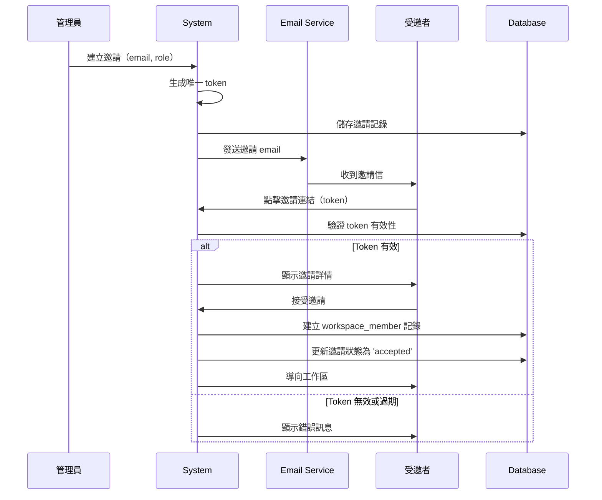

# SaaS 產品功能

## 概述

本文件詳細說明 ng-gighub 作為企業級 SaaS 產品的核心功能，包含邀請系統（Invitation System）、權限矩陣（Permission Matrix）、計費機制（Billing & Subscription）、使用量追蹤、以及租戶管理功能。

## 目錄

- [邀請系統](#邀請系統)
- [權限矩陣](#權限矩陣)
- [計費與訂閱](#計費與訂閱)
- [使用量追蹤](#使用量追蹤)
- [租戶管理](#租戶管理)

## 邀請系統

### 概念

邀請系統允許組織/團隊成員邀請新使用者加入工作區，支援：
- Email 邀請
- 邀請連結
- 權限預設
- 邀請過期
- 邀請取消

### 資料庫 Schema

```sql
CREATE TABLE invitations (
  -- 主鍵
  id uuid PRIMARY KEY DEFAULT gen_random_uuid(),
  
  -- 邀請資訊
  email text NOT NULL,
  token text UNIQUE NOT NULL,
  
  -- 邀請目標
  workspace_id uuid REFERENCES workspaces(id) ON DELETE CASCADE,
  organization_id uuid REFERENCES accounts(id) ON DELETE CASCADE,
  team_id uuid REFERENCES teams(id) ON DELETE CASCADE,
  
  -- 角色與權限
  role text NOT NULL CHECK (role IN ('owner', 'admin', 'member', 'viewer')),
  permissions jsonb DEFAULT '{}',
  
  -- 邀請者
  invited_by uuid NOT NULL REFERENCES accounts(id),
  invited_by_name text NOT NULL,
  
  -- 狀態
  status text NOT NULL DEFAULT 'pending'
    CHECK (status IN ('pending', 'accepted', 'declined', 'cancelled', 'expired')),
  
  -- 訊息
  message text,
  
  -- 時間
  created_at timestamptz NOT NULL DEFAULT now(),
  expires_at timestamptz NOT NULL DEFAULT (now() + interval '7 days'),
  accepted_at timestamptz,
  
  -- 回應
  response_note text
);

-- 索引
CREATE INDEX idx_invitations_email ON invitations(email) WHERE status = 'pending';
CREATE INDEX idx_invitations_workspace ON invitations(workspace_id);
CREATE INDEX idx_invitations_token ON invitations(token) WHERE status = 'pending';
CREATE INDEX idx_invitations_expires ON invitations(expires_at) WHERE status = 'pending';

-- RLS
ALTER TABLE invitations ENABLE ROW LEVEL SECURITY;

-- 工作區成員可查看邀請
CREATE POLICY "Workspace members can view invitations"
  ON invitations FOR SELECT
  USING (
    workspace_id IN (
      SELECT workspace_id FROM workspace_members
      WHERE account_id = auth.uid()
    )
  );

-- 管理員可建立邀請
CREATE POLICY "Admins can create invitations"
  ON invitations FOR INSERT
  WITH CHECK (
    workspace_id IN (
      SELECT workspace_id FROM workspace_members
      WHERE account_id = auth.uid()
        AND role IN ('owner', 'admin')
    )
  );
```

### 邀請流程



### 實作：邀請服務

```typescript
@Injectable({ providedIn: 'root' })
export class InvitationService {
  constructor(
    private supabase: SupabaseClient,
    private emailService: EmailService
  ) {}
  
  /**
   * 建立邀請
   */
  async createInvitation(params: {
    email: string;
    workspaceId: string;
    role: 'admin' | 'member' | 'viewer';
    invitedBy: string;
    message?: string;
  }): Promise<Result<Invitation, Error>> {
    // 1. 檢查是否已經是成員
    const existingMember = await this.checkExistingMember(
      params.email,
      params.workspaceId
    );
    
    if (existingMember) {
      return Result.fail(new Error('User is already a member'));
    }
    
    // 2. 檢查是否有待處理的邀請
    const pendingInvitation = await this.checkPendingInvitation(
      params.email,
      params.workspaceId
    );
    
    if (pendingInvitation) {
      return Result.fail(new Error('Invitation already sent'));
    }
    
    // 3. 生成唯一 token
    const token = this.generateToken();
    
    // 4. 建立邀請記錄
    const { data, error } = await this.supabase
      .from('invitations')
      .insert({
        email: params.email,
        token,
        workspace_id: params.workspaceId,
        role: params.role,
        invited_by: params.invitedBy,
        message: params.message,
        expires_at: this.getExpiryDate()
      })
      .select()
      .single();
    
    if (error) {
      return Result.fail(new Error(error.message));
    }
    
    // 5. 發送邀請 email
    await this.sendInvitationEmail(data);
    
    return Result.ok(data as Invitation);
  }
  
  /**
   * 接受邀請
   */
  async acceptInvitation(token: string): Promise<Result<void, Error>> {
    // 1. 查詢邀請
    const { data: invitation, error } = await this.supabase
      .from('invitations')
      .select('*')
      .eq('token', token)
      .eq('status', 'pending')
      .single();
    
    if (error || !invitation) {
      return Result.fail(new Error('Invitation not found'));
    }
    
    // 2. 檢查是否過期
    if (new Date(invitation.expires_at) < new Date()) {
      await this.updateInvitationStatus(invitation.id, 'expired');
      return Result.fail(new Error('Invitation expired'));
    }
    
    // 3. 建立成員記錄
    const { error: memberError } = await this.supabase
      .from('workspace_members')
      .insert({
        workspace_id: invitation.workspace_id,
        account_id: auth.uid(),
        role: invitation.role
      });
    
    if (memberError) {
      return Result.fail(new Error(memberError.message));
    }
    
    // 4. 更新邀請狀態
    await this.updateInvitationStatus(invitation.id, 'accepted');
    
    return Result.ok();
  }
  
  /**
   * 取消邀請
   */
  async cancelInvitation(invitationId: string): Promise<Result<void, Error>> {
    const { error } = await this.supabase
      .from('invitations')
      .update({ status: 'cancelled' })
      .eq('id', invitationId);
    
    if (error) {
      return Result.fail(new Error(error.message));
    }
    
    return Result.ok();
  }
  
  /**
   * 重新發送邀請
   */
  async resendInvitation(invitationId: string): Promise<Result<void, Error>> {
    // 更新過期時間並重新發送 email
    const { data, error } = await this.supabase
      .from('invitations')
      .update({
        expires_at: this.getExpiryDate()
      })
      .eq('id', invitationId)
      .select()
      .single();
    
    if (error) {
      return Result.fail(new Error(error.message));
    }
    
    await this.sendInvitationEmail(data);
    
    return Result.ok();
  }
  
  private generateToken(): string {
    return crypto.randomUUID();
  }
  
  private getExpiryDate(): string {
    const date = new Date();
    date.setDate(date.getDate() + 7); // 7 天後過期
    return date.toISOString();
  }
  
  private async sendInvitationEmail(invitation: any): Promise<void> {
    const invitationUrl = `${environment.appUrl}/invitations/accept/${invitation.token}`;
    
    await this.emailService.send({
      to: invitation.email,
      subject: 'You have been invited to join a workspace',
      template: 'invitation',
      data: {
        invitedBy: invitation.invited_by_name,
        workspaceName: invitation.workspace_name,
        role: invitation.role,
        message: invitation.message,
        invitationUrl,
        expiresAt: invitation.expires_at
      }
    });
  }
}
```

## 權限矩陣

### 概念

權限矩陣定義了不同角色在不同資源上的操作權限，是 RBAC 系統的核心。

### 角色定義

#### Workspace 角色

| 角色 | 說明 | 權限範圍 |
|------|------|----------|
| Owner | 擁有者 | 完全控制 |
| Admin | 管理員 | 管理成員、設定 |
| Member | 成員 | 讀寫資源 |
| Viewer | 瀏覽者 | 僅讀取 |

#### Organization 角色

| 角色 | 說明 | 權限範圍 |
|------|------|----------|
| Owner | 組織擁有者 | 完全控制、計費 |
| Admin | 組織管理員 | 管理團隊、成員 |
| Billing | 帳務管理 | 管理訂閱、發票 |
| Member | 組織成員 | 存取資源 |

#### Team 角色

| 角色 | 說明 | 權限範圍 |
|------|------|----------|
| Maintainer | 維護者 | 管理團隊資源 |
| Member | 團隊成員 | 讀寫團隊資源 |

### 權限矩陣表

```sql
CREATE TABLE permission_matrix (
  id uuid PRIMARY KEY DEFAULT gen_random_uuid(),
  
  -- 角色
  role text NOT NULL,
  
  -- 資源類型
  resource_type text NOT NULL, -- workspace, repository, team, etc.
  
  -- 操作權限
  can_create boolean DEFAULT false,
  can_read boolean DEFAULT false,
  can_update boolean DEFAULT false,
  can_delete boolean DEFAULT false,
  
  -- 管理權限
  can_manage_members boolean DEFAULT false,
  can_manage_settings boolean DEFAULT false,
  can_manage_permissions boolean DEFAULT false,
  
  -- 特殊權限
  custom_permissions jsonb DEFAULT '{}',
  
  -- 約束
  UNIQUE(role, resource_type)
);

-- 範例資料
INSERT INTO permission_matrix (role, resource_type, can_create, can_read, can_update, can_delete, can_manage_members, can_manage_settings)
VALUES
  -- Workspace Owner
  ('owner', 'workspace', true, true, true, true, true, true),
  ('owner', 'repository', true, true, true, true, true, true),
  ('owner', 'team', true, true, true, true, true, true),
  
  -- Workspace Admin
  ('admin', 'workspace', false, true, true, false, true, true),
  ('admin', 'repository', true, true, true, true, true, false),
  ('admin', 'team', true, true, true, true, true, false),
  
  -- Workspace Member
  ('member', 'workspace', false, true, false, false, false, false),
  ('member', 'repository', true, true, true, false, false, false),
  ('member', 'team', false, true, false, false, false, false),
  
  -- Workspace Viewer
  ('viewer', 'workspace', false, true, false, false, false, false),
  ('viewer', 'repository', false, true, false, false, false, false),
  ('viewer', 'team', false, true, false, false, false, false);
```

### 權限檢查服務

```typescript
@Injectable({ providedIn: 'root' })
export class PermissionMatrixService {
  private matrixCache = new Map<string, PermissionSet>();
  
  constructor(private supabase: SupabaseClient) {
    this.loadPermissionMatrix();
  }
  
  private async loadPermissionMatrix() {
    const { data } = await this.supabase
      .from('permission_matrix')
      .select('*');
    
    if (data) {
      data.forEach(row => {
        const key = `${row.role}:${row.resource_type}`;
        this.matrixCache.set(key, {
          canCreate: row.can_create,
          canRead: row.can_read,
          canUpdate: row.can_update,
          canDelete: row.can_delete,
          canManageMembers: row.can_manage_members,
          canManageSettings: row.can_manage_settings,
          canManagePermissions: row.can_manage_permissions
        });
      });
    }
  }
  
  /**
   * 檢查權限
   */
  can(
    role: string,
    resourceType: string,
    action: 'create' | 'read' | 'update' | 'delete' | 'manage_members' | 'manage_settings'
  ): boolean {
    const key = `${role}:${resourceType}`;
    const permissions = this.matrixCache.get(key);
    
    if (!permissions) {
      return false;
    }
    
    switch (action) {
      case 'create': return permissions.canCreate;
      case 'read': return permissions.canRead;
      case 'update': return permissions.canUpdate;
      case 'delete': return permissions.canDelete;
      case 'manage_members': return permissions.canManageMembers;
      case 'manage_settings': return permissions.canManageSettings;
      default: return false;
    }
  }
  
  /**
   * 取得角色的所有權限
   */
  getPermissions(role: string, resourceType: string): PermissionSet | null {
    const key = `${role}:${resourceType}`;
    return this.matrixCache.get(key) || null;
  }
}

interface PermissionSet {
  canCreate: boolean;
  canRead: boolean;
  canUpdate: boolean;
  canDelete: boolean;
  canManageMembers: boolean;
  canManageSettings: boolean;
  canManagePermissions: boolean;
}
```

### UI: 權限矩陣管理

```typescript
@Component({
  selector: 'app-permission-matrix',
  template: `
    <div class="permission-matrix">
      <h2>權限矩陣</h2>
      
      <table mat-table [dataSource]="matrix">
        <!-- 角色欄 -->
        <ng-container matColumnDef="role">
          <th mat-header-cell *matHeaderCellDef>角色</th>
          <td mat-cell *matCellDef="let row">{{ row.role }}</td>
        </ng-container>
        
        <!-- 資源類型欄 -->
        <ng-container matColumnDef="resourceType">
          <th mat-header-cell *matHeaderCellDef>資源</th>
          <td mat-cell *matCellDef="let row">{{ row.resourceType }}</td>
        </ng-container>
        
        <!-- 權限欄 -->
        <ng-container matColumnDef="create">
          <th mat-header-cell *matHeaderCellDef>建立</th>
          <td mat-cell *matCellDef="let row">
            <mat-icon [class.granted]="row.canCreate">
              {{ row.canCreate ? 'check' : 'close' }}
            </mat-icon>
          </td>
        </ng-container>
        
        <ng-container matColumnDef="read">
          <th mat-header-cell *matHeaderCellDef>讀取</th>
          <td mat-cell *matCellDef="let row">
            <mat-icon [class.granted]="row.canRead">
              {{ row.canRead ? 'check' : 'close' }}
            </mat-icon>
          </td>
        </ng-container>
        
        <!-- 更多權限欄... -->
        
        <tr mat-header-row *matHeaderRowDef="displayedColumns"></tr>
        <tr mat-row *matRowDef="let row; columns: displayedColumns;"></tr>
      </table>
    </div>
  `,
  standalone: true
})
export class PermissionMatrixComponent implements OnInit {
  matrix = signal<PermissionMatrixRow[]>([]);
  displayedColumns = ['role', 'resourceType', 'create', 'read', 'update', 'delete'];
  
  constructor(private permissionService: PermissionMatrixService) {}
  
  async ngOnInit() {
    await this.loadMatrix();
  }
  
  private async loadMatrix() {
    // 載入權限矩陣資料
  }
}
```

## 計費與訂閱

### 訂閱方案

```typescript
interface SubscriptionPlan {
  id: string;
  name: string;
  slug: 'free' | 'pro' | 'enterprise';
  price: {
    monthly: number;
    yearly: number;
    currency: string;
  };
  limits: {
    maxMembers: number;
    maxRepositories: number;
    maxStorage: number; // GB
    maxTeams: number;
  };
  features: string[];
}

const PLANS: SubscriptionPlan[] = [
  {
    id: 'plan_free',
    name: 'Free',
    slug: 'free',
    price: { monthly: 0, yearly: 0, currency: 'USD' },
    limits: {
      maxMembers: 3,
      maxRepositories: 5,
      maxStorage: 5,
      maxTeams: 0
    },
    features: [
      'Public repositories',
      '5GB storage',
      'Community support'
    ]
  },
  {
    id: 'plan_pro',
    name: 'Pro',
    slug: 'pro',
    price: { monthly: 29, yearly: 290, currency: 'USD' },
    limits: {
      maxMembers: 50,
      maxRepositories: -1, // unlimited
      maxStorage: 100,
      maxTeams: 10
    },
    features: [
      'Unlimited repositories',
      '100GB storage',
      'Priority support',
      'Advanced permissions',
      'Audit logs'
    ]
  },
  {
    id: 'plan_enterprise',
    name: 'Enterprise',
    slug: 'enterprise',
    price: { monthly: 99, yearly: 990, currency: 'USD' },
    limits: {
      maxMembers: -1,
      maxRepositories: -1,
      maxStorage: -1,
      maxTeams: -1
    },
    features: [
      'Everything in Pro',
      'Unlimited everything',
      '24/7 phone support',
      'SSO integration',
      'Custom contracts',
      'Dedicated account manager'
    ]
  }
];
```

### 資料庫 Schema

```sql
CREATE TABLE subscriptions (
  id uuid PRIMARY KEY DEFAULT gen_random_uuid(),
  
  -- 訂閱者
  organization_id uuid NOT NULL REFERENCES accounts(id),
  
  -- 方案
  plan_id text NOT NULL,
  plan_slug text NOT NULL CHECK (plan_slug IN ('free', 'pro', 'enterprise')),
  
  -- 狀態
  status text NOT NULL DEFAULT 'active'
    CHECK (status IN ('active', 'cancelled', 'past_due', 'unpaid', 'trialing')),
  
  -- 計費週期
  billing_cycle text NOT NULL CHECK (billing_cycle IN ('monthly', 'yearly')),
  
  -- 金額
  amount numeric(10, 2) NOT NULL,
  currency char(3) NOT NULL DEFAULT 'USD',
  
  -- Stripe 相關
  stripe_subscription_id text UNIQUE,
  stripe_customer_id text,
  
  -- 時間
  current_period_start timestamptz NOT NULL,
  current_period_end timestamptz NOT NULL,
  trial_end timestamptz,
  cancelled_at timestamptz,
  
  created_at timestamptz NOT NULL DEFAULT now(),
  updated_at timestamptz NOT NULL DEFAULT now()
);

-- 發票表
CREATE TABLE invoices (
  id uuid PRIMARY KEY DEFAULT gen_random_uuid(),
  
  subscription_id uuid REFERENCES subscriptions(id),
  organization_id uuid NOT NULL REFERENCES accounts(id),
  
  -- 發票資訊
  invoice_number text UNIQUE NOT NULL,
  amount numeric(10, 2) NOT NULL,
  tax numeric(10, 2) DEFAULT 0,
  total numeric(10, 2) NOT NULL,
  currency char(3) NOT NULL DEFAULT 'USD',
  
  -- 狀態
  status text NOT NULL CHECK (status IN ('draft', 'open', 'paid', 'void', 'uncollectible')),
  
  -- Stripe
  stripe_invoice_id text UNIQUE,
  stripe_payment_intent_id text,
  
  -- 時間
  period_start timestamptz NOT NULL,
  period_end timestamptz NOT NULL,
  due_date timestamptz,
  paid_at timestamptz,
  
  created_at timestamptz NOT NULL DEFAULT now()
);
```

### Stripe 整合

```typescript
@Injectable({ providedIn: 'root' })
export class StripeService {
  constructor(private supabase: SupabaseClient) {}
  
  /**
   * 建立訂閱
   */
  async createSubscription(params: {
    organizationId: string;
    planSlug: 'pro' | 'enterprise';
    billingCycle: 'monthly' | 'yearly';
  }): Promise<Result<Subscription, Error>> {
    // 呼叫 Edge Function 處理 Stripe 訂閱
    const { data, error } = await this.supabase.functions.invoke(
      'create-subscription',
      {
        body: params
      }
    );
    
    if (error) {
      return Result.fail(new Error(error.message));
    }
    
    return Result.ok(data);
  }
  
  /**
   * 取消訂閱
   */
  async cancelSubscription(subscriptionId: string): Promise<Result<void, Error>> {
    const { error } = await this.supabase.functions.invoke(
      'cancel-subscription',
      {
        body: { subscriptionId }
      }
    );
    
    if (error) {
      return Result.fail(new Error(error.message));
    }
    
    return Result.ok();
  }
  
  /**
   * 更新付款方式
   */
  async updatePaymentMethod(
    customerId: string,
    paymentMethodId: string
  ): Promise<Result<void, Error>> {
    const { error } = await this.supabase.functions.invoke(
      'update-payment-method',
      {
        body: { customerId, paymentMethodId }
      }
    );
    
    if (error) {
      return Result.fail(new Error(error.message));
    }
    
    return Result.ok();
  }
}
```

### Edge Function: 建立訂閱

```typescript
// supabase/functions/create-subscription/index.ts
import Stripe from 'stripe';

const stripe = new Stripe(Deno.env.get('STRIPE_SECRET_KEY')!, {
  apiVersion: '2024-04-10'
});

Deno.serve(async (req) => {
  try {
    const { organizationId, planSlug, billingCycle } = await req.json();
    
    // 1. 取得或建立 Stripe Customer
    const customer = await getOrCreateCustomer(organizationId);
    
    // 2. 取得價格 ID
    const priceId = getPriceId(planSlug, billingCycle);
    
    // 3. 建立訂閱
    const subscription = await stripe.subscriptions.create({
      customer: customer.id,
      items: [{ price: priceId }],
      payment_behavior: 'default_incomplete',
      expand: ['latest_invoice.payment_intent']
    });
    
    // 4. 儲存到資料庫
    await saveSubscriptionToDatabase(subscription, organizationId);
    
    return new Response(
      JSON.stringify({ subscription }),
      { headers: { 'Content-Type': 'application/json' } }
    );
  } catch (error) {
    return new Response(
      JSON.stringify({ error: error.message }),
      { status: 400, headers: { 'Content-Type': 'application/json' } }
    );
  }
});
```

## 使用量追蹤

### 資料庫 Schema

```sql
CREATE TABLE usage_metrics (
  id uuid PRIMARY KEY DEFAULT gen_random_uuid(),
  
  organization_id uuid NOT NULL REFERENCES accounts(id),
  
  -- 指標
  metric_name text NOT NULL, -- members, repositories, storage, api_calls, etc.
  metric_value bigint NOT NULL,
  
  -- 時間
  period_start timestamptz NOT NULL,
  period_end timestamptz NOT NULL,
  recorded_at timestamptz NOT NULL DEFAULT now(),
  
  -- 索引
  UNIQUE(organization_id, metric_name, period_start)
);

-- 分區（按月）
CREATE TABLE usage_metrics_partitioned (
  LIKE usage_metrics INCLUDING ALL
) PARTITION BY RANGE (recorded_at);
```

### 使用量追蹤服務

```typescript
@Injectable({ providedIn: 'root' })
export class UsageTrackingService {
  async trackUsage(params: {
    organizationId: string;
    metricName: string;
    value: number;
  }): Promise<void> {
    await this.supabase.from('usage_metrics').insert({
      organization_id: params.organizationId,
      metric_name: params.metricName,
      metric_value: params.value,
      period_start: this.getPeriodStart(),
      period_end: this.getPeriodEnd()
    });
  }
  
  async checkLimit(
    organizationId: string,
    metricName: string
  ): Promise<{ current: number; limit: number; exceeded: boolean }> {
    // 取得當前使用量
    const current = await this.getCurrentUsage(organizationId, metricName);
    
    // 取得訂閱限制
    const limit = await this.getLimit(organizationId, metricName);
    
    return {
      current,
      limit,
      exceeded: limit > 0 && current >= limit
    };
  }
}
```

## 租戶管理

### 租戶設定

```sql
CREATE TABLE tenant_settings (
  id uuid PRIMARY KEY DEFAULT gen_random_uuid(),
  
  organization_id uuid UNIQUE NOT NULL REFERENCES accounts(id),
  
  -- 功能開關
  features jsonb DEFAULT '{
    "advanced_permissions": false,
    "sso": false,
    "audit_logs": false,
    "custom_branding": false
  }',
  
  -- 配額
  quotas jsonb DEFAULT '{
    "max_members": 3,
    "max_repositories": 5,
    "max_storage_gb": 5,
    "max_teams": 0
  }',
  
  -- 自訂設定
  custom_settings jsonb DEFAULT '{}',
  
  updated_at timestamptz NOT NULL DEFAULT now()
);
```

## 相關文件

- [認證與令牌管理](./authentication.md)
- [授權與權限管理](./authorization.md)
- [多租戶架構](./multi-tenancy.md)
- [可觀察性](./observability.md)

---

**最後更新**: 2025-11-22  
**維護者**: Development Team  
**版本**: 1.0.0
