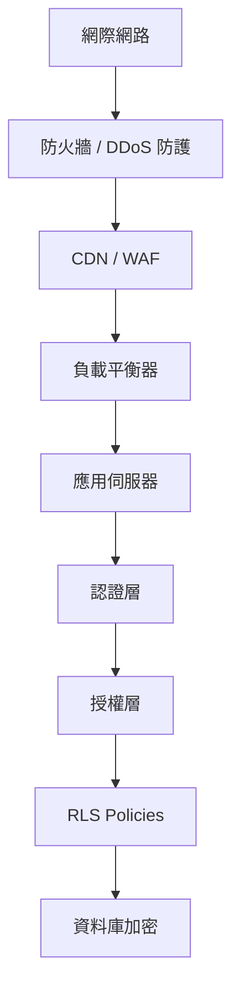

# 安全最佳實踐

## 概述

本文件詳細說明 ng-gighub 專案的安全最佳實踐，涵蓋 OWASP Top 10 防護、資料加密、API 安全、審計日誌，以及安全開發流程。

## 目錄

- [安全架構原則](#安全架構原則)
- [OWASP Top 10 防護](#owasp-top-10-防護)
- [認證安全](#認證安全)
- [授權安全](#授權安全)
- [資料加密](#資料加密)
- [API 安全](#api-安全)
- [前端安全](#前端安全)
- [資料庫安全](#資料庫安全)
- [審計與監控](#審計與監控)
- [安全開發流程](#安全開發流程)

## 安全架構原則

### 1. 深度防禦 (Defense in Depth)

實施多層安全控制，即使某一層被突破，其他層仍能提供保護：



### 2. 最小權限原則 (Principle of Least Privilege)

- 使用者只獲得執行任務所需的最小權限
- 服務帳號使用受限權限
- 定期審查與撤銷不必要的權限

### 3. 預設拒絕 (Deny by Default)

- 除非明確允許，否則拒絕所有存取
- RLS Policy: 預設拒絕所有操作
- API: 預設要求認證

### 4. 故障安全 (Fail Secure)

- 系統故障時保持安全狀態
- 錯誤訊息不洩漏敏感資訊
- 認證失敗時記錄日誌

## OWASP Top 10 防護

### 1. Broken Access Control (存取控制失效)

#### 防護措施

**後端防護：**
```typescript
// 檢查使用者是否有權限存取資源
async checkAccess(userId: string, resourceId: string, action: string) {
  // 1. 驗證使用者身份
  if (!userId) {
    throw new UnauthorizedException('User not authenticated');
  }

  // 2. 檢查權限
  const hasPermission = await this.permissionService.check(
    userId,
    resourceId,
    action
  );

  if (!hasPermission) {
    // 記錄未授權存取嘗試
    await this.auditService.log({
      event: 'unauthorized_access_attempt',
      userId,
      resourceId,
      action,
      timestamp: new Date()
    });

    throw new ForbiddenException('Access denied');
  }

  return true;
}
```

**RLS 防護：**
```sql
-- 所有表啟用 RLS
ALTER TABLE repositories ENABLE ROW LEVEL SECURITY;

-- 預設拒絕所有操作
CREATE POLICY "deny_all_by_default"
  ON repositories
  AS RESTRICTIVE
  FOR ALL
  USING (false);

-- 明確授權特定操作
CREATE POLICY "allow_read_with_permission"
  ON repositories
  FOR SELECT
  USING (
    -- 實作存取控制邏輯
  );
```

### 2. Cryptographic Failures (加密失敗)

#### 防護措施

**傳輸加密：**
```typescript
// 強制 HTTPS
export const securityHeaders = {
  'Strict-Transport-Security': 'max-age=31536000; includeSubDomains',
  'Content-Security-Policy': "upgrade-insecure-requests"
};
```

**儲存加密：**
```sql
-- 使用 pgcrypto 加密敏感資料
CREATE EXTENSION IF NOT EXISTS pgcrypto;

-- 加密欄位
CREATE TABLE sensitive_data (
  id uuid PRIMARY KEY,
  encrypted_value bytea, -- 使用 pgp_sym_encrypt 加密
  created_at timestamptz DEFAULT now()
);

-- 加密函數
CREATE OR REPLACE FUNCTION encrypt_sensitive_data(plain_text text, secret text)
RETURNS bytea
LANGUAGE sql
AS $$
  SELECT pgp_sym_encrypt(plain_text, secret);
$$;

-- 解密函數
CREATE OR REPLACE FUNCTION decrypt_sensitive_data(encrypted_data bytea, secret text)
RETURNS text
LANGUAGE sql
AS $$
  SELECT pgp_sym_decrypt(encrypted_data, secret);
$$;
```

### 3. Injection (注入攻擊)

#### SQL Injection 防護

**使用參數化查詢：**
```typescript
// ✅ 正確：使用參數化查詢
async getRepository(id: string) {
  const { data } = await this.supabase
    .from('repositories')
    .select('*')
    .eq('id', id) // 參數化
    .single();
  
  return data;
}

// ❌ 錯誤：字串拼接
async getRepositoryUnsafe(id: string) {
  // 絕對不要這樣做！
  const query = `SELECT * FROM repositories WHERE id = '${id}'`;
  // 容易受到 SQL Injection 攻擊
}
```

#### XSS 防護

**Angular 內建防護：**
```typescript
// Angular 預設會對插值進行消毒
// ✅ 安全：Angular 會自動轉義
<div>{{ userInput }}</div>

// ⚠️ 危險：繞過消毒
<div [innerHTML]="userInput"></div> // 避免使用

// ✅ 需要時使用 DomSanitizer
constructor(private sanitizer: DomSanitizer) {}

getSafeHtml(html: string) {
  return this.sanitizer.sanitize(SecurityContext.HTML, html);
}
```

**Content Security Policy (CSP)：**
```typescript
// server.ts - 設定 CSP 標頭
app.use((req, res, next) => {
  res.setHeader(
    'Content-Security-Policy',
    [
      "default-src 'self'",
      "script-src 'self' 'unsafe-inline' https://trusted-cdn.com",
      "style-src 'self' 'unsafe-inline'",
      "img-src 'self' data: https:",
      "font-src 'self' data:",
      "connect-src 'self' https://api.supabase.co",
      "frame-ancestors 'none'",
      "base-uri 'self'",
      "form-action 'self'"
    ].join('; ')
  );
  next();
});
```

### 4. Insecure Design (不安全的設計)

#### 威脅建模

在設計階段識別潛在威脅：

```typescript
interface ThreatModel {
  asset: string; // 資產（資料、功能）
  threats: Threat[]; // 威脅
  vulnerabilities: string[]; // 弱點
  controls: Control[]; // 控制措施
  residualRisk: RiskLevel; // 殘餘風險
}

interface Threat {
  id: string;
  description: string;
  likelihood: 'low' | 'medium' | 'high';
  impact: 'low' | 'medium' | 'high';
  mitigations: string[];
}
```

### 5. Security Misconfiguration (安全配置錯誤)

#### 安全標頭配置

```typescript
// security-headers.ts
export const securityHeaders = {
  // HTTPS 強制
  'Strict-Transport-Security': 'max-age=31536000; includeSubDomains; preload',
  
  // XSS 防護
  'X-Content-Type-Options': 'nosniff',
  'X-Frame-Options': 'DENY',
  'X-XSS-Protection': '1; mode=block',
  
  // CSP
  'Content-Security-Policy': "default-src 'self'; ...",
  
  // Referrer Policy
  'Referrer-Policy': 'strict-origin-when-cross-origin',
  
  // Permissions Policy
  'Permissions-Policy': 'geolocation=(), microphone=(), camera=()'
};
```

#### 環境變數管理

```typescript
// ✅ 正確：使用環境變數
export const environment = {
  production: true,
  supabaseUrl: process.env['SUPABASE_URL'],
  supabaseAnonKey: process.env['SUPABASE_ANON_KEY']
};

// ❌ 錯誤：硬編碼敏感資訊
export const environment = {
  supabaseUrl: 'https://xxx.supabase.co', // 不要這樣做
  supabaseAnonKey: 'eyJhbGc...' // 不要這樣做
};
```

### 6. Vulnerable and Outdated Components (易受攻擊和過時的組件)

#### 依賴管理

```bash
# 定期檢查漏洞
npm audit

# 修復漏洞
npm audit fix

# 更新依賴
npm update

# 使用 Dependabot 自動更新
```

```yaml
# .github/dependabot.yml
version: 2
updates:
  - package-ecosystem: "npm"
    directory: "/"
    schedule:
      interval: "weekly"
    open-pull-requests-limit: 10
```

### 7. Identification and Authentication Failures (識別和認證失敗)

參考 [認證與令牌管理](./authentication.md) 文件。

### 8. Software and Data Integrity Failures (軟體和資料完整性失敗)

#### 檔案上傳驗證

```typescript
async validateFileUpload(file: File): Promise<void> {
  // 1. 檢查檔案大小
  const MAX_SIZE = 10 * 1024 * 1024; // 10MB
  if (file.size > MAX_SIZE) {
    throw new Error('File too large');
  }

  // 2. 檢查檔案類型
  const ALLOWED_TYPES = ['image/jpeg', 'image/png', 'application/pdf'];
  if (!ALLOWED_TYPES.includes(file.type)) {
    throw new Error('Invalid file type');
  }

  // 3. 檢查檔案內容（Magic Numbers）
  const buffer = await file.arrayBuffer();
  const isValidType = await this.verifyFileType(buffer, file.type);
  
  if (!isValidType) {
    throw new Error('File content does not match declared type');
  }

  // 4. 掃描惡意軟體（若有整合）
  // await this.antivirusService.scan(file);
}
```

### 9. Security Logging and Monitoring Failures (安全日誌和監控失敗)

參考 [審計與監控](#審計與監控) 章節。

### 10. Server-Side Request Forgery (SSRF)

#### SSRF 防護

```typescript
// URL 驗證
async validateUrl(url: string): Promise<boolean> {
  try {
    const parsedUrl = new URL(url);
    
    // 1. 只允許特定協議
    if (!['http:', 'https:'].includes(parsedUrl.protocol)) {
      return false;
    }

    // 2. 封鎖內部 IP
    const hostname = parsedUrl.hostname;
    
    // 封鎖 localhost
    if (['localhost', '127.0.0.1', '::1'].includes(hostname)) {
      return false;
    }

    // 封鎖私有 IP 範圍
    const privateIpRanges = [
      /^10\./,
      /^172\.(1[6-9]|2[0-9]|3[0-1])\./,
      /^192\.168\./,
      /^169\.254\./, // Link-local
      /^fe80:/ // IPv6 link-local
    ];

    if (privateIpRanges.some(range => range.test(hostname))) {
      return false;
    }

    return true;
  } catch {
    return false;
  }
}
```

## 認證安全

詳細內容請參考 [認證與令牌管理](./authentication.md)。

### 密碼政策

```typescript
interface PasswordPolicy {
  minLength: 8;
  requireUppercase: true;
  requireLowercase: true;
  requireNumbers: true;
  requireSpecialChars: true;
  preventCommonPasswords: true;
  preventUserInfoInPassword: true;
}

function validatePassword(password: string, policy: PasswordPolicy): boolean {
  // 實作密碼驗證邏輯
}
```

### Rate Limiting

```typescript
// 登入嘗試限制
const LOGIN_ATTEMPTS_LIMIT = 5;
const LOCKOUT_DURATION = 15 * 60 * 1000; // 15 minutes

async checkRateLimit(identifier: string): Promise<void> {
  const key = `rate_limit:login:${identifier}`;
  const attempts = await this.redis.incr(key);
  
  if (attempts === 1) {
    await this.redis.expire(key, 60); // 1 minute window
  }

  if (attempts > LOGIN_ATTEMPTS_LIMIT) {
    await this.redis.expire(key, LOCKOUT_DURATION / 1000);
    throw new TooManyRequestsException(
      `Too many login attempts. Please try again later.`
    );
  }
}
```

## 授權安全

詳細內容請參考 [授權與權限管理](./authorization.md)。

## 資料加密

### 傳輸中加密 (Encryption in Transit)

```typescript
// 強制 HTTPS
if (req.protocol !== 'https' && process.env.NODE_ENV === 'production') {
  return res.redirect(`https://${req.headers.host}${req.url}`);
}
```

### 靜態加密 (Encryption at Rest)

```sql
-- 加密敏感欄位
CREATE TABLE users (
  id uuid PRIMARY KEY,
  email text,
  encrypted_ssn bytea, -- 加密的社會安全號碼
  created_at timestamptz DEFAULT now()
);

-- 加密函數
CREATE OR REPLACE FUNCTION encrypt_field(plain_text text)
RETURNS bytea
LANGUAGE plpgsql
AS $$
DECLARE
  encryption_key text;
BEGIN
  -- 從環境變數或安全存儲取得金鑰
  encryption_key := current_setting('app.encryption_key');
  RETURN pgp_sym_encrypt(plain_text, encryption_key);
END;
$$;
```

## API 安全

### API 認證

```typescript
// API Key 驗證
@Injectable()
export class ApiKeyGuard implements CanActivate {
  async canActivate(context: ExecutionContext): Promise<boolean> {
    const request = context.switchToHttp().getRequest();
    const apiKey = request.headers['x-api-key'];

    if (!apiKey) {
      throw new UnauthorizedException('API key required');
    }

    const isValid = await this.apiKeyService.validate(apiKey);

    if (!isValid) {
      throw new UnauthorizedException('Invalid API key');
    }

    return true;
  }
}
```

### Rate Limiting

```typescript
// API Rate Limiting
@Injectable()
export class ApiRateLimitGuard implements CanActivate {
  private readonly limits = {
    free: { requests: 100, window: 3600 }, // 100 requests per hour
    pro: { requests: 1000, window: 3600 },
    enterprise: { requests: 10000, window: 3600 }
  };

  async canActivate(context: ExecutionContext): Promise<boolean> {
    const request = context.switchToHttp().getRequest();
    const userId = request.user?.id;
    const userPlan = await this.getUserPlan(userId);

    const limit = this.limits[userPlan];
    const key = `rate_limit:api:${userId}`;

    const current = await this.redis.incr(key);
    
    if (current === 1) {
      await this.redis.expire(key, limit.window);
    }

    if (current > limit.requests) {
      throw new TooManyRequestsException(
        `Rate limit exceeded. Limit: ${limit.requests} requests per ${limit.window} seconds`
      );
    }

    // 在回應標頭中返回限制資訊
    const response = context.switchToHttp().getResponse();
    response.setHeader('X-RateLimit-Limit', limit.requests);
    response.setHeader('X-RateLimit-Remaining', limit.requests - current);
    response.setHeader('X-RateLimit-Reset', Date.now() + limit.window * 1000);

    return true;
  }
}
```

### Input Validation

```typescript
// DTO 驗證
import { IsString, IsEmail, MinLength, MaxLength } from 'class-validator';

export class CreateUserDto {
  @IsString()
  @MinLength(3)
  @MaxLength(50)
  username: string;

  @IsEmail()
  email: string;

  @IsString()
  @MinLength(8)
  @MaxLength(100)
  password: string;
}

// 使用
@Post('users')
async createUser(@Body(ValidationPipe) dto: CreateUserDto) {
  return await this.userService.create(dto);
}
```

## 前端安全

### XSS 防護

```typescript
// 使用 Angular 的 DomSanitizer
import { DomSanitizer, SafeHtml } from '@angular/platform-browser';

@Component({
  selector: 'app-content',
  template: '<div [innerHTML]="safeContent"></div>'
})
export class ContentComponent {
  safeContent: SafeHtml;

  constructor(private sanitizer: DomSanitizer) {
    const userInput = '<script>alert("XSS")</script>';
    
    // 消毒使用者輸入
    this.safeContent = this.sanitizer.sanitize(
      SecurityContext.HTML,
      userInput
    ) || '';
  }
}
```

### CSRF 防護

```typescript
// HTTP Interceptor 加入 CSRF Token
@Injectable()
export class CsrfInterceptor implements HttpInterceptor {
  intercept(req: HttpRequest<any>, next: HttpHandler): Observable<HttpEvent<any>> {
    // 從 Cookie 讀取 CSRF Token
    const csrfToken = this.getCsrfTokenFromCookie();

    if (csrfToken && this.isStateMutatingRequest(req)) {
      req = req.clone({
        setHeaders: {
          'X-CSRF-Token': csrfToken
        }
      });
    }

    return next.handle(req);
  }

  private isStateMutatingRequest(req: HttpRequest<any>): boolean {
    return ['POST', 'PUT', 'DELETE', 'PATCH'].includes(req.method);
  }

  private getCsrfTokenFromCookie(): string | null {
    // 實作從 Cookie 讀取邏輯
    return null;
  }
}
```

## 資料庫安全

### RLS Policies

詳細內容請參考 [授權與權限管理](./authorization.md)。

### 連線安全

```typescript
// 使用 SSL 連線
export const dbConfig = {
  host: process.env.DB_HOST,
  port: 5432,
  database: process.env.DB_NAME,
  user: process.env.DB_USER,
  password: process.env.DB_PASSWORD,
  ssl: {
    rejectUnauthorized: true,
    ca: fs.readFileSync('/path/to/ca-certificate.crt').toString()
  }
};
```

### 最小權限原則

```sql
-- 建立應用程式專用角色
CREATE ROLE app_user WITH LOGIN PASSWORD 'secure_password';

-- 只授予必要權限
GRANT CONNECT ON DATABASE mydb TO app_user;
GRANT USAGE ON SCHEMA public TO app_user;
GRANT SELECT, INSERT, UPDATE ON TABLE users TO app_user;

-- 撤銷不必要權限
REVOKE DELETE ON TABLE users FROM app_user;
```

## 審計與監控

### 審計日誌

```sql
-- 審計日誌表
CREATE TABLE audit_logs (
  id uuid PRIMARY KEY DEFAULT gen_random_uuid(),
  user_id uuid REFERENCES auth.users(id),
  event_type text NOT NULL,
  resource_type text,
  resource_id uuid,
  action text NOT NULL,
  ip_address inet,
  user_agent text,
  request_id text,
  success boolean NOT NULL,
  error_message text,
  metadata jsonb DEFAULT '{}',
  created_at timestamptz DEFAULT now()
);

-- 索引
CREATE INDEX idx_audit_logs_user ON audit_logs(user_id);
CREATE INDEX idx_audit_logs_event ON audit_logs(event_type);
CREATE INDEX idx_audit_logs_resource ON audit_logs(resource_type, resource_id);
CREATE INDEX idx_audit_logs_timestamp ON audit_logs(created_at);

-- RLS Policy
ALTER TABLE audit_logs ENABLE ROW LEVEL SECURITY;

CREATE POLICY "Users can view their own audit logs"
  ON audit_logs
  FOR SELECT
  USING (user_id = auth.uid());
```

### 記錄關鍵事件

```typescript
@Injectable()
export class AuditService {
  async log(event: AuditEvent): Promise<void> {
    await this.supabase.from('audit_logs').insert({
      user_id: event.userId,
      event_type: event.eventType,
      resource_type: event.resourceType,
      resource_id: event.resourceId,
      action: event.action,
      ip_address: event.ipAddress,
      user_agent: event.userAgent,
      success: event.success,
      error_message: event.errorMessage,
      metadata: event.metadata
    });
  }

  // 記錄認證事件
  async logAuthEvent(event: AuthEvent) {
    await this.log({
      eventType: event.type, // 'login', 'logout', 'password_change'
      userId: event.userId,
      action: event.action,
      ipAddress: event.ipAddress,
      userAgent: event.userAgent,
      success: event.success,
      errorMessage: event.error
    });
  }

  // 記錄資料存取事件
  async logDataAccess(event: DataAccessEvent) {
    await this.log({
      eventType: 'data_access',
      userId: event.userId,
      resourceType: event.resourceType,
      resourceId: event.resourceId,
      action: event.action, // 'read', 'create', 'update', 'delete'
      success: event.success
    });
  }
}
```

### 異常檢測

```typescript
// 檢測異常行為
async detectAnomalies(userId: string): Promise<Anomaly[]> {
  const anomalies: Anomaly[] = [];

  // 1. 檢查異常登入地點
  const recentLogins = await this.getRecentLogins(userId, 24);
  const locations = recentLogins.map(l => l.location);
  const uniqueLocations = new Set(locations);
  
  if (uniqueLocations.size > 3) {
    anomalies.push({
      type: 'suspicious_location',
      severity: 'medium',
      message: 'Login from multiple locations in short time'
    });
  }

  // 2. 檢查失敗登入嘗試
  const failedAttempts = await this.getFailedLoginAttempts(userId, 1);
  
  if (failedAttempts > 5) {
    anomalies.push({
      type: 'brute_force_attempt',
      severity: 'high',
      message: 'Multiple failed login attempts detected'
    });
  }

  // 3. 檢查異常資料存取
  const dataAccess = await this.getDataAccessPatterns(userId, 24);
  const avgAccess = this.calculateAverage(dataAccess);
  const currentAccess = dataAccess[dataAccess.length - 1];
  
  if (currentAccess > avgAccess * 5) {
    anomalies.push({
      type: 'unusual_data_access',
      severity: 'high',
      message: 'Unusual spike in data access detected'
    });
  }

  return anomalies;
}
```

## 安全開發流程

### 1. 需求階段

- [ ] 識別敏感資料
- [ ] 定義安全需求
- [ ] 進行威脅建模
- [ ] 定義隱私需求

### 2. 設計階段

- [ ] 安全架構設計
- [ ] 資料流圖
- [ ] 信任邊界定義
- [ ] 安全控制設計

### 3. 開發階段

- [ ] 安全編碼實踐
- [ ] 程式碼審查
- [ ] 靜態程式碼分析
- [ ] 依賴漏洞掃描

### 4. 測試階段

- [ ] 安全測試
- [ ] 滲透測試
- [ ] 漏洞評估
- [ ] 合規性測試

### 5. 部署階段

- [ ] 安全配置檢查
- [ ] 環境變數管理
- [ ] 存取控制驗證
- [ ] 監控與告警設定

### 6. 維護階段

- [ ] 定期安全審查
- [ ] 漏洞修補
- [ ] 日誌監控
- [ ] 事件回應

## 安全檢查清單

### 開發前

- [ ] 了解安全需求與威脅
- [ ] 設計安全控制措施
- [ ] 選擇安全的依賴套件

### 開發中

- [ ] 使用參數化查詢
- [ ] 驗證所有使用者輸入
- [ ] 實作適當的錯誤處理
- [ ] 避免硬編碼敏感資訊
- [ ] 使用安全的加密演算法

### 程式碼審查

- [ ] 檢查存取控制
- [ ] 檢查注入漏洞
- [ ] 檢查加密使用
- [ ] 檢查錯誤處理
- [ ] 檢查日誌記錄

### 部署前

- [ ] 更新所有依賴
- [ ] 掃描已知漏洞
- [ ] 配置安全標頭
- [ ] 啟用 HTTPS
- [ ] 設定監控與告警

## 相關文件

- [認證與令牌管理](./authentication.md)
- [授權與權限管理](./authorization.md)
- [角色系統 (RBAC)](./role-based-access-control.md)
- [多租戶架構](./multi-tenancy.md)
- [系統基礎設施概覽](./overview.md)

## 總結

ng-gighub 的安全策略採用：

- **深度防禦**: 多層安全控制
- **OWASP Top 10 防護**: 覆蓋常見漏洞
- **認證安全**: JWT + MFA + Rate Limiting
- **授權安全**: RLS + RBAC + ABAC
- **資料加密**: 傳輸與靜態加密
- **審計監控**: 完整的日誌與異常檢測

透過完善的安全實踐，確保系統符合企業級 SaaS 的安全要求。

---
**最後更新**: 2025-11-22  
**維護者**: Development Team  
**版本**: 1.0.0
