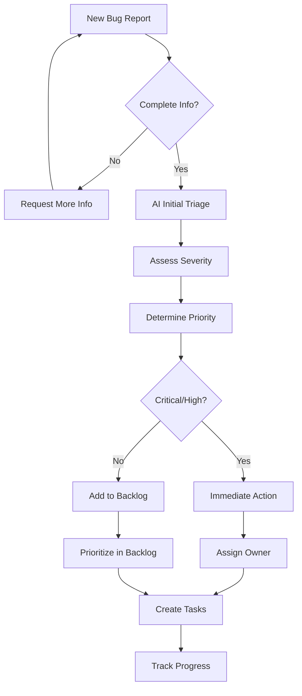

# AI Agent Bug Triage Prompts

## Overview
This document provides prompt templates for AI agents to effectively triage, categorize, prioritize, and create actionable tasks from bug reports.

## Bug Triage Objectives

### Primary Goals
1. Assess bug severity and priority
2. Identify root cause or potential causes
3. Determine affected components
4. Suggest investigation steps
5. Create actionable fix tasks
6. Estimate effort required

## Prompt Templates

### Template 1: Initial Bug Triage

```
You are a technical lead performing initial bug triage.

BUG REPORT:
Title: {bug_title}
Reporter: {reporter_name}
Date: {report_date}
Environment: {environment}

Description:
{bug_description}

Steps to Reproduce:
{reproduction_steps}

Expected Behavior:
{expected_behavior}

Actual Behavior:
{actual_behavior}

Additional Context:
{additional_info}

Please provide:
1. Severity Assessment: [CRITICAL/HIGH/MEDIUM/LOW]
2. Priority Recommendation: [P0/P1/P2/P3/P4]
3. Category: [Bug/Feature Request/Enhancement/Documentation]
4. Affected Components: List components/files likely involved
5. Initial Analysis: Potential root causes
6. Reproducibility: [ALWAYS/SOMETIMES/RARE/CANNOT_REPRODUCE]
7. User Impact: Description of impact on users
8. Suggested Labels: List of labels to apply
9. Recommended Action: Next steps
10. Assigned To: Suggested team or individual

Provide reasoning for severity and priority assessments.
```

### Template 2: Root Cause Analysis

```
You are a debugging expert analyzing a bug for root cause.

BUG DETAILS:
{bug_description}

ERROR LOGS:
{error_logs}

STACK TRACE:
{stack_trace}

AFFECTED CODE (if available):
{code_snippet}

RECENT CHANGES:
{recent_commits}

Perform root cause analysis:

1. Error Analysis
   - Parse error messages
   - Identify error patterns
   - Check for common causes

2. Code Path Analysis
   - Trace execution flow
   - Identify failure point
   - Check data transformations

3. Environmental Factors
   - Browser/OS specific?
   - Timing issues?
   - State dependencies?

4. Similar Issues
   - Reference past similar bugs
   - Check known issues
   - Review related tickets

Provide:
- Most Likely Root Cause: [with confidence level]
- Alternative Hypotheses: Other possible causes
- Investigation Steps: How to confirm root cause
- Quick Fix vs Proper Fix: Trade-offs
- Prevention Strategy: How to prevent similar bugs
```

### Template 3: Bug Categorization and Labeling

```
You are a bug classification expert.

BUG REPORT:
{bug_report}

Categorize this bug across multiple dimensions:

1. Type Classification
   - [ ] Functional Bug
   - [ ] Performance Issue
   - [ ] Security Vulnerability
   - [ ] UI/UX Issue
   - [ ] Data Integrity Issue
   - [ ] Integration Issue
   - [ ] Documentation Issue

2. Component Classification
   - Affected Module: {module_name}
   - Affected Layer: [Frontend/Backend/Database/Infrastructure]
   - Affected Feature: {feature_name}

3. Behavior Classification
   - [ ] Regression (previously worked)
   - [ ] Never Worked
   - [ ] Edge Case
   - [ ] Race Condition
   - [ ] Configuration Issue

4. Impact Classification
   - User Impact: [None/Minor/Major/Blocking]
   - Data Impact: [None/Display/Integrity/Loss]
   - System Impact: [None/Performance/Availability/Security]

5. Complexity Classification
   - Investigation Effort: [Low/Medium/High]
   - Fix Complexity: [Simple/Moderate/Complex]
   - Testing Effort: [Low/Medium/High]

Based on classification, suggest:
- Appropriate labels
- Target sprint/milestone
- Required expertise
- Testing requirements
```

### Template 4: Priority Scoring

```
You are helping determine bug priority using a scoring matrix.

BUG REPORT:
{bug_report}

Score the bug on these dimensions (0-10 scale):

1. Severity Score (0-10)
   - Impact on functionality
   - Data loss risk
   - Security implications
   - Performance impact

2. Frequency Score (0-10)
   - How often does it occur?
   - How many users affected?
   - Is it increasing?

3. Urgency Score (0-10)
   - Business impact
   - Customer complaints
   - Contractual obligations
   - Competitor advantage

4. Workaround Score (0-10)
   - Is there a workaround?
   - How easy is the workaround?
   - Does workaround have side effects?

Calculate:
- Total Priority Score: (Severity × 0.4) + (Frequency × 0.3) + (Urgency × 0.2) + (Workaround × 0.1)
- Priority Level: Based on score ranges
  - 8-10: P0 (Critical - Drop everything)
  - 6-7.9: P1 (High - Fix this sprint)
  - 4-5.9: P2 (Medium - Fix soon)
  - 2-3.9: P3 (Low - Backlog)
  - 0-1.9: P4 (Nice to have)

Provide:
- Detailed scoring breakdown
- Priority recommendation
- Justification
- SLA expectations
```

### Template 5: Bug to Task Conversion

```
You are creating actionable tasks from a bug report.

BUG:
{bug_details}

ROOT CAUSE:
{root_cause}

Create a structured fix plan with tasks:

1. Investigation Tasks (if needed)
   - [ ] Reproduce bug locally
   - [ ] Identify root cause
   - [ ] Check for similar issues

2. Fix Tasks
   - [ ] Implement fix
   - [ ] Add validation/guards
   - [ ] Update error handling

3. Testing Tasks
   - [ ] Write regression test
   - [ ] Test fix manually
   - [ ] Test edge cases
   - [ ] Verify in staging

4. Documentation Tasks
   - [ ] Update API docs
   - [ ] Add code comments
   - [ ] Update changelog
   - [ ] Create runbook (if needed)

5. Deployment Tasks
   - [ ] Create hotfix branch
   - [ ] Deploy to staging
   - [ ] Smoke test
   - [ ] Deploy to production
   - [ ] Monitor metrics

For each task, provide:
- Task ID and title
- Detailed description
- Acceptance criteria
- Estimated effort (hours)
- Prerequisites
- Assigned to (role/person)
- Risk level
```

## Severity Guidelines

### CRITICAL (P0)
**Definition**: System is completely unusable or major security breach

**Examples**:
- Complete system outage
- Data loss or corruption
- Critical security vulnerability
- Payment processing broken
- Authentication system down

**SLA**: Fix immediately (within hours)

### HIGH (P1)
**Definition**: Major functionality broken, affects many users

**Examples**:
- Core feature not working
- Significant performance degradation
- Affects large portion of users
- Workaround is difficult

**SLA**: Fix within 24-48 hours

### MEDIUM (P2)
**Definition**: Functionality impaired but system usable

**Examples**:
- Minor feature broken
- UI issues affecting usability
- Affects some users
- Acceptable workaround exists

**SLA**: Fix within current sprint

### LOW (P3)
**Definition**: Minor issue with minimal impact

**Examples**:
- Cosmetic issues
- Minor UI inconsistencies
- Rare edge cases
- Documentation errors

**SLA**: Fix when convenient

## Example Triage Outputs

### Example 1: Critical Bug Triage

**Bug Report**:
```
Title: Users cannot login to the application
Reporter: support@company.com
Environment: Production

Description:
Multiple users reporting they cannot login. Getting "Server Error" message.
Started occurring approximately 30 minutes ago.

Steps to Reproduce:
1. Go to login page
2. Enter valid credentials
3. Click login button
4. See error message

Expected: User should be logged in
Actual: Error message "Server Error" displayed
```

**AI Triage Output**:
```markdown
## Bug Triage Report

### Classification
**Severity**: CRITICAL
**Priority**: P0
**Category**: Bug - Authentication
**Reproducibility**: ALWAYS

### Impact Assessment
**User Impact**: BLOCKING
- All users cannot access the application
- Estimated affected users: 100% of active users
- Business operations completely halted

**Business Impact**: CRITICAL
- Revenue loss if prolonged
- Customer dissatisfaction
- Potential SLA violations

### Component Analysis
**Affected Components**:
- Authentication Service (auth.service.ts)
- Login API Endpoint (/api/auth/login)
- Session Management
- Potentially: Database connection or Auth Provider

**Affected Layer**: Backend + Frontend

### Initial Root Cause Hypothesis
**Most Likely** (80% confidence):
- Authentication service or database connection issue
- Possible causes:
  1. Third-party auth provider outage
  2. Database connection pool exhausted
  3. Recent deployment broke auth flow
  4. Certificate expired

**Alternative Hypotheses**:
- API rate limiting triggered
- Configuration change
- Infrastructure issue

### Investigation Steps
1. **IMMEDIATE** (Do now):
   ```bash
   # Check service health
   curl https://api.app.com/health
   
   # Check auth service logs
   kubectl logs -f auth-service --tail=100
   
   # Check database connections
   # Check auth provider status
   ```

2. **Verify recent changes**:
   - Check last 2 hours of deployments
   - Review recent config changes
   - Check infrastructure changes

3. **Monitor**:
   - Error rates
   - Response times
   - Database connections

### Recommended Actions

**Immediate** (Next 15 minutes):
1. ✅ Page on-call engineer
2. ✅ Check service health dashboard
3. ✅ Review error logs
4. ✅ Check external dependencies
5. ✅ Consider rollback if recent deploy

**Short-term** (Next 1 hour):
1. ✅ Identify root cause
2. ✅ Implement fix or rollback
3. ✅ Verify fix in staging
4. ✅ Deploy to production
5. ✅ Monitor for 30 minutes

**Follow-up** (Next 24 hours):
1. ✅ Post-incident review
2. ✅ Add monitoring/alerting
3. ✅ Add integration tests
4. ✅ Update runbook
5. ✅ Communicate with stakeholders

### Task Breakdown

**TASK-001: Emergency Investigation**
- **Type**: Investigation
- **Assigned**: On-call SRE
- **Effort**: 30 minutes
- **Description**: Investigate and identify root cause
- **Acceptance Criteria**: Root cause identified and documented

**TASK-002: Implement Fix**
- **Type**: Development
- **Assigned**: Backend Team Lead
- **Effort**: 1-2 hours
- **Description**: Implement fix for identified issue
- **Acceptance Criteria**: Login functionality restored

**TASK-003: Add Monitoring**
- **Type**: DevOps
- **Assigned**: SRE Team
- **Effort**: 2 hours
- **Description**: Add alerting for auth service health
- **Acceptance Criteria**: Alerts configured and tested

### Labels to Apply
- `severity:critical`
- `priority:p0`
- `component:authentication`
- `incident`
- `production-bug`

### Communication
**Notify**:
- Engineering leadership
- Support team
- Customer success
- Status page update

**Template**:
"We are aware of login issues affecting all users. Our team is actively 
investigating and working on a fix. Updates will be posted every 15 minutes."
```

### Example 2: Low Priority Bug Triage

**Bug Report**:
```
Title: Button text slightly misaligned on mobile Safari
Reporter: designer@company.com
Environment: iOS Safari

Description:
The submit button text appears 1-2px lower than it should on iOS Safari.
This is a minor visual inconsistency.
```

**AI Triage Output**:
```markdown
## Bug Triage Report

### Classification
**Severity**: LOW
**Priority**: P3
**Category**: Bug - UI/Visual
**Reproducibility**: ALWAYS (iOS Safari only)

### Impact Assessment
**User Impact**: MINOR
- Cosmetic issue only
- Functionality not affected
- Only affects iOS Safari users
- Does not prevent any user actions

**Business Impact**: MINIMAL
- No revenue impact
- No functionality impact
- Minor brand/quality perception

### Component Analysis
**Affected Components**:
- Submit button component (button.component.css)
- Mobile styles
- Safari-specific CSS

**Affected Layer**: Frontend - Styling

### Root Cause Analysis
**Most Likely** (90% confidence):
- Browser-specific CSS rendering difference
- Likely related to line-height or vertical-align
- Safari's button rendering differs from other browsers

**Fix Approach**:
```css
/* Add Safari-specific fix */
button {
  display: flex;
  align-items: center;
  justify-content: center;
}
```

### Recommended Priority: P3 (Low)
**Reasoning**:
- Cosmetic only, no functional impact
- Affects subset of users (iOS Safari)
- Easy workaround: None needed
- Can be batched with other UI fixes

### Task Breakdown

**TASK-001: Fix button alignment**
- **Type**: Bug Fix
- **Assigned**: Frontend Team
- **Effort**: 30 minutes
- **Sprint**: Any upcoming sprint
- **Description**: Fix button text alignment in Safari
- **Acceptance Criteria**: 
  - Button text perfectly aligned on iOS Safari
  - No regression on other browsers
  - Add visual regression test

### Labels to Apply
- `severity:low`
- `priority:p3`
- `component:ui`
- `browser:safari`
- `platform:ios`
- `good-first-issue`

### Additional Notes
- Could be good task for new team member
- Consider fixing similar issues in same PR
- Add to design QA checklist for future
```

## Bug Triage Workflow



## Triage Checklist

### Information Completeness
- [ ] Clear description of issue
- [ ] Steps to reproduce
- [ ] Expected vs actual behavior
- [ ] Environment details
- [ ] Screenshots/logs (if applicable)
- [ ] User impact described

### Analysis Complete
- [ ] Severity assessed
- [ ] Priority assigned
- [ ] Components identified
- [ ] Root cause hypothesized
- [ ] Labels applied
- [ ] Owner assigned

### Action Items Created
- [ ] Investigation tasks (if needed)
- [ ] Fix tasks defined
- [ ] Testing plan created
- [ ] Documentation needs identified
- [ ] Communication plan set

## Best Practices

### For AI Triage
- ✅ Always explain reasoning
- ✅ Provide confidence levels
- ✅ Suggest multiple hypotheses
- ✅ Include investigation steps
- ✅ Be conservative with severity

### For Human Review
- ✅ Verify AI assessment
- ✅ Add domain knowledge
- ✅ Consider business context
- ✅ Adjust based on current priorities
- ✅ Communicate with stakeholders

## Metrics to Track

### Triage Efficiency
- Time to first triage
- Accuracy of AI severity assessment
- Accuracy of AI priority assignment
- Time to resolution by priority

### Bug Quality
- Incomplete reports rate
- "Cannot reproduce" rate
- False positive rate
- Duplicate bug rate

## References
- Bug Severity Guidelines
- Priority Matrix
- SLA Documentation
- Incident Response Procedures
