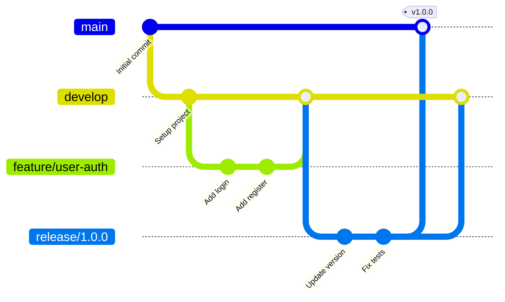

# Git Workflow Guide

## Overview
This document outlines the Git workflow and branching strategy for the ng-gighub project.

## Branching Strategy

### Main Branches

#### `main`
- **Purpose**: Production-ready code
- **Protection**: Protected branch with required reviews
- **Deployment**: Automatically deployed to production
- **Direct commits**: Not allowed

#### `develop`
- **Purpose**: Integration branch for features
- **Protection**: Protected branch with required reviews
- **Deployment**: Automatically deployed to staging
- **Direct commits**: Limited to hotfixes only

### Supporting Branches

#### Feature Branches
- **Naming**: `feature/<ticket-id>-<short-description>`
- **Example**: `feature/TASK-123-user-authentication`
- **Base**: Created from `develop`
- **Merge into**: `develop`
- **Lifetime**: Deleted after merge

#### Bugfix Branches
- **Naming**: `bugfix/<ticket-id>-<short-description>`
- **Example**: `bugfix/BUG-456-fix-login-error`
- **Base**: Created from `develop`
- **Merge into**: `develop`
- **Lifetime**: Deleted after merge

#### Hotfix Branches
- **Naming**: `hotfix/<version>-<short-description>`
- **Example**: `hotfix/1.2.1-critical-security-fix`
- **Base**: Created from `main`
- **Merge into**: Both `main` and `develop`
- **Lifetime**: Deleted after merge

#### Release Branches
- **Naming**: `release/<version>`
- **Example**: `release/1.2.0`
- **Base**: Created from `develop`
- **Merge into**: Both `main` and `develop`
- **Purpose**: Final preparations before production release

## Workflow Diagram



## Commit Message Convention

### Format
```
<type>(<scope>): <subject>

<body>

<footer>
```

### Types
- **feat**: New feature
- **fix**: Bug fix
- **docs**: Documentation changes
- **style**: Code style changes (formatting, missing semi-colons, etc.)
- **refactor**: Code refactoring without feature changes
- **perf**: Performance improvements
- **test**: Adding or updating tests
- **build**: Changes to build system or dependencies
- **ci**: Changes to CI configuration
- **chore**: Other changes that don't modify src or test files

### Examples

#### Feature Commit
```
feat(auth): implement user registration

- Add registration form component
- Create user registration service
- Add email validation
- Update routing configuration

Closes #123
```

#### Bug Fix Commit
```
fix(posts): resolve duplicate posts issue

Fixed a race condition that caused posts to appear
multiple times in the feed when rapidly scrolling.

Fixes #456
```

#### Breaking Change
```
feat(api)!: change authentication token format

BREAKING CHANGE: Authentication tokens now use JWT
format instead of custom format. All clients must
update their token handling logic.

Migration guide: docs/migration/v2-auth.md
```

### Commit Message Rules

1. **Subject Line**
   - Use imperative mood: "add feature" not "added feature"
   - Don't capitalize first letter
   - No period at the end
   - Maximum 50 characters

2. **Body**
   - Wrap at 72 characters
   - Explain what and why, not how
   - Separate from subject with blank line

3. **Footer**
   - Reference issues: `Closes #123`, `Fixes #456`
   - Note breaking changes: `BREAKING CHANGE: description`

## Pull Request Process

### Creating a Pull Request

1. **Update your branch**
   ```bash
   git checkout develop
   git pull origin develop
   git checkout feature/your-feature
   git rebase develop
   ```

2. **Push your changes**
   ```bash
   git push origin feature/your-feature
   ```

3. **Create PR via GitHub**
   - Title should be clear and descriptive
   - Link related issues
   - Fill out PR template completely
   - Add relevant labels
   - Request reviewers

### PR Title Format
```
[Type] Brief description of changes
```

Examples:
- `[Feature] Add user profile editing`
- `[Bugfix] Fix memory leak in subscription`
- `[Hotfix] Patch critical security vulnerability`

### PR Description Template
```markdown
## Description
Brief description of the changes

## Type of Change
- [ ] Bug fix
- [ ] New feature
- [ ] Breaking change
- [ ] Documentation update

## Related Issues
Closes #123

## Changes Made
- Added user profile component
- Updated user service
- Added unit tests

## Testing
- [ ] Unit tests pass
- [ ] Integration tests pass
- [ ] Manual testing completed

## Screenshots (if applicable)
Add screenshots here

## Checklist
- [ ] Code follows style guidelines
- [ ] Self-review completed
- [ ] Comments added for complex code
- [ ] Documentation updated
- [ ] No new warnings generated
- [ ] Tests added/updated
- [ ] All tests passing
```

### Code Review Guidelines

#### For Authors
- Keep PRs small and focused (< 400 lines changed)
- Provide context in description
- Respond to feedback promptly
- Don't take feedback personally
- Update PR based on feedback

#### For Reviewers
- Review within 24 hours
- Be constructive and respectful
- Explain your suggestions
- Approve if no blocking issues
- Use GitHub's suggestion feature for small changes

### Review Process
1. Automated checks must pass (tests, linting)
2. At least one approval required
3. No unresolved conversations
4. Branch up-to-date with target
5. Merge using "Squash and merge" (default)

## Common Workflows

### Starting New Feature
```bash
# Update develop
git checkout develop
git pull origin develop

# Create feature branch
git checkout -b feature/TASK-123-new-feature

# Make changes and commit
git add .
git commit -m "feat(feature): add new feature"

# Push to remote
git push origin feature/TASK-123-new-feature
```

### Updating Feature Branch
```bash
# Get latest from develop
git checkout develop
git pull origin develop

# Update feature branch
git checkout feature/TASK-123-new-feature
git rebase develop

# Force push if already pushed
git push origin feature/TASK-123-new-feature --force-with-lease
```

### Handling Merge Conflicts
```bash
# Start rebase
git rebase develop

# Resolve conflicts in files
# Edit conflicting files

# Mark as resolved
git add .
git rebase --continue

# Or abort if needed
git rebase --abort
```

### Creating a Hotfix
```bash
# Create hotfix from main
git checkout main
git pull origin main
git checkout -b hotfix/1.2.1-critical-fix

# Make fix and commit
git add .
git commit -m "fix(security): patch XSS vulnerability"

# Merge to main
git checkout main
git merge hotfix/1.2.1-critical-fix
git tag v1.2.1
git push origin main --tags

# Also merge to develop
git checkout develop
git merge hotfix/1.2.1-critical-fix
git push origin develop

# Delete hotfix branch
git branch -d hotfix/1.2.1-critical-fix
git push origin --delete hotfix/1.2.1-critical-fix
```

## Best Practices

### Commits
- Commit early and often
- Make atomic commits (one logical change per commit)
- Write meaningful commit messages
- Don't commit sensitive data or credentials
- Review changes before committing

### Branches
- Keep branches short-lived (< 1 week)
- Sync with base branch regularly
- Delete branches after merge
- Use descriptive branch names

### Collaboration
- Communicate changes in PR descriptions
- Tag relevant team members
- Keep PRs manageable in size
- Respond to review comments promptly
- Use draft PRs for work in progress

## Useful Git Commands

### Checking Status
```bash
# Show status
git status

# Show commit log
git log --oneline --graph --all

# Show changes
git diff
git diff --staged
```

### Undoing Changes
```bash
# Discard local changes
git checkout -- <file>

# Unstage file
git reset HEAD <file>

# Amend last commit
git commit --amend

# Undo last commit (keep changes)
git reset --soft HEAD~1

# Undo last commit (discard changes)
git reset --hard HEAD~1
```

### Cleaning Up
```bash
# Remove untracked files (dry run)
git clean -n

# Remove untracked files
git clean -f

# Remove untracked files and directories
git clean -fd
```

## Git Configuration

### Recommended Settings
```bash
# Set user info
git config --global user.name "Your Name"
git config --global user.email "your.email@example.com"

# Set default editor
git config --global core.editor "code --wait"

# Enable color
git config --global color.ui auto

# Set default branch name
git config --global init.defaultBranch main

# Configure line endings (choose ONE based on your platform)
# IMPORTANT: Teams should standardize on one approach
git config --global core.autocrlf input  # Mac/Linux (recommended for cross-platform teams)
git config --global core.autocrlf true   # Windows only (if team is Windows-only)
# Note: Use .gitattributes file to enforce consistent line endings across all platforms
```

### Useful Aliases
```bash
# Status shortcut
git config --global alias.st status

# Log with graph
git config --global alias.lg "log --oneline --graph --all"

# Amend last commit
git config --global alias.amend "commit --amend --no-edit"

# Show current branch
git config --global alias.current "rev-parse --abbrev-ref HEAD"
```

## Troubleshooting

### Problem: Merge Conflicts
**Solution**: Resolve conflicts manually, then continue with merge/rebase

### Problem: Pushed Wrong Commit
**Solution**: Use `git revert` to create a new commit that undoes changes

### Problem: Need to Change Old Commit
**Solution**: Use interactive rebase (`git rebase -i`) carefully

### Problem: Accidentally Deleted Branch
**Solution**: Use `git reflog` to find commit and recreate branch

## References
- [Git Documentation](https://git-scm.com/doc)
- [GitHub Flow](https://guides.github.com/introduction/flow/)
- [Conventional Commits](https://www.conventionalcommits.org/)
- [Git Best Practices](https://git-scm.com/book/en/v2)
