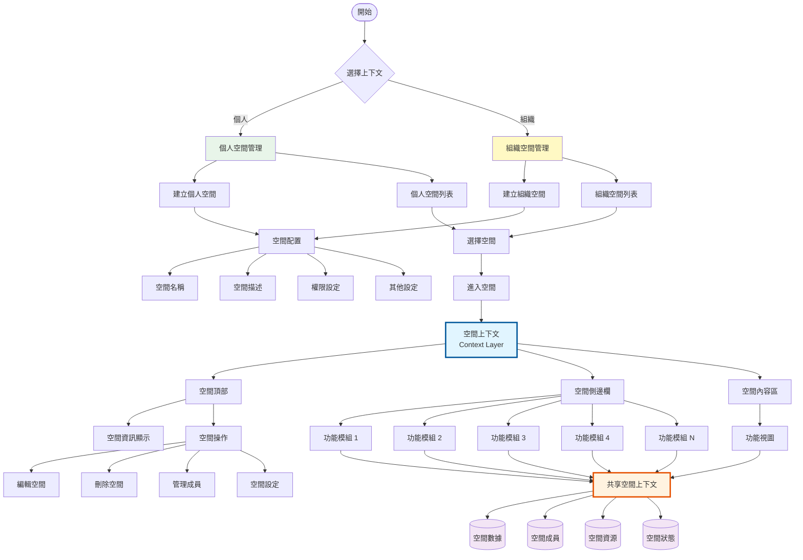
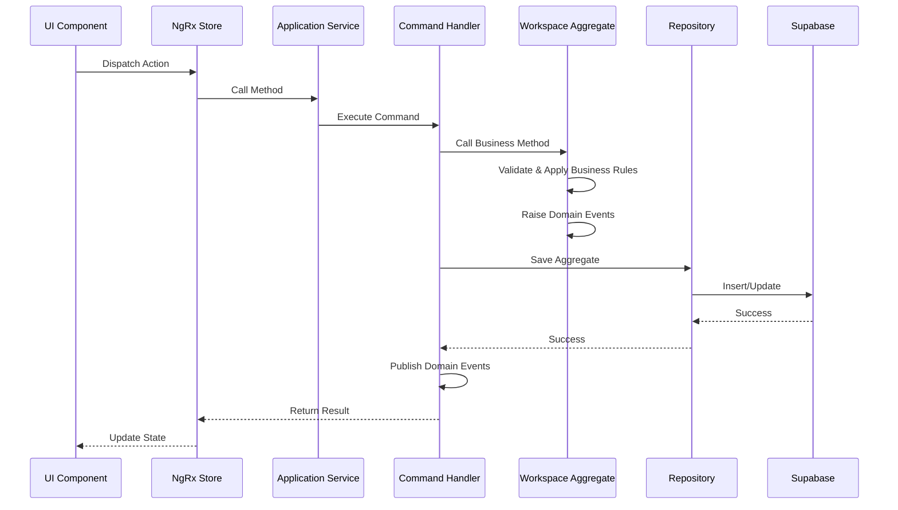
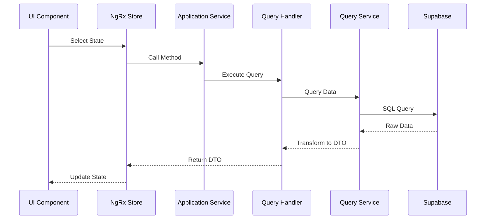
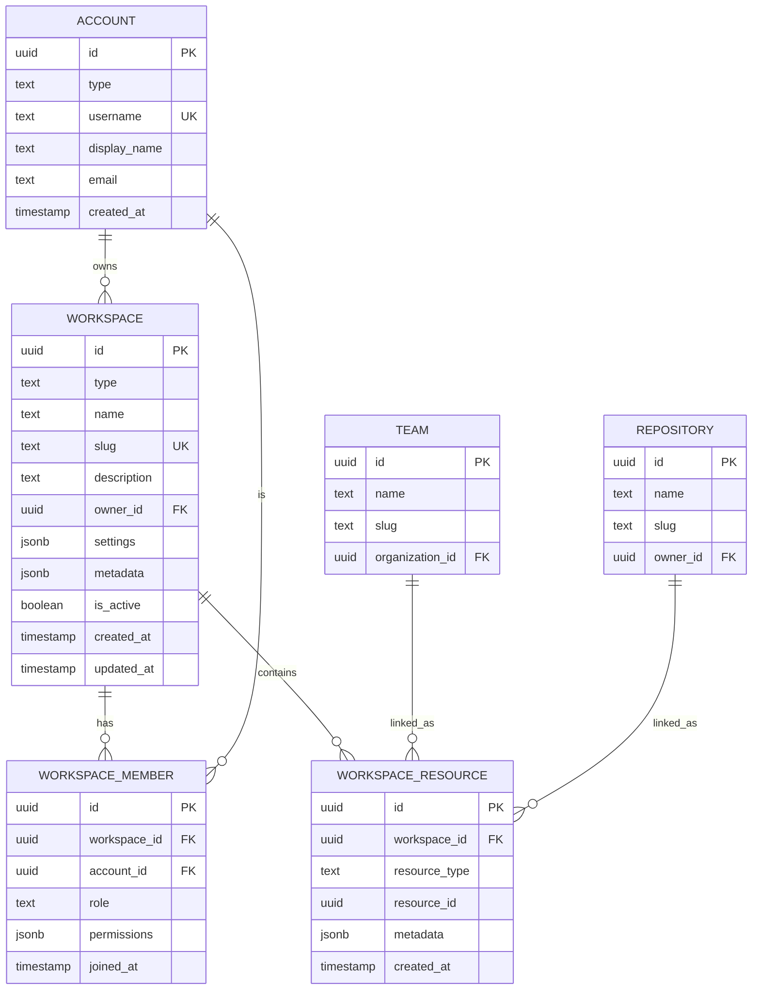

# Space Management System - 完整開發計畫

## 文件資訊
- **建立日期**: 2025-11-22
- **版本**: 1.0.0
- **狀態**: Initial Planning
- **負責人**: Development Team

---

## 目錄

1. [專案概覽](#1-專案概覽)
2. [系統架構](#2-系統架構)
3. [領域模型設計](#3-領域模型設計)
4. [資料庫設計](#4-資料庫設計)
5. [Application Layer 設計](#5-application-layer-設計)
6. [Infrastructure Layer 設計](#6-infrastructure-layer-設計)
7. [Features Layer 設計](#7-features-layer-設計)
8. [路由與導航設計](#8-路由與導航設計)
9. [狀態管理設計](#9-狀態管理設計)
10. [權限與安全設計](#10-權限與安全設計)
11. [實作階段規劃](#11-實作階段規劃)
12. [測試策略](#12-測試策略)
13. [部署與監控](#13-部署與監控)
14. [附錄](#14-附錄)

---

## 1. 專案概覽

### 1.1 目標

實作一個完整的 Space Management 系統，支援：
- 個人空間（Personal Space）管理
- 組織空間（Organization Space）管理
- 空間上下文切換與狀態管理
- 模組化功能架構
- 成員與資源管理

### 1.2 核心功能流程




### 1.3 技術棧

| 類別 | 技術 | 版本 | 用途 |
|------|------|------|------|
| 框架 | Angular | 20.1.x | 前端框架 |
| 語言 | TypeScript | 5.8.x | 開發語言 |
| SSR | @angular/ssr | 20.1.x | 伺服器端渲染 |
| 後端 | Supabase | 2.84.x | 資料庫與後端服務 |
| 狀態管理 | RxJS + Signals | 7.8.x | 響應式狀態管理 |
| UI 框架 | Angular Material | 20.1.x | UI 元件庫 |
| 測試 | Jasmine + Karma | - | 單元測試 |
| 架構模式 | DDD + Clean Architecture + CQRS | - | 架構設計 |

---

## 2. 系統架構

### 2.1 架構層級

ng-gighub 採用 DDD (Domain-Driven Design) + Clean Architecture + CQRS 模式：

```
┌─────────────────────────────────────────────────┐
│          Features Layer (展示層)                 │
│   ┌───────────────────────────────────────┐    │
│   │ Workspace Feature Module              │    │
│   │ - Pages (List, Create, Detail, etc.)  │    │
│   │ - Components (Header, Sidebar, etc.)  │    │
│   │ - State Management                    │    │
│   └───────────────────────────────────────┘    │
└─────────────────────────────────────────────────┘
                      ↓ depends on
┌─────────────────────────────────────────────────┐
│       Application Layer (應用層)                 │
│   ┌───────────────────────────────────────┐    │
│   │ Commands & Handlers                   │    │
│   │ - CreateWorkspaceCommand              │    │
│   │ - AddMemberCommand                    │    │
│   │ - AddResourceCommand                  │    │
│   │                                       │    │
│   │ Queries & Handlers                    │    │
│   │ - GetWorkspaceByIdQuery               │    │
│   │ - ListWorkspacesQuery                 │    │
│   │ - GetWorkspaceMembersQuery            │    │
│   │                                       │    │
│   │ DTOs                                  │    │
│   │ - WorkspaceDto                        │    │
│   │ - WorkspaceMemberDto                  │    │
│   └───────────────────────────────────────┘    │
└─────────────────────────────────────────────────┘
                      ↓ depends on
┌─────────────────────────────────────────────────┐
│         Domain Layer (領域層)                    │
│   ┌───────────────────────────────────────┐    │
│   │ WorkspaceAggregate (聚合根)           │    │
│   │ - Business Logic                      │    │
│   │ - Invariants                          │    │
│   │                                       │    │
│   │ Entities                              │    │
│   │ - WorkspaceMember                     │    │
│   │ - WorkspaceResource                   │    │
│   │                                       │    │
│   │ Value Objects                         │    │
│   │ - WorkspaceId, WorkspaceSlug          │    │
│   │ - WorkspaceType, MemberRole           │    │
│   │                                       │    │
│   │ Domain Events                         │    │
│   │ - WorkspaceCreatedEvent               │    │
│   │ - MemberAddedEvent                    │    │
│   │                                       │    │
│   │ Repository Interface                  │    │
│   └───────────────────────────────────────┘    │
└─────────────────────────────────────────────────┘
                      ↑ implemented by
┌─────────────────────────────────────────────────┐
│      Infrastructure Layer (基礎設施層)           │
│   ┌───────────────────────────────────────┐    │
│   │ Supabase Repository Implementation    │    │
│   │ - WorkspaceSupabaseRepository         │    │
│   │                                       │    │
│   │ Mappers                               │    │
│   │ - WorkspaceMapper                     │    │
│   │ - MemberMapper                        │    │
│   │                                       │    │
│   │ Query Services                        │    │
│   │ - WorkspaceQueryService               │    │
│   │                                       │    │
│   │ Supabase Schema                       │    │
│   └───────────────────────────────────────┘    │
└─────────────────────────────────────────────────┘
```

### 2.2 資料流

#### Command Flow (寫入操作)



#### Query Flow (讀取操作)



---

## 3. 領域模型設計

### 3.1 WorkspaceAggregate (已實作)

工作區聚合根已在 `src/app/core/domain/workspace/` 實作，包含：

#### 聚合根
- `WorkspaceAggregate`: 管理工作區生命週期與業務規則

#### 值物件 (Value Objects)
- `WorkspaceId`: UUID 識別碼
- `WorkspaceType`: 類型 (personal | organization)
- `WorkspaceSlug`: URL-friendly 識別碼
- `MemberRole`: 成員角色 (owner | admin | member | viewer)

#### 實體 (Entities)
- `WorkspaceMember`: 工作區成員
- `WorkspaceResource`: 工作區資源連結

#### 領域事件 (Domain Events)
- `WorkspaceCreatedEvent`
- `WorkspaceUpdatedEvent`
- `WorkspaceDeletedEvent`
- `MemberAddedEvent`
- `MemberRemovedEvent`
- `MemberRoleChangedEvent`
- `ResourceAddedEvent`
- `ResourceRemovedEvent`

### 3.2 業務規則

#### 工作區規則
1. ✅ 工作區必須有唯一的 slug
2. ✅ 工作區名稱不可為空，且不超過 100 字元
3. ✅ 工作區類型只能是 personal 或 organization
4. ✅ 擁有者不能被移除
5. ✅ 建立時自動將擁有者加為成員

#### 成員規則
1. ✅ 成員在工作區中必須唯一
2. ✅ 擁有者的角色不能被變更
3. ✅ 角色階層：owner > admin > member > viewer
4. 🔲 Admin 可以管理 member 和 viewer
5. 🔲 Member 只能檢視和參與
6. 🔲 Viewer 只能檢視

#### 資源規則
1. ✅ 資源可以是任意類型（team, repository, project 等）
2. ✅ 資源通過 resource_type 和 resource_id 識別
3. ✅ 資源可以有自訂的 metadata
4. 🔲 資源刪除需要檢查依賴關係

### 3.3 領域關係圖



---

## 4. 資料庫設計

### 4.1 現有 Supabase Tables

專案已有以下 Tables（使用中）：

#### workspaces
```sql
CREATE TABLE workspaces (
  id UUID PRIMARY KEY DEFAULT extensions.uuid_generate_v4(),
  type TEXT NOT NULL CHECK (type IN ('personal', 'organization')),
  name TEXT NOT NULL,
  slug TEXT NOT NULL UNIQUE,
  description TEXT,
  owner_id UUID NOT NULL REFERENCES accounts(id),
  avatar_url TEXT,
  settings JSONB DEFAULT '{}',
  metadata JSONB DEFAULT '{}',
  is_active BOOLEAN DEFAULT true,
  created_at TIMESTAMPTZ DEFAULT now(),
  updated_at TIMESTAMPTZ DEFAULT now()
);

COMMENT ON TABLE workspaces IS '工作區主表，支援個人和組織兩種類型';
COMMENT ON COLUMN workspaces.type IS '工作區類型: personal (個人) 或 organization (組織)';
COMMENT ON COLUMN workspaces.slug IS '工作區唯一識別碼（URL-friendly）';
COMMENT ON COLUMN workspaces.owner_id IS '工作區擁有者（可以是使用者或組織）';
COMMENT ON COLUMN workspaces.settings IS '工作區設定（JSON 格式）';
COMMENT ON COLUMN workspaces.metadata IS '額外的元資料（JSON 格式）';
```

#### workspace_members
```sql
CREATE TABLE workspace_members (
  id UUID PRIMARY KEY DEFAULT extensions.uuid_generate_v4(),
  workspace_id UUID NOT NULL REFERENCES workspaces(id) ON DELETE CASCADE,
  account_id UUID NOT NULL REFERENCES accounts(id) ON DELETE CASCADE,
  role TEXT NOT NULL DEFAULT 'member' 
    CHECK (role IN ('owner', 'admin', 'member', 'viewer')),
  permissions JSONB DEFAULT '{}',
  joined_at TIMESTAMPTZ DEFAULT now(),
  UNIQUE(workspace_id, account_id)
);

COMMENT ON TABLE workspace_members IS '工作區成員關聯表';
COMMENT ON COLUMN workspace_members.role IS '成員角色: owner (擁有者), admin (管理員), member (成員), viewer (瀏覽者)';
COMMENT ON COLUMN workspace_members.permissions IS '自訂權限設定（JSON 格式）';
```

#### workspace_resources
```sql
CREATE TABLE workspace_resources (
  id UUID PRIMARY KEY DEFAULT extensions.uuid_generate_v4(),
  workspace_id UUID NOT NULL REFERENCES workspaces(id) ON DELETE CASCADE,
  resource_type TEXT NOT NULL,
  resource_id UUID NOT NULL,
  metadata JSONB DEFAULT '{}',
  created_at TIMESTAMPTZ DEFAULT now(),
  UNIQUE(workspace_id, resource_type, resource_id)
);

COMMENT ON TABLE workspace_resources IS '工作區資源關聯表，用於連結工作區與其他資源（如團隊、儲存庫等）';
COMMENT ON COLUMN workspace_resources.resource_type IS '資源類型（例如: team, repository, project）';
COMMENT ON COLUMN workspace_resources.resource_id IS '資源的 UUID';
COMMENT ON COLUMN workspace_resources.metadata IS '資源相關的額外資訊（JSON 格式）';
```

### 4.2 Indexes

```sql
-- workspaces 索引
CREATE INDEX idx_workspaces_owner_id ON workspaces(owner_id);
CREATE INDEX idx_workspaces_type ON workspaces(type);
CREATE INDEX idx_workspaces_slug ON workspaces(slug);
CREATE INDEX idx_workspaces_is_active ON workspaces(is_active);

-- workspace_members 索引
CREATE INDEX idx_workspace_members_workspace_id ON workspace_members(workspace_id);
CREATE INDEX idx_workspace_members_account_id ON workspace_members(account_id);
CREATE INDEX idx_workspace_members_role ON workspace_members(role);

-- workspace_resources 索引
CREATE INDEX idx_workspace_resources_workspace_id ON workspace_resources(workspace_id);
CREATE INDEX idx_workspace_resources_type ON workspace_resources(resource_type);
CREATE INDEX idx_workspace_resources_resource_id ON workspace_resources(resource_id);
```

### 4.3 Row Level Security (RLS)

```sql
-- Enable RLS
ALTER TABLE workspaces ENABLE ROW LEVEL SECURITY;
ALTER TABLE workspace_members ENABLE ROW LEVEL SECURITY;
ALTER TABLE workspace_resources ENABLE ROW LEVEL SECURITY;

-- workspaces policies
CREATE POLICY "Users can view their own workspaces"
  ON workspaces FOR SELECT
  USING (
    owner_id = auth.uid() OR
    id IN (
      SELECT workspace_id FROM workspace_members
      WHERE account_id = auth.uid()
    )
  );

CREATE POLICY "Users can create personal workspaces"
  ON workspaces FOR INSERT
  WITH CHECK (
    type = 'personal' AND owner_id = auth.uid()
  );

CREATE POLICY "Organization owners can create organization workspaces"
  ON workspaces FOR INSERT
  WITH CHECK (
    type = 'organization' AND
    owner_id IN (
      SELECT id FROM accounts
      WHERE type = 'organization' AND
      owner_id = auth.uid()
    )
  );

CREATE POLICY "Workspace owners and admins can update"
  ON workspaces FOR UPDATE
  USING (
    owner_id = auth.uid() OR
    id IN (
      SELECT workspace_id FROM workspace_members
      WHERE account_id = auth.uid() AND role IN ('admin', 'owner')
    )
  );

CREATE POLICY "Only workspace owners can delete"
  ON workspaces FOR DELETE
  USING (owner_id = auth.uid());

-- workspace_members policies
CREATE POLICY "Members can view workspace members"
  ON workspace_members FOR SELECT
  USING (
    workspace_id IN (
      SELECT id FROM workspaces
      WHERE owner_id = auth.uid() OR
      id IN (
        SELECT workspace_id FROM workspace_members
        WHERE account_id = auth.uid()
      )
    )
  );

CREATE POLICY "Owners and admins can add members"
  ON workspace_members FOR INSERT
  WITH CHECK (
    workspace_id IN (
      SELECT id FROM workspaces
      WHERE owner_id = auth.uid() OR
      id IN (
        SELECT workspace_id FROM workspace_members
        WHERE account_id = auth.uid() AND role IN ('admin', 'owner')
      )
    )
  );

CREATE POLICY "Owners and admins can remove members"
  ON workspace_members FOR DELETE
  USING (
    workspace_id IN (
      SELECT id FROM workspaces
      WHERE owner_id = auth.uid() OR
      id IN (
        SELECT workspace_id FROM workspace_members
        WHERE account_id = auth.uid() AND role IN ('admin', 'owner')
      )
    )
  );

-- workspace_resources policies
CREATE POLICY "Members can view workspace resources"
  ON workspace_resources FOR SELECT
  USING (
    workspace_id IN (
      SELECT id FROM workspaces
      WHERE owner_id = auth.uid() OR
      id IN (
        SELECT workspace_id FROM workspace_members
        WHERE account_id = auth.uid()
      )
    )
  );

CREATE POLICY "Owners and admins can manage resources"
  ON workspace_resources FOR ALL
  USING (
    workspace_id IN (
      SELECT id FROM workspaces
      WHERE owner_id = auth.uid() OR
      id IN (
        SELECT workspace_id FROM workspace_members
        WHERE account_id = auth.uid() AND role IN ('admin', 'owner')
      )
    )
  );
```

### 4.4 Functions & Triggers

```sql
-- Update updated_at timestamp
CREATE OR REPLACE FUNCTION update_updated_at_column()
RETURNS TRIGGER AS $$
BEGIN
  NEW.updated_at = now();
  RETURN NEW;
END;
$$ LANGUAGE plpgsql;

CREATE TRIGGER update_workspaces_updated_at
  BEFORE UPDATE ON workspaces
  FOR EACH ROW
  EXECUTE FUNCTION update_updated_at_column();

-- Ensure owner is automatically added as member
CREATE OR REPLACE FUNCTION add_owner_as_member()
RETURNS TRIGGER AS $$
BEGIN
  INSERT INTO workspace_members (workspace_id, account_id, role)
  VALUES (NEW.id, NEW.owner_id, 'owner')
  ON CONFLICT (workspace_id, account_id) DO NOTHING;
  RETURN NEW;
END;
$$ LANGUAGE plpgsql;

CREATE TRIGGER add_workspace_owner_as_member
  AFTER INSERT ON workspaces
  FOR EACH ROW
  EXECUTE FUNCTION add_owner_as_member();
```

---

## 5. Application Layer 設計

### 5.1 Commands

#### CreateWorkspaceCommand
```typescript
// src/app/core/application/workspace/commands/create-workspace.command.ts
export interface CreateWorkspaceCommand {
  type: 'personal' | 'organization';
  name: string;
  slug: string;
  description?: string;
  ownerId: string;
  settings?: Record<string, any>;
}

export class CreateWorkspaceHandler {
  constructor(
    private workspaceRepository: IWorkspaceRepository,
    private eventBus: IEventBus
  ) {}

  async execute(command: CreateWorkspaceCommand): Promise<Result<string, Error>> {
    // 1. 驗證輸入
    // 2. 建立聚合根
    // 3. 儲存到 Repository
    // 4. 發布領域事件
    // 5. 回傳 workspace ID
  }
}
```

#### UpdateWorkspaceCommand
```typescript
export interface UpdateWorkspaceCommand {
  workspaceId: string;
  name?: string;
  description?: string;
  avatarUrl?: string;
  settings?: Record<string, any>;
}
```

#### DeleteWorkspaceCommand
```typescript
export interface DeleteWorkspaceCommand {
  workspaceId: string;
}
```

#### AddMemberCommand
```typescript
export interface AddMemberCommand {
  workspaceId: string;
  accountId: string;
  role: 'admin' | 'member' | 'viewer';
}
```

#### RemoveMemberCommand
```typescript
export interface RemoveMemberCommand {
  workspaceId: string;
  accountId: string;
}
```

#### ChangeMemberRoleCommand
```typescript
export interface ChangeMemberRoleCommand {
  workspaceId: string;
  accountId: string;
  newRole: 'admin' | 'member' | 'viewer';
}
```

#### AddResourceCommand
```typescript
export interface AddResourceCommand {
  workspaceId: string;
  resourceType: string;
  resourceId: string;
  metadata?: Record<string, any>;
}
```

#### RemoveResourceCommand
```typescript
export interface RemoveResourceCommand {
  workspaceId: string;
  resourceId: string;
}
```

### 5.2 Queries

#### GetWorkspaceByIdQuery
```typescript
export interface GetWorkspaceByIdQuery {
  workspaceId: string;
  includeMembers?: boolean;
  includeResources?: boolean;
}

export interface WorkspaceDto {
  id: string;
  type: 'personal' | 'organization';
  name: string;
  slug: string;
  description: string | null;
  ownerId: string;
  avatarUrl: string | null;
  settings: Record<string, any>;
  metadata: Record<string, any>;
  isActive: boolean;
  createdAt: Date;
  updatedAt: Date;
  members?: WorkspaceMemberDto[];
  resources?: WorkspaceResourceDto[];
  memberCount?: number;
  resourceCount?: number;
}
```

#### ListWorkspacesQuery
```typescript
export interface ListWorkspacesQuery {
  accountId: string;
  type?: 'personal' | 'organization';
  isActive?: boolean;
  page?: number;
  pageSize?: number;
  sortBy?: 'name' | 'createdAt' | 'updatedAt';
  sortOrder?: 'asc' | 'desc';
}

export interface WorkspaceListDto {
  workspaces: WorkspaceDto[];
  total: number;
  page: number;
  pageSize: number;
}
```

#### GetWorkspaceMembersQuery
```typescript
export interface GetWorkspaceMembersQuery {
  workspaceId: string;
  role?: 'owner' | 'admin' | 'member' | 'viewer';
  page?: number;
  pageSize?: number;
}

export interface WorkspaceMemberDto {
  id: string;
  workspaceId: string;
  accountId: string;
  accountUsername: string;
  accountDisplayName: string;
  accountAvatarUrl: string | null;
  role: 'owner' | 'admin' | 'member' | 'viewer';
  permissions: Record<string, any>;
  joinedAt: Date;
}
```

#### GetWorkspaceResourcesQuery
```typescript
export interface GetWorkspaceResourcesQuery {
  workspaceId: string;
  resourceType?: string;
  page?: number;
  pageSize?: number;
}

export interface WorkspaceResourceDto {
  id: string;
  workspaceId: string;
  resourceType: string;
  resourceId: string;
  resourceName?: string;
  metadata: Record<string, any>;
  createdAt: Date;
}
```

### 5.3 DTOs

所有 DTO 應該是不可變的，並包含必要的資料驗證。

```typescript
// src/app/core/application/workspace/dtos/workspace.dto.ts
export class WorkspaceDto {
  constructor(
    public readonly id: string,
    public readonly type: 'personal' | 'organization',
    public readonly name: string,
    public readonly slug: string,
    public readonly description: string | null,
    public readonly ownerId: string,
    public readonly avatarUrl: string | null,
    public readonly settings: Record<string, any>,
    public readonly metadata: Record<string, any>,
    public readonly isActive: boolean,
    public readonly createdAt: Date,
    public readonly updatedAt: Date,
    public readonly members?: WorkspaceMemberDto[],
    public readonly resources?: WorkspaceResourceDto[],
    public readonly memberCount?: number,
    public readonly resourceCount?: number
  ) {}
}
```

---

## 6. Infrastructure Layer 設計

### 6.1 Repository Implementation

```typescript
// src/app/core/infrastructure/persistence/workspace/workspace-supabase.repository.ts
import { Injectable } from '@angular/core';
import { SupabaseClient } from '@supabase/supabase-js';
import { IWorkspaceRepository } from '@core/domain/workspace/repositories/workspace.repository.interface';
import { WorkspaceAggregate } from '@core/domain/workspace/aggregates/workspace.aggregate';
import { WorkspaceMapper } from './workspace.mapper';

@Injectable({
  providedIn: 'root'
})
export class WorkspaceSupabaseRepository implements IWorkspaceRepository {
  constructor(
    private supabase: SupabaseClient,
    private mapper: WorkspaceMapper
  ) {}

  async findById(id: string): Promise<WorkspaceAggregate | null> {
    const { data, error } = await this.supabase
      .from('workspaces')
      .select(`
        *,
        members:workspace_members(*),
        resources:workspace_resources(*)
      `)
      .eq('id', id)
      .single();

    if (error || !data) return null;
    return this.mapper.toDomain(data);
  }

  async save(workspace: WorkspaceAggregate): Promise<void> {
    const dto = this.mapper.toPeristence(workspace);
    
    const { error } = await this.supabase
      .from('workspaces')
      .upsert(dto);

    if (error) throw new Error(`Failed to save workspace: ${error.message}`);

    // Save members and resources separately
    await this.saveMembers(workspace);
    await this.saveResources(workspace);
  }

  async delete(id: string): Promise<void> {
    const { error } = await this.supabase
      .from('workspaces')
      .delete()
      .eq('id', id);

    if (error) throw new Error(`Failed to delete workspace: ${error.message}`);
  }

  private async saveMembers(workspace: WorkspaceAggregate): Promise<void> {
    // Implementation...
  }

  private async saveResources(workspace: WorkspaceAggregate): Promise<void> {
    // Implementation...
  }
}
```

### 6.2 Mapper

```typescript
// src/app/core/infrastructure/persistence/workspace/workspace.mapper.ts
import { Injectable } from '@angular/core';
import { WorkspaceAggregate } from '@core/domain/workspace/aggregates/workspace.aggregate';
import { WorkspaceId } from '@core/domain/workspace/value-objects/workspace-id.vo';
import { WorkspaceType } from '@core/domain/workspace/value-objects/workspace-type.vo';
import { WorkspaceSlug } from '@core/domain/workspace/value-objects/workspace-slug.vo';

@Injectable({
  providedIn: 'root'
})
export class WorkspaceMapper {
  toDomain(raw: any): WorkspaceAggregate {
    return WorkspaceAggregate.reconstruct(
      WorkspaceId.create(raw.id),
      WorkspaceType.create(raw.type),
      raw.name,
      WorkspaceSlug.create(raw.slug),
      raw.owner_id,
      raw.description,
      raw.avatar_url,
      raw.settings,
      raw.metadata,
      raw.is_active,
      new Date(raw.created_at),
      new Date(raw.updated_at),
      raw.members?.map(m => this.memberMapper.toDomain(m)) || [],
      raw.resources?.map(r => this.resourceMapper.toDomain(r)) || []
    );
  }

  toPeristence(workspace: WorkspaceAggregate): any {
    return {
      id: workspace.getId().getValue(),
      type: workspace.getType().getValue(),
      name: workspace.getName(),
      slug: workspace.getSlug().getValue(),
      description: workspace.getDescription(),
      owner_id: workspace.getOwnerId(),
      avatar_url: workspace.getAvatarUrl(),
      settings: workspace.getSettings(),
      metadata: workspace.getMetadata(),
      is_active: workspace.getIsActive(),
      created_at: workspace.getCreatedAt().toISOString(),
      updated_at: workspace.getUpdatedAt().toISOString()
    };
  }
}
```

### 6.3 Query Service

```typescript
// src/app/core/infrastructure/query/workspace-query.service.ts
import { Injectable } from '@angular/core';
import { SupabaseClient } from '@supabase/supabase-js';
import { WorkspaceDto } from '@core/application/workspace/dtos/workspace.dto';

@Injectable({
  providedIn: 'root'
})
export class WorkspaceQueryService {
  constructor(private supabase: SupabaseClient) {}

  async getWorkspaceById(
    id: string,
    includeMembers = false,
    includeResources = false
  ): Promise<WorkspaceDto | null> {
    let query = this.supabase
      .from('workspaces')
      .select('*');

    if (includeMembers) {
      query = query.select('*, members:workspace_members(*)');
    }

    if (includeResources) {
      query = query.select('*, resources:workspace_resources(*)');
    }

    const { data, error } = await query.eq('id', id).single();

    if (error || !data) return null;

    return this.mapToDto(data);
  }

  async listWorkspaces(
    accountId: string,
    filters: any
  ): Promise<{ workspaces: WorkspaceDto[]; total: number }> {
    let query = this.supabase
      .from('workspaces')
      .select('*, member_count:workspace_members(count)', { count: 'exact' })
      .or(`owner_id.eq.${accountId},id.in.(select workspace_id from workspace_members where account_id=${accountId})`);

    // Apply filters...
    if (filters.type) {
      query = query.eq('type', filters.type);
    }

    if (filters.isActive !== undefined) {
      query = query.eq('is_active', filters.isActive);
    }

    const { data, error, count } = await query;

    if (error) throw new Error(`Failed to list workspaces: ${error.message}`);

    return {
      workspaces: data?.map(d => this.mapToDto(d)) || [],
      total: count || 0
    };
  }

  private mapToDto(data: any): WorkspaceDto {
    return new WorkspaceDto(
      data.id,
      data.type,
      data.name,
      data.slug,
      data.description,
      data.owner_id,
      data.avatar_url,
      data.settings || {},
      data.metadata || {},
      data.is_active,
      new Date(data.created_at),
      new Date(data.updated_at),
      data.members?.map(m => this.mapMemberToDto(m)),
      data.resources?.map(r => this.mapResourceToDto(r)),
      data.member_count
    );
  }

  private mapMemberToDto(data: any): any {
    // Implementation...
  }

  private mapResourceToDto(data: any): any {
    // Implementation...
  }
}
```

---

## 7. Features Layer 設計

### 7.1 Module Structure

```
src/app/features/workspace/
├── workspace.routes.ts           # 路由配置
├── pages/
│   ├── workspace-list/
│   │   ├── workspace-list.component.ts
│   │   ├── workspace-list.component.html
│   │   ├── workspace-list.component.scss
│   │   └── workspace-list.component.spec.ts
│   ├── workspace-create/
│   │   ├── workspace-create.component.ts
│   │   ├── workspace-create.component.html
│   │   ├── workspace-create.component.scss
│   │   └── workspace-create.component.spec.ts
│   ├── workspace-detail/
│   │   ├── workspace-detail.component.ts
│   │   ├── workspace-detail.component.html
│   │   ├── workspace-detail.component.scss
│   │   └── workspace-detail.component.spec.ts
│   └── workspace-settings/
│       ├── workspace-settings.component.ts
│       ├── workspace-settings.component.html
│       ├── workspace-settings.component.scss
│       └── workspace-settings.component.spec.ts
├── components/
│   ├── workspace-header/
│   │   ├── workspace-header.component.ts
│   │   ├── workspace-header.component.html
│   │   └── workspace-header.component.scss
│   ├── workspace-sidebar/
│   │   ├── workspace-sidebar.component.ts
│   │   ├── workspace-sidebar.component.html
│   │   └── workspace-sidebar.component.scss
│   ├── workspace-card/
│   │   ├── workspace-card.component.ts
│   │   ├── workspace-card.component.html
│   │   └── workspace-card.component.scss
│   ├── member-list/
│   │   ├── member-list.component.ts
│   │   ├── member-list.component.html
│   │   └── member-list.component.scss
│   ├── resource-list/
│   │   ├── resource-list.component.ts
│   │   ├── resource-list.component.html
│   │   └── resource-list.component.scss
│   └── workspace-context-menu/
│       ├── workspace-context-menu.component.ts
│       ├── workspace-context-menu.component.html
│       └── workspace-context-menu.component.scss
├── state/
│   ├── workspace.store.ts        # NgRx Signal Store
│   ├── workspace.effects.ts      # Side Effects
│   └── workspace.selectors.ts    # Selectors
└── services/
    └── workspace-ui.service.ts   # UI-specific services
```

### 7.2 Component Design

#### WorkspaceListComponent

```typescript
// src/app/features/workspace/pages/workspace-list/workspace-list.component.ts
import { Component, OnInit, inject } from '@angular/core';
import { CommonModule } from '@angular/common';
import { Router } from '@angular/router';
import { WorkspaceStore } from '../../state/workspace.store';
import { WorkspaceCardComponent } from '../../components/workspace-card/workspace-card.component';

@Component({
  selector: 'app-workspace-list',
  standalone: true,
  imports: [CommonModule, WorkspaceCardComponent],
  templateUrl: './workspace-list.component.html',
  styleUrl: './workspace-list.component.scss',
  changeDetection: ChangeDetectionStrategy.OnPush
})
export class WorkspaceListComponent implements OnInit {
  private store = inject(WorkspaceStore);
  private router = inject(Router);

  workspaces = this.store.workspaces;
  isLoading = this.store.isLoading;
  error = this.store.error;

  ngOnInit(): void {
    this.store.loadWorkspaces();
  }

  onCreateWorkspace(): void {
    this.router.navigate(['/workspaces/create']);
  }

  onSelectWorkspace(workspaceId: string): void {
    this.router.navigate(['/workspaces', workspaceId]);
  }
}
```

#### WorkspaceDetailComponent

```typescript
// src/app/features/workspace/pages/workspace-detail/workspace-detail.component.ts
import { Component, OnInit, inject, computed } from '@angular/core';
import { CommonModule } from '@angular/common';
import { ActivatedRoute, Router } from '@angular/router';
import { WorkspaceStore } from '../../state/workspace.store';
import { WorkspaceHeaderComponent } from '../../components/workspace-header/workspace-header.component';
import { WorkspaceSidebarComponent } from '../../components/workspace-sidebar/workspace-sidebar.component';

@Component({
  selector: 'app-workspace-detail',
  standalone: true,
  imports: [CommonModule, WorkspaceHeaderComponent, WorkspaceSidebarComponent],
  templateUrl: './workspace-detail.component.html',
  styleUrl: './workspace-detail.component.scss',
  changeDetection: ChangeDetectionStrategy.OnPush
})
export class WorkspaceDetailComponent implements OnInit {
  private store = inject(WorkspaceStore);
  private route = inject(ActivatedRoute);
  private router = inject(Router);

  workspace = this.store.currentWorkspace;
  members = this.store.currentMembers;
  resources = this.store.currentResources;
  isLoading = this.store.isLoading;

  workspaceId = computed(() => this.route.snapshot.params['id']);

  ngOnInit(): void {
    const id = this.workspaceId();
    if (id) {
      this.store.loadWorkspace(id);
    }
  }

  onBack(): void {
    this.router.navigate(['/workspaces']);
  }

  onEdit(): void {
    const id = this.workspaceId();
    this.router.navigate(['/workspaces', id, 'settings']);
  }
}
```

### 7.3 State Management (NgRx Signal Store)

```typescript
// src/app/features/workspace/state/workspace.store.ts
import { Injectable, inject } from '@angular/core';
import { signalStore, withState, withMethods, patchState } from '@ngrx/signals';
import { rxMethod } from '@ngrx/signals/rxjs-interop';
import { pipe, switchMap, tap, catchError, of } from 'rxjs';
import { WorkspaceDto } from '@core/application/workspace/dtos/workspace.dto';
import { WorkspaceService } from '@core/application/workspace/workspace.service';

interface WorkspaceState {
  workspaces: WorkspaceDto[];
  currentWorkspace: WorkspaceDto | null;
  currentMembers: any[];
  currentResources: any[];
  isLoading: boolean;
  error: string | null;
}

const initialState: WorkspaceState = {
  workspaces: [],
  currentWorkspace: null,
  currentMembers: [],
  currentResources: [],
  isLoading: false,
  error: null
};

export const WorkspaceStore = signalStore(
  { providedIn: 'root' },
  withState(initialState),
  withMethods((store, workspaceService = inject(WorkspaceService)) => ({
    loadWorkspaces: rxMethod<void>(
      pipe(
        tap(() => patchState(store, { isLoading: true, error: null })),
        switchMap(() =>
          workspaceService.listWorkspaces().pipe(
            tap((workspaces) =>
              patchState(store, { workspaces, isLoading: false })
            ),
            catchError((error) => {
              patchState(store, { error: error.message, isLoading: false });
              return of([]);
            })
          )
        )
      )
    ),

    loadWorkspace: rxMethod<string>(
      pipe(
        tap(() => patchState(store, { isLoading: true, error: null })),
        switchMap((id) =>
          workspaceService.getWorkspaceById(id).pipe(
            tap((workspace) =>
              patchState(store, {
                currentWorkspace: workspace,
                currentMembers: workspace.members || [],
                currentResources: workspace.resources || [],
                isLoading: false
              })
            ),
            catchError((error) => {
              patchState(store, { error: error.message, isLoading: false });
              return of(null);
            })
          )
        )
      )
    ),

    createWorkspace: rxMethod<any>(
      pipe(
        tap(() => patchState(store, { isLoading: true, error: null })),
        switchMap((command) =>
          workspaceService.createWorkspace(command).pipe(
            tap((workspace) => {
              const workspaces = [...store.workspaces(), workspace];
              patchState(store, { workspaces, isLoading: false });
            }),
            catchError((error) => {
              patchState(store, { error: error.message, isLoading: false });
              return of(null);
            })
          )
        )
      )
    ),

    updateWorkspace: rxMethod<any>(
      pipe(
        tap(() => patchState(store, { isLoading: true, error: null })),
        switchMap((command) =>
          workspaceService.updateWorkspace(command).pipe(
            tap((workspace) => {
              const workspaces = store.workspaces().map(w =>
                w.id === workspace.id ? workspace : w
              );
              patchState(store, {
                workspaces,
                currentWorkspace: workspace,
                isLoading: false
              });
            }),
            catchError((error) => {
              patchState(store, { error: error.message, isLoading: false });
              return of(null);
            })
          )
        )
      )
    ),

    deleteWorkspace: rxMethod<string>(
      pipe(
        tap(() => patchState(store, { isLoading: true, error: null })),
        switchMap((id) =>
          workspaceService.deleteWorkspace(id).pipe(
            tap(() => {
              const workspaces = store.workspaces().filter(w => w.id !== id);
              patchState(store, { workspaces, isLoading: false });
            }),
            catchError((error) => {
              patchState(store, { error: error.message, isLoading: false });
              return of(null);
            })
          )
        )
      )
    )
  }))
);
```

---


## 8. 路由與導航設計

### 8.1 Route Structure

```typescript
// src/app/features/workspace/workspace.routes.ts
import { Routes } from '@angular/router';
import { authGuard } from '@core/guards/auth.guard';

export const workspaceRoutes: Routes = [
  {
    path: '',
    canActivate: [authGuard],
    children: [
      {
        path: '',
        loadComponent: () =>
          import('./pages/workspace-list/workspace-list.component').then(
            (m) => m.WorkspaceListComponent
          ),
        title: 'Workspaces'
      },
      {
        path: 'create',
        loadComponent: () =>
          import('./pages/workspace-create/workspace-create.component').then(
            (m) => m.WorkspaceCreateComponent
          ),
        title: 'Create Workspace'
      },
      {
        path: ':id',
        loadComponent: () =>
          import('./pages/workspace-detail/workspace-detail.component').then(
            (m) => m.WorkspaceDetailComponent
          ),
        title: 'Workspace Details',
        children: [
          {
            path: '',
            redirectTo: 'overview',
            pathMatch: 'full'
          },
          {
            path: 'overview',
            loadComponent: () =>
              import('./pages/workspace-overview/workspace-overview.component').then(
                (m) => m.WorkspaceOverviewComponent
              )
          },
          {
            path: 'members',
            loadComponent: () =>
              import('./pages/workspace-members/workspace-members.component').then(
                (m) => m.WorkspaceMembersComponent
              )
          },
          {
            path: 'resources',
            loadComponent: () =>
              import('./pages/workspace-resources/workspace-resources.component').then(
                (m) => m.WorkspaceResourcesComponent
              )
          },
          {
            path: 'settings',
            loadComponent: () =>
              import('./pages/workspace-settings/workspace-settings.component').then(
                (m) => m.WorkspaceSettingsComponent
              )
          }
        ]
      }
    ]
  }
];
```

### 8.2 Navigation Flow

```mermaid
graph LR
    Home[/] --> Workspaces[/workspaces]
    Workspaces --> List[List View]
    Workspaces --> Create[/workspaces/create]
    List --> Detail[/workspaces/:id]
    Detail --> Overview[/workspaces/:id/overview]
    Detail --> Members[/workspaces/:id/members]
    Detail --> Resources[/workspaces/:id/resources]
    Detail --> Settings[/workspaces/:id/settings]
```

---

## 9. 狀態管理設計

### 9.1 Context Provider Pattern

為實現 "共享空間上下文"，我們使用 Angular 的 Hierarchical Injector 模式：

```typescript
// src/app/features/workspace/services/workspace-context.service.ts
import { Injectable, signal, computed } from '@angular/core';
import { WorkspaceDto } from '@core/application/workspace/dtos/workspace.dto';

@Injectable()  // 不使用 providedIn: 'root'，而是在 workspace-detail 層級提供
export class WorkspaceContextService {
  // 當前工作區 signal
  private _workspace = signal<WorkspaceDto | null>(null);
  
  // 公開的只讀 computed
  workspace = computed(() => this._workspace());
  workspaceId = computed(() => this._workspace()?.id);
  workspaceType = computed(() => this._workspace()?.type);
  workspaceName = computed(() => this._workspace()?.name);
  
  // 成員相關
  private _members = signal<any[]>([]);
  members = computed(() => this._members());
  memberCount = computed(() => this._members().length);
  
  // 資源相關
  private _resources = signal<any[]>([]);
  resources = computed(() => this._resources());
  resourceCount = computed(() => this._resources().length);
  
  // 設置工作區上下文
  setWorkspace(workspace: WorkspaceDto): void {
    this._workspace.set(workspace);
    this._members.set(workspace.members || []);
    this._resources.set(workspace.resources || []);
  }
  
  // 更新成員
  updateMembers(members: any[]): void {
    this._members.set(members);
  }
  
  // 更新資源
  updateResources(resources: any[]): void {
    this._resources.set(resources);
  }
  
  // 清除上下文
  clear(): void {
    this._workspace.set(null);
    this._members.set([]);
    this._resources.set([]);
  }
}
```

### 9.2 Context Usage in Components

```typescript
// workspace-detail.component.ts
@Component({
  selector: 'app-workspace-detail',
  standalone: true,
  imports: [CommonModule, RouterOutlet, WorkspaceHeaderComponent, WorkspaceSidebarComponent],
  providers: [WorkspaceContextService],  // 在這裡提供 service
  templateUrl: './workspace-detail.component.html',
  changeDetection: ChangeDetectionStrategy.OnPush
})
export class WorkspaceDetailComponent implements OnInit {
  private context = inject(WorkspaceContextService);
  private store = inject(WorkspaceStore);
  private route = inject(ActivatedRoute);
  
  workspace = this.context.workspace;
  
  ngOnInit(): void {
    const id = this.route.snapshot.params['id'];
    this.store.loadWorkspace(id);
    
    // 訂閱 store 更新並同步到 context
    effect(() => {
      const workspace = this.store.currentWorkspace();
      if (workspace) {
        this.context.setWorkspace(workspace);
      }
    });
  }
  
  ngOnDestroy(): void {
    this.context.clear();
  }
}

// 子組件可以直接注入使用
@Component({
  selector: 'app-workspace-members',
  standalone: true,
  template: `
    <h2>Members ({{ memberCount() }})</h2>
    <ul>
      @for (member of members(); track member.id) {
        <li>{{ member.accountDisplayName }} - {{ member.role }}</li>
      }
    </ul>
  `
})
export class WorkspaceMembersComponent {
  private context = inject(WorkspaceContextService);
  
  members = this.context.members;
  memberCount = this.context.memberCount;
}
```

---

## 10. 權限與安全設計

### 10.1 權限模型

```typescript
// src/app/core/domain/workspace/value-objects/permissions.vo.ts
export enum WorkspacePermission {
  // Workspace permissions
  VIEW_WORKSPACE = 'workspace:view',
  EDIT_WORKSPACE = 'workspace:edit',
  DELETE_WORKSPACE = 'workspace:delete',
  MANAGE_SETTINGS = 'workspace:manage_settings',
  
  // Member permissions
  VIEW_MEMBERS = 'members:view',
  ADD_MEMBERS = 'members:add',
  REMOVE_MEMBERS = 'members:remove',
  CHANGE_ROLES = 'members:change_roles',
  
  // Resource permissions
  VIEW_RESOURCES = 'resources:view',
  ADD_RESOURCES = 'resources:add',
  REMOVE_RESOURCES = 'resources:remove',
  MANAGE_RESOURCES = 'resources:manage'
}

export class RolePermissions {
  private static readonly ROLE_PERMISSIONS: Record<string, WorkspacePermission[]> = {
    owner: Object.values(WorkspacePermission),  // All permissions
    admin: [
      WorkspacePermission.VIEW_WORKSPACE,
      WorkspacePermission.EDIT_WORKSPACE,
      WorkspacePermission.MANAGE_SETTINGS,
      WorkspacePermission.VIEW_MEMBERS,
      WorkspacePermission.ADD_MEMBERS,
      WorkspacePermission.REMOVE_MEMBERS,
      WorkspacePermission.CHANGE_ROLES,
      WorkspacePermission.VIEW_RESOURCES,
      WorkspacePermission.ADD_RESOURCES,
      WorkspacePermission.REMOVE_RESOURCES,
      WorkspacePermission.MANAGE_RESOURCES
    ],
    member: [
      WorkspacePermission.VIEW_WORKSPACE,
      WorkspacePermission.VIEW_MEMBERS,
      WorkspacePermission.VIEW_RESOURCES,
      WorkspacePermission.ADD_RESOURCES
    ],
    viewer: [
      WorkspacePermission.VIEW_WORKSPACE,
      WorkspacePermission.VIEW_MEMBERS,
      WorkspacePermission.VIEW_RESOURCES
    ]
  };
  
  static getPermissions(role: string): WorkspacePermission[] {
    return this.ROLE_PERMISSIONS[role] || [];
  }
  
  static hasPermission(role: string, permission: WorkspacePermission): boolean {
    return this.getPermissions(role).includes(permission);
  }
}
```

### 10.2 Permission Guard

```typescript
// src/app/core/guards/workspace-permission.guard.ts
import { inject } from '@angular/core';
import { CanActivateFn, Router } from '@angular/router';
import { WorkspaceContextService } from '@features/workspace/services/workspace-context.service';
import { WorkspacePermission, RolePermissions } from '@core/domain/workspace/value-objects/permissions.vo';

export function workspacePermissionGuard(
  requiredPermission: WorkspacePermission
): CanActivateFn {
  return () => {
    const context = inject(WorkspaceContextService);
    const router = inject(Router);
    
    const workspace = context.workspace();
    if (!workspace) {
      return router.createUrlTree(['/workspaces']);
    }
    
    // Get current user's role in workspace
    const currentUserId = 'current-user-id';  // TODO: Get from auth service
    const member = workspace.members?.find(m => m.accountId === currentUserId);
    
    if (!member) {
      return router.createUrlTree(['/workspaces']);
    }
    
    const hasPermission = RolePermissions.hasPermission(member.role, requiredPermission);
    
    if (!hasPermission) {
      return router.createUrlTree(['/workspaces', workspace.id]);
    }
    
    return true;
  };
}
```

### 10.3 Permission Directive

```typescript
// src/app/shared/directives/workspace-permission.directive.ts
import { Directive, Input, TemplateRef, ViewContainerRef, inject, effect } from '@angular/core';
import { WorkspaceContextService } from '@features/workspace/services/workspace-context.service';
import { WorkspacePermission, RolePermissions } from '@core/domain/workspace/value-objects/permissions.vo';

@Directive({
  selector: '[appWorkspacePermission]',
  standalone: true
})
export class WorkspacePermissionDirective {
  private context = inject(WorkspaceContextService);
  private templateRef = inject(TemplateRef);
  private viewContainer = inject(ViewContainerRef);
  
  @Input() set appWorkspacePermission(permission: WorkspacePermission) {
    effect(() => {
      const workspace = this.context.workspace();
      const hasPermission = this.checkPermission(workspace, permission);
      
      if (hasPermission) {
        this.viewContainer.createEmbeddedView(this.templateRef);
      } else {
        this.viewContainer.clear();
      }
    });
  }
  
  private checkPermission(workspace: any, permission: WorkspacePermission): boolean {
    if (!workspace) return false;
    
    const currentUserId = 'current-user-id';  // TODO: Get from auth service
    const member = workspace.members?.find((m: any) => m.accountId === currentUserId);
    
    if (!member) return false;
    
    return RolePermissions.hasPermission(member.role, permission);
  }
}
```

Usage:
```html
<!-- Only show for users with permission -->
<button *appWorkspacePermission="WorkspacePermission.DELETE_WORKSPACE"
        (click)="deleteWorkspace()">
  Delete Workspace
</button>

<div *appWorkspacePermission="WorkspacePermission.MANAGE_SETTINGS">
  <app-workspace-settings></app-workspace-settings>
</div>
```

---

## 11. 實作階段規劃

### Phase 1: Foundation (Week 1-2)
**目標**: 建立基礎設施與 Domain Layer

#### Tasks:
- [x] Domain Layer 已完成
  - [x] WorkspaceAggregate
  - [x] Value Objects
  - [x] Entities
  - [x] Domain Events
  - [x] Repository Interface
  
- [ ] Infrastructure Layer (Week 1)
  - [ ] Supabase Repository Implementation (Complexity: 6)
  - [ ] Mappers (Complexity: 5)
  - [ ] Query Service (Complexity: 6)
  - [ ] Event Bus Integration (Complexity: 4)
  
- [ ] Database Migrations (Week 1)
  - [ ] Create indexes (Complexity: 3)
  - [ ] Create RLS policies (Complexity: 7)
  - [ ] Create triggers & functions (Complexity: 5)
  - [ ] Test RLS policies (Complexity: 6)

### Phase 2: Application Layer (Week 3-4)
**目標**: 實作 Commands, Queries 與 Handlers

#### Tasks:
- [ ] Commands & Handlers (Week 3)
  - [ ] CreateWorkspaceCommand + Handler (Complexity: 5)
  - [ ] UpdateWorkspaceCommand + Handler (Complexity: 4)
  - [ ] DeleteWorkspaceCommand + Handler (Complexity: 5)
  - [ ] AddMemberCommand + Handler (Complexity: 6)
  - [ ] RemoveMemberCommand + Handler (Complexity: 5)
  - [ ] ChangeMemberRoleCommand + Handler (Complexity: 5)
  - [ ] AddResourceCommand + Handler (Complexity: 5)
  - [ ] RemoveResourceCommand + Handler (Complexity: 4)
  
- [ ] Queries & Handlers (Week 4)
  - [ ] GetWorkspaceByIdQuery + Handler (Complexity: 4)
  - [ ] ListWorkspacesQuery + Handler (Complexity: 6)
  - [ ] GetWorkspaceMembersQuery + Handler (Complexity: 5)
  - [ ] GetWorkspaceResourcesQuery + Handler (Complexity: 5)
  
- [ ] DTOs (Week 4)
  - [ ] WorkspaceDto (Complexity: 3)
  - [ ] WorkspaceMemberDto (Complexity: 3)
  - [ ] WorkspaceResourceDto (Complexity: 3)
  - [ ] WorkspaceListDto (Complexity: 2)

### Phase 3: Features Layer - Core Components (Week 5-6)
**目標**: 實作基本 UI 組件與頁面

#### Tasks:
- [ ] Pages (Week 5)
  - [ ] WorkspaceListComponent (Complexity: 6)
  - [ ] WorkspaceCreateComponent (Complexity: 7)
  - [ ] WorkspaceDetailComponent (Complexity: 8)
  - [ ] WorkspaceSettingsComponent (Complexity: 6)
  
- [ ] Reusable Components (Week 6)
  - [ ] WorkspaceHeaderComponent (Complexity: 5)
  - [ ] WorkspaceSidebarComponent (Complexity: 6)
  - [ ] WorkspaceCardComponent (Complexity: 4)
  - [ ] MemberListComponent (Complexity: 6)
  - [ ] ResourceListComponent (Complexity: 6)
  - [ ] WorkspaceContextMenuComponent (Complexity: 5)

### Phase 4: State Management & Context (Week 7)
**目標**: 實作狀態管理與上下文服務

#### Tasks:
- [ ] State Management
  - [ ] WorkspaceStore (NgRx Signal Store) (Complexity: 8)
  - [ ] Workspace Effects (Complexity: 6)
  - [ ] Workspace Selectors (Complexity: 4)
  
- [ ] Context Services
  - [ ] WorkspaceContextService (Complexity: 7)
  - [ ] Context Integration with Components (Complexity: 6)

### Phase 5: Permissions & Security (Week 8)
**目標**: 實作權限控制與安全機制

#### Tasks:
- [ ] Permission System
  - [ ] Permission Value Objects (Complexity: 5)
  - [ ] RolePermissions Service (Complexity: 6)
  - [ ] WorkspacePermissionGuard (Complexity: 6)
  - [ ] WorkspacePermissionDirective (Complexity: 5)
  
- [ ] Security Testing
  - [ ] RLS Policy Tests (Complexity: 7)
  - [ ] Permission Guard Tests (Complexity: 5)
  - [ ] E2E Security Tests (Complexity: 8)

### Phase 6: Routing & Navigation (Week 9)
**目標**: 完善路由與導航體驗

#### Tasks:
- [ ] Route Configuration (Complexity: 4)
- [ ] Guards Integration (Complexity: 5)
- [ ] Lazy Loading Setup (Complexity: 4)
- [ ] Breadcrumb Component (Complexity: 5)
- [ ] Navigation Service (Complexity: 4)

### Phase 7: Polish & Optimization (Week 10-11)
**目標**: UI/UX 優化與效能調整

#### Tasks:
- [ ] UI/UX Improvements (Week 10)
  - [ ] Loading States (Complexity: 4)
  - [ ] Error Handling UI (Complexity: 5)
  - [ ] Empty States (Complexity: 3)
  - [ ] Animations (Complexity: 5)
  - [ ] Responsive Design (Complexity: 6)
  
- [ ] Performance (Week 11)
  - [ ] Query Optimization (Complexity: 7)
  - [ ] Caching Strategy (Complexity: 6)
  - [ ] Virtual Scrolling (if needed) (Complexity: 7)
  - [ ] Bundle Size Optimization (Complexity: 5)

### Phase 8: Testing & Documentation (Week 12)
**目標**: 完整測試覆蓋與文件

#### Tasks:
- [ ] Unit Tests
  - [ ] Domain Layer Tests (Complexity: 6)
  - [ ] Application Layer Tests (Complexity: 7)
  - [ ] Infrastructure Layer Tests (Complexity: 8)
  - [ ] Component Tests (Complexity: 7)
  
- [ ] Integration Tests
  - [ ] API Integration Tests (Complexity: 8)
  - [ ] Database Integration Tests (Complexity: 7)
  
- [ ] E2E Tests
  - [ ] User Journey Tests (Complexity: 9)
  - [ ] Permission Flow Tests (Complexity: 8)
  
- [ ] Documentation
  - [ ] API Documentation (Complexity: 5)
  - [ ] Component Documentation (Complexity: 4)
  - [ ] User Guide (Complexity: 6)

---

## 12. 測試策略

### 12.1 Unit Testing

#### Domain Layer Tests
```typescript
// workspace.aggregate.spec.ts
describe('WorkspaceAggregate', () => {
  describe('create', () => {
    it('should create workspace with owner as member', () => {
      const workspace = WorkspaceAggregate.create(
        WorkspaceId.create('test-id'),
        WorkspaceType.createPersonal(),
        'Test Workspace',
        WorkspaceSlug.fromName('Test Workspace'),
        'owner-id'
      );
      
      expect(workspace.getName()).toBe('Test Workspace');
      expect(workspace.getMemberCount()).toBe(1);
      expect(workspace.isOwner('owner-id')).toBe(true);
    });
  });
  
  describe('addMember', () => {
    it('should add new member with specified role', () => {
      const workspace = createTestWorkspace();
      
      workspace.addMember(
        'member-1',
        'account-1',
        MemberRole.createAdmin()
      );
      
      expect(workspace.getMemberCount()).toBe(2);
      expect(workspace.isMember('account-1')).toBe(true);
    });
    
    it('should throw error if member already exists', () => {
      const workspace = createTestWorkspace();
      workspace.addMember('member-1', 'account-1', MemberRole.createAdmin());
      
      expect(() => {
        workspace.addMember('member-2', 'account-1', MemberRole.createMember());
      }).toThrow('Member already exists in workspace');
    });
  });
});
```

### 12.2 Integration Testing

#### Repository Tests
```typescript
// workspace-supabase.repository.spec.ts
describe('WorkspaceSupabaseRepository', () => {
  let repository: WorkspaceSupabaseRepository;
  let supabase: SupabaseClient;
  
  beforeEach(() => {
    // Setup test database
    supabase = createTestSupabaseClient();
    repository = new WorkspaceSupabaseRepository(supabase, new WorkspaceMapper());
  });
  
  it('should save and retrieve workspace', async () => {
    const workspace = createTestWorkspace();
    
    await repository.save(workspace);
    const retrieved = await repository.findById(workspace.getId().getValue());
    
    expect(retrieved).not.toBeNull();
    expect(retrieved?.getName()).toBe(workspace.getName());
  });
});
```

### 12.3 E2E Testing

```typescript
// workspace.e2e.spec.ts
describe('Workspace Management', () => {
  it('should create and view personal workspace', () => {
    cy.login('test-user');
    cy.visit('/workspaces');
    
    cy.contains('Create Workspace').click();
    cy.get('[data-testid="workspace-name"]').type('My Workspace');
    cy.get('[data-testid="workspace-type"]').select('personal');
    cy.get('[data-testid="submit"]').click();
    
    cy.url().should('include', '/workspaces/');
    cy.contains('My Workspace').should('be.visible');
  });
  
  it('should add member with admin role', () => {
    cy.login('workspace-owner');
    cy.visit('/workspaces/test-workspace-id/members');
    
    cy.contains('Add Member').click();
    cy.get('[data-testid="member-search"]').type('john-doe');
    cy.get('[data-testid="member-role"]').select('admin');
    cy.get('[data-testid="add-member-submit"]').click();
    
    cy.contains('john-doe').should('be.visible');
    cy.contains('admin').should('be.visible');
  });
});
```

---

## 13. 部署與監控

### 13.1 Build Configuration

```json
// angular.json (excerpt)
{
  "projects": {
    "ng-gighub": {
      "architect": {
        "build": {
          "options": {
            "budgets": [
              {
                "type": "initial",
                "maximumWarning": "500kb",
                "maximumError": "1mb"
              },
              {
                "type": "anyComponentStyle",
                "maximumWarning": "4kb",
                "maximumError": "8kb"
              }
            ]
          }
        }
      }
    }
  }
}
```

### 13.2 Environment Configuration

```typescript
// src/environments/environment.ts
export const environment = {
  production: false,
  supabase: {
    url: process.env['SUPABASE_URL'],
    anonKey: process.env['SUPABASE_ANON_KEY']
  },
  features: {
    workspace: {
      maxMembersPerWorkspace: 100,
      maxResourcesPerWorkspace: 1000
    }
  }
};
```

### 13.3 Monitoring

```typescript
// Error tracking integration
import * as Sentry from '@sentry/angular';

Sentry.init({
  dsn: environment.sentryDsn,
  integrations: [
    new Sentry.BrowserTracing({
      routingInstrumentation: Sentry.routingInstrumentation,
    }),
  ],
  tracesSampleRate: 1.0,
});
```

---

## 14. 附錄

### 14.1 參考資料

- [Angular Documentation](https://angular.dev)
- [Supabase Documentation](https://supabase.com/docs)
- [Domain-Driven Design](https://www.domainlanguage.com/ddd/)
- [Clean Architecture](https://blog.cleancoder.com/uncle-bob/2012/08/13/the-clean-architecture.html)
- [CQRS Pattern](https://martinfowler.com/bliki/CQRS.html)

### 14.2 Glossary

| Term | Definition |
|------|------------|
| Workspace | 工作區，支援個人或組織類型的協作空間 |
| Aggregate Root | 聚合根，DDD 中的核心概念，維護聚合的一致性 |
| Value Object | 值物件，不可變的領域概念，通過屬性值識別 |
| Domain Event | 領域事件，記錄重要的業務事件 |
| Command | 命令，改變系統狀態的操作 |
| Query | 查詢，只讀取不改變狀態的操作 |
| DTO | Data Transfer Object，資料傳輸物件 |
| RLS | Row Level Security，Supabase 的行級安全策略 |

### 14.3 設計決策記錄

#### ADR-001: 採用 NgRx Signal Store
**日期**: 2025-11-22  
**狀態**: Accepted  
**決策**: 使用 NgRx Signal Store 進行狀態管理  
**理由**:
- 與 Angular Signals 完美整合
- 比傳統 NgRx 更簡潔
- 提供響應式更新
- 減少 boilerplate code

#### ADR-002: Hierarchical Context Service
**日期**: 2025-11-22  
**狀態**: Accepted  
**決策**: 使用 Hierarchical Injector 提供 Workspace Context  
**理由**:
- 自動作用域管理
- 避免全域狀態污染
- 支援多個 workspace 實例
- 符合 Angular DI 最佳實踐

#### ADR-003: RLS for Security
**日期**: 2025-11-22  
**狀態**: Accepted  
**決策**: 使用 Supabase RLS 實現安全控制  
**理由**:
- 資料庫層級的安全保證
- 減少後端邏輯複雜度
- 效能優化
- 符合 Zero Trust 原則

### 14.4 下一步

1. ✅ Domain Layer 完成
2. 🔲 開始 Infrastructure Layer 實作
3. 🔲 建立 Database Migrations
4. 🔲 實作 Application Layer Commands
5. 🔲 實作 Application Layer Queries
6. 🔲 開始 UI 組件開發

---

**文件結束**

本開發計畫提供了完整的 Space Management 系統實作指南，涵蓋從 Domain Layer 到 Features Layer 的所有層級，包含詳細的架構設計、程式碼範例、測試策略和實作階段規劃。

**維護提醒**:
- 隨著實作進度更新完成狀態
- 記錄實際遇到的問題與解決方案
- 更新設計決策記錄
- 保持程式碼範例與實際實作同步
